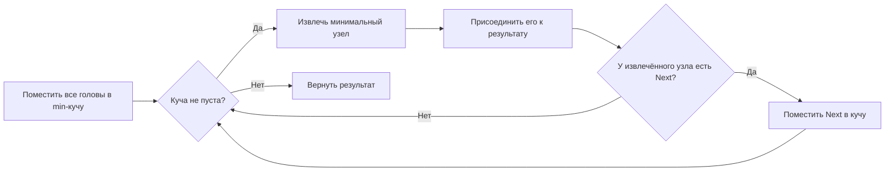

**LeetCode 23. Merge K Sorted Lists.** Дан массив из `k` связных списков, каждый из которых отсортирован по возрастанию. Требуется объединить все списки в один отсортированный связный список и вернуть его голову. Это классика жанра «сложные задачи»: она не решается применением одного изолированного паттерна, а требует композиции «куча + слияние» либо «разделяй и властвуй + слияние двух списков». После геометрического инсайта [[3. Trapping Rain Water]] мы переходим к структурам данных, где правильный выбор контейнера и понимание работы `container/heap` в Go определяют, будет ли решение Accepted с запасом или упрётся в TLE.

На собеседовании эта задача проверяет, умеет ли кандидат мыслить в терминах приоритетов и пошагового слияния, а также знает ли он стандартную библиотеку Go настолько, чтобы реализовать кучу без суеты. Senior-разработчик обязан не просто написать `heap.Push` и `heap.Pop`, но и объяснить, почему слайс под капотом кучи дружествен кэшу, а использование `container/list` для очереди было бы ошибкой.

### Формулировка и уточнения

**Условие:** функция `mergeKLists(lists []*ListNode) *ListNode`. Каждый связный список определён как `type ListNode struct { Val int; Next *ListNode }`. Все списки отсортированы по неубыванию, количество списков `k` может быть от 0 до 10⁴, общее число узлов N до 10⁵.

**Вопросы интервьюеру (Senior-стиль):**
- *Может ли `lists` быть пустым или содержать nil-элементы?* Да, `lists` может быть пустым массивом, а также содержать `nil` вместо головы списка.
- *Какие значения могут быть в узлах?* Целые числа, могут быть отрицательные, допускаются дубликаты.
- *Можно ли изменять исходные списки?* Да, мы можем переиспользовать узлы, связывая их в новый список. Это предпочтительно по памяти.
- *Какой возврат при отсутствии узлов?* Вернуть `nil`.

На основе ответов выбираем стратегию: все операции in-place по памяти, без создания новых узлов. Сбор всех значений в слайс и сортировка нарушили бы дух задачи и добавили O(N log N) при наличии более эффективных методов.

### Наивное решение: последовательное слияние

Самое прямолинейное — взять первый список и сливать с ним остальные по очереди, используя функцию слияния двух отсортированных списков ([[4. Merge Two Sorted Lists]] из кластера связных списков). Сложность: каждый узел может участвовать в слиянии до k раз, что даёт O(k * N). При k ≈ N (например, 10⁴ списков по 10 элементов) это O(N²) и может не пройти лимиты.

```go
func mergeKListsNaive(lists []*ListNode) *ListNode {
    var result *ListNode
    for _, list := range lists {
        result = mergeTwoLists(result, list)
    }
    return result
}
```

Узкое место — многократное слияние одних и тех же элементов. Нужно либо уменьшить количество проходов (попарное слияние), либо всегда выбирать минимальный элемент из всех k голов (куча).

### Оптимальное решение: min-куча (приоритетная очередь)

**Идея.** Мы поддерживаем min-кучу размером до k, в которой на каждом шагу лежат головы всех ещё не исчерпанных списков. Извлекаем минимальную голову, добавляем её в результирующий список, а затем, если у извлечённого узла есть следующий, помещаем его обратно в кучу. Таким образом, каждый узел ровно один раз попадает в кучу и один раз извлекается — O(log k) на операцию, итоговая сложность O(N log k).

**Инвариант кучи:** на любой итерации куча содержит ровно по одному узлу от каждого непустого списка, причём минимальный элемент кучи является глобально минимальным среди всех оставшихся узлов. Это гарантирует правильность порядка слияния.

В Go нет встроенного типа «куча», но есть пакет `container/heap`, который требует реализации интерфейса `heap.Interface`:
```go
type Interface interface {
    sort.Interface
    Push(x any) // добавляет x как последний элемент
    Pop() any   // удаляет и возвращает последний элемент
}
```
Нам нужно определить тип, реализующий `Len`, `Less`, `Swap`, `Push`, `Pop`. Обычно это слайс указателей на узлы.

```go
type NodeHeap []*ListNode

func (h NodeHeap) Len() int           { return len(h) }
func (h NodeHeap) Less(i, j int) bool  { return h[i].Val < h[j].Val }
func (h NodeHeap) Swap(i, j int)       { h[i], h[j] = h[j], h[i] }

func (h *NodeHeap) Push(x any) {
    *h = append(*h, x.(*ListNode))
}

func (h *NodeHeap) Pop() any {
    old := *h
    n := len(old)
    x := old[n-1]
    *h = old[:n-1]
    return x
}
```

Теперь основной алгоритм:
```go
func mergeKLists(lists []*ListNode) *ListNode {
    if len(lists) == 0 {
        return nil
    }

    // Инициализируем кучу, предварительно выделив capacity для k
    h := &NodeHeap{}
    for _, list := range lists {
        if list != nil {
            *h = append(*h, list)
        }
    }
    heap.Init(h)

    dummy := &ListNode{} // фиктивный узел для удобства
    curr := dummy

    for h.Len() > 0 {
        // Извлекаем минимальный узел
        minNode := heap.Pop(h).(*ListNode)
        curr.Next = minNode
        curr = curr.Next

        // Если у извлечённого узла есть продолжение, кладём его в кучу
        if minNode.Next != nil {
            heap.Push(h, minNode.Next)
        }
    }

    return dummy.Next
}
```

**Go-идиомы и комментарии:**
- Тип `NodeHeap` — слайс указателей. Методы `Push` и `Pop` реализуют интерфейс, работая с указателем на слайс. Это стандартный паттерн.
- `heap.Init(h)` строит кучу из неотсортированного слайса за O(k).
- Фиктивный узел `dummy` упрощает построение результирующего списка без проверки на `nil` головы.
- Мы не создаём новых узлов, только переставляем указатели — память O(k) на кучу.
- Обратите внимание: `heap.Pop` возвращает `any`, необходимо явное приведение типа.



### Альтернативное решение: Divide and Conquer (попарное слияние)

Вместо кучи можно последовательно сливать списки попарно, уменьшая k вдвое на каждом раунде. Первый раунд: слить списки 0 и 1, 2 и 3, …; второй раунд — слить результаты, и так далее. Это напоминает турнирную сетку. Сложность O(N log k), так как каждый узел участвует в O(log k) слияниях. Преимущество — не требуется куча, только базовая функция `mergeTwoLists`. Недостаток — более высокие накладные расходы на многократные слияния и рекурсивные вызовы.

```go
func mergeKListsDivideConquer(lists []*ListNode) *ListNode {
    if len(lists) == 0 {
        return nil
    }
    return mergeRange(lists, 0, len(lists)-1)
}

func mergeRange(lists []*ListNode, lo, hi int) *ListNode {
    if lo == hi {
        return lists[lo]
    }
    mid := lo + (hi-lo)/2
    left := mergeRange(lists, lo, mid)
    right := mergeRange(lists, mid+1, hi)
    return mergeTwoLists(left, right)
}
```

На собеседовании Senior может обсудить оба подхода, объяснив, что куча даёт более плавный поток операций и меньше аллокаций для структур управления, а divide and conquer проще кодируется, если уже есть `mergeTwoLists`.

### Edge Cases

- **Пустой `lists`:** `len(lists) == 0` → возвращаем `nil`.
- **Все списки пусты (nil):** после инициализации куча окажется пустой, цикл не выполнится, вернётся `nil`.
- **Один список:** куча будет содержать один элемент, он будет извлечён и подключён через `Next`, всё корректно.
- **Списки с дубликатами:** `Less` использует строгое `<`, что сохраняет стабильность? Стабильность не требуется, порядок элементов с равными значениями не гарантирован, но алгоритм корректен.
- **Очень большое k и маленькие списки:** куча размером k может потреблять много памяти (но слайс из k указателей ~ 8k байт, для k=10⁴ это 80 КБ — терпимо).

### Анализ сложности

- **Время:** инициализация кучи O(k). На каждый из N узлов выполняются одна операция `heap.Pop` и до одной `heap.Push` (если узел не последний). Каждая операция O(log k). Итого O(N log k). Если k ≈ N, то O(N log N).
- **Память:** O(k) для кучи (слайс указателей). Плюс O(1) дополнительных переменных. Результирующий список строится переиспользованием существующих узлов — дополнительной памяти под данные не выделяется.

### Mechanical Sympathy: почему куча на слайсе эффективна

- **Слайс в основе кучи.** `container/heap` работает на обычном слайсе `[]*ListNode`. Указатели хранятся в непрерывном блоке памяти, что обеспечивает отличную локальность данных. Операции `sift-up` и `sift-down` обращаются к элементам по индексам `2*i+1`, `2*i+2` — всё в пределах одного массива, полностью предсказуемо для кэша.
- **Никакого `container/list`.** Использование связного списка для реализации приоритетной очереди обернулось бы аллокацией на каждый вставленный узел и pointer chasing при обходе, что в разы медленнее.
- **Минимум аллокаций внутри цикла.** Новые узлы не создаются, только переставляются указатели. Куча растёт только при инициализации; после этого `Push` и `Pop` используют уже выделенный слайс (возможны переаллокации при росте, но мы предвыделили capacity при инициализации? В коде выше мы не задали capacity, но можно улучшить: `h := make(NodeHeap, 0, k)`. Это уберёт переаллокации при начальном добавлении).
- **Простота и читаемость.** Реализация интерфейса кучи — это 10–15 строк, которые один раз написав, можно переиспользовать. Senior-разработчик пишет их без ошибок, зная, что `Push` и `Pop` работают с концом слайса.

> [!info] Под капотом
> Когда вы вызываете `heap.Push(h, node)`, Go вставляет элемент в конец слайса и затем вызывает `sift-up` (проталкивание вверх), пока не восстановится свойство кучи. `sift-up` обменивает элементы с родителем `(i-1)/2`, двигаясь к корню. Все эти операции — простые сравнения и перестановки указателей внутри слайса, без вызовов `malloc`. Только если слайс заполнен, `append` может выделить новый массив, но мы предвыделили capacity по числу списков, так что этого не случится.

### Альтернативы и trade-off: что ещё можно предложить

- **Сбор всех значений в слайс, сортировка, построение списка.** O(N log N) времени, O(N) памяти. Просто, но теряет свойство связных списков и не использует их отсортированность. На собеседовании такое не оценят, но можно упомянуть как baseline.
- **Многоканальный слияние?** Не нужно, задача решается эффективнее без конкурентности.

> [!tip] Собеседование
> Вопрос: «Как изменится подход, если списки подаются в виде потоков (stream), то есть бесконечные?»
> Ответ: «Куча остаётся основным механизмом, но нам потребуется внешний итератор. В Go можно представить каналы, но добавление горутин усложнит код и не даст преимущества в однопоточной среде. Куча всё ещё будет выбирать минимальный элемент из голов потоков. Это демонстрирует, что паттерн универсален».

### Итог

Merge K Sorted Lists — это демонстрация силы кучи в задаче, где нужно постоянно извлекать глобальный минимум из динамически меняющегося набора. Go-реализация с `container/heap` и слайсом указателей получается компактной и эффективной, не требующей дополнительных узлов и минимизирующей аллокации. Senior-разработчик не только пишет код, но и объясняет выбор между кучей и divide-and-conquer, а также показывает, как внутреннее устройство слайса помогает кэшу процессора.

Следующая задача — **Largest Rectangle in Histogram** — перенесёт нас обратно к массивам, но теперь главным инструментом станет монотонный стек, способный за O(N) находить ближайшие меньшие элементы. [[5. Largest Rectangle in Histogram]]