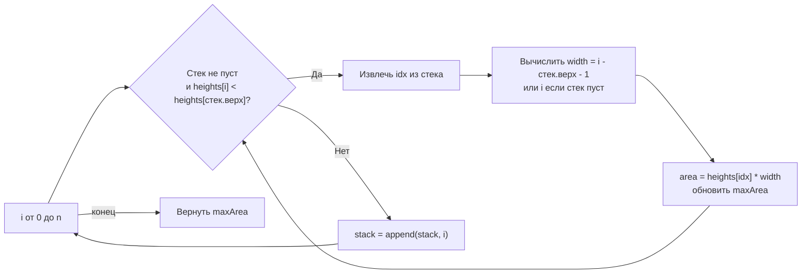

**LeetCode 84. Largest Rectangle in Histogram.** Дан массив неотрицательных целых чисел `heights`, представляющий высоты столбцов гистограммы. Ширина каждого столбца равна 1. Требуется найти площадь самого большого прямоугольника, который можно вписать в гистограмму (прямоугольник должен касаться нижней оси и быть ограничен столбцами слева и справа). Это одна из самых знаменитых сложных задач, которая после геометрических инсайтов [[3. Trapping Rain Water]] и композиции кучи в [[4. Merge K Sorted Lists]] приводит нас к **монотонному стеку** — структуре, позволяющей за O(N) найти ближайший меньший элемент для каждого столбца и вычислить максимальную площадь без единого вложенного цикла.

На собеседовании задача проверяет, способен ли кандидат увидеть связь между площадью прямоугольника и «первым меньшим элементом», а затем реализовать стек на слайсе, объяснив инвариант. Senior Go-разработчик не просто воспроизводит алгоритм, но и показывает, как слайс, используемый как стек, взаимодействует с кэш-памятью и почему он предпочтительнее связного списка или явной рекурсии.

### Формулировка и уточнения

**Условие:** функция `largestRectangleArea(heights []int) int`. Возвращает максимальную площадь прямоугольника, который можно вписать в гистограмму.

**Вопросы интервьюеру (Senior-стиль):**
- *Может ли массив быть пустым?* Да, `n = 0` → площадь 0.
- *Могут ли высоты быть нулевыми?* Да, высота может быть 0, что создаёт разрывы в гистограмме; нулевой прямоугольник не добавляет площади.
- *Есть ли отрицательные числа?* Нет, все высоты ≥ 0.
- *Каков диапазон значений?* До 10⁴ столбцов, высоты до 10⁴. Произведение `height * width` может достигать 10⁸, что входит в `int` (64-битный на большинстве платформ), но Senior упомянет, что в 32-битной среде нужно использовать `int64`.
- *Можно ли модифицировать входной слайс?* Мы его не модифицируем, но если разрешено, можно добавить sentinel.

Ответы диктуют выбор: массив для хранения высот, слайс для стека индексов.

### Наивное решение: расширение от каждого столбца

Для каждого индекса `i` пытаемся расширить прямоугольник высоты `heights[i]` влево и вправо, пока высоты столбцов не меньше `heights[i]`. Ширина — количество таких столбцов. Вычисляем площадь `heights[i] * width`, обновляем максимум. Поиск левой и правой границы для каждого `i` требует O(N) сканирования, что даёт O(N²) времени. При N=10⁵ это 10¹⁰ операций — TLE.

```go
func largestRectangleAreaNaive(heights []int) int {
    n := len(heights)
    maxArea := 0
    for i := 0; i < n; i++ {
        left, right := i, i
        for left >= 0 && heights[left] >= heights[i] {
            left--
        }
        for right < n && heights[right] >= heights[i] {
            right++
        }
        width := right - left - 1
        area := heights[i] * width
        if area > maxArea {
            maxArea = area
        }
    }
    return maxArea
}
```

Узкое место — повторный обход для поиска границ. Но мы замечаем, что для столбца `i` левая граница — это первый столбец слева, который **ниже** `heights[i]`. Аналогично правая граница — первый столбец справа, который ниже. Если бы мы могли для каждого элемента быстро находить ближайший меньший слева и справа, задача решалась бы за O(N). Именно это делает монотонный стек.

### Оптимальное решение: монотонный стек

**Идея.** Мы проходим по массиву слева направо, поддерживая стек индексов, для которых высоты образуют **неубывающую последовательность**. Когда встречаем столбец, который **ниже** вершины стека, это означает, что для всех более высоких столбцов в стеке мы нашли правую границу (текущий индекс). Для каждого извлекаемого индекса `idx` левая граница — это новый элемент на вершине стека после извлечения (или -1, если стек пуст). Ширина = `right - left - 1`, площадь = `heights[idx] * width`. Мы вычисляем площадь и обновляем максимум, затем продолжаем сравнивать с новой вершиной, пока стек не восстановит монотонность. После обработки всех элементов в стеке могут остаться индексы, для которых правая граница = `n`. Их мы обрабатываем аналогично.

Добавление фиктивного нуля в конец массива (sentinel) позволяет единообразно обработать все оставшиеся в стеке элементы без дополнительного цикла.

**Инвариант стека:** индексы в стеке всегда упорядочены по возрастанию высоты. Это значит, что для любого элемента в стеке все элементы между ним и следующим в стеке не ниже его. Когда мы извлекаем элемент, мы знаем, что его прямоугольник не может быть расширен вправо дальше текущего индекса `i`, а влево — дальше индекса, который теперь на вершине стека.

```go
func largestRectangleArea(heights []int) int {
    n := len(heights)
    if n == 0 {
        return 0
    }

    // Стек хранит индексы столбцов в порядке возрастания высоты
    stack := make([]int, 0, n)
    maxArea := 0

    // Проходим все столбцы; i == n — sentinel высоты 0 для очистки стека
    for i := 0; i <= n; i++ {
        var curHeight int
        if i < n {
            curHeight = heights[i]
        } else {
            curHeight = 0 // sentinel, гарантирует выталкивание всех из стека
        }

        // Пока текущая высота меньше высоты на вершине стека,
        // прямоугольник с высотой вершины стека завершён.
        for len(stack) > 0 && curHeight < heights[stack[len(stack)-1]] {
            idx := stack[len(stack)-1]
            stack = stack[:len(stack)-1] // pop

            // Определяем ширину
            width := i
            if len(stack) > 0 {
                width = i - stack[len(stack)-1] - 1
            } else {
                width = i // весь отрезок слева до 0
            }
            area := heights[idx] * width
            if area > maxArea {
                maxArea = area
            }
        }
        stack = append(stack, i)
    }

    return maxArea
}
```

**Go-идиомы и комментарии:**
- `stack := make([]int, 0, n)` — предвыделение ёмкости под стек. Гарантирует отсутствие переаллокаций внутри цикла.
- Стек оперирует индексами, доступ к `heights[idx]` — прямая адресация по слайсу.
- Цикл `for i := 0; i <= n; i++` включает фиктивный индекс `n` с высотой 0, что элегантно очищает стек.
- Извлечение `stack = stack[:len(stack)-1]` — O(1), не копирует данные.
- Проверка `len(stack) > 0` перед использованием `stack[len(stack)-1]` обязательна.
- Вычисление ширины: если стек пуст, значит, все столбцы левее `idx` были не ниже `heights[idx]`, поэтому ширина равна `i` (индекс текущего столбца, исключая его).



### Почему это работает: геометрический инвариант

Для столбца `idx`, извлекаемого из стека, мы точно знаем:
- **Правая граница** — текущий индекс `i` (высота в `i` меньше `heights[idx]`), следовательно, прямоугольник не может простираться дальше.
- **Левая граница** — индекс на новой вершине стека (или -1). Поскольку стек хранит индексы в порядке возрастания высоты, все столбцы между `left+1` и `right-1` имеют высоту **не меньше** `heights[idx]`, иначе бы они вытолкнули `idx` раньше.

Таким образом, для каждого столбца мы вычисляем площадь наибольшего прямоугольника, который использует его высоту как лимитирующую. Среди всех таких прямоугольников обязательно окажется глобальный максимум.

### Edge Cases

- **Пустой массив:** `n = 0` → сразу возвращаем 0.
- **Один столбец:** `[5]`. Стек: `i=0` добавляется, `i=1` (sentinel 0) выталкивает 0, ширина = 1, площадь = 5.
- **Все столбцы одинаковой высоты:** `[2,2,2]`. Стек не будет выталкивать до sentinel'а. Когда `i=3` (0), извлекаются индексы 2, 1, 0. Для каждого ширина равна `i - left - 1`: для 2 (последний) left = 1 (индекс 1), width = 3 - 1 - 1 = 1? Подожди, нужно протрассировать. При `i=3`, стек содержит [0,1,2]. curHeight=0 < 2, pop 2: left=1, width=3-1-1=1, area=2*1=2. pop 1: left=0, width=3-0-1=2, area=2*2=4. pop 0: stack empty, width=3, area=2*3=6. maxArea=6, верно.
- **Нули в массиве:** нулевой столбец выталкивает все более высокие и добавляется в стек. Сам нулевой столбец никогда не увеличит площадь, но служит разделителем.
- **Строго возрастающий массив:** `[1,2,3]`. Стек наполняется, и только sentinel в конце вытолкнет элементы, корректно вычисляя площади: для 3 (idx=2) width=1, area=3; для 2 (idx=1) width=2 (до 3), area=4; для 1 (idx=0) width=3, area=3. max=4. Верно (прямоугольник высоты 2, ширина 2).

> [!warning] Ловушка / Gotcha
> Не забывайте включать фиктивный индекс `i = n` с высотой 0, чтобы обработать элементы, оставшиеся в стеке. Без этого последний возрастающий участок не будет учтён. Альтернативно можно после основного цикла вручную вытолкнуть стек с правой границей `n`.

### Анализ сложности

- **Время:** O(N). Каждый индекс помещается в стек ровно один раз и извлекается не более одного раза. Внутренний цикл `for` может на одной итерации сделать несколько извлечений, но суммарно их количество не превышает N. Все операции внутри цикла — O(1).
- **Память:** O(N) для стека в худшем случае (например, строго возрастающий массив). Дополнительная память помимо входного слайса — только стек индексов.

### Mechanical Sympathy: монотонный стек на слайсе

- **Стек реализован на слайсе.** Операции `append` и срез `stack = stack[:len(stack)-1]` работают с непрерывным блоком памяти, который мы предвыделили. Новые аллокации внутри цикла отсутствуют. Это предельно дружественно кэшу: верхушка стека всегда в L1-кэше.
- **Последовательный доступ к `heights`.** Мы идём по массиву слева направо, читая высоты. Аппаратный prefetcher легко предсказывает следующие элементы.
- **Отсутствие указателей.** В стеке хранятся простые `int`, а не указатели на узлы, как было бы в реализации на связном списке. Никакого pointer chasing, никакой нагрузки на GC.
- **Никаких map.** Поиск ближайшего меньшего элемента без стека мог бы потребовать map и дополнительных структур, что добавило бы pointer chasing и аллокации. Монотонный стек полностью лишён этого.

> [!info] Под капотом
> В рантайме Go слайс `[]int` представлен заголовком `SliceHeader` и непрерывным массивом в куче. Операция `stack = stack[:len(stack)-1]` лишь уменьшает поле `Len` заголовка, не освобождая память. Это позволяет повторно использовать выделенный массив при последующих `append`. Если бы стек сильно уменьшался и снова рос, память не фрагментировалась бы. В production-коде такое переиспользование — стандарт.

### Альтернативы и trade-off

- **Разделяй и властвуй (Divide and Conquer).** Найти минимальный столбец, площадь с ним = `min * (right-left+1)`, затем рекурсивно повторить слева и справа. В худшем случае (отсортированный массив) O(N²) без оптимизаций, с поиском минимума через дерево отрезков — O(N log N) с O(N) памяти. Монотонный стек проще и быстрее.
- **Дерево отрезков.** Можно построить дерево отрезков для RMQ (range minimum query) и искать минимум за O(log N). Общая сложность O(N log N), код громоздкий. Не рекомендуется на собеседовании.
- **Динамическое программирование с границами.** Можно хранить левые границы в массиве и обновлять их прыжками, что тоже даёт O(N), но монотонный стек интуитивно понятнее.

> [!tip] Собеседование
> Вопрос: «Почему вы использовали стек, а не рекурсивный Divide and Conquer?»
> Ответ: «Монотонный стек гарантирует строгое O(N) время и O(N) память без риска квадратичного вырождения. Он идиоматичен для задач о ближайшем меньшем/большем элементе и реализуется на слайсе без накладных расходов. Divide and Conquer элегантен, но на собеседовании я предпочту более надёжный по асимптотике вариант».

### Итог

Largest Rectangle in Histogram — это каноническая задача на монотонный стек, которая демонстрирует, как структура с простым инвариантом превращает O(N²) в O(N). В Go она решается слайсом как стеком, без дополнительных аллокаций и с отличной кэш-локальностью. Senior-разработчик не просто реализует алгоритм, но и объясняет геометрический смысл, инвариант и механическую симпатию.

Следующая задача — **Sliding Window Maximum** — вернёт нас к скользящему окну, но теперь с монотонной очередью, объединяя идеи этого и предыдущих кластеров. [[6. Sliding Window Maximum]]