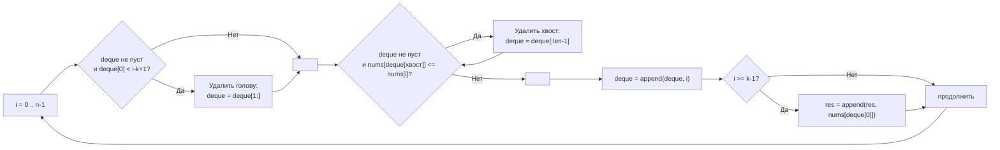

**LeetCode 239. Sliding Window Maximum.** Дан целочисленный массив `nums` и параметр `k` — размер скользящего окна. Окно двигается слева направо с шагом 1. Для каждого положения окна требуется найти **максимальный элемент** внутри него и вернуть список этих максимумов. Задача — одна из вершин класса «сложные», потому что наивное сканирование каждого окна за O(k) даёт O(N*k), что при k, близком к N, превращается в квадратичный кошмар.

Однако истинная глубина задачи не в том, чтобы «найти максимум в окне», а в том, чтобы **поддерживать этот максимум амортизированно за O(1)** при сдвиге окна. Для этого требуется композиция паттернов: **скользящее окно задаёт границы**, а **монотонная очередь (monotonic deque)** молниеносно извлекает максимум. Senior Go-разработчик видит здесь не только алгоритмическую элегантность, но и возможность показать, как слайс, используемый как двусторонняя очередь, даёт нулевые аллокации, последовательный доступ к памяти и идеальную кэш-локальность — в отличие от `container/list` или кучи.

### Формулировка и уточнения

**Условие:** функция `maxSlidingWindow(nums []int, k int) []int`.
- `1 <= k <= len(nums) <= 10^5`.
- Элементы `nums[i]` — целые числа в диапазоне `[-10^4, 10^4]`.
- Возвращается слайс длиной `n - k + 1`.

**Вопросы интервьюеру:**
- *Может ли `k` быть равен длине массива?* Да, тогда вернётся слайс из одного элемента — максимума всего массива.
- *Может ли `k` быть равен 1?* Да, тогда результат — копия исходного массива.
- *Есть ли ограничение на память?* Ожидается O(k) дополнительной памяти, не считая результата.
- *Допустимы ли дубликаты?* Да, значения могут повторяться, на логику это не влияет.

Ответы фиксируют выбор: монотонная очередь на слайсе индексов с предвыделенной ёмкостью `k`.

### Наивное решение: сканирование каждого окна

Для каждой позиции `i` от 0 до `n - k` пробегаем `k` элементов и ищем максимум. Время O(N·k). Если k ≈ N/2, это O(N²) — при N=10⁵ неприемлемо (10¹⁰ операций → TLE).

```go
func maxSlidingWindowNaive(nums []int, k int) []int {
    n := len(nums)
    if n == 0 {
        return nil
    }
    res := make([]int, 0, n-k+1)
    for i := 0; i <= n-k; i++ {
        maxVal := nums[i]
        for j := i + 1; j < i+k; j++ {
            if nums[j] > maxVal {
                maxVal = nums[j]
            }
        }
        res = append(res, maxVal)
    }
    return res
}
```

Узкое место — мы заново обходим почти одни и те же элементы, отбрасывая информацию о предыдущем окне. Вопрос, ведущий к прозрению: **«Какие элементы могут стать максимумом в будущем, а какие — никогда?»** Если в окно входит новый элемент `x`, то все элементы слева от него, которые **меньше или равны** `x`, никогда не станут максимумом, пока `x` находится в окне — `x` моложе и не меньше. Следовательно, их можно удалить. Это наблюдение рождает **монотонную очередь**.

### Оптимальное решение: монотонная очередь (monotonic deque)

**Идея.** Мы поддерживаем двустороннюю очередь **индексов** элементов. Очередь обладает двумя свойствами:
1. **Монотонность:** значения `nums` по индексам в очереди строго убывают (невозрастание). Это значит, что голова очереди всегда хранит индекс **максимального** элемента текущего окна.
2. **Актуальность:** в очереди находятся только индексы, принадлежащие текущему окну `[i - k + 1, i]`.

При сдвиге окна вправо на позицию `i`:
- **Удаляем из головы** индексы, которые вышли за левую границу окна (`< i - k + 1`).
- **Удаляем с хвоста** индексы, значения которых **меньше или равны** `nums[i]`. Они никогда не станут максимумом, пока `i` внутри окна.
- Добавляем `i` в хвост очереди.
- Если окно полностью сформировано (`i >= k - 1`), добавляем `nums[голова]` в результат.

Каждый индекс помещается в очередь **ровно один раз** и удаляется из неё **не более одного раза**. Поэтому суммарное количество операций с очередью не превышает 2N, что даёт амортизированное O(1) на шаг и общую сложность O(N).

```go
func maxSlidingWindow(nums []int, k int) []int {
    n := len(nums)
    if n == 0 || k == 0 {
        return nil
    }

    // Результат с предвыделенной ёмкостью
    res := make([]int, 0, n-k+1)
    // Монотонная очередь: слайс индексов, значения nums по ним убывают
    deque := make([]int, 0, k)

    for i := 0; i < n; i++ {
        // 1. Удаляем индексы, вышедшие за левую границу окна
        if len(deque) > 0 && deque[0] < i-k+1 {
            deque = deque[1:]
        }

        // 2. Удаляем с хвоста все индексы, значения которых <= текущего
        for len(deque) > 0 && nums[deque[len(deque)-1]] <= nums[i] {
            deque = deque[:len(deque)-1]
        }

        // 3. Добавляем текущий индекс
        deque = append(deque, i)

        // 4. Если окно полностью заполнено, записываем максимум
        if i >= k-1 {
            res = append(res, nums[deque[0]])
        }
    }
    return res
}
```

**Go-идиомы и комментарии:**
- `deque := make([]int, 0, k)` — предвыделение вместимости. Очередь никогда не превысит размер `k`, поэтому переаллокаций внутри цикла не будет. Это осознанное управление памятью.
- `deque[1:]` и `deque[:len(deque)-1]` — операции над заголовком слайса, без копирования данных. Нижележащий массив остаётся неизменным, меняются только поля `Len` и `Data` структуры `SliceHeader`.
- Проверка `len(deque) > 0` перед каждым доступом к элементам очереди обязательна.
- Имена `deque`, `res`, `i` чётки; логика линейна.



### Инвариант монотонной очереди и доказательство корректности

Очередь поддерживает два инварианта:
1. **Инвариант значений:** `nums[deque[0]] >= nums[deque[1]] >= ... >= nums[deque[m-1]]`. Строгое убывание (невозрастание) гарантирует, что максимум всегда в голове.
2. **Инвариант принадлежности:** все индексы в очереди принадлежат текущему окну `[i-k+1, i]`.

**Почему удаление с хвоста безопасно?** Если `nums[deque[хвост]] <= nums[i]`, то элемент `deque[хвост]` находится **левее** `i` и имеет **меньшее или равное** значение. Пока `i` находится в окне (а войдёт он в него прямо сейчас и пробудет там `k` шагов), `deque[хвост]` никогда не станет максимумом: `i` моложе и не меньше. Если `deque[хвост]` покинет окно раньше `i`, он и подавно не сможет конкурировать. Следовательно, его можно безопасно удалить.

**Почему удаление из головы безопасно?** Если `deque[0] < i - k + 1`, индекс физически вышел за левую границу окна и больше не должен рассматриваться.

Таким образом, после каждой итерации голова очереди указывает на максимальный элемент текущего окна. Мы не пропускаем ни один потенциальный максимум.

### Edge Cases

- **k = 1:** окно из одного элемента. Очередь всегда будет содержать ровно один индекс (текущий), результат — копия `nums`. Алгоритм работает без изменений.
- **k = len(nums):** единственное окно. Очередь после обработки всех элементов будет содержать в голове индекс глобального максимума. Результат — слайс из одного элемента.
- **Все элементы равны:** `[5,5,5], k=2`. Каждый новый элемент выталкивает предыдущий (так как `<=`), очередь всегда содержит только последний добавленный индекс. Максимум корректен (равные значения).
- **Строго возрастающий массив:** `[1,2,3,4], k=3`. Каждый новый элемент выталкивает все предыдущие (они меньше). Очередь всегда из одного элемента — текущего. Максимумы: `[3,4]`. Корректно.
- **Строго убывающий массив:** `[4,3,2,1], k=3`. Новый элемент меньше хвоста, поэтому очередь накапливает индексы. Голова удерживает максимум, пока не выйдет за границу. Максимумы: `[4,3]`. Корректно.
- **Пустой массив или k=0:** возвращаем `nil`.

> [!warning] Ловушка / Gotcha
> Новички иногда пишут `if` вместо `for` при очистке хвоста: одного удаления может быть недостаточно, если новый элемент больше нескольких предыдущих. Цикл `for` гарантирует полное восстановление монотонности. Пропуск этого цикла — верный путь к неверному ответу.

### Анализ сложности

- **Время:** O(N). Каждый индекс добавляется в `deque` ровно один раз и удаляется не более одного раза (либо из головы, либо из хвоста). Внутренний цикл `for` по хвосту может за одну итерацию выполнить несколько удалений, но амортизированно каждое удаление оплачено предыдущим добавлением. Общее количество операций очереди ≤ 2N.
- **Память:** O(k) для `deque` (хранение индексов). Результат — O(N – k + 1) для выходного слайса. Дополнительная память помимо результата не превышает размера окна. Никаких map или деревьев.

### Mechanical Sympathy: слайс как идеальный deque

- **Слайс — непрерывный блок памяти.** В отличие от `container/list`, где каждый элемент аллоцируется отдельно и хранит `interface{}`, наш `deque` — это `[]int`. Индексы лежат вплотную друг к другу, что дружественно кэш-линиям процессора. Операции среза (`deque[1:]`, `deque[:len-1]`) лишь сдвигают указатель и длину в заголовке — без копирования данных.
- **Предвыделение ёмкости.** `make([]int, 0, k)` гарантирует, что внутренний массив очереди не будет переаллоцирован и скопирован в процессе работы. Это устраняет скрытые всплески времени, характерные для динамически растущих слайсов.
- **Последовательный доступ к `nums`.** Чтение `nums[i]` строго последовательно. Аппаратный prefetcher безошибочно предсказывает следующие кэш-линии.
- **Отсутствие pointer chasing.** Мы храним индексы, а не указатели на узлы. Обращение `nums[deque[0]]` — это двойная прямая адресация: сначала читаем индекс из очереди (L1-кэш), затем значение из `nums` (L1/L2-кэш). Никаких переходов по указателям.
- **Нет нагрузки на GC.** Внутри цикла не создаются новые объекты — только целочисленные переменные и срезы заголовков. GC не вызывается.

> [!info] Под капотом
> Если бы мы реализовали очередь через `container/list`, каждая вставка и удаление аллоцировала бы `list.Element` в куче, а доступ к значению требовал бы приведения `interface{}`. Это породило бы тонны мусора и pointer chasing. Монотонная очередь на слайсе полностью лишена этих недостатков и работает на порядок быстрее.

### Альтернативные подходы и их место

- **Куча (Priority Queue).** Можно хранить в куче все элементы окна вместе с индексами. Извлечение максимума — O(1) (peek), вставка — O(log k), удаление произвольного элемента (при выходе за границу) — O(k) без дополнительных структур, или O(log k) с ленивым удалением. Общая сложность O(N log k). Куча требует больше кода (`container/heap`) и константа выше, чем у монотонной очереди.
- **Дерево отрезков или сбалансированное BST.** Позволяет запрашивать максимум за O(log N), обновлять окно за O(log N). Общая сложность O(N log N), память O(N). Избыточно для статического окна.
- **Разделение на блоки (sqrt-decomposition).** Можно разбить массив на блоки по √N, хранить максимумы блоков, обновлять за O(√N). Сложность O(N√N), интересно, но не оптимально.

Монотонная очередь выигрывает по всем параметрам: O(N) времени, O(k) памяти, простая реализация на слайсе. Senior-кандидат обязан не просто знать этот паттерн, но и объяснить, почему он предпочтительнее кучи в данном контексте.

> [!tip] Собеседование
> Вопрос: «Почему вы не использовали кучу?»
> Ответ: «Куча дала бы O(N log k), что приемлемо, но монотонная очередь даёт O(N) с гораздо меньшей константой. В Go куча требует реализации `heap.Interface`, что добавляет код. Очередь на слайсе реализуется проще, работает быстрее за счёт непрерывной памяти и не требует ленивого удаления устаревших элементов. Это лучший выбор для фиксированного размера окна, где нас интересует только максимум».

### Итог

Sliding Window Maximum — это жемчужина алгоритмического дизайна, где скользящее окно и монотонная очередь сливаются в элегантный O(N) механизм. В Go задача раскрывается с особой красотой: слайс как deque, отсутствие аллокаций, идеальная кэш-локальность и амортизированная сложность. Senior-разработчик не просто решает задачу, а демонстрирует глубокое понимание инвариантов, композиции паттернов и механической симпатии — от процессорного prefetcher'а до escape analysis.

Теперь мы переходим к последней задаче этого кластера — **Serialize and Deserialize Binary Tree**, где алгоритмическая сложность переносится с массивов на деревья, и на первый план выходит проектирование протокола сериализации с последующим восстановлением структуры. [[7. Serialize and Deserialize Binary Tree]]