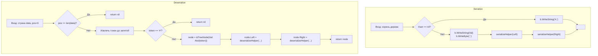

**LeetCode 297. Serialize and Deserialize Binary Tree.** Требуется спроектировать алгоритм сериализации и десериализации бинарного дерева. Сериализация — это процесс преобразования дерева в строку, десериализация — обратное восстановление из строки. Формат сериализации не задан жёстко; необходимо, чтобы результат десериализации был структурно идентичен исходному дереву. Задача завершает кластер «Сложные задачи» и соединяет воедино два мира: классические структуры данных ([[1. Теория. Деревья]]) и алгоритмическую инженерию — проектирование формата, устойчивого к ошибкам, быстрого по времени и экономного по памяти.

После геометрических и стековых прозрений [[5. Largest Rectangle in Histogram]] и композиции окна с монотонной очередью в [[6. Sliding Window Maximum]] мы приходим к задаче, где сложность не в математическом инсайте, а в системном проектировании. Как представить дерево линейно, чтобы его можно было однозначно восстановить, не теряя структуру null-указателей? Как сделать это идиоматично на Go, балансируя между читаемостью, производительностью строковых операций и управлением памятью? Senior-разработчик обязан не просто выдать работающий код, но и обсудить форматы (preorder с маркерами, BFS), сравнить их стоимость по памяти и аллокациям, а также показать, как `strings.Builder` и `strconv` помогают избежать мусора.

### Формулировка и уточнения

**Условие:** реализовать две функции:
- `serialize(root *TreeNode) string` — возвращает строку, однозначно представляющую дерево.
- `deserialize(data string) *TreeNode` — восстанавливает дерево из строки.

Тип узла:
```go
type TreeNode struct {
    Val   int
    Left  *TreeNode
    Right *TreeNode
}
```

**Вопросы интервьюеру (Senior-стиль):**
- *Может ли дерево быть пустым?* Да, `root == nil` → нужно как-то представить пустое дерево, обычно специальной строкой или пустым значением.
- *Какие значения могут быть в узлах?* Целые числа, могут быть отрицательными, нулями, дубликаты разрешены.
- *Насколько большим может быть дерево?* До 10⁴ узлов. Значит, рекурсивный подход должен быть безопасен по стеку (стек горутины в Go растёт, но глубина 10⁴ — это нормально, хотя может быть близко к предельному для вложенных рекурсий).
- *Важен ли точный формат строки?* Нет, только обратимость.
- *Можно ли использовать глобальные переменные или состояния?* Нет, всё должно быть инкапсулировано в функции; для десериализации потребуется передавать позицию в строке.

На основе ответов мы выбираем **preorder-обход с маркерами null** как канонический подход. Альтернатива — BFS с маркерами — также будет рассмотрена.

### Наивное решение: raw строки и разделение через strings.Split

Первый порыв — сериализовать в строку вида `1,2,null,null,3,4,null,null,5,null,null`, затем при десериализации разбить по запятой через `strings.Split` и восстанавливать рекурсивно. Это работает, но имеет проблемы:
- `strings.Split` аллоцирует слайс всех токенов сразу, что при 10⁴ узлов даёт O(N) памяти только под слайс токенов.
- Каждый вызов `strings.Split` порождает новые строки (копии), хотя можно было бы избежать части аллокаций, используя посимвольный парсинг.

```go
// Наивная десериализация (для понимания)
func deserializeNaive(data string) *TreeNode {
    if data == "" {
        return nil
    }
    tokens := strings.Split(data, ",")
    return buildTree(&tokens)
}

func buildTree(tokens *[]string) *TreeNode {
    if len(*tokens) == 0 {
        return nil
    }
    token := (*tokens)[0]
    *tokens = (*tokens)[1:]
    if token == "null" {
        return nil
    }
    val, _ := strconv.Atoi(token) // ошибка игнорируется — неидиоматично
    node := &TreeNode{Val: val}
    node.Left = buildTree(tokens)
    node.Right = buildTree(tokens)
    return node
}
```

Senior сразу укажет на недостатки: аллокация слайса `tokens`, игнорирование ошибки `Atoi`, неэффективное копирование строк. Оптимизируем.

### Оптимальное решение: preorder DFS с `strings.Builder` и посимвольным парсингом

**Сериализация.** Обходим дерево рекурсивно в preorder (корень → лево → право). Для каждого узла записываем его значение, для null-указателей — специальный маркер, например `#`. Разделитель — запятая. Чтобы избежать конкатенации строк в цикле (которая создаёт новую строку на каждое присоединение), используем `strings.Builder`. Это стандартный идиоматичный подход в Go для построения длинных строк.

```go
func serialize(root *TreeNode) string {
    var b strings.Builder
    serializeHelper(root, &b)
    return b.String()
}

func serializeHelper(node *TreeNode, b *strings.Builder) {
    if node == nil {
        b.WriteString("#,")
        return
    }
    // Записываем значение через strconv.Itoa без лишних преобразований
    b.WriteString(strconv.Itoa(node.Val))
    b.WriteByte(',')
    serializeHelper(node.Left, b)
    serializeHelper(node.Right, b)
}
```

**Go-идиомы:**
- `strings.Builder` — эффективный способ построения строки; внутри использует `[]byte` и растёт амортизированно.
- `strconv.Itoa` — конвертирует `int` в строку, аллоцируя её, но builder примет строку и скопирует в свой буфер.
- Разделитель — запятая; финальная строка будет заканчиваться запятой, но это не мешает парсингу.

**Десериализация.** Вместо разбиения всей строки на слайс токенов, мы будем идти по строке, извлекая значения по одному. Для этого заведём индекс `pos`, который будет продвигаться вперёд. При каждом рекурсивном вызове читаем следующий токен (до запятой) и сдвигаем `pos`. Это O(N) времени и O(глубина рекурсии) дополнительной памяти (без учёта выходного дерева). Стек вызовов — O(h), где h — высота дерева. Для сбалансированного дерева O(log N), для вырожденного O(N), но N ≤ 10⁴, что безопасно для стека горутины (начальный стек 2 КБ, растёт динамически).

```go
func deserialize(data string) *TreeNode {
    if data == "" {
        return nil
    }
    return deserializeHelper(data, &pos)
}

// pos — индекс начала следующего токена
func deserializeHelper(data string, pos *int) *TreeNode {
    if *pos >= len(data) {
        return nil
    }

    // Извлекаем следующий токен
    start := *pos
    for *pos < len(data) && data[*pos] != ',' {
        *pos++
    }
    token := data[start:*pos] // срез строки — без аллокации!
    *pos++ // пропускаем запятую

    if token == "#" {
        return nil
    }

    val, err := strconv.Atoi(token)
    if err != nil {
        // По контракту строка валидна, но Senior всегда проверяет
        return nil
    }
    node := &TreeNode{Val: val}
    node.Left = deserializeHelper(data, pos)
    node.Right = deserializeHelper(data, pos)
    return node
}
```

**Go-идиомы и комментарии:**
- `token := data[start:*pos]` — срез строки, **не копирует** байты, а создаёт новый заголовок `stringStruct`, указывающий на ту же память. Это O(1) по памяти. Однако поскольку `data` — это большая строка, а `token` живёт только внутри функции `strconv.Atoi` (которая всё равно парсит и преобразует), удержания памяти не происходит. Если бы мы сохраняли эти токены надолго, следовало бы скопировать.
- `strconv.Atoi` обрабатывает отрицательные числа корректно.
- Индекс `pos` передаётся по указателю, что экономит память (не нужно возвращать новый индекс) и является стандартным паттерном в Go.
- `for *pos < len(data) && data[*pos] != ','` — посимвольный проход, без `strings.Index`. Быстро и без аллокаций.



### Альтернативное решение: BFS (уровневый обход)

Можно сериализовать дерево в BFS-порядке. Это удобнее для визуализации и иногда позволяет обрабатывать дерево без рекурсии (полностью итеративно). При десериализации используем очередь для восстановления.

**Сериализация (BFS):**
```go
func serializeBFS(root *TreeNode) string {
    if root == nil {
        return "#"
    }
    var b strings.Builder
    queue := []*TreeNode{root}
    for len(queue) > 0 {
        node := queue[0]
        queue = queue[1:]
        if node == nil {
            b.WriteString("#,")
        } else {
            b.WriteString(strconv.Itoa(node.Val))
            b.WriteByte(',')
            queue = append(queue, node.Left, node.Right)
        }
    }
    return b.String()
}
```

**Десериализация (BFS):** нужно обойти токены, создавая узлы и связывая их через очередь. Это полностью итеративный процесс, не использующий рекурсию, что может быть предпочтительнее для очень глубоких деревьев. Память — O(ширина дерева) для очереди.

```go
func deserializeBFS(data string) *TreeNode {
    if data == "#" {
        return nil
    }
    // Извлекаем первый токен (корень) вручную
    pos := 0
    root := readNextNodeBFS(data, &pos)
    if root == nil {
        return nil
    }
    queue := []*TreeNode{root}
    for len(queue) > 0 {
        node := queue[0]
        queue = queue[1:]
        // Читаем левого потомка
        node.Left = readNextNodeBFS(data, &pos)
        if node.Left != nil {
            queue = append(queue, node.Left)
        }
        // Читаем правого потомка
        node.Right = readNextNodeBFS(data, &pos)
        if node.Right != nil {
            queue = append(queue, node.Right)
        }
    }
    return root
}

func readNextNodeBFS(data string, pos *int) *TreeNode {
    if *pos >= len(data) {
        return nil
    }
    start := *pos
    for *pos < len(data) && data[*pos] != ',' {
        *pos++
    }
    token := data[start:*pos]
    *pos++
    if token == "#" || token == "" {
        return nil
    }
    val, _ := strconv.Atoi(token)
    return &TreeNode{Val: val}
}
```

**Сравнение DFS vs BFS:**

| Характеристика | DFS (preorder) | BFS (уровневый) |
|---|---|---|
| Рекурсия | Да (глубина O(h)) | Нет (итеративный) |
| Память (помимо данных) | Стек вызовов O(h) | Очередь O(ширина) |
| Восстановление | Рекурсивное, естественное для preorder | Итеративное, более громоздкое |
| Идиоматичность в Go | Рекурсия по дереву — стандарт | Итеративный BFS — стандарт для поиска в ширину |
| Кэш-локальность | Узлы обходятся в глубину, может быть хуже | По уровням, лучше для «плоских» структур |

На собеседовании Senior продемонстрирует оба подхода и объяснит выбор: DFS проще и лаконичнее, BFS безопаснее для вырожденных деревьев без риска глубокой рекурсии.

### Edge Cases

- **Пустое дерево:** `nil`. Сериализуем как `"#"`. При десериализации сразу возвращаем `nil`.
- **Один узел:** `"1,#,#"`. Десериализация корректно создаст узел с `nil`-детьми.
- **Все узлы левые (вырожденное дерево):** `"1,2,3,#,#,#,#"`. DFS зайдёт в рекурсию на глубину N. Стек горутины справится (N ≤ 10⁴), но Senior может упомянуть, что в экстремальных случаях при N > 10⁶ лучше использовать BFS или итеративный DFS с собственным стеком.
- **Отрицательные значения и нули:** `strconv.Atoi` корректно обрабатывает.
- **Строка с пробелами:** не должна возникать, формат жёсткий.

### Анализ сложности

- **Сериализация:**
  - Время O(N) — каждый узел посещается один раз, `Builder.WriteString` амортизированно O(1) на операцию.
  - Память O(N) для итоговой строки, плюс O(h) стек рекурсии.
- **Десериализация (DFS):**
  - Время O(N) — каждый токен извлекается один раз, `Atoi` работает за O(длина токена).
  - Память O(N) для создаваемого дерева, плюс O(h) стек вызовов.

### Mechanical Sympathy: `strings.Builder`, срезы строк и аллокации

- **`strings.Builder`** внутри использует `[]byte`. При вызове `b.String()` он не копирует байты, а создаёт строку, ссылающуюся на тот же массив (если Builder не был переиспользован). Это эффективно и дружественно GC: массив в куче один, строка над ним — лёгкий заголовок.
- **Срезы строк `data[start:*pos]`** при десериализации не копируют данные — они ссылаются на исходную большую строку. Исходная строка будет жить до конца десериализации, что нормально. Если бы мы хотели освободить её (например, при потоковой обработке), можно было бы копировать токены через `string([]byte(token))`, но здесь это не требуется.
- **Отсутствие `strings.Split`** уменьшает пиковое потребление памяти: мы не аллоцируем слайс всех токенов сразу. Посимвольный проход даёт константную дополнительную память.
- **`strconv.Atoi`** конвертирует строку в `int`, не сохраняя ссылку на строку — GC может собрать исходную строку, если она больше не нужна? Исходная строка `data` всё ещё удерживается вызывающей функцией, поэтому она не будет собрана до завершения `deserialize`. Это нормально.

> [!info] Под капотом
> В рантайме Go строка — это `stringStruct{unsafe.Pointer, int}`. Срез `data[start:*pos]` просто уменьшает длину в новом заголовке, сохраняя исходный указатель на массив. Никаких копирований. Именно это позволяет парсить строки без аллокаций. Аналогично `strings.Builder` хранит слайс байтов и при вызове `String()` конструирует строку, указывающую на тот же массив. Это zero-copy операции, которые Senior обязан знать и использовать.

### Альтернативные форматы и trade-off

- **JSON или XML:** избыточны для бинарного дерева с целыми числами, увеличивают размер строки и сложность парсинга.
- **Бинарный формат:** можно сериализовать в `[]byte` с использованием `encoding/binary`. Меньше размер, но нечитаемо человеком и сложнее отлаживать. На собеседовании обычно не требуют.
- **Использование `strconv.FormatInt` / `strconv.AppendInt`:** ещё более эффективно, так как можно писать прямо в `[]byte`, избегая аллокации промежуточной строки. Для продакшена Senior может рассмотреть этот вариант.

> [!tip] Собеседование
> Вопрос: «Как бы вы адаптировали сериализацию для очень большого дерева, которое не помещается в память?»
> Ответ: «Я бы использовал стриминговую сериализацию: вместо построения полной строки в памяти писал бы токены в `io.Writer` (например, файл или сетевой сокет). Для десериализации читал бы из `io.Reader` с использованием буфера. BFS-формат здесь удобнее, так как не требует глубокой рекурсии при чтении. В Go это легко сделать благодаря интерфейсам `io.Writer` и `io.Reader`».

### Итог

Serialize and Deserialize Binary Tree завершает кластер сложных задач, подводя итог всему, чему мы научились: от распознавания паттернов и композиции структур данных до механической симпатии и идиоматичного Go. Задача не ставит рекордов по алгоритмической сложности, но требует зрелого инженерного подхода: проектирования формата, эффективной работы со строками, осознанного выбора между рекурсией и итерацией, и внимания к памяти. Senior-разработчик, решивший её, демонстрирует готовность не только к собеседованию, но и к реальной работе, где подобные задачи — рутина.

На этом мы завершаем раздел **02. Задачи**. Весь теоретический фундамент из раздела **01. Теория** и практические навыки, отточенные на десятках задач, теперь составляют ваш личный инструментарий Go-инженера. Осталось лишь отточить его на mock-интервью и реальных собеседованиях. Вперёд!