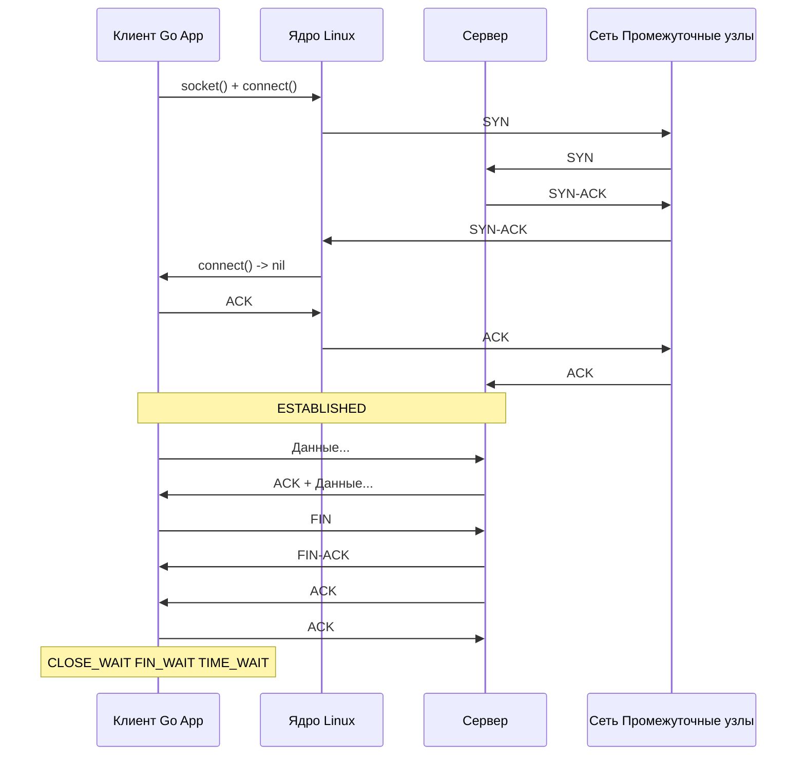

## Введение: Что такое TCP на самом деле?

TCP (Transmission Control Protocol) — это не просто «надежный протокол». С точки зрения Mechanical Sympathy, TCP — это сложный конечный автомат, живущий в пространстве ядра Linux. Для Go-разработчика он выглядит как простой интерфейс `net.Conn`, но за фасадом скрывается управление памятью, синхронизация кэш-линий CPU при обновлении окон и значительный оверхед на переключение контекста при обработке каждого сетевого прерывания.

В отличие от UDP, где вы просто «выбрасываете пакеты в эфир», TCP требует поддержания состояния (connection state) на обеих сторонах. Это означает аллокации в ядре (структура `tcp_sock`), инвалидацию кэш-линий (cache line ping-pong) при конкурентном доступе к очередям отправки/приема и строгий контроль жизненного цикла соединения.

## Устройство TCP-сегмента (Under the Hood)

TCP работает поверх IP, который не гарантирует доставку. Поэтому TCP добавляет свой заголовок (минимум 20 байт) и механизм подтверждения.

```text
 0                   1                   2                   3
 0 1 2 3 4 5 6 7 8 9 0 1 2 3 4 5 6 7 8 9 0 1 2 3 4 5 6 7 8 9 0 1
+-+-+-+-+-+-+-+-+-+-+-+-+-+-+-+-+-+-+-+-+-+-+-+-+-+-+-+-+-+-+-+-+
|          Source Port            |       Destination Port        |
+-+-+-+-+-+-+-+-+-+-+-+-+-+-+-+-+-+-+-+-+-+-+-+-+-+-+-+-+-+-+-+-+
|                        Sequence Number                        |
+-+-+-+-+-+-+-+-+-+-+-+-+-+-+-+-+-+-+-+-+-+-+-+-+-+-+-+-+-+-+-+-+
|                    Acknowledgment Number                      |
+-+-+-+-+-+-+-+-+-+-+-+-+-+-+-+-+-+-+-+-+-+-+-+-+-+-+-+-+-+-+-+-+
|  Data Offset |    Reserved    |N|C|E|U|A|P|R|S|F|    Window   |
+-+-+-+-+-+-+-+-+-+-+-+-+-+-+-+-+-+-+-+-+-+-+-+-+-+-+-+-+-+-+-+-+
|           Checksum            |         Urgent Pointer        |
+-+-+-+-+-+-+-+-+-+-+-+-+-+-+-+-+-+-+-+-+-+-+-+-+-+-+-+-+-+-+-+-+
|                    Options (variable length)                  |
+-+-+-+-+-+-+-+-+-+-+-+-+-+-+-+-+-+-+-+-+-+-+-+-+-+-+-+-+-+-+-+-+
|                            Data                               |
+-+-+-+-+-+-+-+-+-+-+-+-+-+-+-+-+-+-+-+-+-+-+-+-+-+-+-+-+-+-+-+-+
```

Ключевые поля для бэкенд-инженера:
- `Sequence Number` (32 бита): Позиция первого байта данных в потоке. Абсолютный номер сессии.
- `Acknowledgment Number` (32 бита): Следующий ожидаемый байт. Работает по принципу Cumulative ACK.
- `Window Size`: Объем данных, которые приемник готов принять без ожидания подтверждения. Основа Flow Control.
- Флаги (`SYN`, `ACK`, `FIN`, `RST`): Управляют состоянием конечного автомата.
- `Options`: MSS (Maximum Segment Size), Window Scaling, SACK, Timestamps. Именно здесь ядро настраивает производительность под конкретное железо и задержки сети.

> [!info] Под капотом
> В Linux ядре состояние соединения хранится в `struct tcp_sock` (в `include/net/tcp.h`). Поля `snd_una`, `snd_nxt`, `rcv_wup`, `rcv_wnd` обновляются при каждом прерывании. Каждое изменение приводит к атомарным операциям (`cmpxchg`) и потенциальной инвалидации кэш-линий CPU (MESI protocol), что является фундаментальной причиной задержек на холодном старте соединения и при высокой частоте пакетов.

## Гарантийный контракт TCP

TCP гарантирует три вещи, но платит за это ценой:
1. **Доставка (Reliability)**: Если пакет потерян, таймер retransmission срабатывает, и ядро отправляет дубликат. В Go это означает, что `conn.Write()` может вернуть `nil, nil` (успех), но данные еще не дошли до адресата. Или `conn.Read()` может блокироваться бесконечно, если соединение разорвано на стороне клиента (требует `SetReadDeadline` или heartbeat).
2. **Порядок (Ordering)**: Благодаря `Sequence Number`, ядро пересобирает байты в правильном порядке перед передачей в буфер Go. Для Go это означает, что вы работаете с потоком байт, а не с дискретными сообщениями. Границы сообщений отсутствуют!
3. **Отсутствие дубликатов**: Cumulative ACK гарантирует, что байт `N` доставлен, поэтому байты `1..N-1` не будут доставлены повторно.

> [!warning] Ловушка / Gotcha
> **TCP не гарантирует доставку сообщений, а гарантирует доставку байтов.** Если вы пишете в сокет 1000 байт, а читатель считывает 400, а потом 600 — это нормально. Это называется «streaming» vs «message-oriented». В Go это критично для протоколов вроде HTTP/1.1: вы должны читать ровно до `Content-Length`, иначе следующий запрос «съест» данные.

## Жизненный цикл соединения: От SYN до FIN

TCP — протокол с состоянием (stateful). Соединение проходит через четко определенный конечный автомат (RFC 793 / RFC 1122).



Разберем ключевые этапы:
1. **3-Way Handshake**: `SYN` -> `SYN-ACK` -> `ACK`. Создает начальные последовательные номера (ISN) и согласует параметры (MSS, Window Scaling). В Go вызов `net.Dial()` блокируется ровно до завершения этого этапа.
2. **Data Transfer**: Обычный обмен `ACK` и пакетов данных. Ядро кэширует окна и управляет очередями `sndbuf` (отправка) и `rcvbuf` (прием).
3. **Tear Down (Закрытие)**: Идеальный сценарий — 4-way handshake (`FIN` -> `ACK` -> `FIN` -> `ACK`). Но часто сервер отвечает на `FIN` своим `FIN` в одном пакете (`FIN-ACK`), что сокращает цикл до 3 шагов.
4. **TIME_WAIT**: Состояние, в котором находится сторона, инициировавшая закрытие. Длится `2 * MSL` (Maximum Segment Lifetime, обычно 60 сек в Linux). Зачем? Чтобы гарантировать, что последний ACK дойдет до сервера, и чтобы старые пакеты из сети не перепутались с новым соединением на тех же портах.

> [!tip] Собеседование
> **Вопрос:** Почему в `TIME_WAIT` нельзя сразу пересоздать сокет на том же порту?
> **Ответ:** Ядро блокирует привязку (bind) на порт, пока идет `TIME_WAIT`, чтобы избежать «фантомных» пакетов. Если бы мы могли сразу bind, пакеты из старого соединения могли бы попасть в новое, нарушив целостность данных. Решение: `SO_REUSEADDR` / `SO_REUSEPORT` (работает с осторожностью) или использование пула соединений вместо постоянного создания и уничтожения сокетов.

## Под капотом: Как Go общается с TCP стеком ОС

Go не реализует TCP вручную. Он делегирует работу ядру Linux (или Windows/macOS) через системные вызовы.

```go
conn, err := net.Dial("tcp", "192.168.1.1:8080")
if err != nil {
    // обработка ошибки dial
}
defer conn.Close()
```

Что происходит «внутри» `net.Dial`?
1. Вызов `socket(AF_INET, SOCK_STREAM, 0)` -> `sys_socket`.
2. `setsockopt(SO_NONBLOCK)` -> `sys_setsockopt`. Сокет переводится в неблокирующий режим.
3. `connect()` -> `sys_connect`. Начинает TCP handshake. Если handshake не завершается мгновенно, вызов возвращает `EINPROGRESS`.
4. **Netpoller**: Go runtime не блокирует системный тред (M). Вместо этого он регистрирует сокет в эпиле (`epoll_ctl(EPOLL_CTL_ADD, fd, EPOLLIN|EPOLLOUT)`). Когда сеть сигнализирует о готовности, netpoller пробуждает горутину (G) из пула.

> [!info] Под капотом
> В Go 1.21+ используется **Netpoller** (epoll/kqueue/eventport), который полностью асинхронен. Это означает, что 100,000 TCP-соединений могут висеть в `TIME_WAIT` или `CLOSE_WAIT` без значительного потребления памяти Go-рантаймом. Память тратится на `struct file` в ядре Linux, а не на `goroutine`. Каждый открытый сокет в Go занимает ~2-4 КБ в ядре (kmem:tcp) + метаданные в Go (netFD).

## Ловушки и инженерные компромиссы (Gotchas)

1. **Head-of-Line (HOL) Blocking на L4**: Если один TCP-пакет теряется, ядро блокирует доставку *всех последующих* пакетов, пока не придет ACK для потерянного. Для Go-разработчика это значит, что медленный диск или сеть на стороне клиента может «заморозить» весь `net/http` сервер. Решение: HTTP/2 с multiplexing или HTTP/3 с QUIC.
2. **Nagle Algorithm vs TCP_NODELAY**: По умолчанию ядро объединяет маленькие пакеты, чтобы уменьшить нагрузку на сеть (Nagle). Это добавляет задержку (до 40 мс). В высокопроизводительных RPC (gRPC, Kafka) всегда ставят `TCP_NODELAY`:
   ```go
   conn.(*net.TCPConn).SetNoDelay(true)
   ```
3. **Port Exhaustion (Исчерпание портов)**: Из-за `TIME_WAIT` и NAT, клиент может исчерпать доступные исходные порты (в Linux диапазон `ip_local_port_range` обычно 32768-60999). Если вы делаете много исходящих соединений, используйте `SO_REUSEPORT` на сервере или пул соединений.
4. **Read/Write Deadlines**: В Go `SetReadDeadline` и `SetWriteDeadline` обновляют таймеры в ядре. Если таймер срабатывает во время `epoll_wait`, netpoller возвращает ошибку `i/o timeout`. Важно не путать это с сетевыми разрывами.

> [!warning] Ловушка / Gotcha
> **CLOSE_WAIT vs TIME_WAIT**: Если в мониторинге вы видите много `CLOSE_WAIT` у вашего Go-сервиса, это значит, что *клиент* не закрыл соединение корректно, а ваш Go-код не вызывает `conn.Close()`. Это утечка ресурсов. `TIME_WAIT` — это нормальное состояние, инициированное вами.

## Итог

TCP — это фундамент, на котором строится 90% бэкенд-инфраструктуры. Понимание его устройства, состояний и взаимодействия с ядром Linux критично для написания отказоустойчивых и производительных Go-приложений.
- TCP гарантирует доставку байтов, но не сообщений. Границы нужно определять на прикладном уровне.
- `TIME_WAIT` — защитный механизм ядра, но источник проблем при масштабировании.
- Go абстрагирует работу с ядром через `net.Conn`, но под капотом использует `netpoller` (epoll/kqueue) для асинхронной обработки тысяч соединений без блокировки тредов.
- Инженерные компромиссы: Nagle vs Latency, HOL Blocking, Port Exhaustion.

Мы разобрали устройство и жизненный цикл TCP. Но как ядро Linux решает проблему потери пакетов и перегрузки сети? В следующей статье мы углубимся в [[11. TCP Handshake, Flow Control и Congestion Control]], чтобы понять, как работают окна, таймеры и алгоритмы контроля перегрузки, которые напрямую влияют на throughput вашего Go-сервиса.