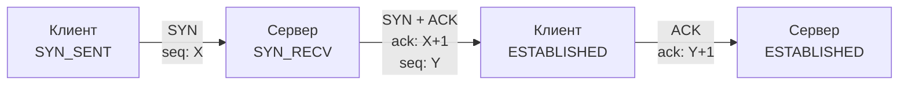

## Введение: Почему TCP — это не просто «труба»

Для бэкенд-разработчика TCP кажется прозрачным слоем, который гарантирует доставку пакетов. Но в высоконагруженных Go-системах TCP становится узким местом, источником latency spikes и причиной утечек ресурсов. Понимание **Handshake**, **Flow Control** и **Congestion Control** позволяет не просто писать код, а управлять поведением сетевого стека, предсказывать деградацию под нагрузкой и избегать типичных production-ловушек.

В этой статье мы разберем механику установления соединений, механизмы контроля потока и перегрузки, а также посмотрим, как Linux и Go runtime взаимодействуют с этими процессами «под капотом».

---

## TCP Handshake: Три этапа установления соединения

TCP устанавливает соединение через **3-way handshake**. Это не просто формальность, а механизм согласования начальных последовательностей (ISN) и подтверждения готовности сторон.

1. **SYN**: Клиент отправляет пакет с флагом `SYN=1` и случайным `seq`. Переходит в состояние `SYN_SENT`.
2. **SYN-ACK**: Сервер (получив `SYN`) отвечает `SYN=1`, `ACK=1`, подтверждает `seq` клиента (`ack = seq_client + 1`) и отправляет свой `seq`. Состояние `SYN_RECV`.
3. **ACK**: Клиент подтверждает `seq` сервера (`ack = seq_server + 1`). Состояние `ESTABLISHED`. Соединение готово.



### Почему именно 3 этапа?
Если бы хватило двух, то задержанный (duplicated) `SYN` от старого соединения мог бы случайно создать новое, невалидное для приложения. Третий шаг гарантирует, что обе стороны подтвердили готовность и знают начальные номера последовательностей друг друга.

> [!warning] Ловушка / Gotcha
> **Half-Open Connections**: Если сервер получил `SYN` и ответил `SYN-ACK`, но не дождался финального `ACK` (клиент упал или пакет потерян), соединение висит в `SYN_RECV`. В Linux это контролируется таймером `tcp_synack_timer`. Если соединений в этом состоянии много — это классический признак SYN-flood атаки или проблемы на стороне клиента.

В Go установление соединения выглядит просто, но за ним стоит сложный путь:
```go
conn, err := net.DialTimeout("tcp", "127.0.0.1:8080", 5*time.Second)
if err != nil {
    return fmt.Errorf("dial failed: %w", err)
}
defer conn.Close()
```
При вызове `Dial` Go запускает `connect()` syscall. Если сеть медленная или пакет `SYN-ACK` не приходит, syscall блокирует горуину до таймаута. Go не использует `select` с таймером внутри `Dial` на уровне ядра — он полагается на `epoll` (см. `[[38. Как Go работает с сетью. net, net_http, netpoller, epoll]]`).

---

## Flow Control: Скользящее окно и буферы получателя

**Flow Control** защищает получателя от переполнения его буфера. Он гарантирует, что отправитель не будет слать данные быстрее, чем получатель сможет их обработать и освободить память.

В заголовке TCP есть поле **Window Size** (16 бит, но с опцией `Window Scale` расширяется до 32 бит). Оно сообщает отправителю, сколько байт памяти доступно в приемном буфере (`sk_rcvbuf` в Linux).

### Как это работает под капотом
1. Linux выделяет буфер для сокета. Размер по умолчанию зависит от `net.core.rmem_default` и `net.core.rmem_max`.
2. При получении данных ядро копирует их из `sk_buff` в буфер сокета.
3. При чтении приложением (syscall `read`/`recv`) данные копируются из буфера сокета в user-space.
4. Поле `Window Size` в исходящих `ACK` пакетах обновляется: `Window = Buffer_Size - Used_Space`.

> [!info] Под капотом
> В Linux структура `tcp_sock` (определяется в `include/net/tcp.h`) содержит поля `rcv_wup` (right edge of window), `rcv_wnd` (current window size) и `copied_seq` (сколько байт уже скопировано в user-space). Когда `rcv_wnd == 0`, получатель отправляет **Zero Window**.

### Zero Window и Zero Window Probes
Если приложение на сервере не читает данные из `conn`, буфер заполняется. Сервер шлет `Window Size = 0`. Клиент должен **прекратить отправку данных**, но не разрывать соединение.
Чтобы обнаружить разрыв (например, клиент потерял последний `ACK` о нулевом окне), сервер периодически шлет **Zero Window Probes** (пакеты с нулевым окном, но с флагом `ACK`). Клиент отвечает подтверждением, и цикл возобновляется.

В Go это поведение прозрачно, но важно понимать: если вы пишете в `conn` быстрее, чем читаете, `SetWriteBuffer` не спасет. Данные будут накапливаться в буфере ядра (`SO_SNDBUF`), что приведет к росту latency и eventual `ECONNRESET` при переполнении.

---

## Congestion Control: Управление нагрузкой в сети

**Congestion Control** решает совсем другую задачу: он защищает **сеть** (маршрутизаторы, каналы) от коллапса, а не получателя. Когда пакеты теряются из-за переполнения буферов на промежуточных узлах, TCP должен снизить скорость передачи.

### Основные алгоритмы (AIMD)
1. **Slow Start**: Экспоненциальный рост `cwnd` (congestion window). Каждое подтвержденное ACK увеличивает `cwnd` на 1 MSS.
2. **Congestion Avoidance**: Когда `cwnd` достигает `ssthresh` (slow start threshold), рост становится линейным (Additive Increase).
3. **Fast Retransmit & Recovery**: Если приходят 3 дублирующихся ACK, алгоритм предполагает потерю одного пакета и начинает retransmission без ожидания таймаута. `cwnd` уменьшается в 2 раза (Multiplicative Decrease).

В Linux по умолчанию используется **CUBIC** (см. `[[13. Congestion Algorithms. Reno, Cubic, BBR]]`). Он оптимизирован для каналов с большой пропускной способностью и задержкой (High-Bandwidth Delay Product).

> [!tip] Собеседование
> **Вопрос:** В чем разница между Flow Control и Congestion Control?
> **Ответ:** Flow Control контролирует скорость на основе буфера **получателя** (реактивное поведение, `Window Size` в TCP заголовке). Congestion Control контролирует скорость на основе потерь пакетов в **сети** (проактивное/адаптивное поведение, `cwnd` в ядре). Flow Control защищает endpoint, Congestion Control защищает инфраструктуру.

---

## Под капотом: Linux TCP Stack и Go netpoller

Когда вы работаете с `net.Conn`, Go делегирует сетевую работу ядру Linux. Ключевые точки взаимодействия:

1. **`sk_buff` очередь**: Ядро хранит входящие/исходящие пакеты в цепочке `sk_buff`. При высокой нагрузке очередь растет, что увеличивает CPU cache misses при обработке.
2. **`sk_lock`**: В ядре используется spinlock для защиты структуры `tcp_sock` от конкурентного доступа. В Go это не проблема, так как `netpoller` работает в отдельных потоках OS и использует `epoll` для мультиплексирования.
3. **Go `netpoller`**: При вызове `conn.Read()` или `conn.Write()` Go проверяет, готов ли сокет через `epoll`. Если TCP стек блокирует запись из-за congestion control или zero window, `epoll` не возвращает событие `EPOLLOUT`. Горуина **не блокирует тред ОС**, а переходит в состояние `waiting` в `netpoll` (см. `[[38. Как Go работает с сетью. net, net_http, netpoller, epoll]]`). Это критически важно для масштабируемости: 100k горутин могут ждать разных сокетов без thrashing контекста.

### Влияние на производительность (Mechanical Sympathy)
- **CPU Cache Lines**: Каждое изменение `tcp_sock` или `sk_buff` может инвалидировать кэш-линии на ядрах, обрабатывающих прерывания сетевой карты (RPS/RFS в Linux). Для high-load систем важно настраивать `net.core.somaxconn` и использовать `SO_REUSEPORT` для балансировки между ядрами.
- **Context Switches**: Если приложение не успевает читать данные, буфер ядра заполняется. Ядро начинает дропать пакеты или отправлять нулевое окно. Go-рантайм перестает опрашивать сокет через `epoll`, экономя CPU.

---

## Код: Тонкая настройка TCP в Go

В production-системах настройки по умолчанию редко подходят. Вот идиоматичный способ управления буферами и keep-alive:

```go
package main

import (
    "context"
    "fmt"
    "log"
    "net"
    "time"
)

func setupTCPConn(conn net.Conn) error {
    // Увеличиваем буферы для снижения давления на GC и ядро
    // В Go эти значения ограничены net.core.rmem_max/sndbuf_max ОС
    if err := conn.SetReadBuffer(1024 * 1024); err != nil {
        return fmt.Errorf("set read buffer: %w", err)
    }
    if err := conn.SetWriteBuffer(1024 * 1024); err != nil {
        return fmt.Errorf("set write buffer: %w", err)
    }

    // Включаем Keep-Alive для обнаружения разорванных соединений
    if err := conn.SetKeepAlive(true); err != nil {
        return fmt.Errorf("set keepalive: %w", err)
    }
    // Период по умолчанию 15 сек, можно уменьшить для быстрой детекции
    if err := conn.SetKeepAlivePeriod(30 * time.Second); err != nil {
        return fmt.Errorf("set keepalive period: %w", err)
    }

    // Отключаем Nagle для low-latency сервисов (задерживает отправку мелких пакетов)
    if tcpConn, ok := conn.(*net.TCPConn); ok {
        if err := tcpConn.SetNoDelay(true); err != nil {
            return fmt.Errorf("set nodelay: %w", err)
        }
    }

    return nil
}

func main() {
    ln, err := net.Listen("tcp", ":8080")
    if err != nil {
        log.Fatalf("listen failed: %v", err)
    }
    defer ln.Close()

    for {
        conn, err := ln.Accept()
        if err != nil {
            log.Printf("accept error: %v", err)
            continue
        }

        if err := setupTCPConn(conn); err != nil {
            log.Printf("conn setup error: %v", err)
            conn.Close()
            continue
        }

        go handleConn(context.Background(), conn)
    }
}

func handleConn(ctx context.Context, conn net.Conn) {
    defer conn.Close()
    // Обработка...
}
```

> [!warning] Ловушка / Gotcha
> `SetReadBuffer` и `SetWriteBuffer` в Go **удваивают** значение, которое вы передаете. Это legacy-поведение от BSD sockets API. Если вы хотите 1 МБ, передавайте `512 * 1024`.

---

## Итоги

1. **Handshake** гарантирует согласование состояний и защищает от дублирования инициаций. Half-open соединения — индикатор атак или сетевых проблем.
2. **Flow Control** использует скользящее окно (`Window Size`) для защиты буфера получателя. Zero Window заставляет отправителя заморозить отправку, но не разрывать соединение.
3. **Congestion Control** (Slow Start, AIMD, CUBIC) регулирует `cwnd` на основе потерь в сети, предотвращая коллапс маршрутизаторов.
4. **Go и ядро**: `netpoller` эффективно ждет TCP-событий через `epoll`, не блокируя треды ОС. При заполнении буферов или congestion горуины корректно ставятся на паузу без context switch thrashing.
5. **Тюнинг**: Используйте `SetReadBuffer`/`SetWriteBuffer`, `SetKeepAlive` и `SetNoDelay` для контроля latency и throughput. Помните про удвоение буферов в Go.

Мы разобрали, как TCP управляет потоком и перегрузкой. Но что происходит, когда пакеты теряются? Как работают таймауты, Nagle и Keep-Alive на уровне протокола? В следующей статье мы углубимся в: [[12. TCP Retransmission, Keep Alive, Nagle и Delayed ACK.md]].