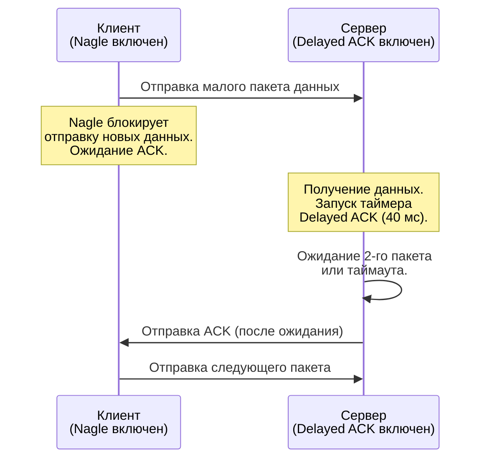

## Введение: Когда TCP начинает «думать»

В предыдущей статье мы разобрали базовый [[11. TCP Handshake, Flow Control и Congestion Control.md]] и механизмы управления окном. Но TCP — это не просто надёжный байтовый поток. Это протокол, который вынужден компенсировать нестабильность IP-сети, потерю пакетов и разнородность путей.

Для бэкенд-разработчика понимание этих механизмов критично, когда вы проектируете low-latency системы (RPC, real-time, high-frequency trading) или боретесь с «зависаниями» под нагрузкой. Сегодня мы разберём три механизма, которые напрямую влияют на задержку и пропускную способность:
1. **Retransmission** — как TCP обнаруживает и восстанавливает потерю пакетов.
2. **Nagle и Delayed ACK** — классический конфликт между буферизацией и задержкой.
3. **Keep-Alive** — детекция разрывов соединения на уровне ядра.

## TCP Retransmission: Механизмы восстановления

Когда отправитель не получает ACK в течение времени, равного **RTO (Retransmission Timeout)**, он считает пакет потерянным и отправляет его снова. Но современный стек TCP не полагается только на таймауты.

### 1. Fast Retransmit и Fast Recovery
Если отправитель получает **3 дубликата ACK (DupACKs)** для одного и того же последовательного номера, он понимает, что следующий пакет потерян, но сеть ещё жива. Вместо ожидания RTO (который может быть сотнями миллисекунд), он мгновенно отправляет потерянный пакет.

После Fast Retransmit включается **Fast Recovery**: `cwnd` (окно перегрузки) не сбрасывается до `1 MSS` (как при таймауте), а уменьшается пропорционально (обычно в 2 раза), чтобы избежать резкого спада пропускной способности.

> [!info] Под капотом
> В Linux ядро использует алгоритм **Jacobson/Karels** для расчёта RTO. Он динамически оценивает RTT (Round Trip Time) и его дисперсию (RTTVAR):
> `RTO = AVERAGE_RTT + max(K, DELAYED_ACK_TIME) * 4`
> Где `K` — константа, зависящая от дисперсии. Если дисперсия растёт (сеть нестабильна), RTO увеличивается, но не линейно, а с защитой от экспоненциального роста.

### 2. Exponential Backoff
Если Fast Retransmit не сработал или потеряна серия пакетов, TCP применяет экспоненциальное увеличение RTO: `RTO *= 2` после каждой неудачной попытки, до достижения `TCP_RTO_MAX` (по умолчанию 120 сек в Linux). После 15 неудачных попыток (`tcp_retries2`) соединение принудительно разрывается.

### 3. Go и настройка Retransmission
Go не предоставляет прямых API для тонкой настройки RTO или лимитов повторов. Эти параметры контролируются ядром Linux через `sysctl`:
```bash
# Минимальный RTO (Linux 4.16+)
sysctl -w net.ipv4.tcp_rto_min=200
# Максимальное количество попыток ретрансмитов
sysctl -w net.ipv4.tcp_retries2=15
```
На уровне приложения в Go вы можете перехватывать ошибки `*net.OpError` и анализировать `Timeout()` и `Temporary()` для реализации собственного retry-механизма с экспоненциальным backoff.

## Nagle и Delayed ACK: Классический конфликт

Эти два механизма созданы для оптимизации загрузки сети, но при совместном включении могут вызвать **deadlock-эффект** (зависание отправки).

### Алгоритм Нагла (Nagle's Algorithm)
Предотвращает отправку множества мелких пакетов, если есть данные, ожидающие подтверждения.
**Правило:** Отправить пакет, если:
1. Буфер отправителя пуст.
2. Получен ACK на все отправленные данные.
3. Установлен флаг `TCP_NODELAY` (отключает алгоритм).

### Delayed ACK
Получатель не отправляет ACK мгновенно на каждый пакет, а ждёт:
1. Прихода второго пакета данных (чтобы ACK совпал с отправкой своего ответа).
2. Или таймаута `tcp_delack_max` (в современных ядрах ~40 мс, исторически 400 мс).

### Сценарий зависания (Nagle + Delayed ACK)



Клиент ждёт ACK, чтобы снять блокировку Nagle. Сервер ждёт второго пакета, чтобы отправить ACK сразу. Оба ждут. Задержка увеличивается на `tcp_delack_max`.

> [!warning] Ловушка / Gotcha
> В gRPC и HTTP/2 это критично. Если вы отправляете много мелких RPC-запросов, задержка каждого будет определяться временем `Delayed ACK` на стороне сервера.

### Решение
Отключение Nagle на стороне отправителя: `TCP_NODELAY=1`.
В Go это делается через `net.Conn`:
```go
conn, err := net.Dial("tcp", addr)
if err != nil {
    return err
}
defer conn.Close()

// Отключаем алгоритм Нагла для снижения задержки
if err := conn.SetNoDelay(true); err != nil {
    return fmt.Errorf("set nodelay: %w", err)
}
```
**Важно:** В Go `TCP_NODELAY` включён по умолчанию для всех соединений, созданных через `net.Dial` и `net.Listen`. Это историческое решение, чтобы избежать проблем с задержками в сетевых приложениях.

## TCP Keep-Alive: Детекция разрывов

**TCP Keep-Alive** — это механизм ядра для обнаружения «мёртвых» пиров (краш сервера, обрыв кабеля, зависание NAT).

### Как работает
1. После `tcp_keepalive_time` (по умолчанию 7200 сек) idle-сессии ядро отправляет probe-пакет (TCP segment с ACK-битом и последовательным номером последнего полученного байта).
2. Если ответ не получен, probe повторяется каждые `tcp_keepalive_intvl` (75 сек) до `tcp_keepalive_probes` (9 раз).
3. После 9 неудачных probe-пакетов соединение закрывается с ошибкой `ETIMEDOUT`.

> [!warning] Ловушка / Gotcha
> **NAT и межсетевые экраны не поддерживают TCP Keep-Alive.** Они отслеживают состояние соединения по таймауту активности (обычно 5-15 минут). Если через NAT проходит TCP-соединение, которое не передаёт данные 7200 секунд, NAT-шлюз уже давно уничтожит его состояние. TCP Keep-Alive до NAT не дойдёт.

### Настройка в Go
```go
// Включение TCP Keep-Alive
if err := conn.SetKeepAlive(true); err != nil {
    return fmt.Errorf("set keepalive: %w", err)
}
// Период проверки (доступен с Go 1.16)
if err := conn.SetKeepAlivePeriod(30 * time.Second); err != nil {
    return fmt.Errorf("set keepalive period: %w", err)
}
```

### TCP Keep-Alive vs Application Heartbeat
В современных распределённых системах **TCP Keep-Alive считается ненадёжным** для бизнес-логики. 
- Он не различает «сервер завис» и «сервер работает, но не отвечает на наши запросы».
- Он не работает за NAT/Firewall.
- Он проверяет только сетевой уровень, а не приложение.

**Рекомендация:** Используйте прикладные heartbeat-механизмы (gRPC `KeepaliveParams`, HTTP/2 Ping, кастомные TCP-команды `PING/PONG`). Они дают точную информацию о здоровье сервиса и работают поверх любого туннеля.

## Go-интеграция и тюнинг в production

В Go работа с этими параметрами сводится к двум слоям:
1. **Socket Options (`net.Conn`)** — `SetNoDelay`, `SetKeepAlive`, `SetKeepAlivePeriod`, `SetReadBuffer`, `SetWriteBuffer`.
2. **Ядро Linux (`sysctl`)** — `tcp_rto_min`, `tcp_delack_max`, `tcp_keepalive_*`, `tcp_slow_start_after_idle`.

### Практические рекомендации для бэкенда
- Для low-latency RPC: всегда оставляйте `SetNoDelay(true)` (по умолчанию в Go).
- Для bulk-transfer (файлы, большие payload): `SetNoDelay(false)` может повысить пропускную способность за счёт уменьшения overhead заголовков.
- Настройте `tcp_delack_max` на стороне серверов под workload. Для интерактивных сервисов `sysctl -w net.ipv4.tcp_delack_min=1` и `tcp_delack_max=1` снижает задержки ACK до минимума.
- При работе с `net/http.Transport` или `gRPC` пул соединений переиспользует сокеты. Настройки, установленные на `conn`, применяются только при первом `Dial`. Для глобального тюнинга используйте `sysctl` или `SO_REUSEPORT` + `SO_BINDTODEVICE` в Kubernetes.

## Итоги и вопросы на собеседовании

Мы разобрали, как TCP компенсирует потерю пакетов, балансирует между буферизацией и задержкой, и обнаруживает разрывы. Эти механизмы тесно связаны с тем, как Go управляет сетевым I/O через `netpoller` и epoll/kqueue.

> [!tip] Собеседование
> **Вопрос:** В чём разница между TCP Keep-Alive и Application Heartbeat? Почему в микросервисах чаще используют второе?
> **Ответ:** TCP Keep-Alive — это механизм ядра для детекции мёртвых пиров на сетевом уровне. Он не проходит за NAT, имеет большие таймауты по умолчанию и не проверяет состояние приложения. Application Heartbeat (gRPC keepalive, HTTP/2 ping) работает на уровне протокола, проходит через любые прокси/NAT, настраивается под SLA сервиса и гарантирует, что приложение живо, а не только сетевой стек.

**Вопрос:** Как работает алгоритм Нагла и с чем он конфликтует?
**Ответ:** Nagle объединяет мелкие пакеты в один, если есть незаподтверждённые данные. Он конфликтует с Delayed ACK на стороне получателя, так как получатель ждёт второй пакет для отправки ACK, а отправитель ждёт ACK для отправки следующего пакета. Решается отключением Nagle (`TCP_NODELAY`) на стороне отправителя.

**Вопрос:** Как Go обрабатывает ретрансмиссии TCP?
**Ответ:** Go не реализует TCP стек на уровне приложения. Все ретрансмисции, RTO-таймеры и Fast Retransmit обрабатываются ядром Linux. Go-рантайм получает события через `netpoller` (epoll), и если пакет потерян, `Read()`/`Write()` блокируются до получения ACK или таймаута. Настройку RTO можно менять только на уровне ядра (`sysctl`) или через `syscall.Setsockopt` с флагами `TCP_CONGESTION`/`TCP_RTO_MIN`.

Мы завершили разбор механизмов восстановления и оптимизации TCP. Следующий шаг — как эти механизмы влияют на глобальную производительность сети и какие алгоритмы контроля перегрузки управляют `cwnd` в современных ядрах. 

Переходим к: [[13. Congestion Algorithms. Reno, Cubic, BBR.md]]