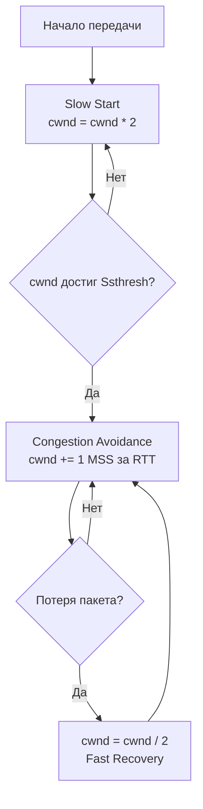

## Введение: Зачем Go-разработчику знать алгоритмы контроля перегрузки?

Контроль перегрузки (Congestion Control) — это механизм ядра Linux, который динамически регулирует размер окна передачи TCP-соединения (`cwnd`), чтобы не завалить сеть пакетами. Для Go-бэкенда это не абстрактная теория, а фундаментальный параметр производительности. От выбранного алгоритма зависит, как быстро `net/http` сервер отдаст ответ, как поведет себя `netpoller` при ожидании готовности сокета, сколько памяти займут буферы и каков будет P99 latency в распределенной среде.

> [!info] Под капотом
> В Linux алгоритм реализован через структуру `tcp_congestion_ops`. При получении каждого ACK ядро вызывает функцию алгоритма (например, `cubic_ack` или `bbr_main`), которая решает: увеличивать `cwnd` или уменьшать. Это происходит в контексте прерывания сетевого стека (softirq `NET_RX_SOFTIRQ`), поэтому тяжелые вычисления в алгоритме могут блокировать обработку остальных пакетов. Go-рантайм здесь не вмешивается, но напрямую зависит от результата работы стека.

## Фундамент: Как TCP понимает, что сеть перегружена?

Классические алгоритмы используют **потерю пакетов** как единственный сигнал перегрузки. Это парадоксально: чтобы узнать, что сеть забита, нужно, чтобы пакеты *пропали*.

Когда `cwnd` превышает пропускную способность канала (Bandwidth-Delay Product, BDP), буферы маршрутизаторов заполняются, и начинается tail-drop. Потеря пакета → редукция окна → падение пропускной способности → рост задержки (Bufferbloat).

## TCP Reno: Классический AIMD

Reno (RFC 5681) использует стратегию **AIMD** (Additive Increase, Multiplicative Decrease).
*   **Рост:** При получении ACK `cwnd` увеличивается на 1 MSS (Maximum Segment Size) за RTT. Линейный рост.
*   **Снижение:** При потере пакета `cwnd` уменьшается вдвое (`cwnd = cwnd / 2`).
*   **Механизм:** Fast Retransmit и Fast Recovery позволяют восстановить связь без полного сброса окна.



Reno отлично работает в локальных сетях с низкой задержкой, но в WAN и облачных условиях его линейный рост слишком медленный, а половинное снижение слишком агрессивное. Пропускная способность восстанавливается долго.

## TCP Cubic: Стандарт Linux и рост по времени

С 2009 года Cubic является алгоритмом по умолчанию в Linux. Он решает проблему медленного восстановления Reno, привязывая рост окна не к количеству ACK, а к **прошедшему времени** с момента последней потери.

Формула роста:
`W_cubic = C * (t - K)^3 + W_last_loss`
Где `t` — время, `K` — точка, где окно достигло максимума, `C` — константа.

> [!info] Под капотом
> Кубический рост (`t^3`) позволяет быстро набрать пропускную способность канала после потери, не вызывая новую перегрузку. Алгоритм адаптируется под BDP автоматически: чем выше задержка или пропускная способность, тем быстрее он расширяет окно.

**Плюсы:** Хорошая TCP-Friendly-конфиденциальность, стабильность в гетерогенных сетях.
**Минусы:** Все еще реагирует на *потерю* пакетов. В облаках с высокой задержкой (межрегиональные вызовы, CDN) это приводит к избыточным буферам и высокому P99 latency.

## TCP BBR: Смена парадигмы (Lossless Congestion Control)

BBR (Bottleneck Bandwidth and Round-time) от Google отказывается от потери пакетов как сигнала. Вместо этого он строит модель сети в реальном времени, измеряя **пропускную способность (BW)** и **минимальную задержку (min RTT)**.

BBR работает в трех фазах:
1. **Startup:** Агрессивный рост окна, пока не будет найдена максимальная BW.
2. **Drain:** Сброс избыточных буферов, накопленных на этапе Startup, для снижения задержки.
3. **ProbeBW:** Периодическое пинкование канала пакетами максимального размера (Pacing Packets), чтобы проверить, есть ли свободная пропускная способность.

> [!tip] Собеседование
> **Вопрос:** Почему BBR работает лучше Cubic в облачных сетях с высокой задержкой?
> **Ответ:** Cubic ждет потери пакета, чтобы уменьшить окно. В облаках с высокой RTT потеря пакета означает, что окно уменьшится, и потребуется время на восстановление. Это убивает latency. BBR измеряет min RTT и BW напрямую. Он держит окно ровно таким, чтобы заполнить канал, но не забить буферы маршрутизаторов. Это дает низкую задержку и высокую утилизацию.

> [!warning] Ловушка / Gotcha
> BBR требует поддержки на обоих концах соединения (или хотя бы на отправителе). Если вы включаете BBR на Go-сервере, а клиент или балансировщик используют старый TCP-стек, преимущества будут частично потеряны. Кроме того, BBR может быть агрессивным в сетях с высокой потерей пакетов (не связанных с перегрузкой), так как интерпретирует их как сигнал для снижения BW.

## Сравнение и выбор в production

| Алгоритм | Сигнал перегрузки | Поведение при потере | Оптимально для |
|---|---|---|---|
| **Reno** | Потеря пакета | Резкое снижение | Локальные сети, legacy |
| **Cubic** | Потеря пакета | Адаптивный рост по времени | Linux-стандарт, гетерогенные сети |
| **BBR** | BW + min RTT | Снижение BW, но не окна | Облака, CDN, high-latency WAN, Go-серверы |

## Go, Linux и сетевой стек: Практика

В Go вы не меняете алгоритм в коде, но вы управляете его последствиями через буферы сокетов и параметры ядра.

Проверка текущего алгоритма:
```bash
sysctl net.ipv4.tcp_congestion_control
# output: net.ipv4.tcp_congestion_control = cubic
```

Включение BBR (требует ядро Linux 4.9+):
```bash
sudo sysctl net.ipv4.tcp_congestion_control=bbr
```

Для Go-бэкенда критично настроить буферы, чтобы алгоритм не уперся в лимиты ядра:
```go
cfg := net.ListenConfig{
    Control: func(network, address string, c syscall.RawConn) error {
        return c.Control(func(fd uintptr) {
            // Увеличиваем буфер приема, чтобы BBR мог эффективно измерять RTT и BW
            syscall.SetsockoptInt(int(fd), syscall.SOL_SOCKET, syscall.SO_RCVBUF, 1024*1024)
            // Увеличиваем буфер отправки для пайплайнинга
            syscall.SetsockoptInt(int(fd), syscall.SOL_SOCKET, syscall.SO_SNDBUF, 1024*1024)
        })
    },
}
```

> [!info] Под капотом
> Go использует `netpoller` (epoll/kqueue) для асинхронного ожидания готовности сокетов. Когда `cwnd` падает из-за congestion control, сокет становится не готов к записи. `netpoller` снимает горутина с CPU, переводит её в состояние waiting в структуре `g`. Чем реже `cwnd` позволяет отправлять данные, тем чаще горутины будут контекстно переключаться. Это влияет на CPU usage и latency.

## Ловушки и собеседования

*   **Bufferbloat:** Если вы видите высокую задержку при полной утилизации канала, но потери пакетов нет, это классический случай, где BBR или `fq_codel` (queueing discipline) спасают ситуацию.
*   **TCP Buffer Tuning:** Формула BDP = BW * RTT. Буферы сокета должны быть >= BDP. В Go 1.19+ появился `net/http.Transport` параметр `ReadBufferSize` и `WriteBufferSize`, но на уровне ядра `sysctl net.ipv4.tcp_rmem` и `tcp_wmem` часто важнее.
*   **Собеседование:** Как congestion control влияет на производительность Go HTTP-сервера? Он определяет, как быстро заполняется sndbuf и как часто netpoller будит горутины. Неверные настройки буферов + Cubic в WAN = высокий P99 latency и пустая загрузка CPU.

## Итог

1.  **Reno** — исторический AIMD, слишком медленный для WAN.
2.  **Cubic** — стандарт Linux, рост окна по времени, хорош для стабильных сетей, но реагирует на потерю.
3.  **BBR** — современный лидер, моделирует сеть по BW и RTT, снижает задержку и повышает утилизацию в облаках.
4.  Для Go-разработчика важно не только выбрать алгоритм на ядре, но и правильно настроить буферы сокетов и понимать, как cwnd влияет на работу netpoller и контекстные переключения горутин.

Мы разобрали, как TCP управляет нагрузкой. Но что если нам вообще не нужны эти гарантии доставки и контроля порядка? В следующей статье мы уйдем от TCP к UDP: [[14. UDP. Когда ненадежный транспорт лучше TCP.md]].