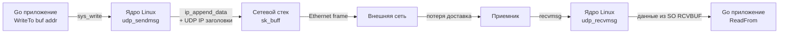

## UDP: Философия и устройство

**UDP (User Datagram Protocol)** — протокол транспортного уровня (RFC 768), который сознательно отказывается от механизмов установления соединения, подтверждения доставки и контроля порядка пакетов. В отличие от TCP, который моделирует поток байтов через виртуальный канал, UDP оперирует **датаграммами** — независимыми блоками данных с сохраненными границами.

Для Go-разработчика переход от TCP к UDP — это не просто смена `SOCK_STREAM` на `SOCK_DGRAM`. Это смена парадигмы: вы берете на себя ответственность за надежность, упорядочивание и восстановление потерь, взамен получая минимальную задержку, предсказуемое поведение и доступ к broadcast/multicast.

## Под капотом: Ядро Linux и датаграммы

В ядре Linux UDP реализуется через структуру `struct udp_sock` (определена в `include/net/udp.h`). При создании сокета `socket(AF_INET, SOCK_DGRAM, IPPROTO_UDP)` ядро выделяет эту структуру, но в отличие от TCP, здесь нет очередей `sk_write_queue` для handshakes, нет `tcp_congestion_ops` для window management и нет состояния `TCP_ESTABLISHED`.

Процесс отправки данных проходит через `udp_sendmsg` -> `ip_append_data` -> `ip_send_skb`. Ядро берет ваш буфер, добавляет UDP-заголовок (ровно 8 байт: `src_port`, `dst_port`, `length`, `checksum`) и IP-заголовок, после чего передает `sk_buff` в сетевой стек. Нет ACK, нет retransmit, нет flow control. Если пакет теряется на маршрутизаторе или на приемнике — он исчезает навсегда.

Ключевое отличие от TCP на уровне ядра: **сохранение границ сообщений (message boundaries)**.
Если вы записали в UDP-сокет 100 байт, на приемнике будет ровно один вызов `recv` с 100 байтами. Ядро не склеивает пакеты и не режет их (до уровня MTU). Это делает UDP идеальным для бинарных протоколов, где целостность пакета критична.



> [!info] Под капотом
> UDP-заголовок содержит поле `Checksum`, которое в IPv4 является опциональным (часто отключено для снижения нагрузки на CPU), а в IPv6 — обязательным. В Go пакет `net` автоматически вычисляет и подставляет контрольную сумму, если вы используете `WriteTo` или `DialUDP`.

## Go-реализация: net.UDPConn и netpoll

В Go UDP-сокеты инкапсулируются в `net.UDPConn`, который встраивает `net.IPConn`. В отличие от TCP-соединений, UDP-сокет в Go **не имеет состояния подключения**. Вы можете вызвать `conn.Connect(addr)`, но это не установит соединение. В ядре это лишь заполнит поля `sk->sk_daddr` и `sk->sk_dport`, что позволит использовать `Write` и `Read` без указания адреса, но пакеты всё равно будут уходить на любые адреса, если вы явно укажете `WriteTo` или `ReadFrom`.

Планировщик Go (`netpoll`) обрабатывает UDP-сокеты через `epoll` (Linux) или `kqueue` (BSD/macOS). Поведение событий отличается от TCP:
- `EPOLLIN` означает, что в буфере сокета (`SO_RCVBUF`) есть данные, готовый к чтению.
- `EPOLLOUT` означает, что в `SO_SNDBUF` есть место, но **не гарантирует** успешную отправку. UDP может вернуть `EAGAIN` или `EWOULDBLOCK`, если буфер переполнится.

```go
package main

import (
	"fmt"
	"net"
	"os"
)

func main() {
	// 1. Создание UDP-сокета
	conn, err := net.ListenUDP("udp", &net.UDPAddr{
		IP:   net.ParseIP("127.0.0.1"),
		Port: 8080,
	})
	if err != nil {
		fmt.Fprintf(os.Stderr, "Ошибка создания сокета: %v\n", err)
		os.Exit(1)
	}
	defer conn.Close()

	fmt.Println("UDP сервер запущен на :8080")

	// 2. Цикл приема
	buf := make([]byte, 1500) // Стандартный MTU
	for {
		n, remoteAddr, err := conn.ReadFromUDP(buf)
		if err != nil {
			fmt.Fprintf(os.Stderr, "Ошибка чтения: %v\n", err)
			continue
		}

		fmt.Printf("Получено %d байт от %s\n", n, remoteAddr)

		// 3. Ответ (адрес уже известен)
		_, err = conn.WriteToUDP([]byte("ACK"), remoteAddr)
		if err != nil {
			fmt.Fprintf(os.Stderr, "Ошибка отправки: %v\n", err)
		}
	}
}
```

## Когда UDP выигрывает у TCP

1. **Критичная задержка (Low Latency):** Отсутствие TCP handshake (3-way) и window management снижает RTT. В Go это особенно заметно при создании тысяч соединений в секунду (`net.Dial` для UDP работает мгновенно, без ожидания сетевого стека).
2. **Broadcast / Multicast:** TCP не поддерживает групповую рассылку. UDP позволяет отправлять пакеты на `224.0.0.0/4` (multicast) или `255.255.255.255` (broadcast). Используется в Service Discovery (mDNS, SSDP), игровых серверах, IoT.
3. **Контроль над надежностью:** Вы сами решаете, что ретранслировать. В голосовых кодеках (VoIP) или игровых тиках потеря одного пакета лучше, чем ожидание ACK и head-of-line blocking.
4. **Протоколы поверх:** DNS, TFTP, QUIC (частично), StatsD/Prometheus (push-метрики), gRPC-хелперы часто используют UDP для снижения накладных расходов на соединение.

> [!warning] Ловушка / Gotcha
> **Переполнение буфера и тихая потеря пакетов.**
> Если приложение не успевает вызывать `ReadFrom`, ядро Linux переполняет `SO_RCVBUF`. В отличие от TCP, который вернет `EAGAIN` или `EWOULDBLOCK`, UDP **тихо отбрасывает** лишние пакеты. Никакого исключения в Go не будет.
> Чтобы увеличить буфер, используйте `conn.SetReadBuffer(size)` до первого чтения. По умолчанию в Linux это часто 212 КБ, чего хватает далеко не всегда под нагрузкой.
> 
> **MTU и фрагментация.**
> UDP не фрагментирует датаграммы автоматически. Если размер пакета превышает Path MTU, ядро отбросит его и вернет ICMP `Fragmentation needed` (если флаг DF установлен, что часто бывает в облаках и контейнерах). Всегда ограничивайте payload под 1472 байта для IPv4 (1500 - 20 IP - 8 UDP) или 1452 для IPv6.

> [!tip] Собеседование
> **Вопрос:** «UDP не гарантирует доставку. Как вы реализуете надежность поверх него?»
> **Ожидаемый ответ:** «Внедряем слой поверх UDP (как в QUIC или DTLS): добавляем sequence numbers, ACK-пакеты, таймеры ретрансляции и sliding window. Важно не реализовывать полный TCP-стек, а брать только нужные гарантии. Для игровых/реалтайм-систем часто используют NACK (Negative ACK) — клиент сообщает, какой пакет потерян, а сервер ретранслирует только его. Также критично обрабатывать `EAGAIN` и настраивать `SO_RCVBUF`/`SO_SNDBUF` под нагрузку.»
> 
> **Вопрос:** «В чем разница между `conn.Connect()` и TCP-подключением?»
> **Ожидаемый ответ:** «`conn.Connect()` на UDP-сокете не устанавливает соединение. Это просто фильтр: ядро запомнит адрес назначения, и `Write`/`Read` будут использовать его по умолчанию. Пакеты все равно могут уходить на другие адреса, если явно указать `WriteTo`. В ядре это просто поля `sk_daddr`/`sk_dport`, нет state machine и нет выделения ресурсов на handshakes.»

## Итог

UDP — это не «сломанный TCP», а фундаментальный примитив для построения высокопроизводительных сетевых сервисов. Он дает прямое управление буферами, отсутствие задержек на handshake и поддержку групповой рассылки, но требует от разработчика явной реализации логики восстановления потерь и контроля MTU. В Go работа с UDP через `net.UDPConn` и `netpoll` остается эффективной, но требует внимательности к `SO_RCVBUF` и обработке `EAGAIN`.

Мы закончили разбор транспортного уровня. Следующий шаг — глубокое погружение в то, как приложения взаимодействуют с сетевым стеком на уровне API. В следующей статье мы разберем: [[15. Порты, сокеты и Socket API]], чтобы понять, как порты, файловые дескрипторы и системные вызовы формируют основу всего сетевого ввода-вывода в Go.