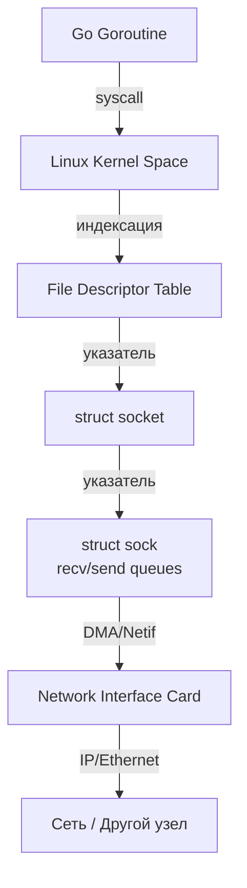

## Порты и сокеты: Логические и физические точки контакта

Для бэкенд-разработчика понимание портов и сокетов — это мост между абстрактным HTTP-сервером и реальным сетевым стеком операционной системы. В Go мы редко пишем сырые `socket()` вызовы, но производительность, стабильность и масштабируемость вашего сервиса напрямую зависят от того, как вы понимаете их внутреннее устройство.

### Что такое порт?
**Порт** — это 16-битное логическое число (от `0` до `65535`), которое идентифицирует конкретное приложение или службу внутри одного IP-узла. Порт не существует в физической сети; он является исключительно механизмом мультиплексирования на уровне хоста.
*   **Well-known ports (0–1023):** Требуют привилегий `root` для биндинга. HTTP (`80`), HTTPS (`443`), SSH (`22`).
*   **Registered ports (1024–49151):** Назначаются IANA для конкретных протоколов.
*   **Ephemeral ports (49152–65535):** Динамически выделяются клиентскими ОС для исходящих соединений.

В Go порт указывается в `net.Listen(":8080")`. Язык автоматически обрабатывает как IPv4, так и IPv6 (`dual-stack`), создавая два сокета, если ядро это поддерживает.

### Что такое сокет?
**Сокет** — это конечная точка взаимодействия (endpoint) в сетевом стеке, абстрагированная через BSD Socket API. Сокет определяется кортежем: `IP + Port + Protocol`.
В отличие от языка C, где сокет — это просто дескриптор файла (`int`), в Go `net.Conn` — это интерфейс, инкапсулирующий сырой сокет, буферы, таймауты и состояние соединения.

## Socket API: Жизненный цикл и системные вызовы

Независимо от языка, базовый жизненный цикл TCP-сервиса опирается на пять ключевых системных вызовов. В Go они скрыты в пакете `net`, но понимание их работы критично для отладки.

```go
// Идиоматичный Go-код, скрывающий сырые syscalls
func main() {
    ln, err := net.Listen("tcp", ":8080")
    if err != nil {
        log.Fatalf("listen failed: %v", err)
    }
    defer ln.Close() // Вызовет close() syscall и освободит FD

    for {
        conn, err := ln.Accept()
        if err != nil {
            log.Printf("accept failed: %v", err)
            continue
        }
        go handleConn(conn) // Каждаяgoroutine управляет своим FD
    }
}
```

### 1. `socket()` → `socket()` syscall
Создает новый сокет. Возвращает **File Descriptor (FD)** — целое число, которое ОС использует для индексации в таблице открытых файлов процесса. В Go этот FD сразу переводится в non-blocking режим (`O_NONBLOCK`), чтобы избежать блокировок планировщика.

### 2. `bind()` → `bind()` syscall
Привязывает сокет к локальному IP и порту. Если порт уже занят, вернется `EADDRINUSE`.
> [!tip] Собеседование
> **Вопрос:** Как разрешить перезапуск сервера без ожидания `TIME_WAIT`?
> **Ответ:** Использовать `SO_REUSEADDR`. В Go это делается через `syscall.SetsockoptInt(fd, syscall.SOL_SOCKET, syscall.SO_REUSEADDR, 1)` в кастомном `Control` функции `net.ListenConfig`. Без этого `bind()` упадет с ошибкой, даже если порт свободен, но есть соединения в `TIME_WAIT`.

### 3. `listen()` → `listen()` syscall (только TCP)
Переводит сокет в состояние `LISTEN`. Второй аргумент `backlog` определяет максимальный размер очереди **непринятых** соединений (syn queue).
> [!warning] Ловушка / Gotcha
> В Linux параметр `backlog` не работает как жесткий лимит. Ядро использует `somaxconn` (по умолчанию 128, часто меняется на `65535` в прод-системах). Если `listen(5)` вызвать с backlog=5, ядро все равно пропустит до `somaxconn` соединений. Для изменения `somaxconn` нужен `sysctl net.core.somaxconn` на уровне ОС.

### 4. `accept()` → `accept4()` syscall
Берет соединение из очереди, созданной клиентским `connect()`. Возвращает **новый FD** для уже установленного соединения. Оригинальный FD слушателя остается активным для новых подключений.
В Go `ln.Accept()` неблокирующий. Если очередь пуста, goroutine не блокируется навсегда — она регистрируется в `netpoll` и спит до события `EPOLLIN`.

### 5. `read()` / `write()` / `close()`
Данные передаются через кольцевые буферы ядра (kernel ring buffers). `close()` на TCP-сокете инициирует нормальный teardown (`FIN`/`ACK`), но не освобождает сокет мгновенно, если есть непрочитанные данные в recv-буфере.

## Под капотом: Сокеты в Linux

Сокет в Linux — это не просто структура, а полноценный объект ядра.

1.  **`struct file`**: Так как сокет маппится на FD, ядро создает объект `file`, который содержит указатель на `struct socket`.
2.  **`struct socket`**: Представляет конечную точку. Содержит `struct sock *sk` (указатель на транспортный слой) и `struct file *file`.
3.  **`struct sock`**: Ядро TCP/UDP стека. Здесь хранятся:
    *   `sk_receive_queue` и `sk_send_queue` (очереди `sk_buff` в памяти).
    *   Окно потока (`snd_wnd`, `rcv_wnd`).
    *   Таймеры (RTO, keepalive, retransmit).
4.  **Вызов `read()`/`write()`**: Данные копируются из `sk_buff` в пользовательский буфер через `copy_from_user` / `copy_to_user`. Это **два копирования** данных в память (ядро -> пользователь) и переключение контекста User -> Kernel.



## Go и Socket API: Абстракция и Netpoller

Go не создает тред на каждое соединение. Вместо этого он использует **Netpoller** — неблокирующий I/O мультиплексор, который в зависимости от ОС использует `epoll` (Linux), `kqueue` (BSD/macOS) или `IOCP` (Windows).

### Как Go обрабатывает тысячи соединений?
1.  При `net.Listen()` или `net.Dial()` сокет переводится в `O_NONBLOCK`.
2.  FD регистрируется в `epoll` через `epoll_ctl(epoll_ctl, fd, EPOLL_CTL_ADD)`.
3.  Go-планировщик (`runtime.gopark`) отключает горутину и передает управление ядру.
4.  Когда сетевая карта генерирует прерывание, драйвер будит ядро, а ядро сигнализирует `epoll_wait` через `epoll_pwait`.
5.  Планировщик Go видит событие `EPOLLIN`/`EPOLLOUT` для FD, будит соответствующую goroutine и возвращает управление.

Это означает, что Go-сервер может держать **сотни тысяч** открытых соединений при минимальном потреблении памяти (~2-4 КБ на goroutine стека + аллокации буферов), потому что нет накладных расходов на треды ОС и переключение их контекста.

> [!info] Под капотом
> В Go 1.21+ netpoller использует `epoll` с флагом `EPOLLONESHOT` для повышения fairness: сокет перерегистрируется только после обработки события, что предотвращает starvation (голодание) при всплесках трафика.

### Сравнение с другими языками
*   **C/C++:** Программист вручную управляет `fd`, `epoll`, таймаутами и буферами. Ошибка в `select()`/`poll()` или пропущенное `close()` ведет к утечке FD и `EMFILE` (too many open files).
*   **Java:** `ServerSocketChannel` + `Selector` (NIO). Аналогично Go, но `ByteBuffer` требует явного управления позицией/лимитом. Garbage Collector может создавать pause из-за аллокаций `Socket` объектов.
*   **PHP:** Исторически блокирующий `fsockopen`. В современных фреймворках (Swoole, RoadRunner) используется кооперативная многозадачность или async runtime, но модель остается ближе к C-сокетам, чем к Go-планировщику.

> [!tip] Собеседование
> **Вопрос:** Что произойдет, если вызвать `close()` на TCP-сокете, который находится в состоянии `ESTABLISHED`?
> **Ответ:** Инициируется нормальный teardown: отправляется `FIN`. Сокет переходит в `CLOSE_WAIT` на стороне, которая вызвала `close()`, и `FIN_WAIT_2` на клиенте. Если приложение перестало читать данные, recv-буфер ядра заполнится, и `close()` вернется мгновенно, но соединение в сети будет закрываться асинхронно. Для принудительного сброса используется `SO_LINGER` с `l_onoff=1, l_linger=0` (эквивалент `RST`), но в Go это делается через `syscall.SetsockoptLinger()`.

## Итог

1.  **Порт** — логический мультиплексор внутри хоста. **Сокет** — конечная точка взаимодействия, маппимая на FD.
2.  **Socket API** (`socket`, `bind`, `listen`, `accept`, `connect`) — базовые syscalls, которые Go инкапсулирует в `net`.
3.  **Под капотом** сокет — это объект ядра (`struct socket` -> `struct sock`) с кольцевыми буферами. Каждый `read/write` стоит переключения контекста и копирования данных.
4.  **Go Netpoller** (`epoll`/`kqueue`) позволяет обрабатывать десятки тысяч соединений в одной goroutine без блокировок, переводя FD в `O_NONBLOCK` и регистрируя их в мультиплексоре.
5.  **Оптимизация:** `SO_REUSEADDR`, настройка `somaxconn`, контроль размера очереди `accept()`, и понимание разницы между `close()` и `shutdown()` критичны для стабильных сервисов.

Мы разобрали, как приложения находят друг друга в сети и создают каналы связи. Но как клиент узнает, куда именно подключаться, если знает только доменное имя? В следующей статье мы разберем [[16. DNS. Как работает преобразование имени в IP]], чтобы понять фундаментальный механизм маршрутизации на уровне приложений.