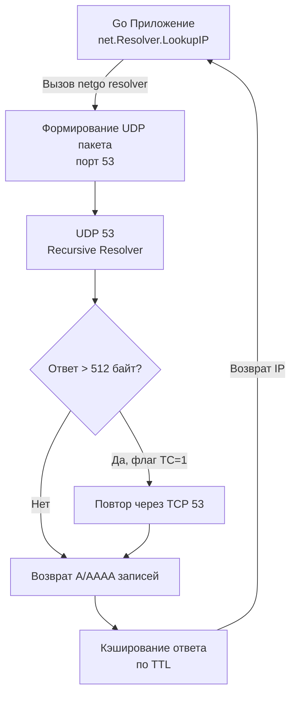

## Введение: DNS как фундамент сетевой инфраструктуры

Для бэкенд-разработчика DNS — это не просто «преобразование имени в адрес», а первый и самый критичный этап любого сетевого взаимодействия. В Go каждый вызов `net.Dial`, `http.Client.Do()` или `grpc.Dial()` неявно запускает резолвинг. Если DNS падает или отвечает медленно, ваше приложение не просто «не находит хост» — оно блокирует рабочие потоки, исчерпывает пулы соединений и провоцирует каскадные таймауты.

Понимание того, как Go резолвит домены, как взаимодействует с ОС, кэширует ответы и обрабатывает ошибки, напрямую влияет на отказоустойчивость и производительность распределённых систем.

## Иерархическая модель разрешения

DNS построена как иерархическая, распределённая база данных. При запросе имени Go не обращается напрямую к конечным серверам, а проходит через цепочку резолверов:

1. **Stub Resolver (Локальный резолвер)**: Обычно встроен в ОС или реализован в `netgo`. Принимает запрос от приложения и формирует UDP-пакет.
2. **Recursive Resolver (Рекурсивный резолвер)**: Сервер провайдера или публичный (Cloudflare 1.1.1.1, Google 8.8.8.8). Берёт на себя всю итеративную обходную работу.
3. **Authoritative Name Server (Авторитетный сервер)**: Хранит финальные записи (A, AAAA, CNAME) для конкретного домена.

> [!NOTE] Под капотом
> В Go с версии 1.11 по умолчанию используется **чистый Go resolver (`netgo`)**. Он полностью заменяет системный `libc` resolver, избегая блокировок в `glibc` и обеспечивая кроссплатформенное поведение. Это особенно важно в высоконагруженных Go-сервисах, где тысячи горутин одновременно делают DNS-запросы.

## Под капотом: Транспорт, UDP/TCP fallback и структура пакета

Резолвинг в Go начинается с отправки UDP-пакета на порт `53`. Однако за кулисами работает сложная логика fallback-механизмов:

1. **UDP 53**: Основной транспорт. Быстрый, без установки соединения.
2. **Truncation (Отсечение)**: Если ответ сервера превышает 512 байт (стандартный лимит UDP для DNS), сервер устанавливает флаг `TC` (Truncated). Клиент обязан повторить запрос через TCP.
3. **TCP 53**: Используется для больших ответов, DNSSEC-подписей или зонных переносов (AXFR). Добавляет 2 дополнительных RTT (Round-Trip Time).

Стандартный DNS-пакет состоит из:
- `Header`: ID запроса, флаги (QR, opcode, AA, TC, RD, RA), счётчики секций.
- `Question`: Запрашиваемое имя, тип записи (A/AAAA), класс (IN).
- `Answer/Authority/Additional`: Найденные записи, NS-серверы рекурсии, дополнительные данные (например, IP-адреса NS-серверов).



## Как Go resolver работает «под капотом»

`netgo` resolver не просто отправляет пакеты. Он реализует полноценный пользовательский стек:

1. **Парсинг конфигурации**: При старте программы читает `/etc/resolv.conf` (Linux), `SCDynamicStore` (macOS) или `dnscfg` (Windows). Извлекает `nameserver`, `domain`, `search`, `ndots`.
2. **`ndots` и `search` домены**: Если точка в имени домена меньше `ndots`, Go автоматически подставляет поисковые домены. Это критично для Kubernetes-сред, где сервисы резолвятся через `svc.cluster.local`.
3. **Встроенный кэш**: `net.Resolver` хранит ответы в `sync.Map` с TTL. Кэш очищается по истечении TTL, но не по времени доступа. Это предотвращает DoS-атаки через постоянный резолвинг.
4. **Асинхронный резолвинг**: Начиная с Go 1.11, `net.DialContext` резолвит адреса асинхронно. Контекст контролирует таймаут *после* начала резолва, но не отменяет его мгновенно.
5. **Fallback на системный resolver**: Если `netgo` не может проанализировать конфиг или включён `GODEBUG=netdns=cgo`, Go переключается на `cgo` resolver, делегируя запрос ОС.

> [!warning] Ловушка / Gotcha
> **`resolv.conf` и `ndots: 5` в Kubernetes**
> Если ваш Go-сервис запускается в кластере, и вы обращаетесь к внутреннему сервису по имени `db-master`, но не указываете полный FQDN, Go попробует добавить поисковые домены. Если `ndots` больше количества точек в имени, резолвинг займет несколько секунд (ожидание таймаута на каждом поисковом домене). Всегда используйте FQDN или настройте `ndots: 0` в Pod-spec.

> [!tip] Собеседование
> **Вопрос:** Как Go обрабатывает параллельные DNS-запросы к одному и тому же домену?
> **Ответ:** Go использует механизм **DNS Caching with Deduplication**. Первая горутина отправляет запрос и блокируется на ожидании ответа. Последующие горуны, видя активный запрос в кэше, не создают новых сокетов, а присоединяются к ожидающему каналу. Это предотвращает «storm of DNS queries» при старте кластера.

## Mechanical Sympathy: Влияние на CPU, кэши и задержки

С точки зрения архитектуры процессора и ОС, DNS-резолвинг — это операция с высокой стоимостью контекста:

1. **Context Switch & Syscall**: Вызов `connect()` для UDP-сокета вызывает системный вызов. Если кэш miss, происходит сетевой I/O, который может заблокировать тред ОС на время RTT (10-100ms). В Go это не блокирует горутины, но может заблокировать `M` (системный тред), заставляя планировщик создавать новый `M`.
2. **CPU Cache Pollution**: Парсинг DNS-пакета, хеширование ключей кэша (`sync.Map`), сравнение TTL работают с кучей и кэшем L1/L2. При высокой частоте резолвинов (например, при перезагрузке сервиса) происходит cache thrashing.
3. **Branch Prediction**: Внутренний кэш Go проверяет TTL атомарно. При hit'е ветвление предсказывается успешно. При miss'е — переход к сетевому стеку. В высоконагруженных прокси это измеримо через `pprof` и `netpoll` трассировку.
4. **TCP Fallback Overhead**: Если ответ > 512 байт, Go открывает TCP-соединение. Это 3-way handshake + TLS (если используется DoH/DoT) + аллокации буферов. Каждая аллокация в Go может вызвать Escape Analysis на кучу, увеличивая нагрузку на GC.

> [!tip] Собеседование
> **Вопрос:** Почему `net.Dial` может блокировать горутины, даже если мы передаём `context`?
> **Ответ:** В старых версиях Go резолвинг был синхронным и блокировал горутины. В современных версиях Go 1.11+ резолвинг асинхронен, но `context` не отменяет уже запущенный резолвинг мгновенно. Если DNS-сервер не отвечает, горутина может ждать до таймаута контекста. Для отмены резолва нужно использовать `net.Resolver` с кастомным `DialContext` или переключиться на кэш.

## Идиоматичная работа с DNS в Go

Для production-систем никогда не полагайтесь на глобальный `net.DefaultResolver`. Создавайте изолированные резолверы, управляйте таймаутами и обрабатывайте ошибки явно.

```go
package main

import (
	"context"
	"errors"
	"fmt"
	"log"
	"net"
	"time"
)

func resolveWithTimeout(ctx context.Context, host string) ([]net.IP, error) {
	// Создаем изолированный резолвер с кастомным таймаутом
	resolver := &net.Resolver{
		PreferGo: true, // Всегда используем netgo resolver
		Dial: func(ctx context.Context, network, address string) (net.Conn, error) {
			d := net.Dialer{
				Timeout: 2 * time.Second, // Жесткий таймаут на UDP/TCP
			}
			return d.DialContext(ctx, network, "8.8.8.8:53")
		},
	}

	// LookupIP возвращает как IPv4, так и IPv6
	ips, err := resolver.LookupIP(ctx, "ip4", host)
	if err != nil {
		// Разделяем ошибки на категории для корректного fallback
		if errors.Is(err, context.DeadlineExceeded) {
			return nil, fmt.Errorf("dns timeout for host %s: %w", host, err)
		}
		if errors.Is(err, context.Canceled) {
			return nil, fmt.Errorf("dns canceled for host %s: %w", host, err)
		}
		return nil, fmt.Errorf("dns lookup failed for host %s: %w", host, err)
	}

	if len(ips) == 0 {
		return nil, fmt.Errorf("no IP addresses found for host %s", host)
	}

	return ips, nil
}

func main() {
	ctx, cancel := context.WithTimeout(context.Background(), 3*time.Second)
	defer cancel()

	ips, err := resolveWithTimeout(ctx, "api.example.com")
	if err != nil {
		log.Fatalf("Fatal DNS error: %v", err)
	}

	fmt.Printf("Resolved %s to %v\n", "api.example.com", ips)
}
```

**Ключевые практики:**
1. **`PreferGo: true`**: Гарантирует использование чистого Go резолвера, избегая `glibc` блокировок и утечек памяти.
2. **Изолированный `Dial`**: Позволяет направлять резолвинг на специфичные DNS-серверы (например, внутренний resolver в Kubernetes или DoH-эндпоинт).
3. **Явный анализ ошибок**: `context.DeadlineExceeded` vs `lookup` ошибки требуют разного поведения в приложении (retry vs circuit break).
4. **Кэширование на уровне приложения**: Если DNS меняется редко, используйте `sync.Map` с TTL или `golang.org/x/sync/singleflight` для дедупликации запросов.

## Итог

DNS в Go — это не абстракция, а активный компонент сетевого стека. `netgo` resolver обеспечивает кроссплатформенность и предсказуемость, но требует понимания:
- `resolv.conf` директив (`ndots`, `search`) и их влияния на задержки.
- Механизма UDP/TCP fallback при ответе > 512 байт.
- Встроенного кэша с TTL, который не реагирует на `context.Canceled`.
- Влияния резолвинов на CPU cache, syscalls и планировщик горутин.

Правильная настройка резолвера, изоляция контекстов и мониторинг DNS-задержек через метрики (например, `dns_lookup_duration_seconds`) — обязательный шаг для перехода от «кода, который работает» к «системе, которая отказоустойчива».

В следующей статье мы погрузимся в детали: [[17. DNS под капотом. Record Types, TTL, Recursive Resolver, кеширование]], разберём типы записей, механизмы рекурсивной обходной работы и тонкости кэширования на уровне протокола.