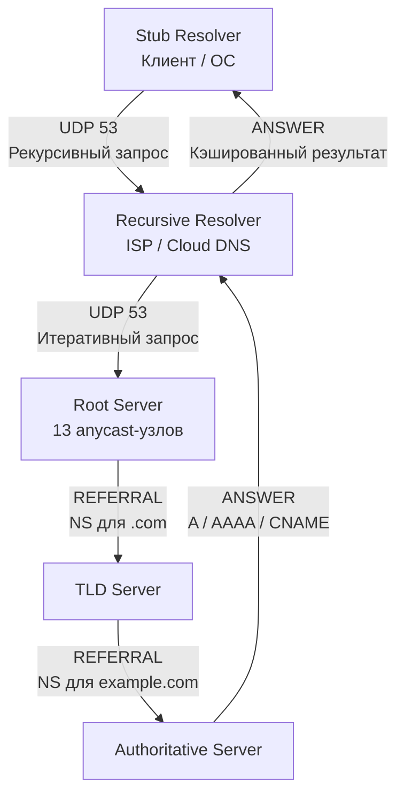

## Двоичный формат DNS-пакета и UDP-транспорт

DNS исторически построен на UDP/53. Это не случайность: отсутствие рукопожатия означает нулевую задержку на установление соединения, что критично для системы, которая должна отдавать ответы за миллисекунды.

DNS-пакет имеет строгую бинарную структуру:
1. **Header (12 байт):** ID запроса (для сопоставления ответа), флаги (QR, Opcode, AA, TC, RD, RA, RCODE), счётчики секций.
2. **Question:** Запрашиваемое имя и тип записи.
3. **Answer, Authority, Additional:** Массивы ресурсов.

> [!info] Под капотом
> Ранние реализации DNS ограничивали пакет 512 байтами. Если ответ был больше, сервер ставил флаг `TC` (Truncated) в заголовке. Клиент должен был переоткрыть соединение по TCP на тот же порт и отправить запрос заново. С появлением **EDNS0** (Extension Mechanisms for DNS) UDP-пакет может достигать 4096 байт (фактически сколько влезет в MTU сети с учётом IP/UDP заголовков). Флаг `TC` в EDNS0 игнорируется, если клиент указал `udp-max` в опциях.

Для бэкенд-разработчика важно понимать: DNS-запрос — это **не атомарная операция**. Это сетевой round-trip. Если UDP-пакет теряется (решётки, NAT, перегрузка роутеров), клиент должен реализовать собственную логику ретраев и таймаутов. В Go эту логику инкапсулирует рантайм, но вы должны явно управлять контекстом запроса.

## Иерархия резолверов: от Stub до Authoritative

DNS — распределённая иерархическая база данных. Запрос никогда не идёт напрямую к владельцу домена.



1. **Stub Resolver:** Часть вашей программы или ОС, которая формирует запрос. В Go это `net.Resolver`.
2. **Recursive Resolver:** Публичный DNS (8.8.8.8, 1.1.1.1) или корпоративный. Принимает запрос, сам обходит иерархию, кэширует ответ и отдаёт результат.
3. **Authoritative Server:** Владелец домена. Отдаёт только те записи, за которые отвечает.

> [!tip] Собеседование
> **Вопрос:** Почему резолвер не делает запрос напрямую к Authoritative серверу?
> **Ответ:** Для снижения нагрузки на корневые и TLD-серверы, а также для реализации кэширования и балансировки нагрузки. Итеративный подход позволяет резолверу кэшировать `NS`-записи промежуточных уровней, ускоряя последующие запросы. Рекурсивный запрос от клиента к резолверу позволяет резолверу скрывать внутреннюю архитектуру сети и применять политики безопасности.

## Типы записей (Record Types), на которые стоит обратить внимание

Go-разработчик чаще всего работает с `A` (IPv4) и `AAAA` (IPv6). Но в системном дизайне важны и другие типы:

- **`CNAME` (Canonical Name):** Алиас. Если `api.example.com` указывает на `lb.cloudprovider.net`, резолвер должен выполнить **цепочку рекурсивных запросов**. Каждая стрелка в цепочке — это новый сетевой round-trip. Длинные цепочки убивают latency.
- **`MX` (Mail Exchange):** Приоритетные серверы для почты. Резолвер сортирует по приоритету (меньше число = выше приоритет).
- **`TXT` (Text):** Хранит произвольные строки. Используется для SPF, DKIM, верификации доменов, а в микросервисах — для передачи конфигурации (Service Discovery через DNS).
- **`SRV` (Service):** `priority`, `weight`, `port`, `target`. Критичен для протоколов вроде LDAP, XMPP, или внутренних сервисов в Kubernetes (хотя K8s предпочитает `CoreDNS` с `SRV`-записями).
- **`NS` (Name Server) и `PTR` (Pointer):** Для зон и обратных записей.

> [!warning] Ловушка / Gotcha
> `CNAME` не может сосуществовать с другими записями на одном узле (RFC 1034). Если вы видите `CNAME` и `MX` на одном имени, это конфликт. Современные DNS-провайдеры автоматически эмулируют `CNAME` для других типов, но это не стандарт. При парсинге ответов через `net.Resolver` всегда проверяйте цепочки `CNAME`, чтобы избежать непредвиденных дополнительных запросов.

## TTL и кэширование: почему DNS не мгновенный

**TTL (Time To Live)** — абсолютное время жизни записи в секундах, указанное авторитативным сервером. Клиент **не может** кэшировать запись дольше указанного TTL, даже если соединение не разорвалось.

Механика кэширования:
1. Клиент делает запрос, получает ответ с `TTL: 300`.
2. Записывает в локальный кэш (OS resolver cache или `netgo` cache) время получения и TTL.
3. При повторном запросе того же имени проверяет `now < received_time + TTL`.
4. Если TTL истёк — кэш инвалидируется, запрос идёт в сеть.

> [!info] Под капотом
> В Linux DNS-кэш часто реализован через `systemd-resolved` или `nscd`. Go (в режиме `netgo`) ведёт собственный кэш в памяти процесса. Это значит, что разные Go-процессы не делят DNS-кэш между собой. Для микросервисов это преимущество: изоляция состояния, но недостаток: дублирование сетевых запросов в пуле инстансов.

TTL напрямую влияет на деплои. Если TTL = 3600 (1 час), вы не сможете быстро переключить трафик на новый IP. Rolling update займёт до часа для полного распространения. Инженерная практика: перед крупными изменениями снижать TTL до 60-300 секунд заранее.

## Как Go резолвит имена под капотом (netgo vs glibc)

В Go резолвинг управляется пакетом `net`. Ключевые компоненты:
- `net.LookupIP(host)` — глобальная функция, использует дефолтный `net.Resolver`.
- `net.Resolver` — кастомизируемый резолвер. Позволяет задать свои nameservers, search domains, timeout.
- `net.DialContext` — при подключении к хосту без IP вызывает DNS внутри.

По умолчанию Go собирается с тегом `netgo` (чистый Go). Он парсит `/etc/resolv.conf` вручную:
- `nameserver` — список IP резолверов.
- `search` — домены поиска (для неполных имён).
- `ndots` — если имя содержит меньше точек, чем `ndots`, резолвер сначала пробует добавить поисковые домены.
- `timeout` / `attempts` — время ожидания и число ретраев перед возвратом ошибки.
- `options` — `rotate` (балансировка между nameservers), `single-request-reopen` (открывать новый UDP-сокет для каждого запроса, обходит NAT-баг), `use-vc` (принудительный TCP), `edns0`.

Если собрано с `cgo`, Go делегирует резолвинг в glibc (`getaddrinfo`). Поведение зависит от системной библиотеки, что делает бинарики непереносимыми между дистрибутивами без `CGO_ENABLED=0`.

> [!tip] Собеседование
> **Вопрос:** Почему `net.LookupIP` блокирует горутину и как это исправить?
> **Ответ:** `net.Resolver` не поддерживает `context.Context` напрямую. Вызов блокирует текущую горутину до завершения сетевого запроса. Идиоматичное решение: запускать резолвинг в отдельной горутине с `context.WithTimeout` и каналом для возврата результата. Это предотвращает starvation горутин в HTTP-хендлерах.

## Практика: управление DNS в Go-приложениях

В высоконагруженных сервисах DNS-запросы становятся узким местом. Паттерны оптимизации:
1. **Кэширование на уровне приложения:** Использовать `sync.Map` или `ttlcache` для хранения результатов.
2. **Кастомный резолвер:** Задавать конкретные DNS-серверы (например, VPC-резолвер AWS или CoreDNS кластера).
3. **Асинхронный резолвинг:** Не блокировать основной поток обработки запросов.

```go
package main

import (
	"context"
	"fmt"
	"net"
	"time"
)

// lookupWithTimeout предотвращает блокировку горутины при зависшем DNS
func lookupWithTimeout(ctx context.Context, host string) ([]net.IP, error) {
	type result struct {
		ips []net.IP
		err error
	}
	ch := make(chan result, 1)

	go func() {
		// netgo парсит /etc/resolv.conf или использует переданные nameservers
		ips, err := net.LookupIP(host)
		ch <- result{ips, err}
	}()

	select {
	case res := <-ch:
		return res.ips, res.err
	case <-ctx.Done():
		return nil, fmt.Errorf("dns lookup timeout for %s: %w", host, ctx.Err())
	}
}

func main() {
	resolver := &net.Resolver{
		PreferGo: true, // Принудительно использовать netgo вместо cgo
		Dial: func(ctx context.Context, network, address string) (net.Conn, error) {
			d := net.Dialer{
				Timeout: 2 * time.Second,
			}
			// Подключаемся к конкретному DNS-серверу в обход системного
			return d.DialContext(ctx, "udp", "10.0.0.53:53")
		},
	}

	ctx, cancel := context.WithTimeout(context.Background(), 3*time.Second)
	defer cancel()

	ips, err := resolver.LookupIP(ctx, "ip4", "api.internal.service")
	if err != nil {
		fmt.Printf("DNS failed: %v\n", err)
		return
	}

	for _, ip := range ips {
		fmt.Printf("Resolved: %s\n", ip)
	}
}
```

> [!warning] Ловушка / Gotcha
> **`PreferGo: true` vs `cgo`:** В контейнерных средах (Alpine, distroless) часто нет glibc. Сборка с `cgo` падает или ведёт к непредсказуемому поведению резолвинга. Всегда используйте `CGO_ENABLED=0` и `PreferGo: true` в production.
> **`ndots: 5` в Kubernetes:** По умолчанию K8s ставит `ndots: 5`. Это значит, что `api` будет искаться как `api.default.svc.cluster.local`, `api.svc.cluster.local`, `api.cluster.local`, `api.local`, `api` (внешний). 5 дополнительных запросов к DNS на каждое имя. Обязательно снижайте `ndots` или используйте полные FQDN в коде.

## Итог

1. DNS — это UDP-протокол с прикладной надёжностью (ретраи, таймауты, TCP-фолбэк при `TC` флаге).
2. Иерархия `Stub -> Recursive -> Root -> TLD -> Auth` обеспечивает масштабируемость, но добавляет сетевые задержки.
3. `CNAME`-цепочки и `TTL` напрямую влияют на latency и время распространения деплоев.
4. Go использует `netgo` по умолчанию, парся `/etc/resolv.conf`. `net.Resolver` блокирует горутину — используйте асинхронные паттерны с `context`.
5. В микросервисной архитектуре DNS-кэш OS часто избыточен. Контролируйте резолвинг на уровне приложения и задавайте явные DNS-серверы.

Мы полностью разобрали механизм разрешения имён. Но как только мы получаем IP, нам нужно установить безопасное соединение. В следующей статье мы перейдём к шифрованию: [[18. TLS и HTTPS. Шифрование поверх TCP]].