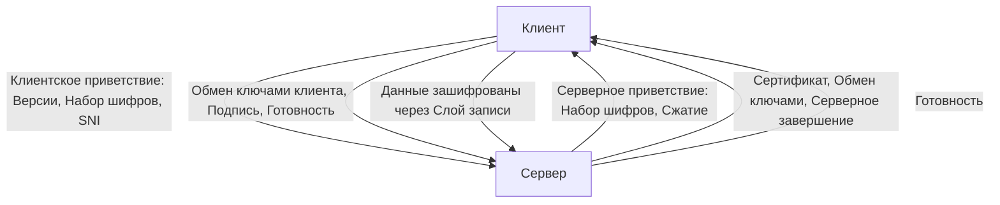

## Введение: HTTPS и место TLS в сетевом стеке

HTTPS — это HTTP поверх TLS (Transport Layer Security). В Go стандартом де-факто является использование пакета `[[18. TLS и HTTPS. Шифрование поверх TCP]]` (в реальности `crypto/tls`), который интегрирован напрямую в `net/http`. Когда вы используете `http.Client` или `http.Server` со схемой `https`, Go автоматически оборачивает базовый `net.Conn` в `tls.Conn`, берёт сертификаты из системного хранилища и управляет жизненным циклом соединения.

В отличие от PHP, где работа с криптографией часто делегируется внешнему расширению `openssl` (что требует `cgo` контекст-переключений и привязывает приложение к версии OpenSSL на сервере), Go реализует `crypto/tls` преимущественно на чистом Go. Это устраняет зависимость от внешних бинарных библиотек, упрощает кросс-компиляцию и позволяет рантайму тонко настраивать аллокации под `GOGC`. В Java аналогичная модель (`SSLSocket`/`SSLContext`) сильно перегружена объектной иерархией, тогда как Go делает ставку на композицию, интерфейсы `io.ReadWriter` и минимизацию косвенных вызовов.

## Архитектура протокола: Handshake и Record Layer

TLS делится на два основных слоя:
1. **Handshake Layer**: Аутентификация сторон, согласование криптографических алгоритмов (cipher suite), обмен ключами и генерация мастер-ключа (Master Secret).
2. **Record Layer**: Фрагментация прикладных данных, шифрование, добавление MAC (или AEAD nonce), контроль целостности и передача по TCP.



> [!tip] Собеседование
> **Вопрос:** Чем TLS 1.3 принципиально отличается от 1.2 в контексте производительности и безопасности?
> **Ответ:** TLS 1.3 сокращает рукопожатие до 1-RTT (ранее требовалось 2-RTT или 0-RTT с рисками replay-атак). Убраны устаревшие алгоритмы (RSA key exchange, CBC, SHA1, MD5). Внедрены обязательные AEAD-режимы (AES-GCM, ChaCha20-Poly1305). В Go 1.21+ TLS 1.3 включен по умолчанию, а рукопожатие оптимизировано через PSK (Pre-Shared Keys) и раннюю передачу данных.

## Под капотом: `crypto/tls` и взаимодействие с рантаймом

В Go `tls.Conn` — это обёртка над `net.Conn`. При первом вызове `Read` или `Write` неявно вызывается `Handshake()`. Если соединение ещё не установлено, горутина блокируется, пока рантайм не выполнит криптографические операции.

### Внутреннее устройство `tls.Conn`
Структура `tls.Conn` содержит:
- `conn net.Conn` — базовое TCP-соединение.
- `config *tls.Config` — параметры соединения (сертификаты, cipher suites, параметры GC).
- `handshakeStatus int32` — атомарный флаг состояния рукопожатия.
- `connState tls.ConnectionState` — кэш состояния соединения.
- `reader`/`writer` — буферы Record Layer.

При выполнении `tls.Conn.Read()` происходит следующее:
1. Проверка флага рукопожатия. Если `0`, вызывается `Handshake()`.
2. Чтение заголовка TLS Record (5 байт: тип, версия, длина).
3. Дефрагмация буфера `rd.buf` (внутренний `[]byte` для Record Layer).
4. Вызов `cipher.AEAD` (например, `crypto/cipher.gcmCipher`) для расшифровки.
5. Возврат данных в пользовательский буфер.

> [!info] Под капотом
> В Go 1.21+ пакет `crypto/tls` переписан с использованием `crypto/internal/fips140` (для соответствия FIPS 140-3) и оптимизирован под `GOMEMLIMIT`. Раньше рукопожатие создавало десятки временных объектов (`HandshakeState`, `cipher.Block`, `[]byte` для nonce), что вызывало пиковую нагрузку на GC. Сейчас используется `sync.Pool` для кэширования `cipher.AEAD` и буферов Record Layer, что снижает давление на сборщик мусора на 30-50% в высоконагруженных сервисах.

## Производительность и механика (Mechanical Sympathy)

Шифрование — это CPU-bound операция, а не IO-bound. Понимание того, как криптография взаимодействует с железом и рантаймом, критично для тюнинга Go-бэкенда.

### 1. Кэш-линии и инструкции процессора
AES-GCM использует инструкции `AES-NI` (встраиваются в CPU начиная с 2010 года). При работе с этими инструкциями данные загружаются в регистры XMM/YMM, а не в L1/L2 кэш. Если вы шифруете большие объемы данных в цикле, избегайте аллокаций в куче (`make([]byte, N)` внутри цикла) — это вызовет false cache misses и заставит GC собирать мусор, когда CPU простаивает в ожидании инструкций шифрования.

### 2. Escape Analysis и GC давление
Каждое TLS-соединение создает временные объекты: `tls.Certificate`, `cipher.AEAD`, `[]byte` для MAC/nonce. При высокой частоте новых соединений (например, в микросервисах с короткими HTTP/1.1 запросами) `GOGC=100` (дефолт) может стать узким местом.
```go
// Плохо: аллокации в куче, вызовут GC stop-the-world
func handleRequest(w http.ResponseWriter, r *http.Request) {
    cert, _ := tls.X509KeyPair(certPEM, keyPEM) // alloc
    cfg := &tls.Config{Certificates: []tls.Certificate{cert}}
    conn, _ := tls.Dial("tcp", "server:443", cfg) // alloc
    // ...
}
```
```go
// Идиоматично: переиспользование объектов, контроль аллокаций
var certPool = sync.Pool{
    New: func() interface{} { return &tls.Config{} },
}

func handleRequest(conn net.Conn) error {
    cfg := certPool.Get().(*tls.Config)
    defer certPool.Put(cfg)
    
    // Настройка cfg...
    tlsConn := tls.Server(conn, cfg)
    if err := tlsConn.Handshake(); err != nil {
        return err
    }
    // Работа с tlsConn...
    return nil
}
```

### 3. Взаимодействие с `netpoller` и G-M-P
Когда `tls.Conn` блокируется в `Read`, горутина `G` переходит в состояние `Gwaiting`. Планировщик Go снимает её с тредa `M` и переносит в `runq`. Если `tls.Conn` ждет данных из сети, `netpoller` (epoll/kqueue) уведомит тред о готовности, и `G` вернется в `runq`. Важно: криптографические операции не блокируют `netpoller`, они выполняются синхронно в текущем `M`. Если CPU загружен шифрованием, `netpoller` может не успевать обслуживать другие соединения на этом `M`. Решение: настройка `GOMAXPROCS` и использование HTTP/2 для мультиплексирования поверх одного TLS-соединения.

> [!warning] Ловушка / Gotcha
> **ChaCha20-Poly1305 vs AES-GCM:** На серверах без `AES-NI` (например, старые ARM-ноды или контейнерные среды с эмуляцией) ChaCha20 работает в 2-3 раза быстрее AES-GCM в программной реализации. Go автоматически выбирает ChaCha20, если `crypto/cipher` обнаруживает отсутствие аппаратного ускорения AES. Не отключайте `tls.Config.CipherSuites` вручную, если не понимаете влияние на кэш-линии и инструкцию `AES-NI`.

## Идиоматичная работа с TLS в Go

Производственный код должен явно управлять валидацией сертификатов, кэшированием конфигураций и graceful shutdown.

```go
package main

import (
    "crypto/tls"
    "crypto/x509"
    "fmt"
    "log"
    "net"
    "os"
)

func establishSecureConn(target string) (*tls.Conn, error) {
    // 1. Загрузка системного хранилища доверенных CA
    pool, err := x509.SystemCertPool()
    if err != nil {
        return nil, fmt.Errorf("failed to load system cert pool: %w", err)
    }

    // 2. Настройка tls.Config
    cfg := &tls.Config{
        RootCAs:            pool,
        MinVersion:         tls.VersionTLS12, // TLS 1.3 по умолчанию в Go 1.21+
        PreferServerCipherSuites: true,
        GetClientCertificate: func(info *tls.CertificateRequestInfo) (*tls.Certificate, error) {
            // mTLS: возврат клиентского сертификата при запросе сервера
            cert, err := tls.LoadX509KeyPair("client.crt", "client.key")
            if err != nil {
                return nil, err
            }
            return &cert, nil
        },
    }

    // 3. Установка соединения
    conn, err := net.Dial("tcp", target)
    if err != nil {
        return nil, fmt.Errorf("tcp dial failed: %w", err)
    }

    tlsConn := tls.Client(conn, cfg)
    if err := tlsConn.Handshake(); err != nil {
        conn.Close()
        return nil, fmt.Errorf("tls handshake failed: %w", err)
    }

    // Проверка сертификата сервера (hostname verification)
    if err := tlsConn.VerifyHostname(target); err != nil {
        tlsConn.Close()
        return nil, fmt.Errorf("hostname verification failed: %w", err)
    }

    return tlsConn, nil
}

func main() {
    conn, err := establishSecureConn("example.com:443")
    if err != nil {
        log.Fatal(err)
    }
    defer conn.Close()
    
    // Работа с conn как с обычным io.ReadWriteCloser
    fmt.Println("Secure connection established")
}
```

> [!tip] Собеседование
> **Вопрос:** Почему `tls.Conn.VerifyHostname()` обязателен после `Handshake()`?
> **Ответ:** `Handshake()` только проверяет криптографическую цепочку доверия (CA) и целостность ключей. Она НЕ проверяет, соответствует ли сертификат запрашиваемому домену. Без `VerifyHostname` вы уязвимы к MITM-атаке, если злоумышленник получит сертификат, выданный легитимным CA, но на другой домен. В Go 1.21+ `http.Client` вызывает её автоматически, но при работе с низкоуровневым `tls.Client` это обязанность разработчика.

## Ловушки и типичные вопросы на собеседованиях

1. **Почему `InsecureSkipVerify` опасен в production?**
   Отключает проверку цепочки CA и имени хоста. Позволяет любому MITM-прокси подменить сертификат. В Go это часто используется локально для самоподписанных сертификатов, но в продакшене должно заменяться на добавление внутреннего CA в `RootCAs`.

2. **Как Go обрабатывает утечку памяти в TLS?**
   `tls.Conn` не реализует финализаторы. Если клиент не вызовет `Close()`, буферы Record Layer и `cipher.AEAD` останутся в `sync.Pool` или куче. Всегда используйте `defer conn.Close()` или явный `tlsConn.Close()`.

3. **Влияние TLS на `GOMEMLIMIT`?**
   При работе с тысячами одновременных TLS-соединений (например, в gRPC-сервисе) аллокации `tls.Config` и внутренних структур могут быстро исчерпать лимит памяти, настроенный через `debug.SetMemoryLimit()`. Используйте `tls.Config` кэширование и `http.Transport` с пулом соединений (`MaxIdleConns`, `IdleConnTimeout`).

4. **Сравнение с PHP/Java:**
   - **PHP:** Требует `openssl` расширение. Каждое обращение к `openssl_crypt` вызывает `cgo` переход и аллокацию в Zval. Высокий overhead при коротких запросах.
   - **Java:** `SSLSocket` создает тяжелые объекты `SSLSession`, `Cipher`. GC压力大, но JIT оптимизирует горячие пути.
   - **Go:** `crypto/tls` — pure-Go (кроме системных вызовов для чтения cert pool). `sync.Pool` для cipher-блоков. Предсказуемая GC-нагрузка. Лучше подходит для высококонкурентных серверов.

## Итог

TLS закрывает разрыв между доверенным прикладным слоем и ненадежной сетью. В Go он реализован через `crypto/tls`, который глубоко интегрирован в `netpoller` и рантайм. Понимание механики работы `cipher.AEAD`, влияния на кэш-линии процессора и давления на GC позволяет проектировать сервисы, которые не деградируют под нагрузкой. Мы разобрали криптографический слой поверх TCP, но для настройки доверия и аутентификации нам потребуется глубже погрузиться в инфраструктуру публичных ключей.

В следующей статье мы разберем: [[19. Сертификаты, PKI, mTLS и процесс TLS Handshake.md]], чтобы понять, как строятся цепочки доверия, как работает mTLS для машинной аутентификации и какие этапы проходят сертификаты в распределенных системах.