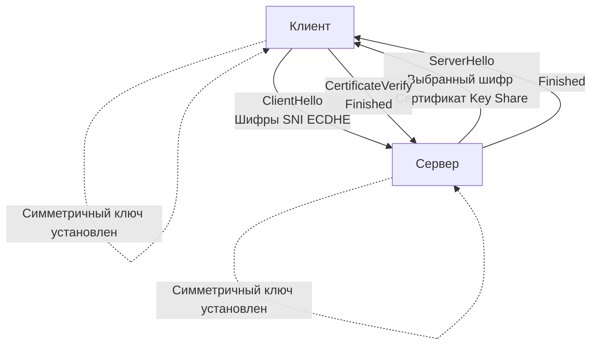

## Фундамент доверия: PKI, Сертификаты и TLS Handshake

В предыдущей статье мы разобрали `[[18. TLS и HTTPS. Шифрование поверх TCP]]` и увидели, что TLS обеспечивает конфиденциальность и целостность данных. Но шифрование бессмысленно без аутентификации. Как клиент может быть уверен, что общается именно с `api.example.com`, а не с поддельным сервером? Ответ лежит в области **PKI (Public Key Infrastructure)** и сертификатов X.509.

## PKI и Иерархия доверия

**PKI** — это инфраструктура открытых ключей, набор ролей, политик и аппаратных/программных средств, обеспечивающих создание, управление, распространение, использование, хранение и аннулирование цифровых сертификатов.

### Цепочка доверия
Доверие в PKI строится на строгой иерархии:
1. **Root CA (Корневой центр сертификации)**: Самоподписанный сертификат. Его публичный ключ вшит в операционную систему, браузеры и доверенные хранилища (Trust Store). Доверие к Root CA абсолютно.
2. **Intermediate CA (Промежуточные центры)**: Root CA подписывает сертификаты промежуточных CA. Это сделано для безопасности: если ключ Intermediate CA скомпрометирован, его можно быстро отозвать, не трогая Root.
3. **Leaf / Server Certificate (Листовой сертификат)**: Выдается конечному серверу или сервису. Содержит публичный ключ сервера, доменное имя (SAN), срок действия и цифровую подпись Intermediate CA.

> [!info] Под капотом
> Сертификат хранится в формате **X.509**, который является спецификацией над **ASN.1 DER**. В Go сертификаты парсятся пакетом `crypto/x509`. Структура `x509.Certificate` содержит поля `Raw` (исходные байты), `RawTBSCertificate` (TBS - To Be Signed), `SignatureAlgorithm`, `Issuer`, `Subject`, `PublicKey` и т.д. Парсинг ASN.1 — рекурсивная операция, чувствительная к размеру и структуре данных, что напрямую влияет на кэш-линии CPU и производительность.

### Валидация цепочки
При подключении клиент должен проверить:
- Подпись каждого уровня цепочки (Intermediate подписан Root, Leaf подписан Intermediate).
- Срок действия (`NotBefore` / `NotAfter`).
- Отзыв сертификата (через **CRL** или **OCSP**).
- Совпадение домена с полем `Subject Alternative Name` (SAN).

## Процесс TLS Handshake

Handshake — это протокол согласования параметров соединения, аутентификации сторон и генерации симметричных ключей. Современный стандарт **TLS 1.3** кардинально упростил и ускорил этот процесс по сравнению с TLS 1.2.



### Ключевые отличия TLS 1.3 от 1.2
1. **Скорость**: TLS 1.3 сокращает handshake до **1-RTT** (или **0-RTT** при повторном подключении с использованием PSK). В TLS 1.2 требовалось 2-RTT.
2. **ECDHE всегда**: Диффи-Хеллман на эллиптических кривых стал обязательным. RSA key exchange удален из-за уязвимостей.
3. **Аутентификация в ServerHello**: Сертификат сервера отправляется сразу после ServerHello, а не отдельным сообщением `Certificate`.
4. **Отсутствие устаревших шифроблоков**: Убраны CBC, RC4, MD5, SHA1. Остались только AEAD (AES-GCM, ChaCha20-Poly1305).

> [!warning] Ловушка / Gotcha
> **SNI (Server Name Indication)** критически важен в handshake. Клиент отправляет желаемый домен в `ClientHello` до шифрования. Если SNI не отправлен, сервер не знает, какой сертификат предоставить, и вернет первый в списке. Это ломает валидацию для клиентов, жестко проверяющих SAN. В Go это решается настройкой `tls.Config.ServerName`.

## mTLS: Взаимная аутентификация

**Mutual TLS (mTLS)** расширяет стандартный handshake: сервер не только предъявляет сертификат, но и запрашивает сертификат у клиента. Клиент должен его отправить, и сервер проверяет его валидность.

### Где применяется
- Service-to-service коммуникация в микросервисах (вместо токенов/заголовков авторизации).
- Доступ к внутренним API.
- Регулирование сетевых политик на уровне L4/L7.

### Реализация в Go
```go
package main

import (
	"context"
	"crypto/tls"
	"crypto/x509"
	"fmt"
	"os"
	"time"
)

func NewMTLSConfig(caPath, certPath, keyPath string) (*tls.Config, error) {
	caCert, err := os.ReadFile(caPath)
	if err != nil {
		return nil, fmt.Errorf("read CA: %w", err)
	}
	caPool := x509.NewCertPool()
	if !caPool.AppendCertsFromPEM(caCert) {
		return nil, fmt.Errorf("parse CA")
	}

	cert, err := tls.LoadX509KeyPair(certPath, keyPath)
	if err != nil {
		return nil, fmt.Errorf("load client cert: %w", err)
	}

	return &tls.Config{
		RootCAs:            caPool,
		ClientAuth:         tls.RequireAndVerifyClientCert,
		Certificates:       []tls.Certificate{cert},
		MinVersion:         tls.VersionTLS13,
		PreferServerCipherSuites: true,
	}, nil
}

func main() {
	cfg, err := NewMTLSConfig("ca.pem", "client.pem", "client.key")
	if err != nil {
		panic(err)
	}

	// Контекст управляет таймаутами handshake
	ctx, cancel := context.WithTimeout(context.Background(), 5*time.Second)
	defer cancel()

	conn, err := tls.DialContext(ctx, "tcp", "api.internal:443", cfg)
	if err != nil {
		panic(err)
	}
	defer conn.Close()

	fmt.Println("mTLS established:", conn.ConnectionState().Version)
}
```

## Под капотом: Go и криптография

### Чистый Go vs CGO
Пакет `crypto/tls` в стандартной сборке Go использует **чистый Go** реализации (`crypto/x509`, `crypto/ecdsa`, `crypto/rsa`). Это обеспечивает кроссплатформенность и безопасность, но может уступать в производительности нативным библиотекам.

При сборке с флагом `CGO_ENABLED=1` (по умолчанию на Linux/macOS), `crypto/tls` может делегировать тяжелые криптографические операции в **libcrypto** (OpenSSL/BoringSSL) через syscall. Это дает доступ к аппаратным расширениям:
- **AES-NI**: Аппаратное ускорение AES-GCM.
- **SHA extensions**: Ускорение хеширования.
- **ECDSA acceleration**: Быстрое вычисление точек на эллиптических кривых.

> [!tip] Собеседование
> **Вопрос:** Как `crypto/tls` обрабатывает блокировку во время handshake?
> **Ответ:** Криптографические операции (ECDHE, проверка подписей) могут быть CPU-intensive. Если они выполняются в чистом Go, горутина может заблокировать системный тред (M) на несколько миллисекунд. Планировщик Go (`runtime.scheduler`) не может вытеснить горутину внутри блокирующего syscall или критической секции `crypto` пакета. Для высоких нагрузок критично использовать `tls.Config` с `GetConfigForClient` для кэширования и избегать создания новых конфигураций на каждое подключение. В Go 1.20+ добавлен `tls.Config.GetCertificate` для динамического выбора, но он также может стать узким местом.

### Escape Analysis и память
Сертификаты в формате PEM — это большие `[]byte`. При передаче в `tls.Config` или `x509.ParseCertificates` они почти всегда **escape to heap** (уходят в кучу), так как их размер превышает порог стековой аллокации, а время жизни превышает область видимости функции. Это создает нагрузку на GC.
```go
// Внутреннее представление x509.Certificate
type Certificate struct {
    Raw                     []byte
    RawTBSCertificate       []byte
    RawSubjectPublicKeyInfo []byte
    RawSubject              []byte
    RawIssuer               []byte
    Signature               []byte
    SignatureAlgorithm      CertificateSignatureAlgorithm
    PublicKeyAlgorithm      PublicKeyAlgorithm
    PublicKey               interface{}
    Version                 int
    SerialNumber            *big.Int
    ...
}
```
Парсинг ASN.1 создает множество промежуточных слайсов. При массовых подключениях это генерирует GC pressure. Решение: кэшировать распарсенные `*x509.Certificate` и использовать `tls.Config.ClientSessionCache`.

## Ловушки и типичные вопросы на собеседованиях

| Проблема / Вопрос | Причина / Ответ |
|-------------------|-----------------|
| `x509: certificate signed by unknown authority` | Отсутствует корневой или промежуточный CA в `RootCAs`. Проверьте цепочку в `openssl x509 -in cert.pem -text`. |
| `tls: failed to verify certificate: x509: certificate has expired` | Сертификат просрочен или на сервере/клиенте неверное системное время. |
| Почему TLS 1.3 быстрее 1.2? | Убрано дополнительное RTT, удалены устаревшие алгоритмы, handshake интегрирован в первые пакеты данных. |
| Как отозвать сертификат? | Через OCSP (Online Certificate Status Protocol) или CRL (Certificate Revocation List). В Go проверяется через `x509.VerifyOptions`. |
| mTLS vs JWT для авторизации | mTLS аутентифицирует *канал/сервис* (криптографически), JWT аутентифицирует *пользователя/токен*. В микросервисах mTLS обеспечивает zero-trust сеть, JWT — бизнес-логику. |

## Итог

Мы разобрали, как PKI обеспечивает доверие в открытом мире, и как TLS Handshake превращает это доверие в симметричные ключи для шифрования трафика. Понимание внутренних механизмов `crypto/tls`, влияния алгоритмов на CPU и памяти, а также особенностей валидации сертификатов критически важно для проектирования надежных сетевых сервисов.

Теперь, когда канал связи защищен и аутентифицирован, мы можем переходить к протоколам прикладного уровня. В следующей статье мы разберем: [[20. HTTP 1.1. Структура запроса и ответа]], чтобы понять, как данные упаковываются поверх защищенного туннеля.