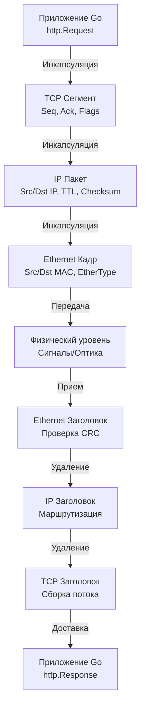

## Введение

Сетевой стек — это фундамент, на котором строится любой бэкенд. В Go вы редко пишете raw-сокеты, но понимание того, как данные трансформируются от байтов в памяти до электромагнитных сигналов на кабеле, критически важно для проектирования производительных, отказоустойчивых систем. Без этого знания вы будете бороться с симптомами (таймауты, утечки соединений, контекстные переключения), не понимая причины.

## OSI и TCP/IP: Практический взгляд

Модель **OSI (Open Systems Interconnection)** — это академический эталон из 7 уровней, созданный для стандартизации взаимодействия разнородных систем. Модель **TCP/IP** — это практическая реализация, на которой построен современный интернет.

| OSI Уровень      | TCP/IP Уровень | Реализация в Go                              |
| :--------------- | :------------- | :------------------------------------------- |
| 7. Прикладной    | Прикладной     | `net/http`, `gRPC`, `encoding/json`          |
| 6. Представления |                | `encoding`, `crypto/tls`                     |
| 5. Сеансовый     |                | `context`, сессии в памяти/Redis             |
| 4. Транспортный  |                | `net.Conn`, `net.TCPConn`, `net.UDPConn`     |
| 3. Сетевой       |                | Внутренние структуры IP-пакетов (драйверы)   |
| 2. Канальный     |                | [[3. Ethernet, MAC-адреса и локальные сети]] |
| 1. Физический    |                | Сетевые карты, кабели, оптика                |

В Go вы работаете преимущественно на уровнях 4 и 7. Уровень 3 и ниже абстрагирован ядром Linux и драйверами.

> [!info] Под капотом
> Почему TCP/IP победил OSI? Модель OSI была слишком сложной для реализации. Каждый уровень должен был строго общаться только с соседними, что вводило избыточную обработку. TCP/IP объединил уровни 5, 6, 7 в один прикладной слой, а уровни 3 и 2 в сетевой и канальный. Это дало гибкость, отказ от жесткой иерархии и позволило протоколам развиваться независимо.

## Путь данных: Инкапсуляция и деинкапсуляция

Когда ваш Go-код отправляет запрос, данные проходят через несколько слоев, каждый из которых добавляет свой заголовок (и иногда трейлер).



1. **I (Инкапсуляция):** Приложение формирует данные → TCP добавляет заголовок (порты, последовательность, контрольная сумма) → IP добавляет заголовок (адреса, TTL, протокол) → Ethernet добавляет кадрирование (MAC-адреса, тип кадра).
2. **P (Передача):** Данные уходят в сетевую карту (NIC).
3. **D (Деинкапсуляция):** Получатель снимает заголовки слой за слоем, передавая полезную нагрузку выше до тех пор, пока не достигнет приложения.

## Go в сетевом стеке: Архитектура абстракций

Пакет `net` в Go — это не просто обертка над `sys/socket`. Это высокоуровневая абстракция, которая скрывает разницу между операционными системами (Linux `epoll`, BSD `kqueue`, Windows `IOCP`).

Ключевые интерфейсы:
- `net.Conn` — базовый интерфейс для любого соединения (`Read`, `Write`, `Close`, `LocalAddr`, `RemoteAddr`).
- `net.Listener` — для TCP-серверов (`Accept`, `Close`, `Addr`).
- `net.PacketConn` — для UDP/ICMP (`ReadFrom`, `WriteTo`).

```go
package main

import (
	"context"
	"fmt"
	"log"
	"net"
	"time"
)

func main() {
	// 1. Создание слушателя. Bind привязывает сокет к адресу на уровне ОС.
	listener, err := net.Listen("tcp", ":8080")
	if err != nil {
		log.Fatalf("listen failed: %v", err)
	}
	defer listener.Close()

	log.Println("server started on :8080")

	for {
		// 2. Accept блокирует гортину до появления нового соединения.
		// Под капотом вызывает syscall accept() и epoll_ctl.
		conn, err := listener.Accept()
		if err != nil {
			log.Printf("accept error: %v", err)
			continue
		}

		// 3. Запуск обработчика в горутине.
		// Контекст позволяет отменять работу при graceful shutdown.
		go handleConnection(context.Background(), conn)
	}
}

func handleConnection(ctx context.Context, conn net.Conn) {
	defer conn.Close()
	
	// Установка таймаута чтения. В Go это не блокирует горутину,
	// а ставит в очередь netpoller и планирует пробуждение.
	conn.SetReadDeadline(time.Now().Add(30 * time.Second))
	
	buf := make([]byte, 4096)
	for {
		n, err := conn.Read(buf)
		if err != nil {
			if netErr, ok := err.(net.Error); ok && netErr.Timeout() {
				log.Println("read timeout")
				return
			}
			log.Printf("read error: %v", err)
			return
		}
		
		_, writeErr := conn.Write(buf[:n])
		if writeErr != nil {
			log.Printf("write error: %v", writeErr)
			return
		}
	}
}
```

## Под капотом: Системные вызовы и планировщик

Когда вы вызываете `net.Listen(":8080")`, Go выполняет следующую последовательность действий:

1. **`socket(AF_INET, SOCK_STREAM, IPPROTO_TCP)`**: Создает файловый дескриптор (fd) в ядре Linux.
2. **`setsockopt(fd, SOL_SOCKET, SO_REUSEADDR, ...)`**: Позволяет перезапускать сервер без ожидания `TIME_WAIT`.
3. **`bind(fd, {family: AF_INET, port: 8080})`**: Привязывает fd к локальному IP и порту.
4. **`listen(fd, backlog)`**: Переводит сокет в состояние ожидания соединений.
5. **`epoll_ctl(epfd, EPOLL_CTL_ADD, fd, &event)`**: Регистрирует fd в глобальном epoll-сете Go. Это ключевой момент: **Go не создает тред на каждый сокет**.

Когда приходит новое соединение, ядро будит `netpoller`. Планировщик Go (G-M-P) извлекает свободную горутину из пула, привязывает её к системному треду (M), выполняет `accept()` и передает управление в ваш `handleConnection`.

> [!warning] Ловушка / Gotcha
> `net.Conn` не гарантирует, что `Read` или `Write` будут блокировать ровно столько времени, сколько нужно. В Go эти операции используют неблокирующий I/O с `epoll`. Если буфер сети пуст, горутина **не блокирует тред ОС**, а переводится в состояние `waiting for network I/O` и убирается из расписания планировщика. Тред освобождается и обслуживает другие горутины.

## Mechanical Sympathy и влияние на железо

Понимание сетевого стека через призму Mechanical Sympathy раскрывает источники потерь производительности:

1. **Контекстные переключения (Context Switch):** Каждое сетевое событие требует перехода User Space ↔ Kernel Space. На современных CPU это стоит ~1000-5000 тактов. `netpoller` минимизирует это, собирая события и пробуждая горутины пачками.
2. **Кэш-линии CPU (L1/L2/L3):** При обработке пакетов ядро Linux копирует данные из NIC DMA-буфера в страницу ядра, затем в пользовательскую память. Каждое копирование вызывает кэш-промахи (cache miss). Go старается минимизировать аллокации через `sync.Pool` и reuse байтов в `bufio`.
3. **Zero-Copy (splice/sendfile):** В высоконагруженных прокси (например, `nginx` или `envoy`) используется `splice()`, которая перемещает данные между буферами ядра без обращения к пользовательскому пространству. В Go это доступно через `syscall.Splice`, но стандартный `net/http` пока использует классическое копирование для совместимости.
4. **DMA (Direct Memory Access):** Сетевая карта пишет данные напрямую в RAM, минуя CPU. Это освобождает процессор для обработки логики. Ошибка драйвера или неверная настройка кольцевых буферов (ring buffer) NIC приводит к `softirq` перегрузке и падению `steal time`.

> [!tip] Собеседование
> **Вопрос:** Почему Go может обрабатывать миллионы соединений на одном сервере, а PHP-FPM или традиционные Java-приложения тонут при той же нагрузке?
> **Ответ:** PHP-FPM и Java (до виртуальных потоков) используют модель «один поток/процесс на соединение». Поток ОС занимает ~1-8 МБ стека и требует тяжелого контекстного переключения. Go использует `netpoller` (epoll/kqueue), который мапит миллионы соединений на dozens тредов ОС. Горутины весят ~2 КБ, их переключение происходит в User Space без участия ядра. Сетевое I/O не блокирует тред, а паркует горутину. Это дает O(1) сложность по памяти и CPU на соединение.

## Сравнение с другими экосистемами

| Аспект | Go (`net`) | Java (NIO/Netty) | C (POSIX sockets) | PHP (FPM/Swoole) |
|:---|:---|:---|:---|:---|
| **I/O Модель** | `epoll` (Linux) / `kqueue` (BSD) | `epoll` / `kqueue` / `IOCP` | Блокирующие/неблокирующие syscalls | FPM: блокирующие процессы / Swoole: epoll |
| **Абстракция** | `net.Conn` (один интерфейс) | `Channel` / `ByteBuf` | `struct sockaddr`, `fd` | Ресурсы / Stream |
| **Память** | Аллокации в куче/сте (Escape Analysis) | Объекты JVM, GC overhead | Ручное управление (`malloc/free`) | FPM: тяжелые процессы / Swoole: кастомный аллокатор |
| **Конкурентность** | Горутинный планировщик (G-M-P) | Потоки ОС / Virtual Threads (21+) | Треды ОС | FPM: процессы / Swoole: события |
| **Сложность** | Низкая (идиоматично) | Высокая (Netty сложен в настройке) | Экстремально высокая (C10K problem) | FPM: низкая, Swoole: высокая |

## Итог

Мы прошли путь от абстрактных моделей до системных вызовов. Ключевые выводы для Go-инженера:
1. **OSI — теория, TCP/IP — практика.** Go работает на уровнях 4 и 7, скрывая слои 1-3 через `netpoller`.
2. **`netpoller` — сердце производительности.** Он превращает блокирующее сетевое I/O в неблокирующее, паркуя горутины в User Space.
3. **Контекстные переключения и кэш — враги.** Минимизация syscalls, буферизация (`bufio`) и понимание DMA/Zero-Copy критичны для Highload.
4. **Go vs Традиционные стеки.** Легковесность горутин и единый `net.Conn` дают экспоненциальное преимущество в плотности соединений по сравнению с PHP-FPM или классическими Java-серверами.

В следующей статье мы спустимся на уровень ниже, к канальному уровню: [[3. Ethernet, MAC-адреса и локальные сети]], чтобы понять, как данные попадают в физическую среду и как Go взаимодействует с MAC-адресацией.