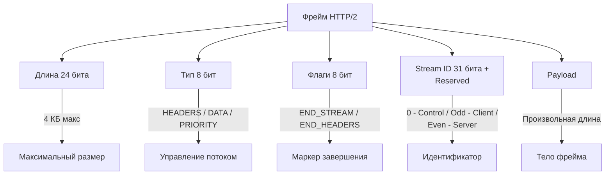
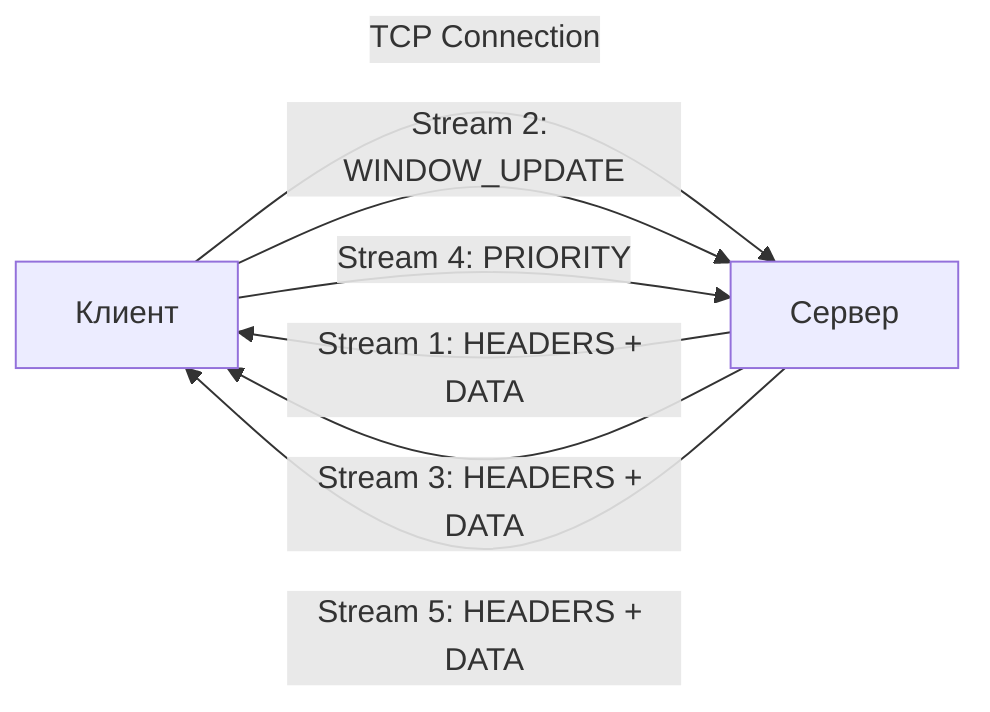

## Сдвиг парадигмы: от текста к бинарным фреймам

В [[20. HTTP 1.1. Структура запроса и ответа]] и [[21. HTTP 1.1 под капотом. Keep Alive, Chunked Encoding, Pipelining.md]] мы разобрали, почему текстовый протокол стал узким местом для высоконагруженных систем. Парсинг текста в Go требует выделения памяти под строки, работы с регулярными выражениями и сложной логики разделения заголовков. HTTP/2 меняет правила игры: это бинарный протокол, ориентированный на производительность и мультиплексирование.

## Бинарный протокол и структура фрейма

В HTTP/2 нет строк `GET / HTTP/1.1\r\n`. Весь трафик состоит из **фреймов** (frames) — бинарных пакетов фиксированного формата. Это позволяет парсить данные на уровне CPU без аллокаций строк, что критично для highload.



Каждый фрейм содержит заголовок (9 байт) и полезную нагрузку. Основные типы:
1. `HEADERS` — заголовки запроса/ответа (сжаты через HPACK).
2. `DATA` — тело сообщения.
3. `WINDOW_UPDATE` — управление flow control.
4. `PRIORITY` — дерево приоритетов потоков.
5. `SETTINGS`, `PING`, `GOAWAY` — управление соединением.

## Мультиплексирование и управление потоками (Streams)

Ключевое отличие от [[21. HTTP 1.1 под капотом. Keep Alive, Chunked Encoding, Pipelining.md]] — **multiplexing**. Один TCP-канал обслуживает сотни логических **streams** (потоков). Каждый stream имеет уникальный 31-битный ID. Клиент использует нечетные ID, сервер — четные.



Это решает проблему Head-of-Line blocking (HOL blocking) уровня приложения, которая убивала pipelining в HTTP/1.1. Если `DATA` для stream 1 задерживается из-за медленного клиента, stream 3 продолжает передаваться.

> [!warning] Ловушка / Gotcha
> Мультиплексирование не отменяет TCP HOL blocking. Если на канале теряется пакет на уровне TCP, все потоки ждут retransmission. Именно поэтому в современных системах переходят к [[23. HTTP 3 и QUIC. Почему будущее уходит от TCP.md]].

## HPACK: сжатие заголовков и память

Заголовки HTTP тяжелые. HPACK (RFC 7541) использует два словаря:
- **Static Table**: Фиксированный набор (например, `:method`, `:scheme`, `:path`, `host`). Индексация по номеру.
- **Dynamic Table**: LRU-кэш, заполняемый сервером во время сессии. Позволяет сжимать повторяющиеся заголовки (например, `cookie`, `user-agent`).

Сжатие работает через индексацию (отправка номера в статической/динамической таблице) или Huffman-кодирование (для новых значений).

> [!info] Под капотом
> В Go реализация HPACK находится в пакете `golang.org/x/net/http2/hpack`. Динамическая таблица — это связный список (doubly-linked list) с LRU-эвакцией. При обновлении таблицы выделяются новые `hpack.Entry` (strings + uint32 index). Это создает нагрузку на GC при high-frequency запросах с уникальными заголовками.

## Go под капотом: `golang.org/x/net/http2`

В Go поддержка HTTP/2 встроена в `net/http`, но активна только при использовании TLS (ALPN negotiation: `h2`). Реализация вынесена в `golang.org/x/net/http2`.

Ключевые структуры:
- `http2.conn`: Обертка над `net.Conn`, содержит `http2.framer`, `http2.writer`, `http2.streamMap`.
- `http2.stream`: Представляет логический поток. Содержит `http2.dataBuffer` (для chunked чтения), `http2.streamState`, `http2.headerFrame`.
- `http2.framer`: Парсит входящие бинарные фреймы. Использует `bytes.Reader` для zero-copy чтения заголовка.
- `http2.streamMap`: `sync.RWMutex` + `map[uint32]*http2.stream` для быстрого поиска потоков.

```go
// Пример внутренней логики создания потока в http2.server
func (s *conn) newStream(id uint32, writeState writeState) *stream {
    // Аллокация stream. В Go это может уйти в кучу из-за escape analysis,
    // если stream передается в интерфейс или замыкание.
    st := &stream{
        id:        id,
        state:     streamActive,
        data:      new(dataBuffer),
        headerBuf: &bytes.Buffer{}, // Буфер для декомпрессии HPACK
    }
    // Регистрация в мапе потоков
    s.streams[id] = st
    return st
}
```

> [!tip] Собеседование
> **Вопрос:** Почему в Go `net/http` по умолчанию включает HTTP/2 только с TLS?
> **Ответ:** Исторически это было требованием спецификации и браузеров. TLS обеспечивает шифрование и предоставляет механизм ALPN (Application-Layer Protocol Negotiation) для согласования протокола на этапе рукопожатия без дополнительных RTT. Без TLS Go не будет апгрейдить соединение до HTTP/2 автоматически.

## Mechanical Sympathy и влияние на производительность

1. **CPU Cache & Parsing:** Бинарные фреймы парсятся за O(1) без аллокаций строк. Заголовок фрейма (9 байт) помещается в один кэш-лайн L1. Это сокращает CPU cycles на парсинг на 40-60% по сравнению с HTTP/1.1.
2. **GC Pressure:** HPACK динамическая таблица создает постоянные аллокации (новые `hpack.Entry`). При highload это увеличивает нагрузку на GC. Оптимизация: ограничение размера динамической таблицы (`SETTINGS_HEADER_TABLE_SIZE`) и использование `sync.Pool` для временных буферов в `framer`.
3. **Контекстные переключения:** Мультиплексирование на одном TCP-сокете снижает количество системных вызовов `socket()`, `connect()`, `close()` в ядре Linux. Это критично для сервисов с короткими запросами (microservices).
4. **Escape Analysis:** `http2.stream` часто аллоцируется в кучу, так как его жизнь может превышать время выполнения функции-обработчика (асинхронная обработка). Использование `http2.Transport` с пулом соединений (`http2.ConfigureTransports`) позволяет переиспользовать `http2.conn` и отложить GC.

> [!warning] Ловушка / Gotcha
> **HPDoS (HTTP/2 Rapid Reset / Header DoS):** Атакующий может быстро отправлять `HEADERS` фреймы с новыми значениями, заставляя сервер постоянно обновлять динамическую таблицу HPACK. Это вызывает аллокации памяти и CPU spikes. В Go защита: `http2.Server.MaxHeaderListSize` и `http2.Server.ReadHeaderBufferSize`.

## Итог

1. HTTP/2 заменил текстовый парсинг на бинарные фреймы, что ускорило обработку на уровне CPU.
2. Мультиплексирование решает проблему HOL blocking приложения, но не отменяет TCP-ограничений.
3. HPACK сжимает заголовки через статические/динамические таблицы и Huffman, но создает нагрузку на GC при высокой частоте уникальных заголовков.
4. В Go реализация строится вокруг `golang.org/x/net/http2`, где `conn`, `stream` и `framer` управляют жизненным циклом потоков.
5. TLS + ALPN обязательны для автоматического апгрейда.

Мы завершили детальный разбор HTTP/2, который стал стандартом де-факто для внутреннего и внешнего API. Однако мультиплексирование все еще привязано к TCP, что сохраняет проблему Head-of-Line blocking на транспортном уровне. В следующей статье мы рассмотрим, как протокол [[23. HTTP 3 и QUIC. Почему будущее уходит от TCP.md]] устраняет эти ограничения на уровне ядра.