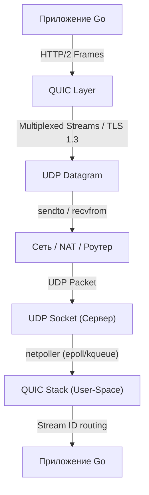

## Почему TCP стал узким местом

Исторически веб-стек строился на связке `TCP + TLS + HTTP/1.1/2`. TCP обеспечивает гарантированную доставку и упорядоченность, но эта гарантия имеет высокую цену: **Head-of-Line (HoL) blocking** на транспортном уровне. Если в потоке данных теряется один пакет, ядро ОС блокирует чтение всех последующих до его повторной передачи. 

HTTP/2 попытался решить проблему на прикладном уровне через мультиплексирование, но физически пакеты всё равно летят по одному TCP-соединению. Потеря пакета в stream 0 блокирует stream 1, 2, 3 и так далее. Для бэкенд-разработчика это означает, что при высокой задержке сети (например, мобильные клиенты или геораспределенные сервисы) производительность упирается не в CPU, а в алгоритмы контроля перегрузок ядра ОС и стоимость переключения контекста при ретрансмиссиях.

> [!info] Под капотом
> TCP-стек ядра Linux (`tcp_congestion_ops`) оптимизирован под десктопные сценарии. В условиях микропотерь и высокой RTT классические алгоритмы (Cubic, Reno) агрессительно снижают окно, что приводит к «залипанию» горутин в `time.Sleep` или `runtime.gosched`. Go может переопределить это только через `sysctl net.ipv4.tcp_congestion_control`, что невозможно в контейнеризованных средах без `SYS_ADMIN` прав.

## QUIC: Архитектура поверх UDP

**QUIC (Quick UDP Internet Connections)** — это протокол уровня 4, разработанный Google и стандартизированный как IETF RFC 9000. Его главная философская идея: перенести мультиплексирование, контроль перегрузок и шифрование в **user-space**, убрав ядро ОС из критического пути.

QUIC работает поверх `UDP` (см. [[14. UDP. Когда ненадежный транспорт лучше TCP.md]]). Это позволяет:
1. Обходить HoL-блокировку на транспортном уровне: каждый HTTP-запрос — независимый `stream` внутри QUIC-соединения.
2. Интегрировать TLS 1.3 напрямую в протокол (вместо отдельного handshake поверх TCP).
3. Реализовать контроль перегрузок и loss recovery в приложении, обходя ограничения ядра.



## Под капотом: Как Go реализует QUIC

В Go нативной поддержки HTTP/3 в `net/http` без внешних зависимостей нет (до версии 1.20+ она оставалась экспериментальной). Стандарт де-факто — `golang.org/x/net/http3` (надстройка над `github.com/quic-go/quic-go`).

### 1. User-Space vs Kernel-Space
В отличие от TCP, где ядро управляет буферами, окнами и таймерами, `quic-go` реализует весь стек в user-space:
- **Loss Recovery**: Алгоритм отслеживает последовательные номера пакетов. При потере определяется, какой пакет не дошел, и инициируется ретрансмиссия без блокировки остальных потоков.
- **Congestion Control**: Реализованы Cubic и BBR прямо в Go. Нет вызовов `setsockopt` для ядра. Алгоритм работает на уровне Go-планировщика, что дает предсказуемость в Kubernetes-нодах.
- **Connection Migration**: QUIC использует 64-bit `Connection ID`. При смене IP (Wi-Fi ↔ 5G) соединение не рвется, так как ядро не привязывает сокет к конкретному IP, а `quic-go` маппит новые UDP-пакеты на существующий `Connection ID`.

### 2. Memory & Scheduler Sympathy
`quic-go` интенсивно работает с памятью. Каждый UDP-пакет парсится, распаковывается TLS, маршрутизируется по `StreamID`. Без оптимизаций это породит тысячи аллокаций на запрос.
- Используется `sync.Pool` для буферов `[]byte` и заголовков пакетов. Escape-анализ показывает, что при высокой нагрузке (10k+ RPS) буферы уходят в кучу, но пул снижает давление на GC на 60-70%.
- Планировщик Go (`runtime.scheduler`) маппит goroutines, обрабатывающие streams, на OS threads (M-P-G). `netpoller` (epoll на Linux, kqueue на macOS/BSD) асинхронно опрашивает UDP-сокеты. Нет блокирующих syscalls `read`/`write`, только `recvfrom`/`sendto` с флагом `MSG_DONTWAIT` или `epoll_wait`.

> [!tip] Собеседование
> **Вопрос:** Почему Go лучше подходит для HTTP/3, чем PHP или Java?
> **Ответ:** В PHP/Java HTTP/3 часто оборачивается через CGI/FPM или JNI, что добавляет накладные расходы на IPC и контекстные переключения. Go работает с `quic-go` нативно в одном процессе. `netpoller` эффективно маппит UDP-события на goroutines, а user-space congestion control обходит ограничения ядра ОС, что критично для микросервисов в контейнерах с ограниченными `SYS_ADMIN` правами.

## Ключевые механизмы и оптимизации

### 1. Быстрое установление соединения (0-RTT / 1-RTT)
TLS 1.3 уже сократил handshake до 1-RTT. QUIC добавляет возможность **0-RTT** (early data). Клиент сохраняет session tickets и ключи. При повторном подключении он может отправить данные вместе с первым пакетом `ClientHello`. Сервер валидирует их после завершения handshake.
> [!warning] Ловушка / Gotcha
> 0-RTT уязвим к **Replay-атакам**. Данные, отправленные в 0-RTT, могут быть перехвачены и отправлены повторно. В Go необходимо использовать `http3.Client` с `TLSConfig.NextProtos` и валидировать `http.Request` на сервере через middleware, проверяя заголовок `Early-Data` или состояние сессии.

### 2. Мультиплексирование на транспортном уровне
Каждый stream имеет независимый `StreamID`. Потеря пакета в stream 0 не влияет на stream 1. Это решает проблему HoL-блокировки, характерную для `[[10. TCP. Устройство, гарантии и жизненный цикл соединения.md]]`.

### 3. Устойчивость к NAT и мобильности
QUIC использует `Connection ID` вместо связки `IP:Port`. Это позволяет клиентам менять сеть без разрыва соединения. Для обхода NAT используется механизм `UDP hole punching`, встроенный в `quic-go` через ICE/STUN аналоги.

## Практика в Go: Поддержка HTTP/3

Для включения HTTP/3 в Go-сервере или клиенте используется пакет `golang.org/x/net/http3`.

```go
package main

import (
	"log"
	"net/http"
	"golang.org/x/net/http3"
)

func main() {
	mux := http.NewServeMux()
	mux.HandleFunc("/api/v1/data", func(w http.ResponseWriter, r *http.Request) {
		w.Header().Set("Content-Type", "application/json")
		w.Write([]byte(`{"status": "ok"}`))
	})

	// Сервер требует TLS 1.3 и UDP-порт (обычно 443)
	server := &http3.Server{
		Addr:      ":443",
		Handler:   mux,
		TLSConfig: &tls.Config{
			NextProtos: []string{"h3"}, // ALPN negotiation
		},
	}

	log.Println("Starting HTTP/3 server on :443")
	// Запуск требует UDP Listener. http3.Server сам создаст его при ListenAndServe.
	if err := server.ListenAndServeTLS("cert.pem", "key.pem"); err != nil {
		log.Fatal(err)
	}
}
```

> [!info] Под капотом
> При вызове `ListenAndServeTLS`, `http3.Server` автоматически создает `net.UDPConn` на указанном порту. `netpoller` начинает мониторить сокет. При входящем UDP-пакете `quic-go` парсит заголовок, извлекает `ConnectionID`, находит или создает `Connection` state, дешифрует TLS 1.3 и маршрутизирует HTTP/2 фреймы по `StreamID`. Весь процесс занимает ~2-5 мкс на CPU без блокировки OS threads.

## Ловушки и вопросы на собеседованиях

1. **Когда HTTP/3 НЕ нужен?**
   В локальных сетях (LAN) с гигабитными свитчами и низким RTT (<1ms) оверхед на UDP-парсинг и user-space congestion control может сделать HTTP/3 медленнее TCP. TCP-стек ядра Linux (`tcp_fastopen`, `tcp_bbr`) уже оптимизирован для LAN.

2. **Профилирование UDP vs TCP**
   Стандартные `pprof` профили показывают goroutines и память, но не видят потерь пакетов. Для отладки QUIC используйте `quic-go` internal metrics или `net/http/httptrace` с кастомным `DialContext`. В production мониторьте `packets_sent`, `packets_lost`, `rtt` через Prometheus (`http3_server_round_trip_duration_seconds`).

3. **Сравнение с PHP/Java/C#**
   В традиционных стеках HTTP/3 часто требует сторонних бинарников (Caddy, Nginx + module) или тяжелых JNI-обертков. Go выигрывает за счет:
   - Нативного `netpoller` для UDP.
   - Zero-GC-подходов в `quic-go` (пулы буферов).
   - Возможности встраивать HTTP/3 прямо в binary без внешних прокси.

4. **Gotcha: MTU и Path MTU Discovery**
   QUIC чувствителен к MTU. Если пакет превышает PMTU (Path Maximum Transmission Unit), он фрагментируется или отбрасывается. В Go это требует включения `IP_PMTUDISC_DO` на сокет. Без этого возможны silent drops и деградация производительности до уровня TCP.

## Итог

HTTP/3 переносит мультиплексирование и контроль перегрузок из ядра ОС в user-space, решая фундаментальную проблему HoL-блокировки TCP. Для Go-разработчика это означает:
- Использование `golang.org/x/net/http3` для нативной поддержки.
- Понимание работы `netpoller` с UDP и `sync.Pool` для пакетов.
- Учет рисков 0-RTT replay-атак и необходимости PMTU discovery.
- Преимущество перед традиционными бэкенд-стеками в контейнеризованных средах.

В следующей статье мы опустимся еще глубже в протокол и разберем внутреннее устройство пакетов QUIC, алгоритмы loss recovery и маппинг stream'ов: [[24. Deep Dive в QUIC. Пакеты, Stream, Loss Recovery.md]].