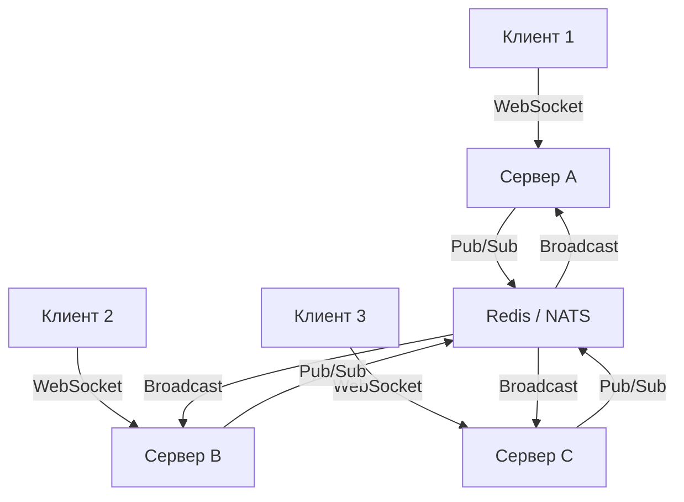

## Введение: От запрос-ответ к постоянному каналу

Классическая HTTP-модель `request-response` требует открытия нового TCP-соединения (или повторного использования через Keep-Alive) для каждой операции. Это создает накладные расходы на рукопожатия, задержки и потребление памяти на стороне сервера. Для сценариев, где клиенту критично получать обновления в реальном времени (чат, биржевые тикеры, live-логирование, коллаборативные редакторы), сервер должен сам инициировать отправку данных клиенту.

Для этого используются **долгоживущие соединения (Persistent Connections)**. В Go они реализуются двумя основными протоколами: **SSE (Server-Sent Events)** и **WebSocket**. Оба строятся на механизме `HTTP Upgrade`, но имеют принципиальные архитектурные различия.

## HTTP Upgrade: Как рождается долгоживущее соединение

Любое долгоживущее соединение начинается как обычный HTTP-запрос. Клиент отправляет заголовок `Upgrade`, а сервер отвечает кодом `101 Switching Protocols`. После этого TCP-соединение не закрывается, а протокол на транспортном уровне меняется.

В Go это реализуется через интерфейс `http.Hijacker`. Рантайм Go проверяет заголовок, подтверждает смену протокола, а затем «перекидывает» (`hijack`) сырой `net.Conn` из `net/http` в ваш код. Управление над потоком байтов передается вам, а `http.Server` перестает парсить заголовки и тело.

> [!info] Под капотом
> `net/http` в Go спроектирован так, чтобы минимизировать аллокации. До момента `Hijack` сервер использует `bufio` для буферизации входящих данных. При успешном перехвате `netpoller` (epoll/kqueue) продолжает мониторить файловый дескриптор, но теперь события `EPOLLIN` будут обрабатываться вашим кодом, а не стандартным парсером HTTP.

## Server-Sent Events (SSE): Простой и надежный push

SSE — это текстовый протокол поверх HTTP/1.1. Он поддерживает **только одностороннюю** передачу данных (от сервера к клиенту). Клиент сам должен реализовывать логику повторных попыток при обрыве связи.

### Почему SSE?
*   Работает через любой HTTP-прокси и NAT (нет необходимости в `Upgrade` для некоторых реализаций, хотя стандарт предполагает его).
*   Автоматический reconnect, heartbeat и ID-механизм встроены в браузерный `EventSource`.
*   Нет накладных расходов на бинарный фрейминг.

### Реализация в Go
```go
func sseHandler(w http.ResponseWriter, r *http.Request) {
    // Проверяем поддержку SSE клиентом
    if !strings.Contains(r.Header.Get("Accept"), "text/event-stream") {
        http.Error(w, "SSE not supported", http.StatusBadRequest)
        return
    }

    // SSE требует заголовков
    w.Header().Set("Content-Type", "text/event-stream")
    w.Header().Set("Cache-Control", "no-cache")
    w.Header().Set("Connection", "keep-alive")
    w.Header().Set("X-Accel-Buffering", "no") // Отключаем буферизацию nginx

    // Получаем интерфейс для принудительной отправки буфера
    flusher, ok := w.(http.Flusher)
    if !ok {
        http.Error(w, "Streaming not supported", http.StatusInternalServerError)
        return
    }

    // Канал для входящих событий (пример)
    events := make(chan string, 10)
    go func() {
        // Имитация генерации событий
        for i := 0; i < 5; i++ {
            events <- fmt.Sprintf("data: tick %d\n\n", i)
            time.Sleep(1 * time.Second)
        }
        close(events)
    }()

    for {
        select {
        case <-r.Context().Done():
            // Клиент отключился. Освобождаем ресурсы.
            return
        case msg, ok := <-events:
            if !ok {
                return
            }
            if _, err := w.Write([]byte(msg)); err != nil {
                return
            }
            flusher.Flush() // Критично! Данные не уйдут в сеть без этого
        }
    }
}
```

> [!warning] Ловушка / Gotcha
> Забытый `Flusher.Flush()` — классическая причина «зависания» SSE. `net/http` по умолчанию буферизует ответ. Без явного сброса клиент не увидит данные, пока буфер не заполнится (обычно 4 КБ) или соединение не закроется.

## WebSocket: Полный дуплекс и фрейминг

WebSocket (RFC 6455) предоставляет **полнодуплексный (full-duplex)** бинарный или текстовый канал поверх одного TCP-соединения. Клиент и сервер могут отправлять данные одновременно без ожидания ответа.

### Внутреннее устройство протокола
WebSocket не отправляет «сырые» байты. Он оборачивает их в **фреймы**:
1.  **Masking:** Клиент обязан маскировать payload (для безопасности против CVE-2011-7008). Сервер может не маскировать исходящие пакеты.
2.  **Opcode:** `0x0` (continuation), `0x1` (text), `0x2` (binary), `0x8` (close), `0x9` (ping), `0xA` (pong).
3.  **Payload length:** Поддерживает 16-bit, 32-bit и 64-bit длины.
4.  **Heartbeat:** `ping/pong` фреймы используются для проверки живости соединения и обхода таймаутов NAT/прокси.

### Реализация в Go
Стандартная библиотека не содержит WebSocket. Индустриальный стандарт — `github.com/gorilla/websocket` или `nhooyr.io/websocket`. Ниже пример с корректной обработкой ошибок и контекстом:

```go
var upgrader = websocket.Upgrader{
    ReadBufferSize:  4096,
    WriteBufferSize: 4096,
    CheckOrigin: func(r *http.Request) bool {
        // В продакшене проверяйте origin строго!
        return true
    },
}

func wsHandler(w http.ResponseWriter, r *http.Request) {
    conn, err := upgrader.Upgrade(w, r, nil)
    if err != nil {
        log.Printf("WebSocket upgrade failed: %v", err)
        return
    }
    defer conn.Close() // Всегда закрываем соединение

    // Чтение в отдельной горутине для асинхронной обработки
    go func() {
        for {
            _, msg, err := conn.ReadMessage()
            if err != nil {
                // CloseSent или net.Error — нормальное завершение
                if websocket.IsUnexpectedCloseError(err, websocket.CloseGoingAway, websocket.CloseAbnormalClosure) {
                    log.Printf("Read error: %v", err)
                }
                break
            }
            // Обработка сообщения...
        }
    }()

    // Запись в основном цикле (или через sync.Mutex, если пишет один writer)
    ticker := time.NewTicker(10 * time.Second)
    defer ticker.Stop()

    for {
        select {
        case <-r.Context().Done():
            // Клиент отключился
            conn.WriteMessage(websocket.CloseMessage, websocket.FormatCloseMessage(websocket.CloseNormalClosure, ""))
            return
        case <-ticker.C:
            // Отправляем ping для поддержания NAT-таблиц
            err := conn.WriteMessage(websocket.PingMessage, nil)
            if err != nil {
                return
            }
        }
    }
}
```

> [!tip] Собеседование
> **Вопрос:** Почему в `gorilla/websocket` чтение и запись требуют синхронизации или отдельных горутин?
> **Ответ:** `websocket.Conn` не является потокобезопасным для одновременного вызова `ReadMessage` и `WriteMessage`. Это ограничение дизайна: фрейминг и чтение длины payload требуют согласованного состояния. Для многопоточной записи используют `sync.Mutex` или паттерн `single writer goroutine` с каналами.

## Под капотом: Go, netpoller и управление памятью

### 1. Netpoller и CPU Cache
Долгоживущие соединения идеально ложатся на `netpoller` (epoll в Linux, kqueue в BSD/macOS). Файловые дескрипторы остаются в `epoll`-инстансе. Когда приходит пакет, ядро будит один из рабочих тредов Go (`runtime.netpoll`), который пробуждает соответствующую горутину.
*   **Механический симпатизм:** Если вы обрабатываете сообщения в одной горутине, вы пользуетесь **CPU cache locality**. Регистры и кэш L1/L2 не инвалидируются при переключении контекста. Это критично для high-throughput систем.

### 2. Горутинный стек и GC
Каждая активная WebSocket/SSE-соединение держит живую горутину.
*   **Стек:** Изначально 2 КБ. Если данные уходят в кучу (escape analysis), стек перераспределяется. Долгоживущие горутины могут накапливать «хвосты» аллокаций, если не освобождать срезы и мапы.
*   **GC Pressure:** Частое создание `[]byte` для payload вызывает нагрузку на GC. Используйте `sync.Pool` для буферов, если протокол позволяет:
    ```go
    var msgPool = sync.Pool{
        New: func() interface{} {
            b := make([]byte, 0, 4096)
            return &b
        },
    }
    // ...
    buf := msgPool.Get().(*[]byte)
    defer msgPool.Put(buf)
    ```

### 3. TCP и Kernel Buffers
Долгоживущее соединение упирается в ограничения ядра:
*   `net.core.rmem_max` / `wmem_max`: Буферы сокета. Если клиент читает медленнее, чем сервер пишет, `TCP Window` закрывается. Горутина блокируется на `Write`, ожидая освобождения пространства в ядре.
*   **Backpressure:** В Go это проявляется как блокировка `conn.Write`. Не используйте неблокирующие каналы без контроля глубины — это приведет к OOM.

> [!warning] Ловушка / Gotcha
> **Goroutine Leak:** Если клиент разорвал соединение, но сервер продолжает писать в канал или не проверяет `r.Context().Done()`, горутина навсегда заблокируется на `chan send` или `conn.Write`. Это классическая утечка памяти в Go-бэкенде. Всегда используйте `select` с `context` или `conn.SetReadDeadline`.

## Масштабирование и паттерны

| Аспект | SSE | WebSocket |
|--------|-----|-----------|
| **Направление** | Server → Client | Client ↔ Server (Full-duplex) |
| **Прокси/NAT** | Пропускается легко (HTTP/1.1) | Требует `Upgrade` (nginx/HAProxy настроены по умолчанию) |
| **Масштабирование** | Sticky sessions или Pub/Sub (Redis/NATS) | Sticky sessions или Pub/Sub (Redis/NATS) |
| **Сложность** | Низкая (стандартный `http.ResponseWriter`) | Высокая (фрейминг, маскирование, reconnect-логика) |

### Горизонтальное масштабирование
Одна инстанция Go не может доставить сообщение всем клиентам, если они распределены по разным нодам. Решение:
1.  **Sticky Sessions:** Load balancer отправляет все пакеты от клиента на один сервер.
2.  **External Pub/Sub (Рекомендуется):** Серверы подписываются на канал (Redis Pub/Sub, NATS, Kafka). При получении сообщения от клиента, сервер транслирует его в Pub/Sub, и все узлы рассылают данные своим клиентам.



## Сравнение с другими языками
*   **PHP (FPM):** Убивает процесс после каждого запроса. Для долгоживущих соединений нужны Swoole, ReactPHP или Hyperf. В Go это не требуется, так как `net/http` спроектирован с нуля под асинхронность.
*   **Java:** Historically Tomcat использовал блокирующий I/O (BIO). Сейчас используется Netty (NIO) с event-loop моделью. Go делает то же самое, но с меньшим количеством boilerplate.
*   **C#:** SignalR абстрагирует WebSocket/SSE/Long Polling. В Go вы чаще работаете с сырыми сокетами или легковесными обертками, что дает больше контроля, но требует понимания сетевых нюансов.

> [!tip] Собеседование
> **Вопрос:** Как обработать ситуацию, когда клиент медленно читает данные, и очередь сообщений растет?
> **Ответ:** 
> 1. Использовать `conn.SetWriteDeadline` для таймаута отправки.
> 2. Внедрить backpressure: если канал событий переполнен, приостановить чтение от клиента или отбрасывать старые сообщения (drop-oldest).
> 3. В ядре: TCP flow control автоматически замедлит отправку, но буфер сокета заполнится. При достижении `rmem_max` соединение разорвется. Поэтому на уровне приложения нужен контроль глубины буфера.

## Итог
Долгоживущие соединения в Go — это не магия, а аккуратное управление файловыми дескрипторами через `netpoller`, контроль жизненного цикла горутин и понимание ограничений TCP-стека. Выбор между SSE и WebSocket определяется архитектурой: SSE для уведомлений и легковесных сценариев, WebSocket для интерактивных приложений с полным дуплексом. При масштабировании обязательно закладывайте Pub/Sub слой или sticky sessions.

Мы разобрали, как поддерживать активные каналы связи. Следующим шагом логично изучить бинарные RPC-протоколы, которые часто используются внутри микросервисов для высокопроизводительного обмена данными: [[26. gRPC, Protocol Buffers и сетевые особенности RPC]].