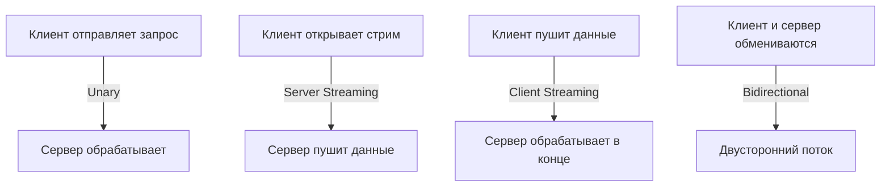

## Введение в RPC и философию gRPC

Remote Procedure Call (RPC) — парадигма, скрывающая сетевую природу вызова за синтаксисом локальной функции. В отличие от REST, где контракт часто описывается в OpenAPI, а данные передаются в текстовом JSON, gRPC ставит во главу угла строгую типизацию, бинарную сериализацию и бидирекциональную потоковую передачу.

Для Go-разработчика gRPC — это не просто "быстрый протокол", а способ управления жизненным циклом соединений и контекстом на уровне рантайма. В отличие от C# или Java, где рантайм часто управляет десериализацией через reflection, Go использует сгенерированный код (`protoc-gen-go`). Это позволяет компилятору эффективно проводить escape analysis, минимизировать аллокации в куче и избегать накладных расходов на reflection в hot paths.

> [!tip] Собеседование
> **Вопрос:** Когда стоит выбирать gRPC вместо REST/JSON?
> **Ответ:** gRPC идеален для внутренней коммуникации микросервисов с высокой частотой вызовов, строгим контрактом, необходимостью стриминга или низкой задержкой. REST/JSON лучше для публичных API, кэширования на L7-прокси и кроссплатформенной совместимости. gRPC не заменяет REST, а дополняет его в рамках polyglot-архитектуры.

## Protocol Buffers: Schema-first и сериализация

`.proto` файлы определяют контракт до написания кода. Proto3 упростил эволюцию схем, убрав обязательные поля и валидацию enum, что критично для микросервисной разработки, где версии могут обновляться асинхронно.

> [!info] Под капотом
> Protobuf использует Variable-Length Quantity (VLQ) для кодирования целых чисел. Меньшие значения занимают меньше байт на wire format. Это напрямую влияет на размер пакета, нагрузку на L1/L2 кэш CPU при десериализации и пропускную способность сети. Go-генератор создает структуры с точными полями, соответствующими wire format, что дает zero-allocation path для hot paths.

**Эволюция схем и совместимость:**
1. Поля в proto имеют номера. Порядок не важен, но номер — нет.
2. Удаление поля не освобождает место в wire format, если его не пометить как `reserved`.
3. Добавление поля с новым номером безопасно, старые клиенты проигнорируют его.
4. Изменение типа поля запрещено, если оно уже использовалось.

```protobuf
// example.proto
syntax = "proto3";
package demo;

message User {
  int64 id = 1;
  string name = 2;
  repeated string roles = 3;
}

service UserService {
  rpc GetUser (GetUserRequest) returns (User);
  rpc ListUsers (ListUsersRequest) returns (stream User);
}
```

## Архитектура gRPC: Транспорт и Стили взаимодействия

gRPC поддерживает четыре стиля взаимодействия, каждый из которых имеет свои сетевые и рантайм-особенности в Go:



В Go streaming реализуется через интерфейс `grpc.Stream` и внутренние структуры `transport.Stream`. Данные не буферируются в памяти целиком для серверного стриминга — они читаются чанками. Для клиентского и двунаправленного стриминга используются горутины, управляемые контекстом.

> [!warning] Ловушка / Gotcha
> Закрытие стрима в Go не освобождает память автоматически. Если вы не прочитаете все данные до `io.EOF` или не отмените контекст, буферы в `transport.Stream` останутся в памяти, что приведет к утечкам и росту RSS процесса.

## Под капотом: gRPC, HTTP/2 и Go-рантайм

gRPC работает поверх HTTP/2. Пакет `grpc-go` не использует `net/http`, а напрямую интегрируется с `net/http2`. Ключевые компоненты рантайма: `transport.Conn`, `transport.Stream`, `grpc.codec` и `grpc.resolver`.

### Multiplexing и HTTP/2
В отличие от `[[10. TCP. Устройство, гарантии и жизненный цикл соединения]]` с его блокировкой на уровне транспортного слоя, gRPC использует бинарные фреймы и multiplexing. Несколько потоков данных (`Stream`) передаются по одному TCP-соединению без заголовочных накладных расходов на каждое сообщение.

> [!info] Под капотом
> `grpc-go` использует кастомный dialer и connection pool (keepalive). Когда `transport.Stream` ждет данных от сети, он регистрирует readiness в `netpoller` (epoll/kqueue) и передает управление планировщику Go. Как только сокет готов, горутина возобновляется без блокировки M.

### Управление контекстом и отмена
Контекст в gRPC — это не просто таймаут. Он транслируется в HTTP/2 фреймы `GOAWAY` или `CANCEL`. При отмене контекста клиент отправляет `RST_STREAM`, сервер прекращает обработку и освобождает ресурсы.

```go
// Пример корректной работы с двунаправленным стримингом
stream, err := client.Chat(ctx)
if err != nil {
    return fmt.Errorf("create stream: %w", err)
}
defer stream.CloseSend() // Важно закрыть отправку, чтобы сигнализировать серверу

// Чтение в горутине
go func() {
    for {
        resp, err := stream.Recv()
        if err == io.EOF {
            return
        }
        if err != nil {
            // Логика обработки ошибки (например, context.Canceled)
            return
        }
        // Обработка resp
    }
}()

// Отправка
for _, msg := range messages {
    if err := stream.Send(msg); err != nil {
        return fmt.Errorf("send: %w", err)
    }
}
```

## Сетевые особенности и производительность

### Механическое сочувствие (Mechanical Sympathy)
Бинарный протокол Protobuf в 3-10 раз компактнее JSON. Меньший размер пакета означает:
1. Меньше промахов TLB (Translation Lookaside Buffer) при работе с сетевыми буферами.
2. Более предсказуемая работа кэш-линий CPU при десериализации.
3. Снижение нагрузки на Garbage Collector: меньше аллокаций строк и байт-массивов.

### Backpressure и Flow Control
HTTP/2 реализует flow control через окна размером в байты. `grpc-go` уважает эти окна, но может буферизовать данные в Go-буферах, если приложение читает медленнее, чем пишет. Для контроля используются `grpc.MaxCallRecvMsgSize` и `grpc.MaxCallSendMsgSize`.

> [!tip] Собеседование
> **Вопрос:** Как gRPC решает проблему Head-of-Line blocking?
> **Ответ:** На уровне TCP HLB есть (один потерянный пакет блокирует весь поток). gRPC переводит HLB на уровень HTTP/2: блокируется только конкретный `Stream`, а остальные продолжают работать. Однако, если один `Stream` блокируется на уровне приложения (например, ожидает ответа от БД), он все равно занимает место в окне flow control, что может замедлить другие потоки на том же соединении.

### Сравнение подходов
| Характеристика | REST/HTTP/1.1 + JSON | gRPC/HTTP/2 + Protobuf |
|---|---|---|
| Формат данных | Текстовый, читаемый | Бинарный, компактный |
| Мультиплексирование | Нет (или pipelining с проблемами) | Есть (фреймы HTTP/2) |
| Сжатие заголовков | Нет (или gzip тела) | HPACK (сжатие HEADERS) |
| Стриминг | SSE / WebSocket | Встроенный бидирекциональный |
| Эволюция контракта | OpenAPI / Swagger | Proto file (reserved, optional) |

## Ловушки, оптимизации и вопросы на собеседованиях

### Типичные ошибки в production
1. **Утечка памяти в стриминге:** Забытое чтение до `io.EOF` или отмена контекста без закрытия `Stream`.
2. **Игнорирование контекста:** Сервер не проверяет `ctx.Done()` при длительных операциях, тратя CPU впустую.
3. **Правильная работа с `grpc.Dial`:** Использование `grpc.WithBlock()` в production убьет инициализацию приложения при недоступности БД. Всегда используйте таймауты или async dial.
4. **TLS Handshake:** gRPC требует TLS по умолчанию. Внутренние сервисы могут использовать `grpc.WithTransportCredentials(insecure.NewCredentials())` для dev, но в prod обязательно mTLS.

> [!warning] Ловушка / Gotcha
> `grpc-go` кеширует соединения в `connPool`. Если вы не настроите `keepalive`, idle-соединения могут быть разорваны прокси или фаерволом, что приведет к `EOF` ошибкам при повторном использовании. Настройте `grpc.KeepaliveParams` с `Time`, `Timeout` и `MinTime`.

### Вопросы на собеседовании (Middle+/Senior)
- **Как gRPC реализует cancellation?** Контекст транслируется в HTTP/2 `CANCEL` фрейм. Сервер должен проверять `ctx.Err()` или читать из `ctx.Done()`.
- **Почему Protobuf быстрее JSON?** Нет парсера строк, нет выделения памяти под ключи объектов, VLQ-кодирование, бинарный формат.
- **Как избежать HLB в gRPC?** Использовать несколько TCP-соединений (`grpc.WithInitialConnWindowSize`, пулинг), или перейти на `[[23. HTTP 3 и QUIC. Почему будущее уходит от TCP]]` (QUIC решает HLB на транспортном уровне).
- **Как профилировать gRPC-сервис?** `pprof` по CPU/Memory + `grpc-go` internal metrics (`grpc_server_started_count`, `grpc_server_handled_count`). Используйте `grpc-go` tracing для анализа задержек внутри `transport`.

## Итог

1. gRPC — это RPC-фреймворк, работающий поверх HTTP/2, предоставляющий бинарный протокол, строгую типизацию и стриминг.
2. Protocol Buffers используют VLQ-кодирование и schema-first подход, что дает компактность и предсказуемую эволюцию контракта.
3. `grpc-go` интегрируется с `net/http2` и `netpoller`, реализующий multiplexing, flow control и non-blocking I/O.
4. Streaming требует строгого управления контекстом и закрытия потоков для предотвращения утечек памяти.
5. Для production критичны keepalive, таймауты dial, настройка max message size и мониторинг HTTP/2 метрик.

Мы разобрали, как gRPC использует возможности HTTP/2 и Go-рантайма для эффективной коммуникации. Следующим логичным шагом будет изучение [[27. Прокси, Reverse Proxy и API Gateway]], чтобы понять, как маршрутизировать, балансировать и защищать gRPC- и HTTP-трафик на периметре инфраструктуры, а также какие особенности работы с прокси-серверами (nginx, Envoy, API Gateway) критичны для production-среды.