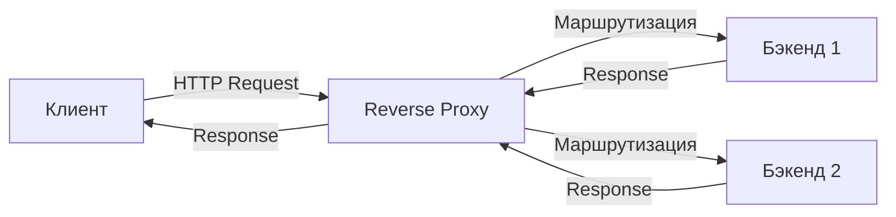

## Введение: Прокси как архитектурный примитив

В современной backend-архитектуре прокси-серверы — это не просто «перенаправители трафика», а критический слой абстракции между клиентом и бизнес-логикой. Для Go-разработчика понимание проксирования выходит за рамки конфигурации Nginx: это знание того, как управлять соединениями, TLS-сессиями, пулами горутин и сетевым стеком ОС на уровне runtime.

Понимание прокси-паттернов необходимо для:
- Снижения нагрузки на сервисы через буферизацию и кеширование.
- Централизованной маршрутизации, аутентификации и rate limiting.
- Оптимизации сетевого стека через HTTP/2 multiplexing и TLS session resumption.
- Предотвращения утечек горутин и истощения портов при высокой нагрузке.

## Forward vs Reverse Proxy: Фундаментальное отличие

Клиентский (Forward) и обратный (Reverse) прокси решают разные задачи и работают на разных границах системы.

**Forward Proxy** находится *перед клиентом*. Клиент явно знает о его существовании (настраивает прокси в браузере или ОС). Он действует от имени клиента: анонимизирует запросы, фильтрует контент, кеширует ответы. Пример: корпоративный прокси для выхода в интернет, Squid.

**Reverse Proxy** находится *перед сервером*. Клиент не знает о его существовании. Он принимает запрос, определяет, какому бэкенду его направить, и возвращает ответ так, будто сам является целевым сервером. Пример: Nginx перед кластером Go-сервисов, CDN, API Gateway.

> [!info] Под капотом
> Разница кроется в HTTP-заголовках и сетевом контексте. Forward proxy модифицирует заголовок `Host` и URI в абсолютном формате (`http://example.com/path`). Reverse proxy работает с относительными путями, переписывает `Host`, `X-Forwarded-For`, `X-Real-IP` и управляет жизненным циклом соединений к бэкенду.



## Reverse Proxy: Устройство и роль в бэкенде

Обратный прокси выполняет несколько системных задач, которые критичны для production-нагрузки:

1. **SSL/TLS Termination**: Расшифровка HTTPS на прокси, передача незашифрованного HTTP на бэкенды. Экономит CPU на сервисах, но требует безопасного канала (или повторного шифрования).
2. **Load Balancing**: Распределение запросов по бэкендам (Round Robin, Least Connections, Weighted).
3. **Connection Pooling**: Переиспользование TCP-соединений к бэкендам для снижения latency и CPU overhead на TCP Handshake.
4. **Buffering & Flow Control**: Защита бэкендов от медленных клиентов (Slowloris) и от перегрузки при пиковой нагрузке.
5. **Routing & Rewriting**: Динамическая маршрутизация по путям, хостам или заголовкам.

## API Gateway: Надстройка над обратным прокси

**API Gateway** — это reverse proxy с бизнес-логикой. Он не просто пересылает байты, а понимает семантику протоколов (HTTP/gRPC), управляет жизненным циклом API, обеспечивает observability и безопасность.

| Функция | Reverse Proxy | API Gateway |
|:---|:---:|:---:|
| Маршрутизация | Статическая / regex | Динамическая / service mesh aware |
| Аутентификация | TLS Client Cert / Basic | JWT, OAuth2, mTLS, RBAC |
| Rate Limiting | IP-based, token bucket | User/tenant-based, distributed |
| Трансформация | Заголовки, body (limited) | JSON/XML mapping, gRPC-HTTP bridge |
| Observability | Access log | Tracing, metrics, structured logging |
| Исполнение | C++/Rust (Nginx/Envoy) | Go, Java, Rust (custom logic) |

В Go API Gateway часто реализуется как standalone-сервис или embedded-компонент, так как `net/http` предоставляет все необходимые примитивы для написания кастомных middleware, динамического роутинга и интеграции с распределенными системами.

## Reverse Proxy в Go: Под капотом и идиомы

Go предоставляет `httputil.ReverseProxy` — production-ready реализацию обратного прокси. Он работает через паттерн `Director`: функция, которая модифицирует `*http.Request` перед отправкой на бэкенд.

```go
package main

import (
	"log"
	"net/http"
	"net/http/httputil"
	"net/url"
	"time"
)

func main() {
	target, err := url.Parse("http://backend-service:8080")
	if err != nil {
		log.Fatalf("Invalid target URL: %v", err)
	}

	// Конфигурация пула соединений критична для производительности
	transport := &http.Transport{
		MaxIdleConns:        100,
		MaxIdleConnsPerHost: 100,
		IdleConnTimeout:     90 * time.Second,
		TLSHandshakeTimeout: 10 * time.Second,
		DisableCompression:  true, // Прокси не должен сжимать, если бэкенд это делает
	}

	proxy := httputil.NewSingleHostReverseProxy(target)
	proxy.Transport = transport
	proxy.FlushInterval = time.Millisecond * 100 // Баланс между latency и throughput
	proxy.ErrorHandler = func(w http.ResponseWriter, r *http.Request, err error) {
		log.Printf("Proxy error: %v", err)
		http.Error(w, "Service Unavailable", http.StatusBadGateway)
	}

	http.ListenAndServe(":8080", proxy)
}
```

### Как работает `httputil.ReverseProxy` под капотом
1. **Director**: Вызывается до отправки запроса. Разработчик должен вручную переписать `Host`, `X-Forwarded-For`, URI.
2. **RoundTrip**: Создает новый `http.Request`, клонирует заголовки, устанавливает соединение через `http.Transport`.
3. **Streaming**: Тело запроса копируется в буфер. Если бэкенд поддерживает `Transfer-Encoding: chunked`, Go 1.18+ корректно пробрасывает его, но на старых версиях требовалась ручная обработка.
4. **Response Copy**: Заголовки ответа копируются, статус перенаправляется. Тело ответа читается в отдельной горутине и записывается в `http.ResponseWriter`.
5. **Cleanup**: При отключении клиента или таймауте горутина завершается, соединение с бэкендом закрывается или возвращается в пул.

> [!warning] Ловушка / Gotcha
> `httputil.ReverseProxy` **не клонирует тело запроса автоматически**. Если вы вызываете `proxy.ServeHTTP` дважды для одного `http.Request`, тело будет пустым при втором вызове, так как `io.ReadCloser` исчерпан. Всегда дублируйте тело через `bytes.NewBuffer` или `io.TeeReader`, если нужна повторная обработка.

## Производительность и Mechanical Sympathy

Прокси-сервис — это узкое место в сети. Каждое решение влияет на использование CPU, памяти и сетевых ресурсов ОС.

### Сетевой стек и `netpoll`
Go использует `netpoll` (epoll на Linux, kqueue на BSD/macOS, IOCP на Windows) для асинхронного I/O. Когда горутина ждет ответа от бэкенда, она блокируется не на syscall-е, а регистрируется в поллере. Это позволяет одной горутине обслуживать десятки тысяч соединений с минимальным расходом стека (2 КБ).

### TLS Handshake и CPU Cache
TLS Termination на прокси снимает нагрузку с бэкендов, но требует собственных вычислений. Go использует `crypto/tls` с оптимизированными реализациями AES-GCM через аппаратные инструкции (AES-NI). Кэш-линии L1/L2 критичны для шифрования: неаллоцированные буферы и `sync.Pool` для `tls.Config` снижают cache misses.

### Connection Pooling и `http.Transport`
`http.Transport` управляет пулом TCP-соединений. При высокой нагрузке:
- `MaxIdleConnsPerHost` должен соответствовать ожидаемому QPS.
- `IdleConnTimeout` предотвращает утечку соединений, когда бэкенды отваливаются.
- TCP KeepAlive (настраивается через `net.Dialer.KeepAlive`) предотвращает отвал соединений в NAT/Load Balancer.

```go
dialer := &net.Dialer{
    Timeout:   5 * time.Second,
    KeepAlive: 30 * time.Second,
}
transport := &http.Transport{
    DialContext:         dialer.DialContext,
    MaxIdleConnsPerHost: 200,
}
```

> [!tip] Собеседование
> **Вопрос:** Почему `MaxIdleConnsPerHost` часто становится причиной деградации под нагрузкой?
> **Ответ:** Если бэкенды динамически масштабируются, статический пул соединений может удерживать мертвые TCP-сокеты. Go не удаляет их из пула мгновенно, он ждет `IdleConnTimeout`. На пиковой нагрузке это приводит к `EADDRNOTAVAIL` или `TIME_WAIT` истощению. Решение: использовать `http2.Transport` для multiplexing или настраивать `net/http` с динамическим пересозданием пула при ошибках `connection reset`.

## Ловушки и вопросы на собеседованиях

### 1. Утечка горутин при отключении клиента
Если клиент разрывает соединение до получения ответа, горутина, читающая бэкенд, может зависнуть. 
**Решение:** Всегда используйте `context.Context` с таймаутом. `httputil.ReverseProxy` поддерживает `http.Server.ReadHeaderTimeout` и `http.Server.IdleTimeout`, но для гарантированного cleanup используйте `context.WithTimeout` на уровне middleware.

### 2. Заголовок `Host`
Бэкенды (особенно Go `http.Server`) требуют корректного `Host`. `httputil.ReverseProxy` устанавливает его автоматически, но если вы модифицируете URI в Director, обязательно проверьте `req.Host`.

### 3. HTTP/2 и multiplexing
Go 1.11+ автоматически использует HTTP/2 для соединений к бэкендам, если они поддерживают ALPN. Это устраняет **Head of Line Blocking** (статья [[23. HTTP 3 и QUIC. Почему будущее уходит от TCP]]). В прокси-слое это критично: один TCP-сокет обслуживает сотни потоков запросов, экономя память CPU и сетевой стек.

### 4. Buffering vs Streaming
`FlushInterval` в `ReverseProxy` контролирует, когда ответ буферизуется и когда отправляется клиенту. Значение `0` включает немедленный flush (высокая latency для небольших ответов, нагрузка на сеть). Значение `>0` буферизует до таймаута (лучший throughput, но задержка).

> [!warning] Ловушка / Gotcha
> При проксировании gRPC через HTTP/2, заголовок `Content-Type: application/grpc` и `TE: trailers` обязательно должны присутствовать. Без них Go-клиент или балансировщик может отбросить ответ как невалидный.

## Сравнение: Go vs Nginx/Envoy

| Критерий | Nginx / Envoy (C++/Rust) | Go Reverse Proxy |
|:---|:---|:---|
| **Производительность** | Максимальная (zero-copy, BPF, VMM) | Высокая, но зависит от GC и аллокаций |
| **Конфигурация** | Декларативная, статическая | Кодовая, динамическая, runtime-aware |
| **Расширяемость** | Lua/WSI (ограничена) | Полная (Go-код, плагины, DI) |
| **Управление памятью** | Статический аллокатор, arena | GC, escape analysis, sync.Pool |
| **Сценарий** | Статическая маршрутизация, TLS, caching | Динамический роутинг, аутентификация, business logic |

Go-прокси выигрывает, когда логика маршрутизации зависит от состояния (базы данных, KV-хранилища, кастомные алгоритмы балансировки). Nginx/Envoy выигрывают в чистой пропускной способности и latency.

## Итог

1. **Reverse Proxy** — прозрачный слой, который управляет соединениями, TLS и маршрутизацией, скрывая архитектуру бэкендов.
2. **API Gateway** — reverse proxy с бизнес-логикой: auth, rate limiting, observability, трансформация.
3. **Go-реализация** через `httputil.ReverseProxy` и `http.Transport` требует тонкой настройки пулов соединений, таймаутов и контекстов для предотвращения утечек.
4. **Mechanical Sympathy**: CPU cache, TLS handshake cost, TCP state machine, `netpoll`/`epoll` и GC pressure напрямую влияют на throughput прокси-сервиса.
5. **Производительность**: `http2.Transport` для multiplexing, `sync.Pool` для заголовков, динамический dialer и корректный `IdleConnTimeout` — база production-прокси.

Мы разобрали архитектуру и реализацию прокси в Go. Следующим логичным шагом является изучение высокопроизводительных C++/Rust-прокси, которые лежат в основе современной инфраструктуры: [[28. nginx, Envoy и HAProxy. Как работают современные прокси]].