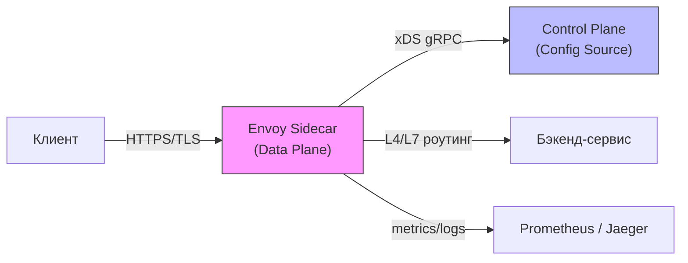

## Введение: Зачем Go-разработчику знать о прокси?

В современной бэкенд-архитектуре Go-приложение редко работает в вакууме. Оно стоит за слоем сетевых компонентов, которые берут на себя маршрутизацию, балансировку, TLS-терминацию, логирование и защиту от DDoS. Понимание того, как устроены современные прокси, критически важно для проектирования производительных систем, правильной настройки `net/http` клиента/сервера и диагностики сложных сетевых проблем.

Прокси делятся на два основных типа:
1. **Forward Proxy** — работает на стороне клиента, перенаправляя исходящие запросы (редко используется в бэкенде).
2. **Reverse Proxy** — работает на стороне сервера, принимая запросы от клиентов и перенаправляя их на бэкенд-сервисы. Именно этот тип доминирует в Go-экосистеме.

По уровню работы с сетевыми протоколами прокси разделяются на:
- **L4 (Transport Layer)** — оперирует IP-адресами и портами (TCP/UDP). Не читает тело запроса.
- **L7 (Application Layer)** — парсит HTTP, gRPC, WebSocket. Может маршрутизировать по заголовкам, пути, методу.

> [!tip] Собеседование
> **Вопрос:** В чем фундаментальное отличие L4-балансировщика от L7?
> **Ответ:** L4 работает на уровне IP/TCP, перенаправляя пакеты без понимания их содержимого. Это быстрее, но не позволяет делать умный роутинг. L7 парсит заголовки и тело, что дает гибкость (канареечные релизы, A/B тесты, валидация), но добавляет CPU-накладку на разбор протокола и контекстные переключения.

## nginx: Архитектура событийной модели

`nginx` — это событийно-ориентированный прокси, написанный на C. Его архитектура построена вокруг модели `master-worker`.

1. **Master-процесс** читает конфигурацию, открывает и bind-ит сокеты, а затем форкает `worker`-процессы.
2. **Worker-процессы** изолированы друг от друга. Каждый воркер работает в одном потоке ОС и использует **`epoll`** (на Linux) или **`kqueue`** (на BSD/macOS) для асинхронного мониторинга тысяч соединений.
3. Когда клиент подключается, `accept()` возвращает дескриптор. `nginx` регистрирует его в `epoll` с флагом `EPOLLIN`. Когда данные приходят, ядро будит воркер, и он читает данные, парсит HTTP, выполняет логику роутинга и отправляет ответ.

**Под капотом:**
- Каждый воркер имеет свой пул файловых дескрипторов и собственную кучу (malloc).
- `nginx` активно использует **`sendfile()`** и **`splice()`** для zero-copy передачи файлов с диска на сетевой интерфейс, минуя пользовательское пространство.
- Конфигурация статична при запуске. Для динамического обновления используется `open_file_cache` и `reconfigure` через `SIGHUP`.

```go
// Пример того, как Go-клиент работает через прокси.
// В отличие от C-прокси, Go абстрагирует epoll через netpoller,
// но при подключении к upstream все равно использует стандартный socket API.
func main() {
	transport := &http.Transport{
		Proxy: http.ProxyFromEnvironment,
		// В продакшене здесь настраиваются dialer, keep-alive и TLS конфигурации
		// для соответствия поведению nginx/HAProxy.
	}
	client := &http.Client{Transport: transport}
	resp, err := client.Get("http://backend-service:8080/health")
	if err != nil {
		log.Fatalf("proxy dial failed: %v", err)
	}
	defer resp.Body.Close()
	// ... обработка ответа
}
```

## HAProxy: L4-мастер и производительность

`HAProxy` исторически позиционируется как высокопроизводительный балансировщик, делающий акцент на **L4 и L7**. В отличие от `nginx`, он часто используется в режиме single-threaded event loop для конкретных бэков.

- **Архитектура:** Один основной поток обрабатывает все входящие соединения через `epoll`. Архитектура спроектирована так, чтобы минимизировать контекстные переключения.
- **Пользовательское пространство TCP:** `HAProxy` реализует часть логики TCP прямо в user-space (например, управление окном перегрузки, ACK-пакеты), что снижает нагрузку на ядро ОС.
- **Zero-copy и буферизация:** Использует фиксированные пулы буферов (memory pools) для избежания фрагментации кучи. Данные копируются минимальное количество раз между буферами.

> [!info] Под капотом
> `HAProxy` избегает динамических аллокаций в hot path. Буферы выделяются при старте в массив фиксированного размера. Это гарантирует cache locality и предсказуемую latencies. В Go аналогом этого подхода является `sync.Pool` или pre-allocated buffers в `bufio`.

## Envoy: Data Plane, xDS и Service Mesh

`Envoy` — прокси нового поколения, написанный на C++ и LLVM. Он стал де-факто стандартом для Service Mesh (Istio, Linkerd) благодаря разделению на **Control Plane** и **Data Plane**.

- **Data Plane:** Сам `Envoy` (sidecar или gateway). Не имеет состояния. Все конфигурации приходят динамически.
- **xDS API:** Протокол для передачи конфигурации от control plane к data plane. Включает LDS (Listener), CDS (Cluster), RDS (Route), SDS (Secrets).
- **Observability:** Встроенная поддержка OpenTelemetry, Prometheus метрик, детального логирования.
- **C++ под капотом:** Нет GC. Память управляется вручную или через arena-аллокаторы. Это дает предсказуемую нагрузку на CPU, но требует строгого контроля за утечками.



## Механическая симпатия: Событийная модель vs Горутинная

Здесь кроется фундаментальное различие между классическими прокси и Go-приложениями.

| Аспект | `nginx` / `HAProxy` / `Envoy` (C/C++) | Go Runtime |
| :--- | :--- | :--- |
| **Модель выполнения** | 1 поток ОС = 1 воркер = 1 `epoll` loop. | M:N планировщик. Миллионы горутин на одном потоке. |
| **Контекстные переключения** | Минимальны. Переключение внутри воркера происходит только при `epoll_wait`. | Частые переключения между goroutine и OS thread (sysmon, netpoll). |
| **Работа с памятью** | Ручное управление / arena / malloc. Кэш-локальность критична. | GC, Escape Analysis. Данные могут уходить в кучу, создавая нагрузку на сборщик. |
| **Сетевой стек** | Пользовательский или ядро (splice/sendfile). | `netpoller` (epoll/kqueue) + `sysmon` + `runtime.netpoll`. |

**Почему это важно для Go-разработчика?**
Когда вы настраиваете Go-сервер за `nginx` или `Envoy`, вы должны понимать, что прокси **не является прозрачным**. 
1. **TLS Overhead:** Терминация TLS на прокси снимает CPU-нагрузку с Go-приложения, но добавляет задержку на шифрование/дешифрование. Используйте аппаратное ускорение (Intel QAT, AWS Nitro) или `nginx` с `ngx_http_ssl_module` и `session resumption`.
2. **Keep-Alive:** Go `net/http` по умолчанию использует HTTP/1.1 с keep-alive. Если прокси не настроен на проксирование keep-alive, каждое новое соединение потребует TCP handshake + TLS handshake. Это убивает производительность при высокой нагрузке.
3. **Buffer Size:** Прокси буферизируют тело запроса. Если размер тела превышает буфер (например, 16KB в `nginx`), данные записываются на диск. Go должен это учитывать при чтении `Request.Body`.

> [!warning] Ловушка / Gotcha
> **TIME_WAIT и Port Exhaustion:** Если Go-клиент делает много коротких запросов к одному бэкенду через прокси, и прокси настроен на `proxy_http_version 1.0` или закрывает соединение, Go-клиент может исчерпать локальные порты. Всегда настраивайте `proxy_set_header Connection "";` в `nginx` или `keepalive` в `HAProxy`, чтобы переиспользовать TCP-соединения.

## Ловушки и типичные вопросы на собеседованиях

1. **Как `nginx` обрабатывает 100k одновременных подключений?**
   Не создает 100k потоков. Использует 1 `epoll` на воркер. Сокеты становятся non-blocking. Когда данных нет, воркер спит в `epoll_wait` (syscall, который не блокирует CPU). При приходе данных ядро будит воркер, он читает, обрабатывает и снова засыпает.

2. **Почему `Envoy` использует xDS вместо статичного конфига?**
   Динамическая конфигурация позволяет обновлять правила роутинга, балансировки и TLS-сертификаты без перезапуска прокси. Это критично для оркестрации в Kubernetes, где pod'ы постоянно создаются и удаляются.

3. **В чем разница между `sendfile` и `splice` в контексте прокси?**
   `sendfile` копирует данные из page cache в socket buffer. `splice` перемещает данные между файловыми дескрипторами (например, от сокета к диску) через ядро, вообще не заходя в user-space. `nginx` использует `splice` для `aio` и `tcp_nopush`.

4. **Как прокси влияют на GC в Go?**
   Косвенно. Если прокси закрывает соединения, Go-клиент вынужден постоянно создавать новые `net.Conn` и аллоцировать буферы. Это увеличивает давление на GC. Настройка `http.Transport.MaxIdleConns` и `IdleConnTimeout` напрямую решает эту проблему.

## Итог

Современные прокси (`nginx`, `HAProxy`, `Envoy`) решают задачи, которые Go-рантайм не берёт на себя: L4/L7 маршрутизация, сложная TLS-терминация, zero-copy I/O, observability и защита от атак. Понимание их устройства позволяет:
- Правильно настраивать `net/http` транспорт для минимизации накладных расходов.
- Избегать утечек портов и TIME_WAIT.
- Выбирать инструмент под задачу: `nginx` для L7-веб, `HAProxy` для L4-балансировки, `Envoy` для Service Mesh.

Мы разобрали, как трафик обрабатывается на уровне прокси. Следующий шаг — понять, как именно трафик распределяется между бэкендами. В следующей статье мы детально разберем: [[29. Балансировка нагрузки. L4, L7, Round Robin, Least Connections]].