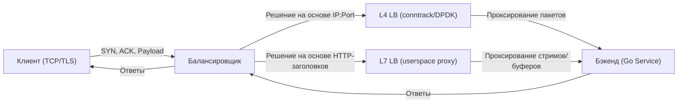

## Балансировка нагрузки: зачем Go-разработчику понимать инфраструктуру

Для разработчика на PHP или Java балансировщик часто выглядит как «чёрный ящик», который просто раздает запросы между воркерами. В Go модель конкурентности фундаментально меняет эту парадигму. Каждый HTTP-запрос в Go обрабатывается в изолированной **гортине**, которая ожидает I/O через `netpoll` (epoll/kqueue). 

Балансировщик нагрузки (Load Balancer, LB) напрямую управляет жизненным циклом ваших горутин:
1. Он решает, когда создать новое соединение (и, следовательно, новую гортину).
2. Он управляет временем жизни соединения через `Keep-Alive` и health-checks.
3. Он может принудительно разрывать соединения, что приводит к `EOF` на стороне Go и требует корректной обработки ошибок.

Понимание того, как данные проходят через L4/L7 уровни, почему одни алгоритмы быстрее других и как Go взаимодействует с сетевым стеком, критично для проектирования отказоустойчивых и высокопроизводительных сервисов.

## L4 и L7: архитектура и под капотом

Балансировщики делятся на два основных класса в зависимости от уровня сетевой модели, на котором они принимают решения.

### Layer 4 (Transport Layer)
Работает с IP-адресами и портами (TCP/UDP). Не читает полезную нагрузку.
* **Как работает:** Использует `conntrack` в ядре Linux или полностью обходит ядро через `DPDK`/`eBPF`/`XDP`. Решение о маршрутизации принимается на основе заголовков TCP/IP.
* **Производительность:** Максимальная. Обработка одного пакета занимает микросекунды. Минимум контекстных переключений (context switches).
* **Особенности:** Не поддерживает TLS termination, не может маршрутизировать по URL/заголовкам. Требует, чтобы бэкенды принимали прямые TCP-соединения.

### Layer 7 (Application Layer)
Работает с содержимым протокола (HTTP, gRPC, TLS).
* **Как работает:** Полностью пересобирает TCP-сегменты в userspace. Прокси (например, [[28. nginx, Envoy и HAProxy. Как работают современные прокси]]) держит открытым соединение до клиента, создает новое до бэкенда и пересылает байты. Требует буферизации, парсинга заголовков и управления состоянием.
* **Производительность:** Ниже L4 из-за аллокаций памяти под буферы, парсинга и дополнительных syscall (`read`/`write`). Современные прокси (Envoy, HAProxy) оптимизируют это через zero-copy и memory pools.
* **Особенности:** Включает WAF, rate-limiting, аутентификацию, перекодирование протоколов, sticky-sessions.



> [!info] Под капотом
> В Linux L4-балансировка часто реализуется через `iptables`/`nftables` (DNAT) или `LVS` (Linux Virtual Server). Ядро меняет заголовок IP на лету, не копируя данные в память. L7-балансировка требует полного разбора TCP-сегментов, контроля порядка доставки и управления окном (window scaling). Если L7-прокси падает, все активные соединения разрываются, а Go-серверы увидят `ECONNRESET` или `EOF`.

## Алгоритмы распределения трафика

Выбор алгоритма определяет нагрузку на CPU, память и предсказуемость latency вашего сервиса.

### Round Robin (RR)
Отдает каждый новый запрос следующему серверу в цикле.
* **Плюсы:** Stateless, минимальные накладные расходы на CPU.
* **Минусы:** Игнорирует текущую загрузку. Если один бэкенд обрабатывает тяжелые запросы (например, генерация PDF), он станет «узким горлышком», пока RR продолжит слать туда новые запросы.
* **Go-специфика:** Идеален для stateless-сервисов с однородной нагрузкой. Не требует отслеживания состояния в LB.

### Least Connections (LC)
Отдает запрос серверу с наименьшим количеством активных соединений.
* **Плюсы:** Адаптивен к разнице во времени обработки запросов. Предотвращает перегрузку «медленных» нод.
* **Минусы:** Stateful. Требует хранения таблицы соединений в памяти LB. При масштабировании таблицы `conntrack` могут возникать hotspots на CPU из-за атомарных операций инкремента/декремента счетчиков.
* **Go-специфика:** Критически важен, если ваш сервис выполняет CPU-bound или I/O-bound операции с разной длительностью. Go-сервер с `net/http` по умолчанию держит соединения открытыми (`Keep-Alive`), поэтому «активное соединение» в LB часто означает «несколько ожидающих горутин».

### Weighted Round Robin / Least Connections
Добавляет коэффициент веса (capacity) каждой ноде. Позволяет учитывать разное железо в кластере.

### Consistent Hashing (Последовательный хеш)
Маршрутизирует запросы к одной ноде на основе хеша от ключа (например, `user_id` или `session_id`).
* **Механизм:** Использует виртуальное кольцо (virtual nodes). При добавлении/удалении ноды меняется только ~1/N часть трафика, а не 100% (как при простом хешировании).
* **Применение:** Кеширование, sticky-sessions, распределение по tenants.

> [!warning] Ловушка / Gotcha
> **Алгоритм LC и Go-клиенты:** Если вы используете LC на балансировщике, но ваши Go-клиенты не переиспользуют соединения (или отключают `Keep-Alive`), метрика «активных соединений» будет врать. Балансировщик будет видеть `1` соединение на все ноды и распределять трафик равномерно, игнорируя реальную загрузку процессора. Всегда настраивайте `http.Transport` с `MaxIdleConns` и `IdleConnTimeout`.

## Go и балансировщики: специфика взаимодействия

Go-рантайм и `net/http` спроектированы с упором на высокую степень конкурентности и эффективное управление соединениями. Балансировщик становится частью этого цикла.

### 1. Keep-Alive и пулы соединений
По умолчанию `http.Server` в Go использует persistent-соединения. Это означает, что один TCP-канал может обслуживать десятки запросов последовательно в рамках одной горутины.
* **Для LB:** Это снижает нагрузку на CPU балансировщика (меньше SYN/ACK пакетов) и улучшает latency (нет рукопожатий TLS/TCP).
* **Настройка:** В Go важно ограничивать `IdleConnTimeout` (по умолчанию 90с) и `MaxIdleConnsPerHost`, чтобы избежать утечки соединений при отключении бэкендов.

### 2. Graceful Shutdown и draining
При деплое или масштабировании LB должен перестать слать трафик на ноду и подождать завершения текущих запросов.
* **В Go:** `http.Server.Shutdown(ctx)` не убивает горутины. Он отключает `Accept()` на сокете и ждет завершения уже запущенных обработчиков.
* **Синхронизация:** Таймауты LB (drain timeout) должны быть строго больше таймаута `http.Server.Shutdown()`. Иначе LB закроет сокет, а Go-горутина попытается записать в `net.Conn`, получив `broken pipe` и panic, если ошибка не обработана.

### 3. Health Checks
* **TCP-чек:** Балансировщик подключается к порту и ждет `SYN-ACK`. Быстрый, но не проверяет логику приложения.
* **HTTP-чек:** Отправляет `GET /health` и ждет статус `200`. Требует легковесного эндпоинта. **Никогда не ставьте в health-check запросы к БД или тяжелым сервисам** — это создаст петлю зависаний.
* **Go-специфика:** Go-сервер должен корректно обрабатывать `CLOSE_WAIT` со стороны LB. Если LB разрывает соединение, Go-горутина, ожидающая чтение, получит `io.EOF` или `net.OpError`.

```go
package main

import (
	"context"
	"log"
	"net/http"
	"os"
	"os/signal"
	"syscall"
	"time"
)

func main() {
	mux := http.NewServeMux()
	mux.HandleFunc("/health", func(w http.ResponseWriter, r *http.Request) {
		// Логика health-check должна быть мгновенной
		w.WriteHeader(http.StatusOK)
	})

	srv := &http.Server{
		Addr:              ":8080",
		Handler:           mux,
		ReadHeaderTimeout: 5 * time.Second,
		IdleTimeout:       120 * time.Second, // Синхронизировать с LB keep-alive
	}

	go func() {
		log.Printf("Server listening on %s", srv.Addr)
		if err := srv.ListenAndServe(); err != http.ErrServerClosed {
			log.Fatalf("HTTP server error: %v", err)
		}
	}()

	// Блокировка сигнала для graceful shutdown
	quit := make(chan os.Signal, 1)
	signal.Notify(quit, syscall.SIGINT, syscall.SIGTERM)
	<-quit

	log.Println("Shutting down server...")
	ctx, cancel := context.WithTimeout(context.Background(), 30*time.Second)
	defer cancel()

	// 1. Отключаем Accept новых соединений
	// 2. Ждем завершения активных горутин
	if err := srv.Shutdown(ctx); err != nil {
		log.Fatalf("Server forced to shutdown: %v", err)
	}
	log.Println("Server exited properly")
}
```

> [!tip] Собеседование
> **Вопрос:** Балансировщик типа L7 оборвал соединение с клиентом во время запроса. Что увидит Go-сервер и как это обработать?
> **Ответ:** Go-сервер попытается записать ответ в `net.Conn`, получит ошибку `write tcp x.x.x.x:8080->y.y.y.y:port: write: broken pipe` или `io: read/write on closed connection`. Идиоматичный Go требует проверки ошибки после `Write()`. Если ошибка связана с закрытием соединения, мы не должны логировать её как критическую, а просто завершить гортину. В `net/http` это часто обрабатывается автоматически, но при использовании низкоуровневых `net.Conn` или `grpc` нужно явно проверять `errors.Is(err, net.ErrClosed)`.
> 
> **Вопрос:** Почему Round Robin может быть плох для Go-кластера с тяжелыми запросами?
> **Ответ:** Go выделяет на каждый запрос горутину с начальным стеком 2-4 КБ, который динамически растет. Тяжелые запросы удерживают соединения и ресурсы CPU. RR не учитывает это, создавая «горячие» ноды. Least Connections или Weighted Algorithm с учетом latency (например, HAProxy's `balance leastconn` или Envoy's `round_robin` с `slow_start`) распределяют нагрузку пропорционально реальной пропускной способности каждой ноды.

## Итог

1. **L4 vs L7:** L4 работает на уровне IP/Port (быстро, `conntrack`/ядро), L7 на уровне протокола (гибко, userspace, буферизация). Выбор зависит от требований к маршрутизации и latency.
2. **Алгоритмы:** RR прост и stateless, LC адаптивен но stateful (требует ресурсов на tracking), Consistent Hashing нужен для sticky-sessions и минимизации ребалансировки.
3. **Go-специфика:** `net/http` использует persistent-соединения и `netpoll`. Балансировщик напрямую влияет на пул соединений, количество горутин и время graceful shutdown.
4. **Синхронизация:** Таймауты LB (drain), Go (`IdleConnTimeout`, `Shutdown` timeout) и health-checks должны работать согласованно, чтобы избежать `broken pipe` и утечки горутин.
5. **Архитектурный совет:** Держите Go-сервисы stateless. Выносите сессию/состояние в Redis/Memcached. Это позволяет использовать любой LB-алгоритм без sticky-sessions и упрощает масштабирование.

Мы разобрали, как трафик распределяется между нодами. Но как сервисы узнают, какие ноды существуют, и как динамически обновлять эту информацию без перезагрузки балансировщика? В следующей статье мы перейдем к: [[30. Service Discovery и балансировка в микросервисах]].