## Введение: Слой L2 в контексте Go-разработки

Мы опустились на уровень 2 модели OSI. Если предыдущие статьи закладывали философию стека и абстрактные модели, то здесь мы переходим к физической и канальной среде, где абстракции превращаются в байты, регистры и электрические сигналы.

Для Go-разработчика, особенно на пути к Senior/Lead, понимание L2 критично в трех сценариях:
1. **Bare-metal и высоконагруженный бэкенд:** Оптимизация сетевого стека, kernel-bypass (DPDK, XDP), работа с raw-сокетами.
2. **Cloud & Kubernetes:** Понимание, как VPC, overlay-сети (VXLAN) и CNI-плагины инкапсулируют Ethernet-фреймы поверх IP.
3. **Отладка и наблюдаемость:** Когда `curl` падает с `ECONNREFUSED` или `ETIMEDOUT`, а метрики в порядке, проблема часто лежит на L2: MAC-таблица коммутатора, collision domain или повреждение фрейма.

## Устройство Ethernet-кадра

Ethernet — это не протокол маршрутизации. Это механизм **фрейминга**. Он определяет, как данные упаковываются в кадр, чтобы несколько устройств могли делить одну физическую среду (исторически коаксиальный кабель или хаб) или обмениваться данными через коммутатор.

Стандартный Ethernet-II кадр (наиболее распространен в IP-сетях) имеет фиксированную структуру заголовка:

```mermaid
flowchart LR
    A["Преамбула<br>7 байт"] -->|"Синхронизация"| B["Начало кадра<br>1 байт"]
    B -->|"Начало кадра"| C["MAC получателя<br>6 байт"]
    C -->|"Куда отправить"| D["MAC отправителя<br>6 байт"]
    D -->|"Кто отправил"| E["Тип кадра<br>2 байта"]
    E -->|"Тип IPv4"| F["Данные<br>46-1500 байт"]
    F -->|"L3/L4 данные"| G["Контрольная сумма<br>4 байта"]
    G -->|"Завершение"| H["Пауза между кадрами<br>12 байт"]

```



**Ключевые поля:**
*   **Dest/Src MAC:** 48-битные адреса получателя и отправителя.
*   **EtherType:** Тип инкапсулированного протокола. `0x0800` — IPv4, `0x86DD` — IPv6, `0x8100` — VLAN tag (802.1Q).
*   **Payload:** Минимум 46 байт (если меньше, Ethernet добавляет `padding`). Максимум 1500 байт (MTU). *Jumbo frames* (до 9000) поддерживаются не всем оборудованием.
*   **FCS (Frame Check Sequence):** CRC-32, вычисляется аппаратно сетевой картой. Проверяется при получении. Если FCS не совпадает, кадр тихо отбрасывается — на L2 нет механизма подтверждения доставки.

> [!warning] Ловушка / Gotcha
> Ethernet **не гарантирует доставку**. Он гарантирует только целостность кадра. Если FCS не сошелся, кадр теряется без уведомления. Гарантии доставки, порядка и дедупликации ложатся на TCP или логику приложения.

## MAC-адреса: Идентификация на уровне L2

**MAC-адрес (Media Access Control)** — это уникальный идентификатор сетевого интерфейса, зашитый в прошивку (OUI + NIC-specific) или программно генерируемый.

*   **Длина:** 6 байт (48 бит). Обычно записывается в шестнадцатеричном виде: `00:1A:2B:3C:4D:5E`.
*   **Структура:** Первые 3 байта — OUI (Organizationally Unique Identifier), выданный IEEE производителю. Остальные 3 байта — уникальные для каждого интерфейса.
*   **Типы адресации:**
    *   **Unicast:** Один конкретный интерфейс.
    *   **Multicast:** Группа интерфейсов. Первый бит MAC-адреса равен `1` (например, `01:00:5E:...` для IPv4 multicast).
    *   **Broadcast:** `FF:FF:FF:FF:FF:FF`. Коммутаторы flood-ят такие кадры во все порты (кроме входящего).

> [!info] Под капотом
> В Linux MAC-адреса хранятся в структуре `struct net_device.dev_addr` в ядре. При создании виртуального интерфейса (veth, bridge, docker0) ядро генерирует случайный MAC из диапазона `02:xx:xx:xx:xx:xx` (второй байт `02` означает locally administered address).

## Локальные сети: Коммутаторы, домены коллизий и широковещание

В современных сетях мы работаем с **коммутаторами (switches)**, а не хабами. Это фундаментально меняет модель:

1.  **Collision Domain:** Раньше в Ethernet все устройства делили одну шину. Если два узла отправляли данные одновременно, возникала коллизия (CSMA/CD). Сейчас каждый порт коммутатора — это отдельный collision domain. Полудуплексный режим практически мертв.
2.  **Broadcast Domain:** Группа устройств, получающих широковещательные кадры. Коммутаторы **не** разделяют broadcast-домены (в отличие от маршрутизаторов на L3). VLAN используется для сегментации broadcast-доменов.
3.  **MAC Learning:** Коммутатор ведет таблицу FDB (Forwarding Database). Когда кадр приходит на порт, коммутатор считывает `Src MAC` и привязывает его к порту. При отправке кадра на `Dest MAC` коммутатор ищет адрес в FDB. Если не находит — делает `unknown unicast flooding` (рассылает всем).

**Механика работы коммутатора:**
Пересылка кадров происходит в **ASIC-чипах** на уровне железа. Это не программная обработка ядра ОС. Задержка составляет наномикросекунды. Именно поэтому L2-коммутация намного быстрее L3-маршрутизации.

## Как Go работает с сетевым интерфейсом и MAC

В Go работа с L2-параметрами абстрагирована в пакете `net`. Важно понимать, что `net.Interface` — это не просто структура, а обертка над системными API (`/sys/class/net/` на Linux, `GetAdaptersInfo` на Windows).

```go
package main

import (
	"fmt"
	"log"
	"net"
)

func main() {
	// Получаем список всех сетевых интерфейсов
	ifaces, err := net.Interfaces()
	if err != nil {
		log.Fatalf("failed to enumerate interfaces: %v", err)
	}

	for _, iface := range ifaces {
		// Фильтруем только активные интерфейсы
		if iface.Flags&net.FlagUp == 0 || iface.Flags&net.FlagRunning == 0 {
			continue
		}

		// Получаем привязанные адреса
		addrs, err := iface.Addrs()
		if err != nil {
			// В Go это не всегда критическая ошибка, просто может не быть адресов
			continue
		}

		// HardwareAddr в Go — это []byte (net.HardwareAddr)
		mac := iface.HardwareAddr
		if mac != nil && len(mac) > 0 {
			fmt.Printf("Interface: %s\n", iface.Name)
			fmt.Printf("MTU: %d\n", iface.MTU)
			fmt.Printf("MAC: %s\n", mac.String())
			fmt.Printf("IPv4/IPv6 Addrs: %v\n", addrs)
		}
	}
}
```

> [!tip] Собеседование
> **Вопрос:** Почему `iface.HardwareAddr` может быть `nil`?
> **Ответ:** На некоторых виртуальных интерфейсах (loopback `lo`, туннели `tun/tap`, некоторые `veth` пары) MAC-адрес не используется или генерируется динамически. Также в контейнеризованных средах MAC может быть назначен оркестратором (K8s, Docker) при создании интерфейса, а не храниться в ядре изначально.

### Привязка к конкретному интерфейсу (Socket Options)
Если Go-сервису нужно слушать только один физический порт (например, для предотвращения IP-spoofing или работы с VLAN), используется опция `SO_BINDTODEVICE` через `syscall` или пакет `golang.org/x/net/ipv4`.

## Под капотом: NIC, DMA и кольцевые буферы

Когда Ethernet-кадр попадает на сетевую карту (NIC), происходит следующее:

1.  **Прием и проверка:** Физический слой декодирует сигнал. MAC-контроллер проверяет FCS. Если CRC не совпадает — кадр отбрасывается на уровне железа.
2.  **DMA (Direct Memory Access):** NIC не копирует данные в CPU. Он использует DMA-контроллер для прямой записи кадра в оперативную память (RAM). Это экономит CPU cycles и снижает latency.
3.  **Ring Buffer (Кольцевой буфер):** NIC и ядро обмениваются фреймами через `rx_ring`. Это кольцевой массив дескрипторов пакетов. Когда NIC заполняет дескриптор данными, он генерирует прерывание (или использует polling) для уведомления ядра.
4.  **sk_buff:** Ядро Linux создает структуру `sk_buff`, которая содержит метаданные кадра, заголовки L2-L4 и payload. Дальше пакет идет в стек сокетов.

**Mechanical Sympathy для Go-разработчика:**
*   **Cache Coherency:** DMA-записи в RAM могут вызывать инвалидацию кэшей CPU. На NUMA-системах важно, чтобы NIC и процессор были на одном NUMA-узле, иначе доступ к памяти через QPI/UPI дает задержку x3-x4.
*   **Kernel Bypass:** В высоконагруженных Go-приложениях (100G+ Ethernet) стандартный стек `sk_buff` становится узким местом. Используют `AF_XDP`, `DPDK` или `io_uring` с raw-сокетами, чтобы обойти ядро и напрямую работать с ring buffer NIC-а.
*   **Checksum Offloading:** NIC сам вычисляет FCS и TCP/UDP checksum. Это экономит CPU, но может ломать снифферы и некоторые load balancers, если они не поддерживают `GRO/GSO` (Generic Receive/Transmit Offload).

> [!info] Под капотом
> В Go нет прямого доступа к DMA или ring buffer. Однако при использовании `netpoll` (epoll/kqueue) и raw-сокетов (`AF_PACKET` на Linux) вы можете настроить `PACKET_RX_RING` для polling-режима, что критично для фаззинга или IDS.

## Ловушки, собеседования и практические выводы

### Типичные вопросы на собеседованиях
1.  **Что произойдет, если коммутатор не найдет MAC-адрес в FDB?**
    Он сделает `flooding` (рассылку) кадра во все порты кроме входящего. Это безопасно в пределах одного broadcast-домена, но увеличивает нагрузку на сеть.
2.  **Можно ли изменить MAC-адрес?**
    Да, программно (`ip link set dev eth0 address ...`). Это называется MAC-spoofing. В облаках MAC часто переназначается при live-migration виртуальной машины.
3.  **Чем отличается MAC от IP на уровне Go-разработчика?**
    IP отвечает за глобальную маршрутизацию (L3). MAC — за локальную доставку до следующего hop (L2). Go-библиотеки (`net.Dial`, `http.Client`) работают с IP/портами. MAC нужен только при работе с `net.Interface`, raw-сокетами или настройке CNI/bridge.
4.  **Почему Ethernet-кадр имеет минимальный размер 46 байт payload?**
    Исторически для обеспечения детекции коллизий на длинных коаксиальных сегментах. В современных switched сетях это артефакт, но сохраняется для обратной совместимости.

### Практические выводы для бэкенда
*   В контейнеризованных средах MAC-адреса **не являются стабильным идентификатором** хоста. Оперируйте IP, hostname или service mesh identifiers.
*   При написании высоконагруженного сетевого кода проверяйте `MTU` интерфейса. Разница между `1500` и `9000` (Jumbo frames) может дать +20-30% throughput при больших payload.
*   Используйте `net.InterfaceByName` с осторожностью: в Docker/K8s имена интерфейсов могут меняться при рестарте контейнеров. Лучше привязываться к MAC или IP, если это возможно.

## Итог

Ethernet — это фундамент, на котором держится весь современный интернет. Несмотря на возраст, он эволюционировал из шины с коллизиями в аппаратно ускоренную коммутационную среду. Для Go-инженера понимание L2 необходимо для:
1.  Правильной работы с `net.Interface` и raw-сокетами.
2.  Понимания ограничений облачных сред (MAC динамичен, broadcast ограничен VPC).
3.  Оптимизации сетевого стека через DMA, ring buffers и kernel-bypass.

Мы рассмотрели, как данные упаковываются в кадры и доставляются внутри локальной сети. Но Ethernet не умеет маршрутизировать трафик между сетями. Для этого нужен адресный план следующего уровня. В следующей статье мы разберем, как устроен IP, чем IPv4 отличается от IPv6 и как пакеты проходят путь через множество hop'ов.

[[4. IP. IPv4, IPv6 и устройство сетевого пакета]]