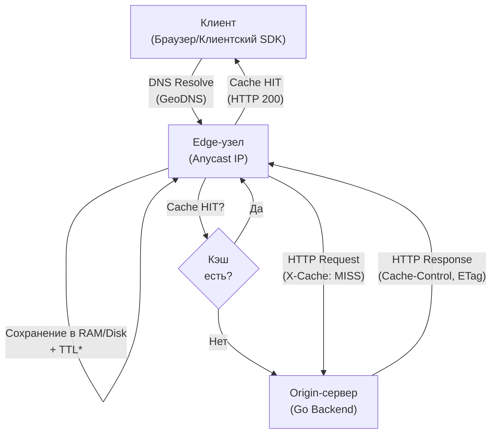

## Роль CDN и Edge в современной архитектуре

Для бэкенд-разработчика, особенно на уровне Senior/Lead, понимание работы CDN (Content Delivery Network) и Edge-вычислений перестаёт быть задачей DevOps и становится критичным компонентом системного дизайна. В современных распределённых системах до 80-90% трафика (статика, кэшируемый контент, API-ответы) не доходит до вашего origin-сервера. Это меняет парадигму: ваше Go-приложение не просто отвечает на запрос, оно генерирует **кэшируемый ответ** и управляет его жизненным циклом.

Edge-архитектура переносит вычислительную логику и кэширование ближе к пользователю, сокращая RTT (Round Trip Time). Для Go-разработчика это означает необходимость глубокого понимания HTTP-кэширования, заголовков валидации, стратегий инвалидации и того, как `net/http` взаимодействует с распределёнными прокси.

## Как работает CDN: от DNS до Edge-узла

CDN — это географически распределённая сеть серверов, которые кэшируют контент и перенаправляют запросы пользователя к ближайшему физически узлу (PoP — Point of Presence).

Профиль запроса в CDN выглядит так:
1. **GeoDNS & Anycast**: DNS-ответ пользователя содержит IP ближайшего PoP. Anycast-маршрутизация позволяет одному IP-адресу транслироваться с множества серверов, а BGP-протокол автоматически направляет трафик к наименее загруженному узлу.
2. **Edge Termination**: На PoP происходит завершение TCP/TLS-соединения. Это снимает нагрузку с origin-сервера и ускоряет установление соединения за счёт кэширования TLS-сессий (Session Resumption).
3. **Cache Lookup**: По ключу (URL + заголовки `Vary`) проверяется RAM/Disk кэш Edge-узла.
4. **Cache Miss**: Если ответа нет, Edge делает запрос к origin. В зависимости от настроек: `cache-control: immutable`, `stale-while-revalidate` или `write-through`.



## HTTP-кэширование: заголовки, валидация и инвалидация

Go не имеет встроенного механизма распределённого кэширования. Его задача — правильно формировать заголовки, чтобы CDN или клиент могли кэшировать ответ, или правильно обрабатывать запросы от кэша.

### Ключевые заголовки `Cache-Control`
| Директива | Значение для Go-бэкенда |
|-----------|------------------------|
| `public` | Разрешает кэширование прокси/CDN. По умолчанию `private` для ответов с авторизацией. |
| `private` | Только клиентский кэш. CDN проигнорирует. |
| `no-cache` | Требует валидации (If-None-Match / If-Modified-Since) перед использованием. |
| `no-store` | Запрещает кэширование. Используется для sensitive данных. |
| `s-maxage=N` | Переопределяет `max-age` только для CDN/Shared Cache. Критично для Go-микросервисов. |
| `stale-while-revalidate=N` | Отдаёт устаревший ответ сразу, а в фоне обновляет кэш. Улучшает P99 latency. |
| `stale-if-error=N` | Отдаёт stale-ответ при ошибке origin (5xx). Повышает availability. |

### Валидация и условные запросы
Когда CDN получает `Cache-Control: no-cache` или истёк `max-age`, он должен проверить актуальность у origin:
- **ETag / If-None-Match**: Токен (обычно `md5` или `xxhash` от тела/метаданных). Если совпадает → `304 Not Modified`.
- **Last-Modified / If-Modified-Since**: Таймстамп в UTC. Менее точный, но экономит CPU на вычислении хеша.

> [!warning] Ловушка / Gotcha
> **Cache-Key Collision**: Если ваш Go-хендлер возвращает разный контент в зависимости от `Accept-Encoding` или `Authorization`, но не указывает заголовок `Vary: Accept-Encoding, Authorization`, CDN склеит кэшированные ответы для разных пользователей. Это приводит к **Cache Poisoning** и утечке данных.
> Всегда используйте `Vary` только с полями, которые реально влияют на ответ. Лишние `Vary`-поля экспоненциально увеличивают количество записей в кэше CDN.

## Edge Computing и Go: где выполнять логику?

Понятие Edge Computing вышло за рамки простого кэширования. Провайдеры (Cloudflare Workers, AWS Lambda@Edge, Fastly Compute@Edge) позволяют исполнять код ближе к пользователю.

### Go vs JavaScript/AssemblyScript на Edge
- **JavaScript**: Стандарт де-факто для edge-функций из-за быстрого cold-start и экосистемы. Но ограничен по памяти (~128-256 MB) и CPU.
- **Go на Edge**: Стремительно набирает популярность благодаря:
  - Фиксированному, предсказуемому потреблению памяти (нет GC-пауз, нет escape-анализа на лету в узких средах).
  - Высокой плотности компиляции (WASM/WASI или нативные бинарники, упакованные в eBPF/FFI).
  - Возможности выносить тяжёлую логику (валидация, маппинг, криптография) с origin на edge.

В Go-архитектуре edge-функции часто используются для:
1. **Auth & Rate Limiting**: Проверка JWT, валидация токенов, WAF-правила.
2. **Request Routing**: A/B тестирование, геолокация, канареечные релизы.
3. **Response Transformation**: SSI (Server-Side Includes), минификация, перепаковка JSON.

## Под капотом: механика кэширования и Mechanical Sympathy

### CPU Cache и кэш-ключи
CDN использует хеш-таблицы для быстрого поиска записей. Ключом часто является `URL + Vary-поля`. 
- Вычисление `xxhash` или `murmur3` в Go оптимизировано под SIMD-инструкции.
- На Edge-узлах кэш-ключи хранятся в RAM. При большом количестве `Vary`-полей возникает **cache bloat**: одна и та же логическая страница хранится в 10+ вариациях, что снижает hit-rate и увеличивает давление на память.

### TCP/TLS на Edge
- **TCP Fast Open (TFO)**: Позволяет передавать данные в первом пакете SYN, экономя RTT.
- **TLS 1.3**: Handshake занимает 1 RTT (или 0 при session resumption). Edge-прокси кэшируют TLS-сессии (`session_ticket`), что критично для мобильных клиентов с нестабильным интернетом.
- **HTTP/2 & HTTP/3 Multiplexing**: Edge-узлы поддерживают мультиплексирование. Ваш Go-клиент должен использовать `http2.Transport` и `http3` для эффективного использования одного соединения к origin.

### Memory & GC на Origin при Cache Miss
Когда происходит cache miss, origin получает пиковую нагрузку. Если вы не настроили `stale-while-revalidate`, все запросы падают на Go-приложение.
- **Thundering Herd**: Одновременный пропуск кэша сотнями горутин. Go-планировщик (`runtime.scheduler`) эффективно распределяет их по `P`, но нагрузка на базу данных остаётся.
- **Решение**: Используйте `sync.Once` или `singleflight` для дедупликации запросов к БД внутри одного процесса Go, а на уровне CDN — `stale-while-revalidate`.

> [!tip] Собеседование
> **Вопрос:** Как Go-приложение должно реагировать на заголовок `Cache-Control: no-store` от CDN?
> **Ответ:** Никак. Это директива *от* кэша *к* origin. Если CDN отправляет `no-store`, значит, он требует от origin не кэшировать ответ. Go-бэкенд должен проверить `Cache-Control` в запросе (иногда CDN передаёт `Surrogate-Control` или специфичные заголовки) и либо вернуть `no-store`, либо проигнорировать заголовок, если это внутренняя политика безопасности. На практике Go-приложения обычно игнорируют входящие `Cache-Control` и управляют кэшированием только через исходящие заголовки.
> 
> **Вопрос:** В чём разница между `s-maxage` и `max-age` для Go-микросервиса?
> **Ответ:** `max-age` применяется и к клиенту, и к прокси. `s-maxage` переопределяет TTL только для shared-кэшей (CDN, reverse proxy). Это позволяет иметь короткое TTL для пользователя (чтобы видеть изменения сразу) и длинное TTL для CDN (чтобы снизить нагрузку на origin).

## Практика: Cache-aware Handler на Go

Ниже представлен production-ready паттерн обработчика, который корректно работает с CDN:
- Генерирует `ETag` на основе тела и версии ресурса.
- Обрабатывает `If-None-Match` (возврат `304`).
- Устанавливает `Cache-Control` и `Vary`.
- Использует `sync` для безопасной работы с контекстом.

```go
package main

import (
	"crypto/sha256"
	"encoding/hex"
	"fmt"
	"net/http"
	"time"
)

// cacheHandler оборачивает логику и управляет HTTP-кэшированием
func cacheHandler(next http.HandlerFunc, ttl time.Duration, cacheKey string) http.HandlerFunc {
	return func(w http.ResponseWriter, r *http.Request) {
		// 1. Получаем данные (в реальности - из БД/кэша)
		body, err := nextData(r.Context(), cacheKey)
		if err != nil {
			http.Error(w, "internal error", http.StatusInternalServerError)
			return
		}

		// 2. Вычисляем ETag (версия контента)
		hash := sha256.Sum256(body)
		etag := fmt.Sprintf(`"%s-%x"`, cacheKey, hash)

		// 3. Проверяем If-None-Match от CDN/Клиента
		// CDN всегда передаёт If-None-Match, если кэш устарел
		if inm := r.Header.Get("If-None-Match"); inm != "" && inm == etag {
			w.Header().Set("ETag", etag)
			w.WriteHeader(http.StatusNotModified)
			return
		}

		// 4. Устанавливаем кэширующие заголовки
		w.Header().Set("Content-Type", "application/json")
		w.Header().Set("ETag", etag)
		// s-maxage: TTL для CDN. max-age: TTL для браузера.
		w.Header().Set("Cache-Control", fmt.Sprintf("public, max-age=60, s-maxage=300, stale-while-revalidate=60"))
		// Критично! Иначе CDN склеит ответы для разных Accept-Encoding
		w.Header().Set("Vary", "Accept-Encoding")

		// 5. Записываем тело
		w.WriteHeader(http.StatusOK)
		w.Write(body)
	}
}

func nextData(ctx context.Context, key string) ([]byte, error) {
	// Имитация запроса к БД или upstream
	return []byte(`{"status":"ok","key":"` + key + `"}`), nil
}

func main() {
	mux := http.NewServeMux()
	mux.HandleFunc("/api/data", cacheHandler(cacheHandler, 5*time.Minute, "v1-data"))
	
	// В production используйте http.Server с правильными таймаутами
	// и context для graceful shutdown
	http.ListenAndServe(":8080", mux)
}
```

## Итоги

1. **CDN — это часть вашего бэкенда**. Вы не можете управлять производительностью, если не управляете кэшированием.
2. **HTTP-кэширование детерминировано**. Заголовки `Cache-Control`, `ETag`, `Vary` строго регламентируют RFC 7234. Нарушение приводит к утечкам данных или cache bloat.
3. **Edge Computing меняет архитектуру**. Логика перемещается на периферию. Go идеален для edge благодаря предсказуемому потреблению памяти и отсутствию GC-пауз.
4. **Mechanical Sympathy**: Понимание TTL, TCP/TLS на периметре, CPU-эффективности хеширования и thundering herd помогает проектировать системы, устойчивые к пиковым нагрузкам.
5. **Инструментарий**: Используйте `Surrogate-Control` для управления кэшем CDN из кода, `stale-while-revalidate` для снижения P99, и всегда валидируйте `Vary`-поля.

В следующей статье мы закрываем тему сетевого обеспечения и переходим к защите периметра: [[32. Firewall, iptables, nftables и базовая фильтрация трафика]].