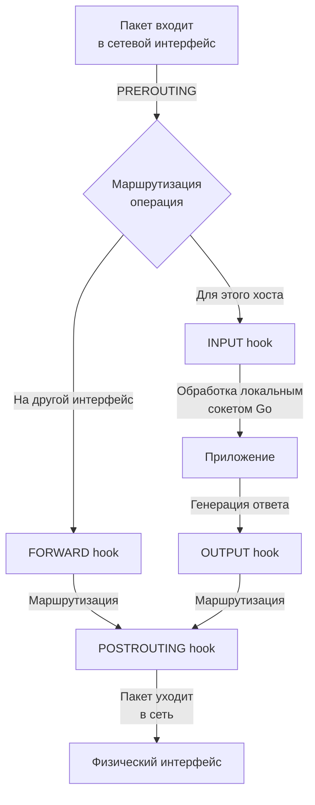

## Firewall, iptables, nftables и базовая фильтрация трафика

Для Go-бэкенд-разработчика фаервол перестает быть абстрактной «стеной» в инфраструктуре, когда вы начинаете отлаживать сетевые проблемы в продакшене, настраивать сетевые политики в Kubernetes или оптимизировать производительность сетевого стека. Понимание того, как ядро Linux обрабатывает пакеты, почему возникают `ECONNREFUSED` или `ETIMEDOUT`, и как работает отслеживание состояний (stateful inspection) — критически важно для системного дизайна и понимания границ ответственности между приложением и инфраструктурой.

## Netfilter: Скелет фильтрации в Linux

В основе сетевой безопасности Linux лежит фреймворк **Netfilter**. Это не один модуль, а архитектура хуков (hooks), встроенная в подсистему сетевого стека ядра. Она позволяет перехватывать, модифицировать и фильтровать пакеты на разных этапах их жизненного цикла, до того как они попадут в сокет приложения, или после выхода из него.

Пакет проходит через несколько точек вхождения (hooks) в зависимости от его назначения:
1. **PREROUTING**: Сразу после получения интерфейсом (для DNAT и маршрутизации).
2. **INPUT**: Если пакет предназначен для локального процесса.
3. **FORWARD**: Если пакет маршрутизируется на другой интерфейс (роутер/прокси).
4. **OUTPUT**: Для пакетов, генерируемых локальными процессами.
5. **POSTROUTING**: Перед отправкой на физический интерфейс (для SNAT/MASQUERADE).



> [!info] Под капотом
> В ядре Linux хуки реализованы через связные списки `struct nf_hook_ops`. Каждый хук — это массив указателей на функции-обработчики. Когда пакет достигает точки, ядро последовательно вызывает эти функции. Возвращаемое значение (`NF_ACCEPT`, `NF_DROP`, `NF_STOLEN`) определяет судьбу пакета. Это O(N) операция по количеству правил, что исторически стало узким местом в `iptables`.

## iptables: Архитектура и ограничения

`iptables` — это клиент для работы с Netfilter, использующий таблично-цепочечную модель. Исторически он опирался на модули ядра `xt_*` (eXtended Target), которые динамически загружались при необходимости.

**Структура iptables:**
*   **Tables (Таблицы):** `filter` (стандартная фильтрация), `nat` (трансляция адресов), `mangle` (модификация заголовков), `raw` (отключение conntrack).
*   **Chains (Цепочки):** Набор правил в одной из точек hook (`INPUT`, `FORWARD`, `OUTPUT`).
*   **Rules (Правила):** `match` (условие: IP, порт, протокол, состояние) + `target` (действие: `ACCEPT`, `DROP`, `REJECT`, `LOG`).

```bash
# Классический пример: разрешить только SSH и HTTP
iptables -A INPUT -p tcp --dport 22 -j ACCEPT
iptables -A INPUT -p tcp --dport 80 -j ACCEPT
iptables -A INPUT -j DROP
```

**Проблема производительности:**
`iptables` хранит правила в линейных списках (`xt_table`). При каждом новом пакете ядро перебирает правила последовательно. Если у вас 5000 правил, каждый пакет проходит до 5000 проверок в контексте ядра. Это вызывает:
1. **Cache thrashing**: Частое чтение памяти ядра сбивает L1/L2 кэш CPU.
2. **Lock contention**: В многопоточных нагрузках блокировки таблиц создают contention на SMP-системах.
3. **Context switch overhead**: Передача правил между user-space (`iptables`) и kernel-space (`netfilter`) происходит через netlink-сокеты, что дорого при частых изменениях.

## nftables: Современный стандарт

`nftables` пришел на смену `iptables`, решив архитектурные проблемы через единый интерфейс и оптимизированное ядром представление правил.

**Ключевые отличия:**
*   **Единый интерфейс**: Одна утилита для всех таблиц (`filter`, `nat`, `mangle`, `raw`).
*   **Maps и Sets**: Позволяют хранить списки IP/портов в хеш-таблицах ядра. Проверка `IP in set` работает за O(1) вместо O(N).
*   **Динамические наборы**: Возможность автоматически добавлять IP в黑名单 при обнаружении аномалий.
*   **Fast path**: Ядро компилирует правила в структуру, близкую к BPF, для быстрого исполнения без перебора линейных списков.

```bash
# nftables: Использование set для белого списка
nft add set ip filter whitelist { type ipv4_addr \; }
nft add element ip filter whitelist { 192.168.1.0/24, 10.0.0.0/8 }
nft add rule ip filter whitelist input ip saddr @whitelist accept
```

> [!warning] Ловушка / Gotcha
> При миграции с `iptables` на `nftables` помните: синтаксис и логика работы с `conntrack` (отслеживание состояний) отличаются. В `nftables` состояние соединения проверяется оператором `ct state`. Также, если вы используете Kubernetes CNI (Calico, Cilium), они могут генерировать правила напрямую через `nftables`, обходя `iptables` полностью. Слепое правление `iptables` в кластере может привести к потере правил или конфликтам с CNI.

## Connection Tracking (conntrack): Состояние и производительность

Stateful firewall (фаервол, отслеживающий состояние) работает на основе таблицы соединений `nf_conntrack`. Когда первый пакет входящего соединения проходит через PREROUTING, ядро создает запись в этой таблице. Последующие пакеты проверяются по статусу соединения (`NEW`, `ESTABLISHED`, `RELATED`).

**Как это влияет на Go-сервис:**
Go использует `netpoller` (epoll/kqueue) для асинхронной работы с сокетами. Когда вы делаете `net.Dial()` или принимаете соединение через `net.Listen()`, вы взаимодействуете с локальным сокетом. Но если соединение проходит через NAT, балансировщик или сетевую политику, `conntrack` решает, куда его направить и разрешить ли ответный трафик.

**Критическая проблема: `nf_conntrack: table full`**
Таблица `conntrack` имеет жесткий лимит (`net.netfilter.nf_conntrack_max`). При высокой нагрузке (например, миллионы коротких соединений от Go-сервиса к внешним API или БД) таблица переполняется. Новые соединения отбрасываются на этапе PREROUTING, еще не дойдя до вашего приложения. Вы получите `ECONNREFUSED` или `ETIMEDOUT`, хотя сам Go-сервис абсолютно жив, память свободна, а CPU не загружен.

> [!tip] Собеседование
> **Вопрос:** Как отладить проблему, когда Go-сервис не может подключиться к базе данных, но `telnet` или `nc` с того же хоста работают?
> **Ответ:** Скорее всего, это проблема stateful-фильтрации или NAT. Нужно проверить таблицу `conntrack` (`conntrack -L`), лимиты (`sysctl net.netfilter.nf_conntrack_max`), правила `iptables/nftables` на соответствие протоколу (TCP vs UDP), а также проверить, не блокирует ли фаервол исходящие соединения (OUTPUT hook) или не меняет ли source IP (SNAT), из-за чего ответы не возвращаются. В Kubernetes также стоит проверить NetworkPolicy.

## Взаимодействие Go-приложений с фаерволом

Go-разработчик редко пишет правила фаервола вручную, но должен понимать их влияние на архитектуру и отладку:

1. **Сетевые политики в K8s**: `NetworkPolicy` транслируется в `nftables`/`iptables` правила на нодах. Неверное правило может изолировать сервис или вызвать `Connection reset by peer`.
2. **Cloud VPC Security Groups**: Это stateful фаерволы на уровне облака. Они обрабатывают трафик до того, как он достигнет хоста. Важно помнить, что они stateful: если вы разрешили исходящий порт, входящий ответ разрешится автоматически.
3. **Отладка в продакшене**: Используйте `tcpdump` и `ss` для анализа. Если `tcpdump` на интерфейсе видит SYN-пакет, но `ss` его не ловит — пакет дропается фаерволом или балансировщиком.

```go
// Пример Go-кода, демонстрирующий важность таймаутов при сетевых проблемах
// Фаерволы часто дропают пакеты без ответа (DROP), что вызывает зависание
// dialer с контекстом критически важен для graceful degradation
ctx, cancel := context.WithTimeout(context.Background(), 5*time.Second)
defer cancel()

conn, err := net.DialContext(ctx, "tcp", "db.internal:5432")
if err != nil {
    // Если err == context.DeadlineExceeded, проверьте фаервол, маршрутизацию и conntrack
    log.Printf("Connection failed: %v", err)
    return err
}
defer conn.Close()
```

## Итог

1. **Netfilter** — архитектура хуков ядра, через которую проходит весь сетевой трафик до приложения.
2. **iptables** устарел из-за линейного перебора правил, фрагментированного API и накладных расходов на netlink.
3. **nftables** использует maps/sets и компиляцию правил в ядре для O(1) проверки и единого интерфейса.
4. **conntrack** — stateful-механизм, лимиты которого могут «убить» сервис при DDoS или утечке соединений.
5. Go-разработчик взаимодействует с фаерволом косвенно: через таймауты, работу с сокетами, сетевые политики и анализ трафика.

Мы разобрали базовую фильтрацию на уровне ядра. Но что делать, когда трафик становится частью атаки или требует тонкой настройки производительности? В следующей статье мы перейдем к [[33. DDoS, Rate Limiting и базовая защита сетевых сервисов]], где разберем методы защиты от перегрузок на уровне приложения и инфраструктуры.