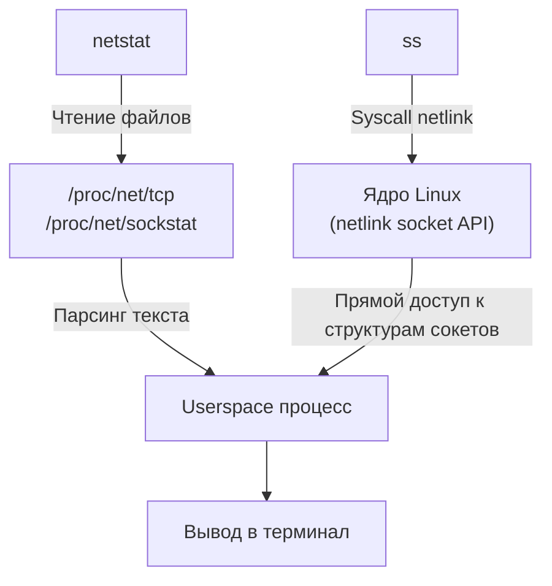

## Введение в сетевую наблюдаемость
В высоконагруженных Go-системах узким местом редко становится чистая вычислительная мощность. Чаще всего деградация вызвана сетевыми задержками, утечками файловых дескрипторов, неоптимальным использованием пулов соединений или блокировками на уровне ядра. Инспекция трафика и состояния сокетов позволяет отделить проблемы рантайма Go от проблем инфраструктуры и сетевого стека.

> [!info] Под капотом
> Go не использует традиционные `select`/`poll` для каждого сокета. Вместо этого рантайм использует [[38. Как Go работает с сетью. net, net_http, netpoller, epoll.md]] (на Linux — `epoll`). Это означает, что сетевые события мультиплексируются на ограниченном количестве системных потоков. Когда вы видите в `ss` множество соединений в состоянии `ESTABLISHED`, но сервис не отвечает, проблема может быть в голодании `netpoller`, исчерпании `epoll` лимитов или блокировке системного треда на `syscall`.

## tcpdump: Сырой трафик и BPF-фильтры
`tcpdump` — классический инструмент для захвата пакетов. В современных Linux он использует `AF_PACKET` сокеты и библиотеку `libpcap`.

Ключевая особенность — **BPF (Berkeley Packet Filter)**. Фильтры компилируются в байткод, который выполняется *внутри ядра* до передачи пакета в userspace. Это радикально снижает нагрузку на CPU и количество контекстных переключений, так как отбрасываются нецелевые пакеты на раннем этапе.

Для Go-разработчика критично понимать, как фильтровать трафик без деградации продакшена:
```bash
# Захват только TCP-пакетов для конкретного сервиса (порт 8080), без DNS-развертки
sudo tcpdump -i eth0 -n -s 0 'tcp port 8080' -w capture.pcap
```

> [!warning] Ловушка / Gotcha
> Флаг `-n` обязателен в продакшене. Без него `tcpdump` выполняет обратные DNS-запросы для каждого пакета, что генерирует дополнительный UDP-трафик и может вызвать истощение локальных портов на самом мониторинговом сервере.
> [!tip] Собеседование
> **Вопрос:** Как `tcpdump` влияет на производительность системы?
> **Ответ:** Базовый захват без фильтров вызывает прерывание на каждый пакет, что приводит к `softirq` обработке и контекстным переключениям. BPF-фильтры переносят часть логики в ядро, уменьшая объем данных, передаваемых в userspace. Для минимизации нагрузки используют кольцевые буферы (`--snapshot-len`) или переходят на `eBPF`-аналоги (`bpftrace`, `tcptrace`).

## Wireshark: Глубокий анализ протоколов
Wireshark — GUI-фронтенд для `libpcap`. Его сила — в встроенных диссекторах (разборщиках протоколов). Для Go-бэкенда он незаменим при отладке:
- **TLS/HTTPS**: Визуализация `TLS Handshake`, проверка сертификатов, анализ `ClientHello`/`ServerHello`.
- **HTTP/2 & gRPC**: Разбор фреймов, приоритетов потоков, `HEADERS`, `DATA`, `GOAWAY`. Позволяет увидеть `HEAD-of-Line` блокировки или асимметрию в `PushPromise`.
- **Результаты**: Экспорт в `tshark` для CI/CD или скриптов автоматизации.

> [!info] Под капотом
> Wireshark не «взламывает» сеть. Он создает `AF_PACKET` сокет, ставит его в promiscuous mode и читает пакеты из кольцевого буфера. Диссекторы работают по принципу рекурсивного парсинга: от Ethernet -> IP -> TCP -> Payload. В Go это аналогично тому, как `net/http` или `grpc-go` парсят байты в структуры.

## netstat vs ss: Архитектура и производительность
Оба инструмента показывают состояние сокетов, но их архитектура кардинально различается.

| Характеристика | `netstat` | `ss` |
|---|---|---|
| Источник данных | `/proc/net/tcp`, `/proc/net/sockstat` (procfs) | `netlink` сокеты (прямой запрос к ядру) |
| Производительность | Очереди, парсинг текстовых файлов | `getsockopt`/`netlink` запросы, мгновенно |
| Поддержка | Старые TCP-состояния | QUIC, BBR, send/recv очереди, PID процессов |

> [!warning] Ловушка / Gotcha
> `netstat` устарел и считается deprecated в современных дистрибутивах. Его использование на высоконагруженных нодах с миллионами сокетов вызывает `high iowait` из-за чтения `/proc`. Всегда используйте `ss`.
> [!tip] Собеседование
> **Вопрос:** Почему `ss` быстрее `netstat` и что показывает поле `recv-q`/`send-q` для TCP?
> **Ответ:** `ss` использует `netlink`, который позволяет ядру вернуть данные напрямую через syscall без чтения файлов. `recv-q` для `ESTABLISHED` — это объем данных, полученных от удаленной стороны, но еще не прочитанных приложением (аналог `SO_RCVBUF`). `send-q` — объем данных, отправленных в TCP-буфер, но не подтвержденных ACK. Если `send-q` постоянно растет, это индикатор того, что сетевой стек ядра или удаленный узел не успевает подтверждать ACK (возможно, проблема с MTU, перегрузка канала или бэклог сокетов).

## Go-специфика: Связь инструментов с netpoller и рантаймом
Когда вы отлаживаете Go-сервис через `ss` или `tcpdump`, важно помнить о модели `G-M-P`.

1. **Утечки соединений (`CLOSE_WAIT`)**: Если `ss -t state close-wait` показывает множество соединений от вашего PID, это почти всегда означает, что в Go коде не вызван `resp.Body.Close()` или `conn.Close()`. Удаленная сторона отправила `FIN`, ядро перевело сокет в `CLOSE_WAIT`, но прикладной поток не закрыл дескриптор.
2. **`TIME_WAIT` и истощение портов**: При высокой скорости создания/завершения соединений (например, в гравитационных тестах или при плохой настройке `http.Transport`) возникает [[39. TIME_WAIT, Port Exhaustion и другие проблемы TCP-сервисов.md]]. `ss -t state time-wait \| wc -l` покажет нагрузку. Go не управляет `tcp_tw_reuse` напрямую, но может минимизировать проблему через пул соединений (`MaxIdleConns`, `IdleConnTimeout`).
3. **Блокировки и `epoll`**: `ss -p` показывает PID процесса, владеющего сокетом. Если вы видите, что сокет принадлежит PID Go-рантайма, но трафик не идет (`tcpdump` показывает пустоту), проверьте, не заблокирован ли `netpoller` или не исчерпан ли `epoll` лимит (`fs.epoll.max_user_watches`).

> [!info] Под капотом
> Go's `netpoller` использует `epoll` для мониторинга сокетов. Когда сокет готов к чтению/записи, ядро будит системный тред, который пробуждает соответствующую горутину. Инструменты вроде `ss` показывают состояние на уровне ядра, но не напрямую на уровне горутин. Для отладки гонок или блокировок в `netpoll` используйте `GODEBUG=netpoll=1` или `pprof` с `goroutine` и `syscall` профилями.



## Практический чек-лист отладки для Go-бэкенда
- **Сервис не отвечает**: `ss -t state established \| grep <pid>` -> `tcpdump -i any port <port> -n` -> проверка `HEADERS`/`DATA` в Wireshark.
- **Высокая latency**: `ss -t -i` (показывает `ssthresh`, `cwnd`, `rtt`, `bbr` параметры) -> анализ `tcpdump` на предмет retransmission.
- **Утечка памяти/файловых дескрипторов**: `ss -p \| grep <pid> \| wc -l` vs `lsof -p <pid> \| grep sock`. Если `ss` показывает меньше сокетов, чем `lsof`, возможно, дескрипторы утекли в `syscall` или не закрыты в `defer`.
- **Проблемы с TLS/gRPC**: Захват трафика Wireshark -> фильтр `tls.handshake.type == 1` (Client Hello) -> проверка сертификатов и cipher suites.

> [!tip] Собеседование
> **Вопрос:** Как отладить ситуацию, когда `ss` показывает `ESTABLISHED`, но `tcpdump` не видит трафик?
> **Ответ:** Это классический признак того, что данные застряли в буфере ядра (`send-q` растет) или приложение не выполняет `write`/`flush`. Также возможно, что трафик блокируется `iptables`/`nftables` на уровне ядра (проверьте `tcpdump -i any` vs `-i eth0`), или приложение использует `connect()` без последующей `write()` (зависание в `TIME_WAIT` на клиенте, если соединение закрыто без `FIN` от приложения). В Go это часто связано с неправильной настройкой `http.Transport.DisableKeepAlives` или отсутствием `resp.Body.Close()`.

## Итог
Сетевая наблюдаемость в Go требует понимания границы между рантаймом и ядром. `tcpdump` и `libpcap` дают доступ к сырым пакетам с минимальными издержками благодаря BPF. `ss` вытеснил `netstat` благодаря `netlink` и производительности. Wireshark незаменим для протокольного уровня (TLS, HTTP/2, gRPC). Понимание того, как `netpoller` взаимодействует с `epoll`, и как состояния сокетов отражаются в Go-коде, позволяет быстро находить утечки, блокировки и узкие места в высоконагруженных системах.

В следующей статье мы разберем инструменты диагностики и устранения проблем: [[35. Диагностика сети. ping, traceroute, dig, curl, mtr.md]], чтобы научиться быстро находить разрывы в цепочке доставки пакетов.