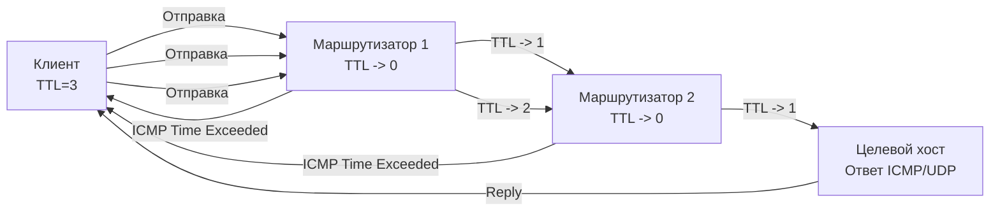

## Введение: Почему диагностика критична для Go-бэкенда

Для бэкенд-разработчика понимание работы сетей — это не просто умение выполнить `ping`. Это умение интерпретировать метрики, находить узкие места на стыке приложения и инфраструктуры и писать код, который корректно реагирует на сетевые аномалии. Инструменты диагностики (`ping`, `traceroute`, `dig`, `curl`, `mtr`) — это пользователи, которые манипулируют сырыми сокетами, настраивают опции IP-стека и отправляют пакеты через `syscalls`.

В Go эти операции часто скрыты за абстракциями `net.Dial` или `http.Client`, но когда производительность падает или соединения рвутся, понимание «под капотом» становится критичным. Мы разберем, как эти инструменты работают на уровне протоколов, какие системные вызовы они вызывают и как перенести их логику в production-ready Go-код.

## ping: ICMP и сырые сокеты

`ping` измеряет задержку (RTT) и потерю пакетов между узлами, используя протокол **ICMP** (Internet Control Message Protocol). В IPv4 это тип 8 (Echo Request) и тип 0 (Echo Reply).

### Под капотом
`ping` работает через **сырые сокеты (Raw Sockets)**. В отличие от `SOCK_STREAM` (TCP) или `SOCK_DGRAM` (UDP), сырой сокет позволяет программе самостоятельно формировать заголовки IP и ICMP.
```bash
# Пример создания сырого сокета в Linux
socket(AF_INET, SOCK_RAW, IPPROTO_ICMP)
```
Для этого процессу требуются права `CAP_NET_RAW` (root) или соответствующий capability. При отправке пакета ядро автоматически вычисляет IP-хедер, инкрементирует идентификатор пакета и выставляет время жизни (TTL). На стороне ответа ядро перехватывает ICMP-пакет, проверяет валидность и возвращает его в пользовательское пространство.

### Go-имплементация
Пакет `net` в стандартной библиотеке Go **не поддерживает** сырые сокеты напрямую (из соображений безопасности и переносимости). Для production-диагностики в Go используется `golang.org/x/net/icmp`:
```go
package main

import (
	"context"
	"fmt"
	"log"
	"net"
	"time"

	"golang.org/x/net/icmp"
	"golang.org/x/net/ipv4"
)

func pingHost(ctx context.Context, addr string) error {
	conn, err := icmp.ListenNetwork(ctx, "ip4:icmp", "0.0.0.0", nil)
	if err != nil {
		return fmt.Errorf("listen icmp: %w", err)
	}
	defer conn.Close()

	// Формируем Echo Request
	msg := &icmp.Message{
		Type: ipv4.ICMPTypeEcho,
		Code: 0,
		Body: &icmp.Echo{
			ID:   os.Getpid() & 0xffff,
			Seq:  1,
			Data: []byte("HELLO"),
		},
	}

	payload, err := msg.Marshal(nil)
	if err != nil {
		return fmt.Errorf("marshal icmp: %w", err)
	}

	// Отправляем
	dst, err := net.ResolveIPAddr("ip4", addr)
	if err != nil {
		return fmt.Errorf("resolve dst: %w", err)
	}

	if _, err := conn.WriteTo(payload, dst); err != nil {
		return fmt.Errorf("write icmp: %w", err)
	}

	// Ждем ответ с таймаутом
	deadline := time.Now().Add(2 * time.Second)
	conn.SetReadDeadline(deadline)
	_, peer, err := conn.ReadFrom(nil)
	if err != nil {
		return fmt.Errorf("read icmp: %w", err)
	}

	fmt.Printf("Reply from %s: RTT OK\n", peer.String())
	return nil
}
```

> [!warning] Ловушка / Gotcha
> Сырые сокеты блокируют системный тред (M) до завершения `syscalls` `sendto`/`recvfrom`. В Go это означает, что если асинхронный обработчик использует сырой сокет без `runtime.LockOSThread` или пула горутин, он может вызвать **scheduler blocking** и деградацию планировщика. Всегда используйте `golang.org/x/net/icmp` или `github.com/go-ping/ping`, которые управляют горутинным пулом.

## traceroute: TTL и маршрутизация

`traceroute` выявляет путь пакета через сеть, манипулируя полем **TTL (Time To Live)** в IP-заголовке.

### Механизм работы
1. Клиент отправляет UDP-пакет (или ICMP Echo) с `TTL=1`.
2. Первый маршрутизатор принимает пакет, уменьшает TTL до 0, отбрасывает его и отправляет обратно клиенту ICMP-сообщение `Time Exceeded`.
3. Клиент повторяет процесс с `TTL=2`, `TTL=3` и так далее, пока не достигнет целевого хоста.
4. Целевой хост отвечает ICMP `Port Unreachable` (для UDP) или `Echo Reply` (для ICMP).



### Go-имплементация
Для реализации `traceroute` в Go нужно использовать `setsockopt` для установки `IP_TTL` на обычном `SOCK_DGRAM` или сырой сокет. В чистом Go это делается через `golang.org/x/net/ipv4` с передачей `RawConn`:
```go
// Установка TTL на уровне IP-стека
conn.SetControlMessage(ipv4.FlagTTL, true)
// В golang.org/x/net/icmp есть встроенная поддержка TTL-инкремента
// или использование raw socket через syscall.SetsockoptInt(conn.Fd(), syscall.IPPROTO_IP, syscall.IP_TTL, ttl)
```

> [!tip] Собеседование
> **Вопрос:** Почему современные `traceroute` часто используют TCP вместо UDP?
> **Ответ:** Многие фаерволы и прокси блокируют UDP-трафик на случайных портах. TCP traceroute (`tcptraceroute`) отправляет SYN-пакеты с инкрементируемым TTL на порт 80/443. Это обходит блокировки, но не работает, если целевой узел отбрасывает SYN-пакеты без ответа (stateless drop).

## dig: DNS-резолвинг и стратегии Go

`dig` запрашивает DNS-записи напрямую, минуя системный кеш. В Go DNS-резолвинг управляется пакетом `net` и конфигурацией `net.Resolver`.

### Под капотом
1. Клиент отправляет UDP-запрос на порт 53. Если ответ > 512 байт, сервер ставит флаг `DO` (EDNS0) и ожидает TCP-перехода.
2. Резолвер проверяет `/etc/resolv.conf`, `nsswitch.conf` и системные кэши (`systemd-resolved`, `dnsmasq`).
3. Go по умолчанию использует стратегию `go` (Cgo resolver), которая делегирует резолвинг libc (`getaddrinfo`). Это обеспечивает поддержку `systemd-resolved` и `mDNS`, но добавляет зависимость от Cgo.

### Настройка в Go
Для production-систем часто требуется отключить Cgo-резолвер и использовать pure-Go DNS для предсказуемости и безопасности:
```go
package main

import (
	"context"
	"fmt"
	"net"
	"time"
)

func main() {
	// Используем pure-Go resolver, игнорируя resolv.conf
	resolver := net.Resolver{
		PreferGo: true,
		Dial: func(ctx context.Context, network, address string) (net.Conn, error) {
			d := net.Dialer{Timeout: 2 * time.Second}
			return d.DialContext(ctx, "udp", "8.8.8.8:53")
		},
	}

	ctx, cancel := context.WithTimeout(context.Background(), 3*time.Second)
	defer cancel()

	ips, err := resolver.LookupIP(ctx, "ip4", "example.com")
	if err != nil {
		fmt.Printf("DNS failed: %v\n", err)
		return
	}
	for _, ip := range ips {
		fmt.Println(ip)
	}
}
```

> [!warning] Ловушка / Gotcha
> Резолвинг в Go **блокирует** текущую горутину. Если `LookupIP` виснет из-за DNS-атаки или таймаута, он заблокирует обработчик запроса. Всегда оборачивайте `net.LookupIP` или `net.Resolver.LookupIP` в `context.WithTimeout`. В высоконагруженных сервисах выносите резолвинг в фоновый воркер и кэшируйте результаты.

## curl: HTTP-транспорт и пулинг соединений

`curl` — это инструмент для отладки HTTP/HTTPS. В Go эквивалентом является `http.Client` с конфигурацией `http.Transport`.

### Под капотом
`curl` управляет пулом соединений через `keep-alive`, устанавливает таймауты на `connect`, `tls handshake` и `read/write`. При превышении лимитов соединения закрываются, а новые открываются.

### Production-ready HTTP Client в Go
```go
package main

import (
	"context"
	"fmt"
	"net"
	"net/http"
	"time"
)

func NewTransport() *http.Transport {
	return &http.Transport{
		MaxIdleConns:        100,
		MaxIdleConnsPerHost: 10,
		IdleConnTimeout:     90 * time.Second,
		
		// Таймауты критичны для предотвращения slowloris и утечки горутин
		TLSHandshakeTimeout:   10 * time.Second,
		ResponseHeaderTimeout: 20 * time.Second,
		ExpectContinueTimeout: 1 * time.Second,
		
		// DialContext для контроля сетевого стека
		DialContext: (&net.Dialer{
			Timeout:   5 * time.Second,
			KeepAlive: 30 * time.Second,
			DualStack: true,
		}).DialContext,
		
		// Force attempt HTTP/2
		ForceAttemptHTTP2: true,
	}
}

func main() {
	client := &http.Client{
		Transport: NewTransport(),
		Timeout:   30 * time.Second,
	}

	ctx, cancel := context.WithTimeout(context.Background(), 25*time.Second)
	defer cancel()

	req, err := http.NewRequestWithContext(ctx, http.MethodGet, "https://api.example.com/health", nil)
	if err != nil {
		panic(err)
	}

	resp, err := client.Do(req)
	if err != nil {
		fmt.Printf("Request failed: %v\n", err)
		return
	}
	defer resp.Body.Close()
	fmt.Printf("Status: %s\n", resp.Status)
}
```

> [!info] Под капотом
> `http.Transport` использует внутреннюю очередь соединений. При высокой нагрузке `MaxIdleConnsPerHost` ограничивает количество живых сокетов. Если лимит исчерпан, новые запросы блокируются до появления свободного сокета или таймаута. Неправильная настройка приводит к **connection exhaustion** и `context deadline exceeded` в логике приложения.

## mtr: непрерывный мониторинг в продакшене

`mtr` (My Traceroute) объединяет `ping` и `traceroute`, непрерывно отправляя пакеты с инкрементируемым TTL и собирая статистику (min/avg/max/loss) для каждого узла в реальном времени.

### Применение в Go
Для мониторинга сети в продакшене не стоит запускать внешние процессы. Вместо этого реализуем легкий probe:
```go
package main

import (
	"context"
	"fmt"
	"log"
	"sync"
	"time"

	"golang.org/x/net/icmp"
	"golang.org/x/net/ipv4"
)

func runContinuousProbe(ctx context.Context, dest string, interval time.Duration) {
	ticker := time.NewTicker(interval)
	defer ticker.Stop()

	var wg sync.WaitGroup
	for range ticker.C {
		wg.Add(1)
		go func() {
			defer wg.Done()
			if err := pingOnce(ctx, dest); err != nil {
				log.Printf("probe failed: %v", err)
			}
		}()
	}
	wg.Wait()
}

func pingOnce(ctx context.Context, addr string) error {
	conn, err := icmp.ListenNetwork(ctx, "ip4:icmp", "", nil)
	if err != nil {
		return err
	}
	defer conn.Close()

	dst, _ := net.ResolveIPAddr("ip4", addr)
	msg := &icmp.Message{Type: ipv4.ICMPTypeEcho, Code: 0, Body: &icmp.Echo{ID: 0, Seq: 1}}
	payload, _ := msg.Marshal(nil)

	start := time.Now()
	if _, err := conn.WriteTo(payload, dst); err != nil {
		return err
	}
	conn.SetReadDeadline(time.Now().Add(2 * time.Second))
	_, _, err = conn.ReadFrom(nil)
	if err != nil {
		return fmt.Errorf("timeout after %v", time.Since(start))
	}
	fmt.Printf("RTT: %v for %s\n", time.Since(start), addr)
	return nil
}
```

> [!tip] Собеседование
> **Вопрос:** Чем `mtr` лучше `traceroute` для диагностики микроперебоев?
> **Ответ:** `traceroute` делает одноразовую трассировку, которая может быть искажена динамическим изменением маршрутов. `mtr` собирает статистику за время, показывая паттерны потерь на конкретных hop-ах. Если потери появляются на hop-2, но исчезают на hop-3 — проблема на сетевом оборудовании провайдера, а не на сервере.

## Под капотом: Syscalls, сырые сокеты и планировщик Go

Инструменты диагностики наглядно демонстрируют взаимодействие пользователейкого пространства с ядром Linux:

1. **Сырые сокеты vs Dgram**: `ping` и `traceroute` (UDP mode) требуют манипуляции с IP-хедером. В Linux это делается через `setsockopt(SOL_IP, IP_TTL, val)` или `IP_HDRINCL`. Go не поддерживает `IP_HDRINCL` в стандартной `net` из-за ограничений безопасности, поэтому используются обертки `golang.org/x/net/icmp`.
2. **Планировщик и блокировки**: Сырые сокеты используют синхронные `syscalls`. Если горутина вызывает `conn.ReadFrom()` и пакет не приходит, тред (M) блокируется в ядре. Планировщик Go (G-M-P) видит это и переносит работу на другой тред, но сам тред остается занятым. Это может привести к исчерпанию пула OS-тредов (`GOMAXPROCS` не ограничивает треды ОС, только потоки).
3. **eBPF и современный стек**: В современных ядрах (4.9+) сырые сокеты для мониторинга заменяются на `eBPF` (см. статью [[36. eBPF и XDP для анализа и ускорения сетевого трафика]]). eBPF позволяет перехватывать пакеты в ядре без блокировки пользовательских тредов и без `CAP_NET_RAW`.

> [!tip] Собеседование
> **Вопрос:** Почему в Go нельзя просто `import "syscall"` и создать сырой сокет для production-кода?
> **Ответ:** Во-первых, это требует `CAP_NET_RAW` (root), что нарушает принцип минимальных привилегий. Во-вторых, синхронные syscalls на сырых сокетах блокируют M-thread, что может вызвать scheduler pressure. В-третьих, Go's `netpoller` (epoll/kqueue) не управляет сырыми сокетами так же эффективно, как `SOCK_STREAM`/`SOCK_DGRAM`, что ведет к непредсказуемой производительности под нагрузкой.

## Итог

1. **ping** использует ICMP и сырые сокеты (`SOCK_RAW`). В Go требует `golang.org/x/net/icmp` и понимания рисков блокировки M-thread.
2. **traceroute** манипулирует полем `IP_TTL` через `setsockopt`. Для обхода фаерволов используется TCP SYN.
3. **dig** демонстрирует важность `net.Resolver` и отключения Cgo-резолвера в изолированных средах. Всегда используйте `context.WithTimeout`.
4. **curl** отражает архитектуру `http.Transport`. Таймауты (`TLSHandshakeTimeout`, `ResponseHeaderTimeout`) и пулинг соединений — обязательный минимум для production.
5. **mtr** показывает паттерны потерь в реальном времени. В Go реализуется через тикер + асинхронные probe-горутины.
6. **Системный уровень**: Сырые сокеты обходят `netpoller`, блокируют треды и требуют root. Современная альтернатива — `eBPF`.

Мы завершили обзор классических инструментов диагностики. В следующей статье мы перейдем к современному методу перехвата и анализа трафика без блокировки тредов: [[36. eBPF и XDP для анализа и ускорения сетевого трафика]].