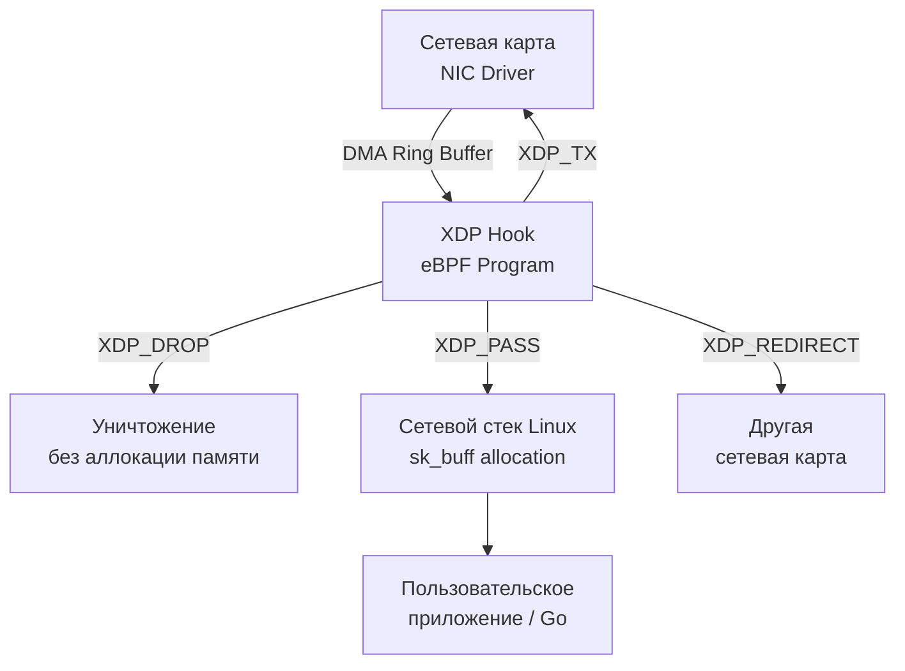

## eBPF и XDP: Ядро как платформа для программирования

Традиционно модификация сетевого поведения в Linux требовала либо перезагрузки модулей ядра, либо использования правил `iptables`/`nftables`, которые обрабатывают пакеты на границе между пользовательским и пространством ядра. Это неизбежно влечёт накладные расходы на копирование данных, контекстные переключения и проверку правил.

**eBPF (Extended Berkeley Packet Filter)** и **XDP (eXpress Data Path)** кардинально меняют эту парадигму. Они позволяют загружать безопасный, скомпилированный в машинный код пользовательский код непосредственно в ядро Linux, где он исполняется на критических хуках сетевого стека. Для Go-разработчика это означает возможность писать высокопроизводительные сетевые фильтры, балансировщики и системы мониторинга без единой строчки на C/C++ и без перезагрузки сервиса.

## Архитектура eBPF: Как это работает под капотом

eBPF — это не просто утилита фильтрации. Это **виртуальная машина (VM)**, встроенная в ядро Linux.

1. **Bytecode и JIT-компиляция:** Вы пишете eBPF-программу на C (с использованием специфичных макросов и типов ядра). Компилятор `clang` превращает её в eBPF-байткод. При загрузке ядро проверяет код через **Verifier** (см. ниже), а затем **JIT-компилятор** (для x86_64, ARM64, RISC-V) преобразует байткод в нативный машинный код. После этого программа исполняется со скоростью, близкой к C.
2. **Verifier (Верификатор):** Главный гарант безопасности. Ядро статически анализирует программу до загрузки:
   - Запрещены бесконечные циклы (лимитит количество инструкций в цикле).
   - Запрещён произвольный доступ к памяти (только через разрешённые структуры ядра).
   - Проверяется корректность операций с регистрами и указателями.
   Если код не проходит верификацию, он не загружается. Это позволяет запускать непроверенный код в Ring 0 без риска падения ядра (Kernel Panic).
3. **eBPF Maps (Карты):** Механизм обмена данными между пользователями и ядром. Это хеш-таблицы, массивы, per-CPU карты и очереди, выделенные в памяти ядра. Go-программа читает/пишет в них через syscall `sys_bpf`, минуя сетевой стек.
4. **BTF (BPF Type Format):** Формат отладочной информации, сгенерированный компилятором. Позволяет eBPF-коду безопасно обращаться к структурам ядра (например, `struct sk_buff` или `struct net_device`), не полагаясь на хардкод смещений полей. Это основа подхода **CO-RE (Compile Once, Run Everywhere)**.

> [!info] Под капотом
> До появления BTF (ядро 5.3+) eBPF-программы писались «вслепую»: разработчики вручную вычисляли смещения полей структур ядра, которые менялись между версиями. BTF позволил компилятору генерировать переносимый код, который адаптируется к структуре ядра на целевом хосте во время загрузки.

## XDP: Ускорение на гранике железа

**XDP** — это фреймворк, позволяющий запускать eBPF-программы на самом раннем этапе обработки пакетов: **сразу после того, как драйвер сетевой карты (NIC) поместил пакет в DMA-буфер, но ДО того, как ядро создаст `struct sk_buff`**.

### Почему это важно?
В традиционном стеке Linux каждый входящий пакет:
1. Копируется из NIC DMA-буфера в память ядра.
2. Выделяется `sk_buff` (структура описания пакета, ~300-600 байт + аллокации).
3. Проходит через сетевой стек, `nf_tables`/`iptables`, маршрутизацию, сокетные буферы.

XDP позволяет решить судьбу пакета **до аллокации `sk_buff`**:
- `XDP_PASS` — передать в обычный стек.
- `XDP_DROP` — уничтожить пакет мгновенно (идеально для DDoS-фильтрации).
- `XDP_TX` — отправить обратно в сеть (для балансировки или NAT).
- `XDP_REDIRECT` — перенаправить пакет на другую сетевую карту или в другую ноду через `AF_XDP` (zero-copy).



## Go-интеграция: `cilium/ebpf` и работа с ядром

Для работы с eBPF в Go используется библиотека `github.com/cilium/ebpf`. Она инкапсулирует syscall `sys_bpf`, загрузку программ, мап и привязку к хукам. Современная версия не требует CGO, так как использует `golang.org/x/sys/unix`.

```go
package main

import (
	"log"
	"os"
	"time"

	"github.com/cilium/ebpf"
	"github.com/cilium/ebpf/link"
	"github.com/cilium/ebpf/ringbuf"
)

//go:generate go build -ldflags '-s -w' -o xdp_prog.xdp xdp.c
// xdp.c должен содержать @license SPDX-License-Identifier: GPL-2.0

func main() {
	// 1. Загрузка скомпилированного eBPF-объекта
	spec, err := ebpf.LoadCollectionSpec("xdp_prog.o")
	if err != nil {
		log.Fatalf("ошибка загрузки спецификации: %v", err)
	}

	// 2. Конфигурация и загрузка в ядро
	coll, err := ebpf.NewCollection(spec)
	if err != nil {
		log.Fatalf("ошибка загрузки в ядро: %v", err)
	}
	defer coll.Close()

	// 3. Привязка к сетевому интерфейсу (XDP driver mode)
	link, err := link.AttachXDP(&link.XDPOpts{
		Program:   coll.Programs["xdp_filter"],
		Interface: 2, // Пример: eth1
	})
	if err != nil {
		log.Fatalf("ошибка привязки XDP: %v", err)
	}
	defer link.Close()

	// 4. Чтение карты (map) из пользовательского пространства
	var count uint64
	maps := coll.Maps["packets_dropped"]
	if err := maps.Lookup([]byte("drop_count"), &count); err != nil {
		log.Printf("ошибка чтения карты: %v", err)
	}
	log.Printf("отфильтровано пакетов: %d", count)

	// 5. Работа с ring buffer для асинхронных событий от ядра
	reader, err := ringbuf.NewReader(coll.Maps["events"])
	if err != nil {
		log.Fatalf("ошибка ringbuf: %v", err)
	}
	defer reader.Close()

	go func() {
		for {
			rec, err := reader.Read()
			if err != nil {
				if err == ringbuf.ErrClosed {
					return
				}
				log.Printf("ошибка чтения событий: %v", err)
				continue
			}
			// Парсинг структуры события из rec.RawSample
			log.Printf("событие от ядра: %d байт", len(rec.RawSample))
		}
	}()

	select {
	case <-time.After(30 * time.Second):
		log.Println("завершение работы")
	}
}
```

> [!tip] Собеседование
> **Вопрос:** Почему `cilium/ebpf` не требует CGO?
> **Ответ:** Раньше eBPF-программы писались на C и компилировались в `.o`-файлы, которые линковались через CGO. Современная библиотека использует syscall `sys_bpf` напрямую из Go, загружая уже скомпилированный eBPF-байткод (`elf.Program` -> `sys_bpf(BPF_PROG_LOAD, ...)`). Это устраняет зависимость от компилятора C на этапе выполнения и упрощает кросс-компиляцию.

## Mechanical Sympathy и производительность

### Почему XDP быстрее `iptables`?
1. **Отсутствие копирования:** XDP работает с сырыми DMA-буферами NIC. Нет аллокации `sk_buff`, нет копирования заголовков.
2. **Минимизация контекстных переключений:** Код исполняется в контексте драйвера NIC (или в softirq), минуя `netfilter` hook-систему и маршрутизацию.
3. **JIT-компиляция:** Никакой интерпретации байткода. Код выполняется как нативный C.
4. **NIC Offload:** Современные сетевые карты (Mellanox, Intel, Marvell) поддерживают **XDP eXpress Data Path with Hardware Offload**. eBPF-программа компилируется в микрокод карты, и фильтрация происходит внутри ASIC. Ядро Linux вообще не участвует в обработке пакета.

### Ограничения eBPF
- **Лимиты верификатора:** Циклы ограничены ~1M инструкций. Рекурсия запрещена. Сложная логика должна выноситься в userspace.
- **Память ядра:** eBPF-программы исполняются в контексте ядра. Утечка памяти или неосвобождённые ресурсы приводят к утечке памяти ядра (kernel memory leak), которую сложно отследить.
- **Блокировка ядра:** Если eBPF-программа зависает или зацикливается, она может заблокировать CPU на уровне ядра, что приведёт к `soft lockup` и зависанию системы.

> [!warning] Ловушка / Gotcha
> **Недооценка BTF:** Если целевая машина не скомпилирована с `CONFIG_DEBUG_INFO_BTF=y` (или не установлен пакет `linux-tools-generic`/`vmlinux.h`), загрузка CO-RE eBPF-программ может завершиться ошибкой `EINVAL`. Всегда проверяйте наличие BTF: `ls /sys/kernel/btf/vmlinux`.
> 
> **XDP и MTU:** При использовании `XDP_TX` или `XDP_REDIRECT` убедитесь, что размер пакета не превышает MTU интерфейса, иначе пакет будет обрезан или отброшен драйвером.

## Архитектурные компромиссы и вопросы на собеседованиях

### eBPF vs Традиционные подходы
| Аспект | `iptables`/`nftables` | XDP + eBPF | DPDK |
|--------|----------------------|------------|------|
| **Точка входа** | `NF_INET_PRE_ROUTING` (после `sk_buff`) | NIC DMA Ring (до `sk_buff`) | Пользовательское пространство |
| **Производительность** | ~1-5 Mpps | ~10-40 Mpps | ~50-100+ Mpps |
| **Сложность разработки** | Низкая (CLI) | Средняя (C/Go + ядро) | Высокая (user-space stack) |
| **Безопасность ядра** | Зависит от правил | Verifier + изоляция | Не затрагивает ядро |
| **Кросс-компилация** | Нет проблем | Требует BTF/CO-RE | Да, но требует специфичных драйверов |

### Типичные вопросы на Middle+/Senior
1. **Как eBPF обеспечивает безопасность при исполнении в Ring 0?**
   Верификатор статически анализирует поток управления и доступ к памяти. Запрещены произвольные указатели, бесконечные циклы и вызовы недоверенных функций ядра. Программа должна быть детерминированной и безопасной по памяти.
2. **Что такое BTF и почему он критичен для современного eBPF?**
   BTF хранит отладочную информацию о типах ядра в ELF-файле. Позволяет eBPF-коду обращаться к полям структур ядра (например, `sk_buff->len`) без хардкода смещений. Реализует CO-RE.
3. **В чем разница между XDP, TC (Traffic Control) и kprobe?**
   - **XDP:** Самый ранний хук. Работает с сырыми пакетами до стека.
   - **TC (clsact/qdisc):** Позднее. После маршрутизации, но до передачи сокету. Удобно для QoS, мониторинга.
   - **kprobe/tracepoint:** Хуки на функции/события ядра. Для отладки и профилирования, а не фильтрации пакетов.
4. **Как Go-приложение безопасно обновляет eBPF-программу на лету?**
   Через `link.AttachXDP` с флагом `Replace: true` или через `ebpf.CollectionSpec` с последующей заменой программы. Важно правильно освобождать старые ссылки, чтобы избежать `EBUSY` и утечки ресурсов ядра.

## Итог

eBPF и XDP превратили ядро Linux из чёрного ядра в программируемую платформу. Для Go-разработчика это открывает путь к созданию высокопроизводительных сетевых инструментов без потери безопасности и без зависимости от C-экосистемы. Понимание того, как данные обходят `sk_buff`, как работает JIT и как карты синхронизируются с userspace, критично для проектирования систем, работающих на пределе пропускной способности.

Мы разобрали, как программно ускорить и контролировать трафик на уровне ядра. Но чтобы по-настоящему понять, почему XDP работает быстрее и как устроен сам путь пакета внутри Linux, нам нужно спуститься ещё ниже. В следующей статье мы изучим [[37. Сетевой стек Linux под капотом]], где рассмотрим `sk_buff`, `net_device`, `sk_buff` allocation и взаимодействие драйверов с ядром.