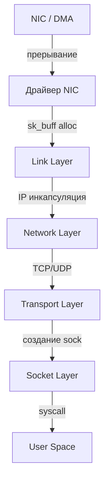

## Введение

Понимание того, как Linux обрабатывает сетевой трафик, критически важно для Go-разработчика, который хочет выйти за пределы `net/http` и начать проектировать высоконагруженные сервисы, прокси или кастомные протоколы. В Go сетевая абстракция (`net.Conn`, `netpoll`) тесно связана с ядром Linux. Когда вы вызываете `conn.Read()` или `conn.Write()`, вы не просто работаете с памятью — вы инициируете цепочку системных вызовов, аллокаций в ядре, DMA-операций и переключений контекста.

Знание внутреннего устройства сетевого стека позволяет объяснять и оптимизировать:
*   Почему `epoll` быстрее `select`/`poll`.
*   Как избежать `sk_buff` утечек и `TCP`-коннекшн-эксплоушена.
*   Где возникают накладные расходы при передаче больших объемов данных.
*   Как правильно тюнить параметры ядра для Go-сервисов.

## Архитектура сетевого стека Linux

Сетевой стек Linux спроектирован как модульная конвейерная система. Пакет проходит через несколько слоев, каждый из которых выполняет свою роль:



1. **Device Driver (`net_device`)**: Управляет физическим или виртуальным интерфейсом (`eth0`, `veth`, `lo`). При поступлении пакета драйвер аллоцирует `sk_buff` и передает его в стек.
2. **Link Layer**: Разбирает MAC-адреса, проверяет `CRC`, фильтрует пакеты по `MAC` или `VLAN`.
3. **Network Layer (IP)**: Маршрутизация, `iptables`/`nftables` (Netfilter), фрагментация/дефрагментация, проверка `TTL`, проверка контрольной суммы.
4. **Transport Layer (TCP/UDP)**: Демultiplexing по портам, `TCP` state machine, `flow control`, `congestion control`, reorder detection, `checksum`.
5. **Socket Layer**: Создает/находит `struct sock`, связывает его с процессом, вызывает `copy_to_user` или `splice` для передачи данных в `User Space`.
6. **User Space**: Приложение читает данные через `read()`/`recv()` или `epoll`.

> [!info] Под капотом
> Каждый пакет в ядре Linux инкапсулируется в структуру `sk_buff` (socket buffer). Это сердце сетевого стека. Она хранит указатели на заголовки (`mac_header`, `nh`, `th`), данные, метаданные (`cb[]`), ссылку на сокет (`sk`) и устройство (`dev`). Аллокация `sk_buff` происходит в slab-кэш памяти (обычно `kmalloc-256` или `kmalloc-512`), что делает её быстрой, но чувствительной к фрагментации кэша CPU.

## Ключевые структуры данных ядра

### `struct sk_buff`
Содержит:
*   `head`, `data`, `tail`, `end` — указатели на область памяти пакета.
*   `len`, `truesize` — длина данных и реальный размер в памяти (важно для `tcp_mem` limits).
*   `sk` — ссылка на `struct sock`.
*   `destructor` — callback для очистки при завершении.
*   `cb[]` — контекст передачи между слоями (например, для `TCP` это очередь retransmit, для `UDP` — очередь `sk_receive_queue`).

### `struct sock`
Абстракция соединения. Содержит:
*   `sk_prot` — указатель на таблицу протоколов (`tcp_prot`, `udp_prot`). Определяет методы `connect`, `sendmsg`, `recvmsg`, `close`.
*   `sk_state` — состояние (`TCP_ESTABLISHED`, `TCP_TIME_WAIT`, `TCP_LISTEN` и т.д.).
*   `sk_backlog` — очередь для пакетов, пришедших во время `accept()` или пока сокет занят.
*   `sk_sleep` — wait queue для блокировки процесса при чтении/записи.
*   `sk_receive_queue` / `sk_write_queue` — очереди пакетов.

> [!warning] Ловушка / Gotcha
> В Go `net.Conn` не является прямым эквивалентом `struct sock`. Go использует `netpoll` (epoll/kqueue) для асинхронного чтения. Когда `epoll` сигнализирует о готовности, Go вызывает `recvmsg()` или `read()`. Если данные еще не пришли в `sk_receive_queue`, процесс блокируется в ядре до появления пакетов или таймаута.

## Системные вызовы и жизненный цикл сокета

Когда Go-сервис запускается, происходит следующее:
1. `socket(AF_INET, SOCK_STREAM, 0)` → Ядро создает `struct socket` и `struct sock`, инициализирует `sk_prot` (например, `tcp_prot`).
2. `bind()` → Привязывает сокет к адресу/порту. Проверяет `SO_REUSEADDR`/`SO_REUSEPORT`.
3. `listen()` → Переводит сокет в состояние `TCP_LISTEN`. Создает очередь `backlog` (ограничена `somaxconn` и `tcp_max_syn_backlog`).
4. `accept()` → Блокируется в `epoll_wait` или `accept4()`. При поступлении `SYN` → `SYN-ACK` → `ACK`, ядро создает новый `struct sock`, добавляет его в `accept queue`.
5. `epoll_ctl(EPOLL_CTL_ADD, fd, EPOLLIN|EPOLLET, &ev)` → Регистрирует сокет в RB-tree ядра. При готовности вызывает callback `ep_poll_callback()`.

> [!tip] Собеседование
> **Вопрос:** Что произойдет, если `backlog` переполнится при высокой нагрузке?
> **Ответ:** Ядро отбрасывает новые `SYN`-пакеты или начинает использовать `syncookies` (если включены). В Go это может привести к `dial timeout` или `connection refused`. Для решения увеличивают `net.core.somaxconn` и `net.ipv4.tcp_max_syn_backlog`, а также используют `SO_REUSEPORT` для распределения нагрузки между горутинами/процессами.

## I/O мультиплексирование: epoll под капотом

Go использует `epoll` (Linux) или `kqueue` (BSD/macOS) через `runtime.netpoll`. В отличие от `select`/`poll`, которые сканируют массивы файловых дескрипторов за `O(N)`, `epoll` работает за `O(1)` благодаря:
1. **Red-Black Tree**: Хранит активные дескрипторы. Добавление/удаление за `O(log N)`.
2. **Wait Queue**: Процессы добавляются в `wait_head` сокетного объекта. При готовности пакета ядро вызывает `ep_poll_callback()`, который пробуждает процессы через `wake_up()`.
3. **Edge-Triggered vs Level-Triggered**: 
   * `EPOLLET` (Edge): Сигнал приходит только при *изменении* состояния. Go использует его для максимальной производительности, но требует полной обработки данных за один вызов `epoll_wait()`.
   * `EPOLLIN` (Level): Сигнал приходит, пока состояние активно. Безопаснее, но чаще вызывает контекстные переключения.

> [!warning] Ловушка / Gotcha
> При использовании `EPOLLET` в Go, если вы прочитали часть данных и вернулись в `epoll_wait`, событие не сгенерируется снова, пока не придет новый пакет. Go решает это внутренним состоянием `netpoller`, но при кастомных `syscalls` или `io_uring` это частая причина "зависания" соединений.

## Zero-Copy и обход копирования памяти

Передача данных между диском/сетью и `User Space` традиционно требует копирования через ядро. Linux предоставляет механизмы `Zero-Copy`:

1. **`sendfile()`**: Копирует данные из `page cache` (файл) напрямую в `sk_buff` драйвера NIC. Избегает копирования в `User Space` буфер.
2. **`splice()`**: Связывает два файловых дескриптора (например, сокет и файл) через `pipe` в ядре. Данные перемещаются через `sk_buff` без копирования в `User Space`.
3. **`io_uring`**: Современный асинхронный I/O, позволяющий регистрировать запросы заранее. Ядро выполняет `DMA` и напрямую вызывает callback, минуя традиционные `epoll` и `syscalls`.

> [!info] Под капотом
> `Zero-Copy` не означает отсутствие копирования. Он означает отсутствие копирования *между ядром и User Space*. Данные все равно копируются через `DMA` из NIC в `page cache`, а затем в `sk_buff`. Однако это устраняет накладные расходы на контекстные переключения и аллокации пользовательских буферов.

## Интеграция с Go: netpoll и производительность

Go не использует `syscalls` для каждого чтения/записи. `netpoll` работает в dedicated OS threads:
1. `netpollinit()` вызывает `epoll_create1()`.
2. При `conn.Read()` Go проверяет `netpoll` queue. Если данных нет, добавляет сокет в `epoll` и блокируется в `epoll_wait()`.
3. При готовности ядро пробуждает thread, Go извлекает данные через `recvmsg()` и раскрывает горутину.

### Критические параметры тюнинга
```bash
# Увеличить очередь listen
sysctl -w net.core.somaxconn=65535
# Увеличить лимит TCP соединений
sysctl -w net.ipv4.tcp_max_syn_backlog=65535
# Включить SO_REUSEPORT для балансировки по ядрам
sysctl -w net.ipv4.ip_local_port_range="1024 65535"
# Уменьшить TIME_WAIT
sysctl -w net.ipv4.tcp_tw_reuse=1
```

В Go это соответствует:
```go
conn.SetNoDelay(true)   // Отключает алгоритм Нагла (Nagle), критично для low-latency
conn.SetReadBuffer(1 << 20) // 1MB буфер чтения
conn.SetWriteBuffer(1 << 20) // 1MB буфер записи
// SO_REUSEPORT настраивается через net.ListenConfig
```

> [!tip] Собеседование
> **Вопрос:** Почему `TCP_NODELAY` часто включают в Go-микросервисах?
> **Ответ:** Алгоритм Нагла (Nagle) объединяет мелкие пакеты для экономии bandwidth. В высоконагруженном бэкенде это добавляет задержку (до 40-200ms). `TCP_NODELAY` отключает буферизацию, отправляя пакеты сразу. Для RPC и HTTP/2 это стандартная практика.

## Итог

1. Сетевой стек Linux — конвейерный, где каждый пакет оборачивается в `sk_buff`.
2. Аллокация `sk_buff` и контекстные переключения между `User Space` и `Kernel Space` — основные источники latency.
3. `epoll` с `EPOLLET` дает Go асинхронность без блокирующих `syscalls` на каждом чтении.
4. `Zero-Copy` (`sendfile`, `splice`) оптимизирует передачу файлов и больших payload.
5. Тюнинг ядра (`somaxconn`, `tcp_tw_reuse`, `SO_REUSEPORT`) и параметров сокета (`TCP_NODELAY`, буферы) напрямую влияет на стабильность под нагрузкой.

Мы разобрали, как Linux обрабатывает пакеты, но как именно Go использует эти механизмы для управления горутинами и событиями? В следующей статье мы углубимся в: [[38. Как Go работает с сетью. net, net_http, netpoller, epoll.md]].