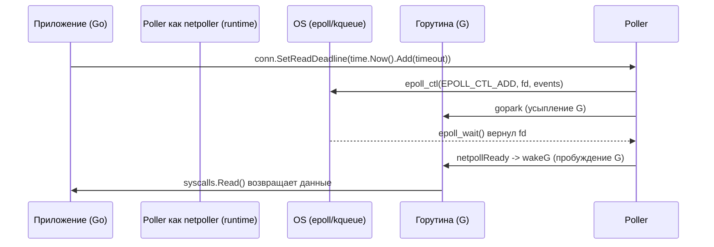

## Введение: Go как событийно-ориентированный runtime

В отличие от PHP или Java, где модель программирования исторически строится вокруг «один запрос — один тред ОС», Go использует модель **многопоточных горутин с неблокирующим I/O**. Это позволяет одному системному потоку (M) обслуживать тысячи одновременных соединений, не упираясь в лимиты ОС на процессы/потоки. Ключ к этой архитектуре — пакет `net`, пакет `net/http` и внутренний планировщик ввода-вывода (`netpoller`).

## Абстракция `net` и файловые дескрипторы

Пакет `net` скрывает различия между ОС, предоставляя унифицированные интерфейсы `net.Conn`, `net.Listener`, `net.Dialer`. Под капотом все они оперируют файловыми дескрипторами (file descriptors, FD). В Unix-системах сокет — это просто FD, который можно передать в `epoll`, `kqueue` или `IOCP`.

```go
// Идиоматичное создание TCP-соединения с контекстом и таймаутами
// Таймауты здесь критичны: они предотвращают утечку горутин
// на медленных или отвалившихся соединениях.
dialer := net.Dialer{
    Timeout:   5 * time.Second,
    KeepAlive: 30 * time.Second,
    DualStack: true,
}

conn, err := dialer.DialContext(ctx, "tcp", "127.0.0.1:8080")
if err != nil {
    // Обработка ошибки...
}
defer conn.Close()
```

> [!info] Под капотом
> При создании сокета Go сразу устанавливает флаг `O_NONBLOCK` (или `FIONBIO` на Windows). Это переводит сокет в **неблокирующий режим**. Если приложение попытается вызвать `Read` или `Write` на таком FD, оно получит `EAGAIN` или `EWOULDBLOCK` вместо блокировки ядра. Именно это позволяет Go не привязывать горутину к системному потоку на время ожидания данных.

## `netpoller` под капотом: `epoll`, `kqueue`, `IOCP`

Сердце сетевой подсистемы Go находится в `runtime/netpoll.go`. Планировщик Go не может просто вызвать `select()` в цикле — это заблокировало бы весь процесс. Вместо этого используется механизм **Event Notification** ОС.

На Linux Go использует `epoll`, на BSD/macOS — `kqueue`, на Windows — `IOCP`. Инициализация происходит один раз при запуске программы через `runtime.netpollGenericInit`.



Когда горутина вызывает `conn.Read()`, а данных нет:
1. Go проверяет `netpoller`. Если FD уже в пуле и готов к чтению — данные берутся сразу.
2. Если нет, горутина вызывается `gopark` и переводится в состояние `Gwaiting`.
3. FD добавляется в `epoll` через `EPOLL_CTL_ADD` с событием `EPOLLIN`.
4. Текущий системный тред (M) засыпает в `epoll_wait()` с таймаутом.
5. Когда данные приходят, ядро будит тред, `netpoll` пробуждает связанную горутину.

> [!warning] Ловушка / Gotcha
> `netpoller` имеет лимит на количество отслеживаемых FD. В современных версиях Go он динамически масштабируется, но при открытии десятков тысяч соединений (например, в прокси или базе данных клиентов) стоит следить за лимитами ОС (`ulimit -n`) и использовать `http2.Transport` или кастомные пулы соединений.

## Планирование горутин при IO: `gopark` и `wakeG`

В Go нет прямой связи «горутина = тред ОС». Планировщик (`sched`) управляет пулом горутин. Когда горутина уходит в сетевой IO:
- Она сохраняет своё состояние в стеке и структуре `g`.
- Через `gopark` она снимается с текущего `P` (logical processor) и помещается в очередь ожидания `netpoll`.
- После пробуждения `runtime.wakeG` возвращает горутину в runqueue `P`.
- **Важно:** Пробуждение не гарантирует, что горутина сразу получит CPU. Она станет `runnable` и будет выполнена следующим доступным `P` или в момент next schedule point.

## `net/http` и `http.Transport`: пули, контексты и таймауты

Пакет `net/http` строится поверх `net`. `http.Server` принимает подключения через `net.Listener`. Каждое новое соединение оборачивается в `http.conn` и запускается в отдельной горутине.

Критический компонент — `http.Transport`. Он отвечает за:
- Переиспользование TCP-соединений (`Keep-Alive`).
- Ограничение одновременных соединений (`MaxIdleConns`, `MaxIdleConnsPerHost`).
- Кеширование соединений в пуле.

```go
transport := &http.Transport{
    MaxIdleConns:        100,
    MaxIdleConnsPerHost: 10,
    IdleConnTimeout:     90 * time.Second,
    // DialContext передается dialer с таймаутами
}

client := &http.Client{
    Transport: transport,
    Timeout:   10 * time.Second, // Применяется ко всему запросу
}
```

> [!tip] Собеседование
> **Вопрос:** Чем отличается `client.Timeout` от `dialer.Timeout`?
> **Ответ:** `dialer.Timeout` контролирует только установку TCP-соединения (SYN/SYN-ACK). `client.Timeout` применяется ко всему циклу: подключение + отправка запроса + ожидание ответа + чтение тела. Если сервер медленно отвечает, `client.Timeout` сработает, но соединение уже будет установлено.

## Mechanical Sympathy: CPU кэши, syscalls, GC

1. **Снижение контекстных переключений:** Благодаря `epoll` и неблокирующим FD, Go избегает блокирующих системных вызовов `read/write` на каждой итерации. Один `epoll_wait` обслуживает тысячи соединений.
2. **Кэш-локальность:** `net/http` и `net` активно используют `sync.Pool` для буферов (например, `bufio.Reader`, `http2.frame`). Это размещает часто используемые объекты в кэшах L1/L2 CPU, снижая cache misses.
3. **Escape Analysis и GC:** При чтении больших тел ответов Go старается избегать аллокаций в куче. Если буфер передается в `sync.Pool`, GC не трогает его. Однако, если вы создаете `[]byte` внутри цикла обработки запросов без пула, GC (особенно в Go 1.21+ с GOGC по умолчанию 100) будет чаще запускать Stop-The-World паузы. Используйте `http.Response.Body.Close()` и `io.CopyBuffer` с кастомными пулами для high-load.
4. **Syscall cost:** Каждый `epoll_ctl` и `epoll_wait` — это syscall. В Go 1.21+ `netpoll` оптимизирован: он использует `epoll_pwait2` (или аналоги) для точного таймаута без `timerfd`.

## Ловушки и вопросы на собеседованиях

- **Утечка горутин на таймаутах:** Если использовать `conn.SetDeadline()` без отмены контекстом, горутина может висеть в `epoll_wait` вечно при отмене. Всегда используйте `Dialer.Timeout` или `conn.SetReadDeadline(time.Now().Add(timeout))` в горутине с `ctx.Done()`.
- **`http.Transport` по умолчанию:** Не создавайте `http.DefaultClient` для high-load. Его `http.DefaultTransport` имеет лимиты и не подходит для пулинга соединений. Всегда инициализируйте кастомный `Transport`.
- **HTTP/2 и Head-of-Line blocking:** В HTTP/2 Go по умолчанию включает h2. Если вы используете `http2.Transport`, помните о блокировке заголовков/тел. В Go 1.21+ добавлена поддержка `http2.Priority` и улучшен фреймовый планировщик.
- **`net.Conn` vs `net.PacketConn`:** Для UDP используйте `PacketConn`. `net` пакет абстрагирует это, но `epoll` для UDP работает иначе (нет концепции "соединения", только FD).

## Итог

Сетевая подсистема Go — это пример идеального баланса между абстракцией и производительностью. `netpoller` забирает на себя работу с `epoll`/`kqueue`, позволяя горутинам выглядеть как блокирующие, но работать неблокирующе. `net/http` добавляет поверх это HTTP-логику, кеширование и пулинг соединений. Понимание того, как `gopark`, `netpoll` и `syscalls` взаимодействуют, позволяет писать сервисы, способные держать сотни тысяч соединений на одной машине без вылета памяти.

Мы разобрали, как Go управляет сетью на уровне рантайма. Следующий шаг — понимание проблем, которые возникают при масштабировании этих соединений в production. В статье [[39. TIME_WAIT, Port Exhaustion и другие проблемы TCP-сервисов.md]] мы разберем, почему TCP-соединения не исчезают мгновенно, как избежать исчерпания портов и как `netpoller` справляется с `FIN_WAIT` и `CLOSE_WAIT`.