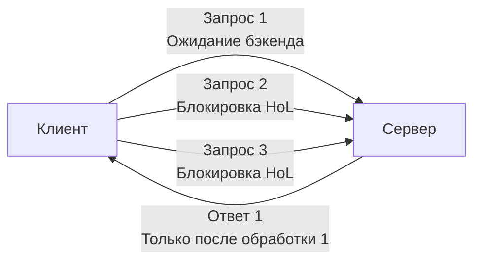

## Введение

Когда мы говорим о высоконагруженном бэкенде, производительность измеряется не только в операциях процессора, но и в задержках сети, утилизации соединений и поведении системы под пиковыми нагрузками. Две классические проблемы, которые часто становятся причиной внезапной деградации или полного падения сервиса — **Head of Line Blocking** и атака **Slowloris**. 

В этой статье мы разберем, как эти явления возникают на уровне сетевого стека, как они влияют на планировщик Go и выделение памяти, и какие production-паттерны необходимо внедрять в `http.Server` для защиты от деградации.

## Head of Line Blocking: Ловушка последовательного исполнения

**Head of Line (HoL) Blocking** — это явление, при котором потеря или задержка одного пакета (или запроса) блокирует доставку последующих, даже если они уже дошли до получателя.

### Уровень TCP
В TCP потеря пакета вызывает срабатывание механизма `Retransmission`. Сторона, которая не получила подтверждение (ACK), останавливает отправку новых окон данных. Все последующие пакеты, которые уже были отправлены и дошли до сервера, остаются в буфере принимающей стороны. Пока не будет retransmit-а потерянного сегмента, вышележащие протоколы (например, HTTP) не могут прочитать данные.

> [!info] Под капотом
> Для процессора это выглядит как простой конвейера (pipeline stall). Кэш-линии L1/L2 инвалидируются, когда CPU пытается прочитать данные из буфера, который заблокирован ожиданием network interrupt. Утилизация CPU падает, а latency растет экспоненциально.

### Уровень HTTP/1.1
Проблема усугубляется на прикладном уровне. В HTTP/1.1 для выполнения нескольких запросов к одному хосту используется `Keep-Alive`, но запросы обрабатываются **строго последовательно**. Если первый запрос ждет ответа от бэкенда (например, долгий SQL-запрос или блокирующий вызов внешней API), второй, третий и N-й запросы физически не могут быть отправлены по этому соединению, даже если сеть свободна.



### Как решается в современных протоколах
*   **HTTP/2:** Вводит **Multiplexing**. Несколько запросов упаковываются в отдельные `Frames` внутри одного TCP-соединения. Потеря пакета в одном кадре задерживает только этот поток, не блокируя остальные. Подробнее в [[22. HTTP 2. Multiplexing, Frames, HPACK]].
*   **HTTP/3 + QUIC:** Полностью устраняет HoL на уровне транспортного стека. QUIC работает поверх UDP и реализует собственную логику `Loss Recovery` и мультиплексирования на уровне стримов. Если пакет теряется, QUIC retransmit-ит только его, не останавливая другие стримы. Подробнее в [[23. HTTP 3 и QUIC. Почему будущее уходит от TCP]] и [[24. Deep Dive в QUIC. Пакеты, Stream, Loss Recovery]].

## Slowloris: Атака медленной смерти

**Slowloris** — это классическая атака типа DoS (Denial of Service), направленная не на перегрузку канала, а на исчерпание ресурсов сервера через удержание соединений.

### Механизм атаки
1. Атакующий открывает тысячи параллельных TCP-соединений к веб-серверу.
2. Отправляет валидные, но **частичные HTTP-запросы** (например, `GET / HTTP/1.1\r\nHost: ...` без `Connection: close` и `Content-Length`).
3. Периодически отправляет фрагменты заголовков (`X-Magic: 1\r\n` каждые 15 секунд), чтобы сервер не сработал по таймауту и не закрыл соединение.
4. Никогда не отправляет пустую строку `\r\n\r\n`, означающую конец заголовков.

Сервер, ожидая завершения запроса или отключения клиента, держит соединение открытым. В Go это означает:
*   Выделенный `net.FD` (файловый дескриптор).
*   Буфер `bufio.Reader` (по умолчанию 4 КБ).
*   Горутина, ожидающая чтения из сокета (стек 2-4 КБ, блокировка в `netpoller`).
*   При достижении лимита `http.Server.MaxConns` новые подключения отклоняются или попадают в очередь ожидания.

> [!warning] Ловушка / Gotcha
> Если вы используете `http.Server` с дефолтными настройками, таймауты чтения и записи отсутствуют. Сервер будет ждать бесконечно, пока клиент не отвалится по таймауту ОС (обычно 2+ часа). Ресурсы истощаются мгновенно, а CPU при этом почти не грузится.

## Деградация под нагрузкой: Системный взгляд

Когда HoL и Slowloris (или просто медленные клиенты) накапливаются, система проходит несколько стадий деградации:

1. **Истощение пула соединений (`http.Transport`):** Клиентские коннекты не освобождаются. Новые запросы начинают ждать в очереди.
2. **Рост tail-latency:** Из-за HoL запросы, которые должны обрабатываться параллельно, выстраиваются в очередь. P99 latency резко растет при стабильном P50.
3. **Утечка горутин и памяти:** Если асинхронная обработка не завершается из-за заблокированных соединений, горутины не собираются GC. `GOMEMLIMIT` или RSS растут до OOM.
4. **Контекстные переключения:** Планировщик Go (`runtime.scheduler`) видит заблокированные в `syscall` или `netpoll` горутины, переносит их в очередь `runq` и создает новые треды ОС (`M`). Это вызывает `Context Switch` и нагрузку на ядро Linux.

## Go-специфика: Управление соединениями и таймауты

В Go 1.21+ защита от деградации строится на двух уровнях: настройка `http.Server` (серверная часть) и `http.Transport` (клиентская часть).

### 1. Серверные таймауты (Обязательный минимум)
Никогда не оставляйте таймауты пустыми. Они должны быть строго меньше таймаутов балансировщика нагрузки (например, NGINX или Envoy).

```go
srv := &http.Server{
    Addr:         ":8080",
    Handler:      myRouter,
    ReadTimeout:  15 * time.Second, // Время на чтение заголовков и тела
    WriteTimeout: 30 * time.Second, // Время на отправку ответа
    IdleTimeout:  60 * time.Second, // Сколько держать idle-соединение в пуле
    MaxHeaderBytes: 1 << 20,        // 1 MB лимит на заголовки (защита от Slowloris)
    // Context-based shutdown (Go 1.21+)
    BaseContext: func(listener net.Listener) context.Context {
        ctx := context.Background()
        return context.WithValue(ctx, "start_time", time.Now())
    },
}
```

### 2. Клиентский пул соединений (`http.Transport`)
По умолчанию Go использует `http.DefaultTransport`. Для production нужно явно управлять пулом, чтобы избежать HoL на клиенте и истощения file descriptors.

```go
transport := &http.Transport{
    MaxIdleConns:        100,
    MaxIdleConnsPerHost: 10, // Критично! Ограничивает HoL на одном хосте
    IdleConnTimeout:     90 * time.Second,
    TLSHandshakeTimeout: 10 * time.Second,
    ResponseHeaderTimeout: 15 * time.Second,
    ExpectContinueTimeout: 1 * time.Second,
}

client := &http.Client{
    Transport: transport,
    Timeout:   30 * time.Second, // Жесткий таймаут на весь запрос
}
```

> [!tip] Собеседование
> **Вопрос:** Что произойдет, если `MaxIdleConnsPerHost` установлен в 0 или не задан?
> **Ответ:** Go создаст неограниченное количество idle-соединений. При атаке Slowloris или при работе с тысячами downstream-сервисов это приведет к исчерпанию file descriptors (`ulimit -n`) и утечке памяти. Всегда ограничивайте пул через `MaxIdleConnsPerHost` или используйте `http2.Transport` с соответствующими лимитами.

### 3. Взаимодействие с `netpoller`
Когда горутина блокируется на чтении из сокета (из-за Slowloris или HoL), она переходит в состояние `waiting` и перестает потреблять CPU. `netpoller` (epoll/kqueue) регистриует fd и ждет событий. Когда таймаут срабатывает, `http.Server` вызывает `conn.Close()`, что генерирует событие `read` с ошибкой `EOF` или `timeout`. Горутина разблокируется, буферы `bufio` сбрасываются, и ресурсы возвращаются в пул.

## Итоги и вопросы для собеседования

1. **Как HTTP/2 решает проблему HoL?** Через мультиплексирование кадров (frames) поверх одного TCP-соединения. Потеря пакета влияет только на конкретный stream, а не на весь поток.
2. **Почему Slowloris опасен для Go-сервера?** Истощает file descriptors, память (буферы `bufio`) и пул горутин, не нагружая CPU. Дефолтный `http.Server` без таймаутов не защитит от него.
3. **Как отличить HoL от реальной медленной бэкенд-логики?** Используйте `http.ServerMetrics` или OpenTelemetry spans. Если `conn_duration` растет, но `cpu_time` низкий — проблема в сети или ожидании внешних зависимостей.
4. **Что делает `MaxConnsPerHost` в `http.Transport`?** Ограничивает количество активных соединений к одному хосту. Превышение лимита заставляет запрос ждать освобождения коннекта в очереди, предотвращая `Too many open files`.

## Что дальше

Мы разобрали сетевые аномалии и механизмы деградации на уровне приложения. Следующий шаг — понимание того, как эти проблемы решаются на уровне инфраструктуры и оркестрации. В следующей статье мы перейдем к сетевому стеку Kubernetes: [[41. Kubernetes Networking. CNI, Pod Network, Service, Ingress]].