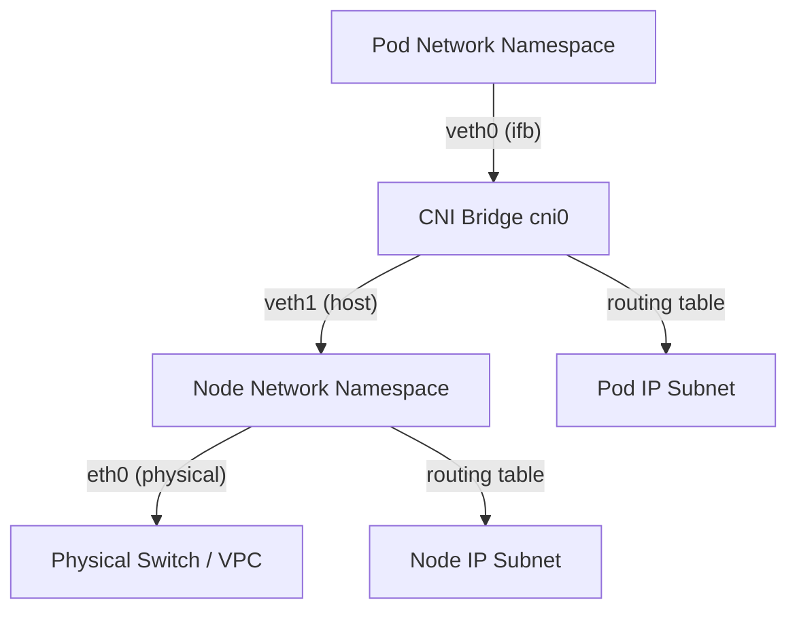

## Сеть в Kubernetes: Фундамент для Go-разработчика

Переход в Kubernetes меняет парадигму сетевой коммуникации. В монолите или на bare-metal вы привыкли к статическим IP, прямым маршрутам и предсказуемым задержкам. В K8s всё динамично: поды умирают, пересоздаются, получают новые IP, а сетевой стек абстрагирован через CNI. Для Go-разработчика это означает, что `net` пакет и `http.Client` начинают работать в условиях нестабильной среды с накладными расходами на инкапсуляцию, коннект-трекинг и DNS-поиски.

Понимание того, как данные проходят от вашего `net/http` сервера до физического провода, критично для тюнинга latency, предотвращения connection leaks и корректной работы在高нагруженных систем.

## K8s Networking Model и Flat Network

Kubernetes декларирует **Flat Network** модель:
1. Каждый Pod получает уникальный IP-адрес.
2. Контейнеры внутри одного Pod делят сетевой стек.
3. Pod могут общаться с любыми другими Pod без NAT.
4. IP Pod доступен для всех узлов кластера.

Это означает, что ваш Go-сервис не должен мапить порты или использовать `localhost` для связи между подами. Вы работаете с обычными TCP/UDP сокетами, как в классическом бэкенде. Однако за этой абстракцией скрывается сложный сетевой стек Linux, который мы разберем ниже.

## CNI и Pod Network: Устройство под капотом

Kubernetes не управляет сетью сам. Он делегирует это **Container Network Interface (CNI)**. Pugins (Calico, Cilium, Flannel, Weave) создают виртуальные сети на уровне ядра Linux.

### Как это работает на уровне ОС и железа
Каждый Pod получает изолированный сетевой стек через **Network Namespace**. Внутри namespace создаются виртуальные интерфейсы `veth` (virtual Ethernet pairs). Один конец пары находится в namespace Pod, второй — в bridge на хосте (например, `cni0` или `flannel.1`).



**Mechanical Sympathy:**
- `veth` пары работают как виртуальные кабели. Пакет, отправленный из Pod, проходит через интерфейс, попадает в bridge, затем в сеть узла. Это добавляет **контекстные переключения** и копирование пакетов между namespace.
- При использовании overlay-сетей (VXLAN, как в Flannel) каждый пакет инкапсулируется в UDP-капсулу. Это увеличивает MTU, вызывает перепаковку пакетов на CPU и требует настройки `gso/gro` на сетевых картах для снижения нагрузки на процессор.
- Cilium заменяет bridge и iptables на **eBPF/XDP**, перемещая маршрутизацию в пространство ядра (kernel space) без копирования данных в user space. Это дает снижение latency на 30-50% и почти нулевое потребление CPU на сетевой стеке.

> [!info] Под капотом
> В Linux сетевые namespace изолируют только сетевые ресурсы (интерфейсы, маршруты, таблицы правил, сокеты). Это легковесная структура (около 1-2 КБ памяти), создаваемая через syscall `clone(CLONE_NEWNET)`. Когда горутина Go открывает сокет в Pod, она фактически работает с файлом дескриптора `/proc/<pid>/fd/...`, привязанным к этому namespace.

## Services и kube-proxy: iptables vs IPVS

**Service** абстрагирует набор подов за стабильным виртуальным IP (`ClusterIP`). Трафик поступает на Service и распределяется на endpoints.

За маршрутизацию отвечает `kube-proxy`. Он наблюдает за API Server и динамически обновляет правила ядра Linux. Есть два режима:

1. **iptables (legacy)**: `kube-proxy` генерирует тысячи правил `iptables -A KUBE-SERVICES -d <ClusterIP> -j KUBE-SVC-...`. Каждое входящее соединение проходит по цепочке правил. При 1000+ сервисов это создает O(N) задержку на каждый пакет.
2. **IPVS**: Использует хеш-таблицы ядра Linux (`ip_vs`). Маршрутизация работает за O(1), аналогично `nginx` upstream или `HAProxy`. Поддерживает L4 load balancing, least-connections, magic-servers.

> [!warning] Ловушка / Gotcha
> **conntrack table exhaustion.** И iptables, и IPVS используют `nf_conntrack` для отслеживания состояний TCP-соединений. В высоконагруженных Go-сервисах (10k+ RPS с короткими коннектами) таблица коннектов быстро переполняется. Ядро начинает дропать пакеты, а Go-клиент получает `connection reset by peer` или `timeout`.
> Решение: `sysctl -w net.netfilter.nf_conntrack_max=1048576` на всех узлах, а также настройка `nf_conntrack_tcp_timeout_established` и использование `ipvs` вместо `iptables`.

## Ingress и внешняя маршрутизация

**Ingress** — это Kubernetes Resource для маршрутизации L7-трафика (HTTP/HTTPS). Сам контроллер не обрабатывает трафик, он только генерирует конфигурацию для внешних прокси (nginx-ingress, envoy, traefik).

Когда внешний клиент подключается к Ingress, трафик проходит через:
1. Cloud Load Balancer (L4) -> NodePort/LoadBalancer Service
2. Ingress Controller Pod (L7 routing, TLS termination)
3. Backend Service -> Endpoints -> Pod

Для Go-разработчика критично понимать, что Ingress Controller часто имеет свои лимиты на `worker_connections`, `proxy_buffer_size` и таймауты. Если Go-сервис отвечает медленно, Ingress может отбросить соединение до того, как `timeout` сработает на стороне приложения.

## Go-specific: DNS, TCP, netpoller и connection limits

Go в Kubernetes работает в контейнеризированной среде с особыми сетевыми паттернами.

### 1. DNS resolution и CoreDNS
K8s использует CoreDNS. По умолчанию `ndots:5` в `/etc/resolv.conf` заставляет Go resolver перебирать все search domains перед обращением к root. Если сервис называется `my-service.default.svc.cluster.local`, запрос может занять 500-1000ms на первый коннект.
**Решение:** Использовать FQDN с точкой в конце (`my-service.default.svc.cluster.local.`) или настроить `ndots:2` в `kube-dns` config.

### 2. TCP Keep-Alive и Cloud NAT
Провайдеры облаков (AWS NLB, GCP Cloud NAT, Azure LB) часто убивают idle TCP соединения через 350-1000 секунд. Go `http.Client` по умолчанию отключает keep-alive для `http://` (только `https` использует).
```go
client := &http.Client{
    Transport: &http.Transport{
        MaxIdleConns:        100,
        MaxIdleConnsPerHost: 100,
        IdleConnTimeout:     90 * time.Second,
        TLSHandshakeTimeout: 10 * time.Second,
    },
    Timeout: 5 * time.Second,
}
```
В Kubernetes также стоит явно настроить `net.TCPConn.SetKeepAlive(true)` и `SetKeepAlivePeriod()`, чтобы пробрасывать синие пакеты через прокси.

### 3. Netpoller и epoll
Go 1.21+ использует `epoll` (Linux) для асинхронного I/O. В K8s это работает нативно, но overlay-сети (VXLAN, Wireguard) могут вызывать:
- **Fragmentation**: Если MTU не настроен, пакеты фрагментируются. Go TCP не умеет эффективно обрабатывать фрагментированные пакеты, что ведет к retransmission.
- **Reordering**: eBPF/Cilium или балансировщики могут переставлять пакеты. Go TCP congestion control (CUBIC) воспринимает это как потерю и снижает window, деградируя throughput.

> [!tip] Собеседование
> **Вопрос:** Почему `curl` внутри пода падает с ` NXDOMAIN`, а `wget` работает? Или почему первый запрос к сервису занимает 500ms?
> **Ответ:** Из-за `ndots:5` в `/etc/resolv.conf`. Go resolver перебирает search domains. `wget` может использовать `getent` или другой механизм. Фикс: добавить точку в конце домена (`service.ns.svc.cluster.local.`) или уменьшить `ndots`.
> 
> **Вопрос:** Как Go netpoller взаимодействует с K8s network namespaces?
> **Ответ:** Netpoller работает на уровне файлового дескриптора сокета. Namespace изолирует сетевой стек, но дескриптор остается валидным. Epoll не знает про namespace, он видит только события ядра. Поэтому производительность не падает, но при пересоздании пода сокет отбрасывается, и Go должен пересоздать listener. Важно использовать `SO_REUSEPORT` для graceful restart.

## Итог

1. **CNI** создает flat network через Linux network namespaces и veth-пары. Накладные расходы на overlay-сети (VXLAN) можно минимизировать настройкой MTU и включением GSO/GRO.
2. **Services** маршрутизируются через `kube-proxy`. IPVS предпочтительнее для высоконагруженных Go-сервисов из-за O(1) маршрутизации и снижения нагрузки на CPU.
3. **conntrack table** — скрытый bottleneck. При 10k+ коротких коннектов таблица переполняется, ядро начинает дропать пакеты. Требуется тюнинг `sysctl`.
4. **DNS и TCP** в K8s требуют явной настройки таймаутов, keep-alive и FQDN для избегания задержек и обрывов соединений от облачных LB.
5. **Go netpoller** работает нативно, но overlay-сети и балансировщики могут вызывать reordering/fragmentation, что деградирует TCP congestion control.

Мы разобрали, как трафик проходит от Go-приложения через сетевой стек Kubernetes до физического интерфейса. Но что делать, когда сервисов становится сотни, и ручная настройка правил маршрутизации превращается в ад? В следующей статье мы перейдем к [[42. Service Mesh. Istio, Linkerd, sidecar proxy]], где разберем, как eBPF и sidecar-прокси решают проблемы наблюдаемости, безопасности и маршрутизации в распределенных системах.