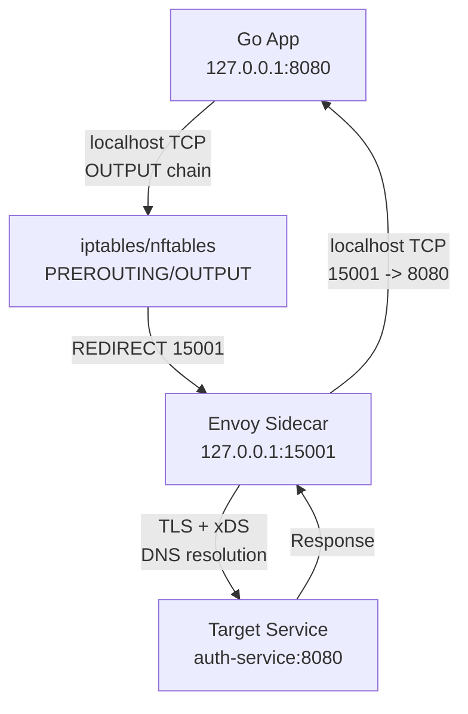

## Service Mesh: Децентрализация сетевой логики

В распределенных системах сетевое взаимодействие становится одной из самых сложных частей. Каждый сервис должен уметь: находить другие сервисы, устанавливать безопасные соединения, обрабатывать таймауты, повторять запросы при сбоях, собирать метрики и трассировки. Если писать эту логику внутри каждого приложения, код дублируется, тестирование усложняется, а обновления безопасности требуют передеплоя всех сервисов.

**Service Mesh** решает эту проблему, вынося сетевую логику из приложения в отдельный слой инфраструктуры. Для Go-разработчика это означает смену парадигмы: вы больше не управляете `net/http.Client` напрямую для сетевых нужд, а делегируете это прокси-слою.

## Архитектура: Control Plane и Data Plane

Service Mesh всегда делится на две независимые части:

1. **Data Plane (Плоскость данных)** — прокси, который физически обрабатывает трафик. В 99% случаев это [42. Service Mesh. Istio, Linkerd, sidecar proxy](42. Service Mesh. Istio, Linkerd, sidecar proxy) (Envoy) или `linkerd2-proxy`. Он работает в реальном времени, без блокировок, с минимальной задержкой.
2. **Control Plane (Управляющая плоскость)** — набор компонентов, которые собирают конфигурацию, сертификаты и политики, а затем распределяют их по прокси. В Istio это `istiod`, в Linkerd — `linkerd-controller` + `destination` + `identity`.

> [!info] Под капотом
> Разделение на плоскости позволяет обновлять сетевые политики без перезагрузки рабочих нагрузок. Control Plane работает в режиме централизованного управления, а Data Plane — в режиме stateless-обработки пакетов. Это классический пример паттерна **Controller-Operator**, адаптированного под сетевой стек.

## Sidecar Pattern: Магия перенаправления трафика

Ключевой механизм внедрения сетевой логики — **Sidecar**. Это контейнер, живущий в одном Pod (или хосте) с целевым приложением. Трафик перенаправляется через правила сети хоста (iptables/nftables) до того, как достигнет приложения.

Процесс выглядит так:
1. Исходящий трафик из Go-приложения (например, `http.Get("http://auth-service:8080")`) попадает в цепочку `OUTPUT` ядра Linux.
2. Правило `REDIRECT` перехватывает пакеты, предназначенные для внешних сервисов, и перенаправляет их на локальный порт прокси (обычно `15001` или `4143`).
3. Прокси устанавливает соединение с целевым сервисом, применяет политики (mTLS, rate limit, circuit breaker) и форвардит трафик.
4. Ответ проходит обратный путь, прокси вносит данные в лог/метрики и передает их приложению.



> [!warning] Ловушка / Gotcha
> Go-приложения по умолчанию используют `net.Dialer`, который не знает о sidecar. Если вы явно укажете IP целевого сервиса, трафик может проскочить в обход прокси, если правила iptables настроены только на `localhost` или `127.0.0.0/8`. В Kubernetes это решается через `iptables` на уровне `kube-proxy` или `CNI`-плагина, но локальная разработка требует ручного маппинга `127.0.0.1` к sidecar.

## Под капотом: Envoy и асинхронная модель

Envoy написан на C++ и использует однопоточную event-driven архитектуру (аналогично Go's `netpoll`, но на уровне C++ `epoll`). Это критически важно для понимания производительности.

**Внутреннее устройство Envoy:**
- **Single-threaded event loop:** Все соединения обрабатываются в одном потоке. Это устраняет необходимость в мьютексах, уменьшает cache misses и предсказуемо ведет себя под нагрузкой.
- **Async I/O:** Использует `epoll` (Linux) или `kqueue` (BSD) для неблокирующих сокеты. Контекстные переключения минимальны.
- **Hot reloading:** Конфигурация загружается через `mmap` или `inotify`. При изменении политик прокси пересобирает маршруты без перезагрузки потоков.
- **Memory management:** Статические пулы объектов (object pools) для HTTP-заголовков и TLS-сессий. GC отсутствует, что дает детерминированную задержку.

Для Go-разработчика это означает: прокси не блокирует горутины. Он работает в отдельном процессе, и связь между Go-приложением и sidecar происходит через локальный Unix/TCP сокет. Это добавляет **один сетевой стек** и **один контекстный переключатель** на каждый запрос.

## Istio и Linkerd: Философия реализации

### Istio
Историо — самый зрелый mesh-решение. Использует протокол **xDS** (CDX, EDS, LDS, RDS, CDS) для передачи конфигурации от `istiod` к прокси.
- **mTLS:** Автоматическая генерация сертификатов через `Citadel` (в новых версиях интегрировано в `istiod`). Использует SPIFFE/SPIRE стандарты.
- **Traffic Management:** Gateway API, VirtualService, DestinationRule. Позволяет делать canary, split, fault injection.
- **Overhead:** Из-за обилия контроллеров (ранее Pilot, Citadel, Galley, Mixer) потребление памяти control plane высокое. Data plane потребляет ~50-100 MB RAM на инстанс.

### Linkerd
Linkerd делает ставку на минимализм. Proxy написан на Rust (`linkerd2-proxy`), что дает:
- Потребление памяти ~10-20 MB на инстанс.
- Быстрый cold start (< 100 ms).
- Упрощенный control plane, управляющий через CRD в Kubernetes.
- Автоматическое mTLS без явной настройки сертификатов.

> [!tip] Собеседование
> **Вопрос:** Почему Envoy потребляет больше памяти, чем linkerd2-proxy?
> **Ответ:** Envoy — C++ приложение с тяжелым runtime: кэширование TLS-сессий, сложные структуры для маршрутизации, статистика per-connection, поддержка множества протоколов (HTTP/1, HTTP/2, gRPC, MQTT, Redis). Linkerd2-proxy написан на Rust, использует `tokio` event loop, минималистичную маршрутизацию и не кэширует TLS-сессии агрессивно. Разница в trade-off: гибкость vs. overhead.

## Влияние на Go-приложения и производительность

Go-приложение в mesh-среде работает как клиент `localhost`. Это меняет архитектуру сетевых вызовов:

1. **Connection Pooling:** `http.Transport` к `127.0.0.1` создает новые TCP-соединения. Mesh прокси кеширует upstream-соединения, но локальный pool может переполняться при высокой concurrency.
2. **DNS Resolution:** Go резолвит DNS на старте или по таймеру. В mesh DNS резолвится прокси (DNS proxy в Envoy). Приложение может видеть устаревший IP, если DNS кэш не обновлен.
3. **Metrics & Tracing:** Заголовки `x-request-id`, `x-b3-*` или W3C Trace Context инжектируются прокси. Go должен использовать `otel` SDK, который автоматически считывает заголовки из входящих запросов.
4. **Debugging:** `tcpdump` на хосте покажет трафик до прокси. Для анализа трафика между app и sidecar используется `nsenter -t <pid> -n tcpdump -i lo port 15001`.

```go
// Пример конфигурации http.Transport для работы с mesh-прокси
// Важно: mesh может добавлять заголовки, менять таймауты, делать retry.
// Поэтому таймауты должны быть агрессивнее на уровне приложения.
transport := &http.Transport{
    MaxIdleConns:        100,
    MaxIdleConnsPerHost: 10,
    IdleConnTimeout:     90 * time.Second,
    // Mesh может добавлять задержку 2-5ms на hop.
    // Дублирование таймаута на каждом hop приведет к каскадным сбоям.
    DialContext: (&net.Dialer{
        Timeout:   3 * time.Second,
        KeepAlive: 30 * time.Second,
    }).DialContext,
}
client := &http.Client{Transport: transport, Timeout: 5 * time.Second}
```

> [!warning] Ловушка / Gotcha
> **Каскадные таймауты (Tail Latency Amplification).** Если сервис A вызывает B, а B вызывает C, и каждый добавляет 5ms задержки из-за mesh, общая latency растет линейно. На 10hop-пайплайне это +50ms. Решение: адаптивные таймауты (`timeouts` в Istio) или отключение mesh для внутренних вызовов (service-to-service).

## Сравнение: Sidecar vs. eBPF vs. Library Injection

| Подход | Примеры | Задержка | Безопасность | Сложность внедрения |
|--------|---------|----------|--------------|---------------------|
| **Sidecar (Envoy/Linkerd)** | Istio, Linkerd | 2-10 ms | Высокая (mTLS, политики) | Средняя (K8s init containers) |
| **eBPF / XDP** | Cilium, Tetragon, Kube-OVN | < 1 ms | Средняя (нет прокси, нет mTLS на уровне L7) | Высокая (ядро, eBPF-компиляция) |
| **Library Injection** | OpenTelemetry, go-mesh-lib | 0 ms | Низкая (зависит от кода) | Низкая (go generate / build tags) |

eBPF-подход (например, `cilium-hubble` или `tetra`) обходит сетевой стек ядра и перехватывает пакеты на уровне `sock_ops` или `xdp`. Это убирает overhead sidecar, но усложняет L7-логику (HTTP parsing, JWT validation). Go-разработчику нужно понимать: если вы используете Cilium CNI, ваш трафик уже оптимизирован на уровне ядра, и дополнительный mesh может быть избыточен.

## Ловушки, Gotchas и вопросы на собеседованиях

> [!tip] Собеседование
> **Вопрос:** Как service mesh влияет на GC в Go-приложении?
> **Ответ:** Прямое влияние нулевое, так как mesh работает в отдельном процессе. Косвенное: прокси может форсировать повторные запросы (retry) или добавлять заголовки, что увеличивает количество аллокаций строк и байт-слайсов в Go. Также, если mesh блокирует запросы (circuit breaker), горутины могут простаивать в `chan` или `http.Client.Do`, что влияет на `runtime.gopark` и статистику goroutines в pprof.

> [!warning] Ловушка / Gotcha
> **Port Exhaustion на sidecar.** Если Go-приложение открывает много соединений к `127.0.0.1:15001`, локальный ephemeral port pool может исчерпаться. Решение: `sysctl -w net.ipv4.ip_local_port_range="1024 65535"`, настройка `SO_REUSEPORT`, или использование Unix domain sockets вместо TCP для app-proxy связи (в Linkerd по умолчанию).

> [!tip] Собеседование
> **Вопрос:** Как отлаживать `TIME_WAIT` в mesh-среде?
> **Ответ:** `TIME_WAIT` возникает, когда Go-приложение закрывает соединение, а прокси еще не отправил FIN. В sidecar-архитектуре proxi использует `SO_LINGER=0` и `TCP_NODELAY` для быстрого сброса. Если проблема в приложении, нужно использовать `http.Transport.DisableKeepAlives=false` и контролировать `MaxIdleConns`. В Kubernetes также помогает `net.ipv4.tcp_fin_timeout` и `net.ipv4.tcp_tw_reuse`.

## Итог

Service Mesh — это архитектурный компромисс между **сетевой прозрачностью** и **инфраструктурным контролем**. 
1. **Sidecar** изолирует сетевую логику от бизнес-кода, позволяя обновлять политики безопасности и маршрутизации без redeploy.
2. **Envoy/Linkerd** работают на уровне event-loop, минимизируя задержку, но добавляют один hop в сетевой стек.
3. **Go-приложения** в mesh-среде должны учитывать локальный proxy, каскадные таймауты и особенности DNS.
4. **eBPF** становится альтернативой для сценариев, где критична производительность, а L7-логика не требуется.

Для Go-разработчика переход к mesh означает смену фокуса: вы больше не пишете `net.Dialer` для сетевых нужд, а проектируете бизнес-логику, зная, что сеть управляется декларативно. Это повышает надежность, но требует глубокого понимания того, как трафик проходит через Pod и ядро Linux.

## Что дальше?

Мы разобрали инфраструктурный слой, который объединяет сервисы в единую сеть. Теперь, когда у нас есть понимание сетевой инфраструктуры, перейдем к паттернам, которые строятся поверх нее. В следующей статье мы разберем: [[43. Сетевые паттерны распределенных систем]], чтобы понять, как проектировать отказоустойчивые системы, работающие в условиях частичных сбоев сети.