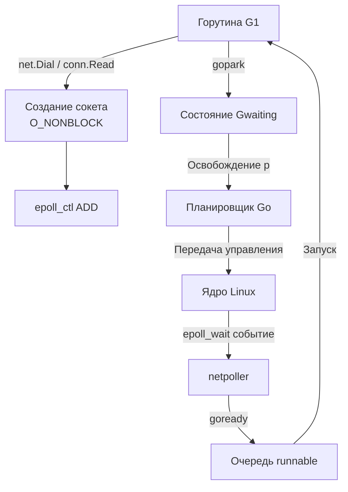

## Финальная синхронизация: Сетевой стек в контексте Go

Мы прошли полный путь от физического уровня и MAC-адресов до распределенных транзакций и Kubernetes CNI. Для бэкенд-разработчика, целящегося на Senior/Lead позицию, знание протоколов по RFC недостаточно. Ключевая компетенция — понимание того, как абстракции языка и рантайма взаимодействуют с ядром ОС, как это влияет на задержки, пропускную способность и отказоустойчивость, и как правильно проектировать системы, чтобы они не упали под нагрузкой.

В этой статье мы соберем разрозненные знания в единую инженерную картину, выделив критические точки взаимодействия Go, ОС и сетевого оборудования.

## Архитектура взаимодействия Go и ОС

Go не реализует свой сетевой стек с нуля. Он использует POSIX-сокеты, но кардинально меняет подход к их обработке. В классических языках (C, Java, C#) разработчик либо блокирует поток на `read`/`write`, либо использует `select`/`epoll` вручную. Go выносит эту логику в рантайм через `[[38. Как Go работает с сетью. net, net_http, netpoller, epoll]]`.

В основе лежит `netpoller`. На Linux он использует `epoll` (в современных версиях Go 1.22+ оптимизированный edge-triggered режим для снижения оверхеда), на macOS/BSD — `kqueue`, на Windows — `IOCP`. 

Когда горутина вызывает `net.Dial()` или `conn.Read()`, рантайм выполняет следующее:
1. Создает сокет и ставит его в неблокирующий режим (`O_NONBLOCK`).
2. Регистрирует сокет в `epoll` через `epoll_ctl(EPOLL_CTL_ADD)`.
3. Вызывает `gopark()`, который переводит горутину в состояние `Gwaiting` и передает управление планировщику.
4. Планировщик переключается на другие горутины или системные треды (`m`).

Когда ядро Linux сигнализирует о готовности сокета через `epoll_wait()`, `netpoller` извлекает события и вызывает `goready()` для соответствующих горутин. Горутина перемещается в очередь `runnable` и будет исполнена ближайшим свободным `p`.

> [!info] Под капотом
> `netpoller` не создает новые системные треды для каждого сокета. Он复用ает фиксированный пул тредов (по умолчанию 1024, настраивается через `GOMAXPROCS` и внутренние лимиты), которые выполняют `epoll_wait` в цикле. Это критически важно для высокой плотности горутин на один тред ОС.

## Ключевые паттерны и Mechanical Sympathy

Понимание сетевого стека без учета железа и ОС приводит к архитектурным ошибкам. Вот критические точки, где инженерия Go встречается с реальностью.

### 1. Стоимость системных вызовов и буферизация
Каждый `read`/`write` через сокет — это переход в Ring 0. В Go пакет `[[6. Стандартная библиотека Go]]` (`bufio`, `bytes`) и `http.Transport` активно используют буферизацию. Однако на уровне приложения вы должны контролировать `http.Transport.MaxIdleConns`, `MaxIdleConnsPerHost` и `IdleConnTimeout`. Неиспользуемые соединения в `TIME_WAIT` не освобождают порты мгновенно (около 60 секунд), что ведет к `[[39. TIME_WAIT, Port Exhaustion и другие проблемы TCP-сервисов]]`.

> [!warning] Ловушка / Gotcha
> `http.Client` по умолчанию кэширует соединения. Если вы создаете новый `http.Client` в каждом запросе, вы теряете пул и создаете тысячу новых TCP-рукопожатий. Всегда переиспользуйте `http.DefaultClient` или кастомный `http.Transport`.

### 2. Zero-Copy и ядро
Go не делает `memcpy` между пользовательским буфером и ядром при записи в сокет, если буфер выровнен и соответствует внутренним структурам `syscall.Sendmsg` или `unix.Sendmsg`. В высоконагруженных сервисах (например, прокси или стриминг) используйте `syscall.Sendmsg` с `iovec` и `SendFile` для передачи файлов напрямую из кэша страницы ядра.

### 3. DNS и блокировка планировщика
`net.LookupIP()` — синхронная операция, которая блокирует текущую горутину до получения ответа. В Go 1.21+ добавлен `net.Resolver.LookupContext`, но он все равно может вызывать блокирующие системные вызовы. В микросервисной архитектуре резолвер должен быть асинхронным или кэшированным. Используйте `[[17. DNS под капотом. Record Types, TTL, Recursive Resolver, кеширование]]` для понимания, почему `dig` может работать быстрее, чем ваш код.

## Системный дизайн и распределенные системы

Сеть — это не только протоколы, это среда с конечной пропускной способностью и конечной задержкой.

### Протокольный выбор: HTTP/2 vs HTTP/3
`[[22. HTTP 2. Multiplexing, Frames, HPACK]]` устранил проблему Head-of-Line Blocking на уровне приложения, но не на уровне TCP. Если один пакет теряется, весь поток блокируется. `[[23. HTTP 3 и QUIC. Почему будущее уходит от TCP]]` и `[[24. Deep Dive в QUIC. Пакеты, Stream, Loss Recovery]]` решают это, перенося поток-ориентированную доставку на уровень приложения поверх UDP. В Go 1.21+ HTTP/3 поддерживается экспериментально, в 1.22+ — стабильно через `http3.Transport`. Для критичных к задержкам сервисов (гейминг, финтех, real-time) переход на QUIC обязателен.

### Отказоустойчивость и Circuit Breaker
В распределенных системах `[[43. Сетевые паттерны распределенных систем]]` требуют явного управления деградацией. Таймауты должны быть иерархичными: `context.WithTimeout` для приложения, `TCPKeepAlive` для транспорта, `IdleTimeout` для прокси. Без этого `[[40. Head of Line Blocking, Slowloris и деградация под нагрузкой]]` превратит ваш пул горутин в deadlock.

> [!tip] Собеседование
> **Вопрос:** Как Go обрабатывает потерю пакетов TCP?
> **Ответ:** Сам Go не обрабатывает потерю пакетов напрямую — это делает стек ОС. Go просто получает `-EAGAIN` или `0` байт от `read`/`write`. Если соединение рвется, `net.Conn` возвращает ошибку `use of closed network connection` или `connection reset by peer`. Для восстановления нужно реализовывать Retry-логику на уровне приложения с экспоненциальной backoff, так как TCP уже попытался восстановить соединение через `[[12. TCP Retransmission, Keep Alive, Nagle и Delayed ACK]]`.

## Ловушки и вопросы на собеседованиях

1. **`net.Dial` vs `net.Listen`**: `Dial` блокирует горутину до успешного рукопожатия или таймаута. В Go нет асинхронных сокетов "из коробки" без `netpoller`. Если вы вызываете `Dial` в цикле без `context`, вы можете исчерпать пул горутин.
2. **`SO_REUSEPORT`**: В Linux позволяет нескольким процессам/тредам bind'иться на один порт. Go использует это для балансировки входящих соединений между `p` (процессами планировщика), снижая contention на мьютексах accept-цепочки.
3. **`TCP_NODELAY`**: По умолчанию включен Nagle Algorithm ([[12. TCP Retransmission, Keep Alive, Nagle и Delayed ACK]]), который буферизует маленькие пакеты. Для RPC и gRPC (`[[26. gRPC, Protocol Buffers и сетевые особенности RPC]]`) его нужно отключать для снижения задержки.
4. **Кэширование DNS в Go**: `net.Resolver` кэширует ответы на уровне ОС (nsswitch), а не в Go. Если вы хотите кастомное кэширование, используйте `[[17. DNS под капотом. Record Types, TTL, Recursive Resolver, кеширование]]` логику самостоятельно или библиотеки вроде `coredns` клиента.
5. **`context` и соединения**: `context.CancelFunc` не разрывает TCP-соединение автоматически. Он просто возвращает `context.Canceled` при чтении/записи. Соединение нужно закрывать явно через `conn.Close()`, иначе оно уйдет в `TIME_WAIT` и потратит память.

## Итог

Сетевой стек в Go — это не просто вызовы `net.Conn`. Это сложный танец между `netpoller`, ядром Linux, планировщиком горутин и аппаратными ограничениями сети. Senior-инженер знает, когда включать `SO_REUSEPORT`, как настраивать `http.Transport` под конкретную нагрузку, почему HTTP/3 может быть быстрее HTTP/2 в условиях packet loss, и как избежать port exhaustion в Kubernetes.

Мы завершили детальный разбор компьютерных сетей и переходим к фундаменту, который определяет философию языка и подход к решению задач. В следующей статье мы разберем: `[[4. История и философия Go. Предпосылки создания языка, парадигма Composition over inheritance и Errors are values]]`.