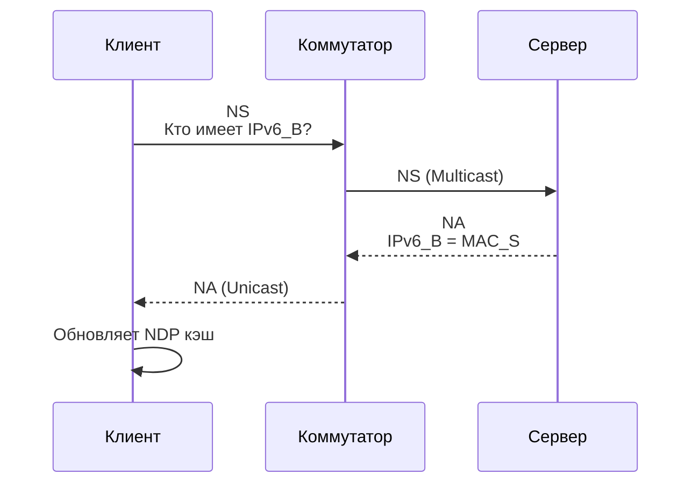

## 1. Зачем нам ARP и NDP? Слой 2 и проблема адресации

Когда вы запускаете `curl http://192.168.1.50/api/health`, ваш Go-приложение формирует TCP-сегмент, оборачивает его в IP-пакет, а тот — в Ethernet-кадр. Но на этом путь не заканчивается. Слой 3 (IP) знает только логические адреса, а слой 2 (Ethernet) оперирует физическими адресами (`MAC`). Коммутаторы (switches) не понимают IP-адресацию, они пересылают кадры исключительно по `MAC`.

Возникает фундаментальная проблема: как отправить кадр на конкретное устройство, если известен только его IP, но неизвестен `MAC`? Здесь в игру вступает **ARP** (для IPv4) и его эволюция **NDP** (для IPv6). Без этих протоколов локальная сеть превратилась бы в набор изолированных подсетей, не способных к обмену данными.

## 2. ARP (Address Resolution Protocol): Механизм IPv4

**ARP** — это протокол разрешения адресов, работающий на стыке сетевых и канальных уровней. Он мапит IPv4-адрес в MAC-адрес в пределах одного широковещательного домена (broadcast domain).

### Как работает ARP (пошагово)
1. **Запрос (Request):** Устройство `A` хочет отправить кадр на IP `X.X.X.X`. Оно проверяет свою ARP-таблицу. Если записи нет, формирует кадр:
   - `Dst MAC`: `FF:FF:FF:FF:FF:FF` (Broadcast)
   - `EtherType`: `0x0806`
   - `Sender MAC/IPv4`: `A`
   - `Target MAC/IPv4`: `00:00:00:00:00:00 / X.X.X.X`
2. **Обработка коммутатором:** Switch видит broadcast и флудит кадр во все порты (кроме входящего).
3. **Ответ (Reply):** Устройство `B` с IP `X.X.X.X` распознает свой адрес, формирует unicast-reply и отправляет его обратно `A`.
4. **Запись в кэш:** `A` сохраняет пару `IP -> MAC` и отправляет данные.

> [!info] Под капотом
> ARP-кадр инкапсулируется прямо в Ethernet-фрейм без заголовка IP. Это делает ARP протоколом, не зависящим от IP, хотя исторически он привязан именно к IPv4. Структура ARP-пакета фиксирована: `Hardware Type` (1), `Protocol Type` (1), `Hardware Size` (1), `Protocol Size` (1), `Opcode` (2), `Sender MAC`, `Sender IP`, `Target MAC`, `Target IP`.

## 3. NDP (Neighbor Discovery Protocol): Эволюция в IPv6

IPv6 отказался от ARP из-за его уязвимостей и неэффективности. Вместо ARP используется **NDP**, построенный на **ICMPv6**.

### Ключевые отличия NDP от ARP
- **Типы сообщений:** `Neighbor Solicitation` (NS, тип 135) и `Neighbor Advertisement` (NA, тип 136).
- **Адресация:** NS отправляется на multicast-адрес `ff02::1:ffXX:XXXX` (префикс `ff02::1:ff` + последние 24 бита целевого IPv6). Это заменяет broadcast и снижает нагрузку на сеть.
- **Атомарность:** NDP объединяет функции ARP, ICMP Redirect и обнаружения недоступных соседей (Duplicate Address Detection, DAD).
- **Безопасность:** Поддержает SEND (Secure Neighbor Discovery) с криптографической верификацией, хотя в продакшене редко используется из-за сложности настройки.



## 4. Как это работает в ядре Linux и Go

Go не реализует ARP/NDP самостоятельно. Он делегирует разрешение логических адресов в физические ядру ОС через системные вызовы и нетворк-стек.

### Внутренности ядра Linux
- **Таблица соседей (Neighbor Table):** Хранится в модуле `neighbour`. Для ARP используется `arp_tables`, для NDP — `ndisc`.
- **Параметры кэша:** Управляются через `/proc/sys/net/ipv4/neigh/<iface>/` и `/proc/sys/net/ipv6/neigh/<iface>/`. Ключевые поля:
  - `base_reachable_time_ms`: TTL кэша (по умолчанию 30 сек в Linux, но динамически меняется).
  - `gc_stale_time`: Время до того, как запись считается "засохшей" (stale).
  - `proxy_arp`: Включение прокси-ARP (когда ядро отвечает за другие подсети).
- **Получение данных:** Go использует `getifaddrs()` для сбора интерфейсов и `ioctl(SIOCGARP)` или `rtnetlink` для чтения/записи таблицы соседей. В современных версиях `golang.org/x/net/ipv4` и `ipv6` предоставляют безопасные обёртки.

### Go и сетевое разрешение
Когда вы вызываете `net.Dial("tcp", "192.168.1.50:80")`, Go:
1. Проверяет, является ли адрес IPv4/IPv6.
2. Делегирует L3/L2 resolution ядру.
3. Ядро проверяет таблицу маршрутизации (`[[6. Маршрутизация. Таблица маршрутов, шлюзы и default route]]`).
4. Если целевой IP в той же подсети -> запускает ARP/NDP.
5. Если шлюз -> шлет ARP для шлюза.
6. Возвращает `syscall.Conn` с установленным L2-маппингом.

```go
package main

import (
	"fmt"
	"log"
	"net"
	"time"
)

// Пример: как Go взаимодействует с L2-стеком
// В продакшене не нужно вручную вызывать ARP. 
// Но для отладки или кастомных прокси (например, BGP/SDN контроллеров) 
// полезно понимать, как читать таблицу соседей.
func main() {
	// Получаем список интерфейсов
	ifaces, err := net.Interfaces()
	if err != nil {
		log.Fatalf("Ошибка получения интерфейсов: %v", err)
	}

	for _, iface := range ifaces {
		// В Go нет прямого API для чтения ARP-кэша из stdlib
		// (безопасность и кроссплатформенность). 
		// Для Linux используется golang.org/x/sys/unix и ioctl.
		fmt.Printf("Интерфейс: %s | MTU: %d | Flags: %v\n",
			iface.Name, iface.MTU, iface.Flags)
	}

	// Имитация запроса соединения (проверяет L3/L2 маршрут)
	conn, err := net.DialTimeout("tcp", "192.168.1.1:80", 2*time.Second)
	if err != nil {
		log.Printf("Не удалось установить соединение (L2/L3 маршрут недоступен): %v", err)
	} else {
		fmt.Println("Соединение установлено. L2-маппинг выполнен ядром.")
		conn.Close()
	}
}
```

## 5. Ловушки безопасности и производительности

> [!warning] Ловушка / Gotcha
> **ARP Spoofing / Poisoning:** Злоумышленник отправляет поддельный ARP-Reply, привязывая свой MAC к IP жертвы или шлюза. Весь трафик перенаправляется через атакующего. В Go-приложениях, работающих с доверенными внутренними сервисами, это может привести к MITM.
> **Митигация:** Static ARP entries, Dynamic ARP Inspection (DAI) на коммутаторах, NDP Guard. В коде: никогда не доверяйте MAC-адресу из непроверенного источника, используйте mTLS для аутентификации на L7.

> [!warning] Ловушка / Gotcha
> **Broadcast Storms:** Если ARP-кэш часто инвалидируется (например, из-за динамического IP или агрессивных таймеров), сеть заваливается запросами. В Kubernetes это частая проблема при частых перезапусках подов (pod churn).
> **Оптимизация:** Настройте `gc_*` параметры в `/proc/sys/net/ipv4/neigh/`. Увеличьте `base_reachable_time` или используйте `proxy_arp`/`ndisc` кэширование на маршрутизаторах.

> [!tip] Собеседование
> **Вопрос:** Почему ARP не работает между разными подсетями?
> **Ответ:** ARP ограничен broadcast-доменом (L2). Маршрутизаторы не форвардят broadcast-кадры. Если целевой IP не в локальной подсети, устройство отправляет ARP-запрос не для целевого IP, а для IP шлюза по умолчанию (default gateway). Коммутатор в другой сети никогда не увидит этот кадр.
> **Вопрос:** Что будет, если в ARP-кадре указать неверный Sender IP?
> **Ответ:** Это называется Gratuitous ARP (GARP) или ARP-спуфинг. Если GARP отправлен корректно (своим IP), он обновляет кэш соседей. Если IP подменён, клиенты обновят кэш на ложный MAC, что приведет к потере пакетов или MITM.

## 6. Итог и переход к следующей теме

ARP и NDP решают критичную задачу маппинга L3-адресов в L2-адреса внутри одного broadcast-домена. ARP устарел из-за broadcast-нагрузки и уязвимостей, NDP на ICMPv6 стал стандартом для IPv6, добавив multicast-эффективность и базовую безопасность. В Go разработчику не нужно реализовывать эти протоколы вручную — рантайм делегирует работу ядру, которое управляет таблицей соседей через `neighbour` подсистему и `rtnetlink`. Понимание этих механизмов необходимо для отладки сетевых задержек, настройки SDN-инфраструктуры и защиты от L2-атак.

Мы разобрали, как узлы находят друг друга в локальной сети. Но как трафик попадает за её пределы? В следующей статье мы закроем фундамент маршрутизации: [[6. Маршрутизация. Таблица маршрутов, шлюзы и default route]].