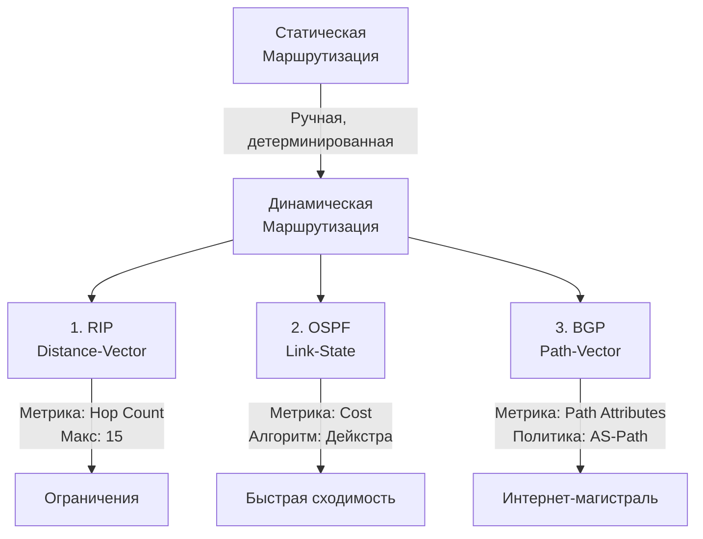

## Статическая и динамическая маршрутизация

В предыдущей статье мы разобрали устройство таблицы маршрутизации и роль шлюза по умолчанию. Но как эта таблица заполняется? На каком этапе маршрутизатор принимает решение о следующем прыжке? И почему в облачных провайдерах вы никогда не увидите `ip route` в привычном виде?

Ответ кроется в механизмах маршрутизации. Для Go-разработчика понимание разницы между статической и динамической маршрутизацией критично: это напрямую влияет на латентность соединений, поведение при сбоях инфраструктуры и способ дебагга `connection refused` или `no route to host` в контейнеризованных средах.

## Статическая маршрутизация: Детерминизм и ручной контроль

**Статическая маршрутизация** означает, что пути к сетевым подсетям прописываются администратором вручную и не меняются автоматически при изменении топологии сети.

В Linux это соответствует записям, созданным через `ip route add` или `route add`. Таблица маршрутизации (FIB - Forwarding Information Base) в этом случае представляет собой статический массив или хеш-таблицу, где поиск следующего прыжка (next-hop) происходит по ключу.

**Преимущества:**
1. Полная предсказуемость и детерминизм. Пакеты всегда идут по одному и тому же пути.
2. Нулевая накладная нагрузка на CPU маршрутизаторов (отсутствуют протоколы обмена).
3. Безопасность: нет риска получения некорректных маршрутов от злоумышленника.

**Недостатки:**
1. Отсутствие отказоустойчивости. При падении линка или маршрутизатора путь перестает работать до ручного вмешательства.
2. Плохая масштабируемость. В сетях из сотен узлов поддерживать статические записи вручную невозможно.

> [!warning] Ловушка / Gotcha
> В современных облаках (AWS VPC, GCP Cloud Router, K8s CNI) статическая маршрутизация полностью абстрагирована. Вы не управляете FIB напрямую. Вместо этого провайдер использует программно-определяемые сети (SDN), где контроллер динамически пересчитывает таблицы на основе состояния кластера. Понимание статики важно для отладки on-premise и edge-вычислений.

## Динамическая маршрутизация: Адаптивность и метрики

**Динамическая маршрутизация** позволяет маршрутизаторам автоматически обмениваться информацией о доступности сетей и совместно строить таблицу маршрутизации. Протоколы используют **метрики** для выбора наилучшего пути.

В Linux динамические протоколы (например, через `bird` или `frr`) пишут свои маршруты в FIB с определенным приоритетом (AD - Administrative Distance). Если несколько путей ведут к одной сети, выбирается путь с наименьшей метрикой или лучшим административным расстоянием.

### 1. RIP (Routing Information Protocol)
Протокол класса **Distance-Vector**. Маршрутизаторы обмениваются полными таблицами маршрутизации с соседями каждые 30 секунд. Метрика — количество прыжков (hop count). Максимум 15 прыжков; 16 считается недостижимым.

**Как работает под капотом:**
Каждый маршрутизатор хранит вектор расстояний до всех известных сетей. При получении обновления он прибавляет 1 к hop count и сравнивает с текущим значением. Если новый путь короче — обновляет FIB.

> [!info] Под капотом
> RIP использует UDP порт 520. Из-за периодической рассылки полных таблиц и отсутствия быстрого обнаружения петель (split horizon, poison reverse) протокол считается устаревшим и применяется только в учебных лабораториях или крайне гетерогенных legacy-сетях.

### 2. OSPF (Open Shortest Path First)
Протокол класса **Link-State**. В отличие от RIP, OSPF не передает полные таблицы. Каждый маршрутизатор строит карту топологии сети (LSDB - Link State Database) и самостоятельно вычисляет кратчайшие пути.

**Алгоритм Дейкстры:**
1. Каждый узел в OSPF-области флудит свои LSAs (Link State Advertisements) всем остальным узлам области.
2. Каждый маршрутизатор собирает LSDB и запускает алгоритм Дейкстры для вычисления кратчайшего дерева (SPF - Shortest Path First).
3. Метрика — cost (обратна пропускной способности линка).

> [!tip] Собеседование
> **Вопрос:** Почему OSPF быстрее сходится при обрыве линка, чем RIP?
> **Ответ:** RIP ждёт таймаута обновления (30 сек) или таймаут удаления записи (180 сек), пока не обнаружит разрыв. OSPF использует механизм hello-пакетов и LSA-флудинг. Как только соседний маршрутизатор обнаруживает down-интерфейс, он мгновенно генерирует новый LSA, и все остальные пересчитывают SPF за миллисекунды.

### 3. BGP (Border Gateway Protocol)
Протокол класса **Path-Vector**. Работает на стыке автономных систем (AS). Не ищет кратчайший путь физически, а применяет **политику маршрутизации** (префиксы, AS-Path, Local Pref, Community).

**Ключевые особенности для бэкенда:**
1. Использует TCP порт 179 для установления сессий (EBGP и IBGP).
2. Поддерживает огромные таблицы (полная таблица маршрутизации интернета > 900 000 префиксов).
3. Позволяет настраивать traffic engineering: как трафик должен уходить из дата-центра в провайдеров.



## Под капотом: FIB и Longest Prefix Match

Когда пакет приходит на сетевую карту, драйвер передаёт его в стек ОС. Слой `netfilter` и `routing` проверяют заголовок IP-пакета. Ключевой механизм — **Longest Prefix Match (LPM)**.

Таблица маршрутизации в Linux хранится в структуре `fib_trie`. Это модифицированное префиксное дерево (Radix Tree). При поиске маршрута процессор проходит по дереву от корня к листьям, сверяя биты IP-адреса назначения с масками подсетей.

**Mechanical Sympathy:**
1. LPM — операция с неопределенным временем выполнения в худшем случае. На больших таблицах (ISP-уровень) дерево становится глубоким.
2. Современный Linux использует **hardware offloading** (via `tc`/`iproute2` и драйверы NIC) для переноса LPM в TCAM (Ternary Content-Addressable Memory) на сетевой карте. Это дает задержку маршрутизации < 10 нс на чип.
3. В программной реализации (software FIB) промахи по кэшу L1/L2 процессора при обходе `fib_trie` могут стоить десятков тактов. Именно поэтому в высоконагруженных Go-сервисах критично минимизировать количество разных исходящих CIDR-подсетей (например, через пул IP-адресов в одном поддиапазоне).

## Go и маршрутизация: Практика

Пакет `net` в Go не предоставляет прямого API для чтения таблицы маршрутизации. Однако при вызове `net.Dial("tcp", "host:port")` стандартная библиотека делает следующее:
1. Разрешает имя через DNS.
2. Вызывает системный вызов `connect()` (в Linux).
3. Ядро Linux смотрит в FIB, находит next-hop и отправляет пакет через соответствующий интерфейс.

Если вам нужно программно работать с маршрутами (например, в сервисе для управления сетью или в custom CNI-плагине), используйте `github.com/vishvananda/netlink`.

```go
package main

import (
	"fmt"
	"log"

	"github.com/vishvananda/netlink"
)

func main() {
	// Получаем все маршруты
	routes, err := netlink.RouteList(nil, netlink.FAMILY_V4)
	if err != nil {
		log.Fatalf("RouteList failed: %v", err)
	}

	// Ищем маршрут по умолчанию (dst == 0.0.0.0/0)
	var defaultGw string
	for _, r := range routes {
		if r.Dst != nil && r.Dst.String() == "0.0.0.0/0" {
			defaultGw = r.Gw.String()
			fmt.Printf("Default Gateway: %s via %s\n", defaultGw, r.LinkName)
			break
		}
	}

	if defaultGw == "" {
		log.Fatal("Default route not found")
	}
}
```

**Важно для Go-разработчика:**
1. В контейнерах (Docker/K8s) сеть изолируется через `network namespace`. У каждого подов своя таблица маршрутизации. `ip route` покажет локальный маршрут к `127.0.0.1/8` и `169.254.169.254/32` (metadata service), а выходной трафик пойдет через `veth`-интерфейс к `CNI-bridge`.
2. Если вы запускаете Go-сервис в Kubernetes, он не знает о реальной физической топологии. Маршрутизация инкапсулируется CNI-плагином (Calico, Cilium, Flannel). Понимание `[[8. NAT, PAT и почему приватные сети работают через один IP]]` критично для отладки egress-трафика.
3. При использовании `net/http.Client` с `DialContext` можно переопределить исходный IP и интерфейс. Это полезно для multi-homed серверов, где нужно явно указать, через какой линк уходить в интернет.

> [!tip] Собеседование
> **Вопрос:** Как Go определяет, через какой интерфейс отправлять пакет, если у сервера несколько сетевых карт?
> **Ответ:** Go делегирует это операционной системе. При первом `Dial` ядро делает FIB lookup. Если в таблице есть несколько путей к одному префиксу с одинаковой метрикой, ядро использует ECMP (Equal-Cost Multi-Path) и хеширует 5-tuple (src/dst IP, src/dst port, protocol) для балансировки нагрузки между интерфейсами. В Go нельзя напрямую заставить `net.Dial` использовать конкретный интерфейс без обёртки над `unix.Bind` или `netlink`.
> 
> **Вопрос:** Что произойдет, если в контейнере пропадет маршрут по умолчанию?
> **Ответ:** Все исходящие соединения, кроме локальных и внутри кластера (через сервисные CIDR), начнут падать с `connect: no route to host`. `net.Dial` вернет ошибку `*net.OpError: dial tcp: connect: no route to host`. В Go это не перехватывается автоматически, и приложение должно реализовывать retry logic или health-check на уровне L4.

## Итог

1. **Статическая маршрутизация** дает детерминизм, но не масштабируется и не отказоустойчива.
2. **Динамическая маршрутизация** решает проблему масштабирования через протоколы обмена состоянием.
3. **RIP** устарел из-за медленной сходимости и ограничений hop-count.
4. **OSPF** использует Link-State и алгоритм Дейкстры для быстрой перестройки внутри одной автономной системы.
5. **BGP** — протокол политики, работающий на стыке AS. Именно он формирует интернет-магистраль.
6. **Longest Prefix Match** — фундаментальный алгоритм поиска в FIB. В Linux реализуется через `fib_trie`, в оборудовании — через TCAM. Кэш-промахи процессора при обходе дерева влияют на задержку маршрутизации.
7. **Go** делегирует выбор маршрута ядру ОС. В контейнеризованной среде маршрутизация инкапсулируется CNI, а не доступна напрямую.

Мы разобрали, как пакеты находят путь в сети. Но что происходит, когда IP-адреса кончаются и нужно связать внешние сети с внутренними? В следующей статье мы разберем: [[8. NAT, PAT и почему приватные сети работают через один IP]], чтобы понять механизмы трансляции адресов и их влияние на Go-приложения.