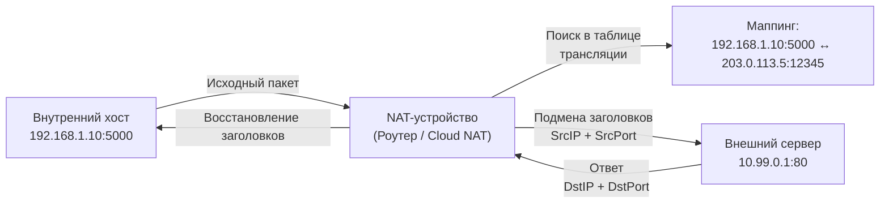

## Проблема исчерпания IPv4 и рождение NAT

Когда интернет только зарождался, адресное пространство `[[4. IP. IPv4, IPv6 и устройство сетевого пакета]]` казалось бесконечным. Но к концу 90-х выяснилось, что 4 миллиарда адресов (2^32) для растущей сети маловато. Решение пришло не в виде мгновенного перехода на `[[4. IP. IPv4, IPv6 и устройство сетевого пакета]]`, а в виде инженерного компромисса: **NAT (Network Address Translation)**.

NAT позволяет группе устройств использовать **один публичный IP-адрес** для выхода во внешний мир. Внутри локальной сети они общаются через **приватные диапазоны**, описанные в RFC 1918:
*   `10.0.0.0/8`
*   `172.16.0.0/12`
*   `192.168.0.0/16`

Это фундаментально меняет архитектуру бэкенда: ваше приложение в облаке, Docker-контейнере или Kubernetes-кластере почти наверняка находится за NAT. Понимание этого механизма критично для отладки сетевых задержек, настройки балансировки и проектирования отказоустойчивых сервисов.

## Как работает NAT и PAT (под капотом)

Простой NAT лишь меняет IP-адрес источника. Но одного IP недостаточно, если за ним сидят сотни горутин, контейнеров или микросервисов. Здесь вступает в силу **PAT (Port Address Translation)**, часто называемый NAPT (Network Address Port Translation).

Когда внутренний хост (например, `192.168.1.10:5000`) отправляет пакет на внешний сервер, NAT-устройство (роутер, фаервол, K8s Node, Cloud NAT) делает следующее:
1.  Смотрит в свою **таблицу трансляции** (conntrack table).
2.  Если записи нет, выделяет свободный внешний порт (например, `203.0.113.5:12345`).
3.  Подменяет заголовок IP-пакета: `SrcIP` → `203.0.113.5`, `SrcPort` → `12345`.
4.  Записывает маппинг: `192.168.1.10:5000` ↔ `203.0.113.5:12345`.
5.  Отправляет пакет дальше через `[[6. Маршрутизация. Таблица маршрутов, шлюзы и default route]]`.

Когда ответ приходит на `203.0.113.5:12345`, NAT смотрит в таблицу, находит внутренний хост и подменяет `DstIP` и `DstPort` обратно.

> [!info] Под капотом
> В Linux ядро не просто меняет байты в пакете. Оно использует подсистему **`nf_conntrack`** (Netfilter Connection Tracking). Каждый пакет проходит через цепочки правил `[[32. Firewall, iptables, nftables и базовая фильтрация трафика]]`. Для каждого нового соединения создается запись в таблице `conntrack`, которая хранит состояние: `ESTABLISHED`, `TIME_WAIT`, `SYN_SENT` и т.д. Это **stateful NAT** (состоятельный NAT). Запись удаляется только при завершении соединения или по истечении таймаута (обычно 432000 сек для TCP, но для `ESTABLISHED` сокращается до 43200 сек).

## Влияние на Go-разработчика и бэкенд-архитектуру

В мире монолитов и VPS NAT был невидим. В мире микросервисов и контейнеризации (`[[41. Kubernetes Networking. CNI, Pod Network, Service, Ingress]]`) NAT стал повсеместным. Go-приложения должны учитывать это при работе с сетью.

### Привязка к адресам в Go
Когда вы вызываете `net.Listen("tcp", ":8080")`, Go привязывается ко всем интерфейсам (`0.0.0.0`). В среде с NAT это работает корректно. Но если вы пишете сервис, который должен отдавать свой адрес внешним клиентам (например, для WebRTC, SIP или callback-ов), вы не можете просто вернуть `192.168.1.10`. Вам нужно использовать **STUN** или доверенный metadata-сервис (AWS EC2 metadata, GCP Compute Engine metadata).

> [!warning] Ловушка / Gotcha
> **Connection Tracking Exhaustion**
> Таблица `nf_conntrack` имеет лимит (`net.netfilter.nf_conntrack_max`). При высокой нагрузке (например, DDoS, массовый исходящий трафик или утечка соединений) таблица переполняется. Новые соединения отбрасываются на уровне ядра с ошибкой `NO ROUTE` или `DROP`, хотя ваше приложение и сеть полностью исправны.
> Проверить состояние: `cat /proc/sys/net/netfilter/nf_conntrack_count`
> В Go это проявляется как внезапные `dial tcp: connect: no route to host` или таймауты на этапе установки соединения, которые не логгируются на уровне приложения. Рантайм Go просто ждет ответа от `[[38. Как Go работает с сетью. net, net_http, netpoller, epoll]]`, который никогда не придет.

## NAT Traversal и проблемы состояний

Классическая проблема NAT: **как инициировать входящее соединение?**
NAT-устройство по умолчанию блокирует все входящие пакеты, если нет активной исходящей записи в `conntrack`. Это ломает классические P2P-протоколы, FTP, SIP.

Решения:
1.  **Port Forwarding**: Ручная настройка правил на роутере. Не масштабируется.
2.  **UPnP / NAT-PMP**: Автоматическое пробитие портов. Проблемы безопасности и доверия к сети.
3.  **STUN / TURN / ICE**: Стандарт для WebRTC. Клиент спрашивает STUN-сервер: "Какой мой публичный IP и порт?". Затем использует этот адрес для прямого соединения (**Hole Punching**). Если NAT блокирует (symmetric NAT), трафик идет через TURN-реле.
4.  **Reverse Proxy / Ingress**: В микросервисах мы не бьем порты. Мы используем `[[27. Прокси, Reverse Proxy и API Gateway]]` или `[[28. nginx, Envoy и HAProxy. Как работают современные прокси]]` как точку входа. Балансировка происходит на L4/L7 уровне, скрывая NAT от приложения.

> [!tip] Собеседование
> **Вопрос:** Почему NAT может "убить" TCP-соединение и как Go с этим работает?
> **Ответ:** Сам NAT не ломает TCP, он прозрачно транслирует адреса. Проблема в том, что если NAT-устройство перезагружается (например, обновление прошивки или сброс конфигурации), таблица `conntrack` очищается. Для TCP это значит, что `ESTABLISHED` соединение разрывается без `FIN`/`RST` флагов. Клиент будет ждать `ACK` бесконечно. Go-приложение должно использовать `[[25. WebSocket, SSE и долгоживущие соединения]]` с heartbeat-ами или реализовывать `[[12. TCP Retransmission, Keep Alive, Nagle и Delayed ACK]]` (TCP KeepAlive), чтобы детектировать разрыв и переподключаться. В Go `net.Conn` не умеет автоматически восстанавливать TCP-соединение после разрыва на уровне NAT — это обязанность приложения (reconnect logic).

## IPv6: Почему NAT отмирает

`[[4. IP. IPv4, IPv6 и устройство сетевого пакета]]` решают проблему адресации. Каждому устройству выделяется `/64` подсеть. Это 18 квинтиллионов адресов на каждый интерфейс.
В мире IPv6:
*   NAT не нужен. Каждый контейнер/под имеет публичный адрес.
*   Stateful firewalls становятся обязательными (прямая противоположность IPv4 NAT).
*   Проблемы `[[39. TIME_WAIT, Port Exhaustion и другие проблемы TCP-сервисов]]` исчезают (портов бесконечно много).
*   `[[41. Kubernetes Networking. CNI, Pod Network, Service, Ingress]]` в IPv6-кластерах работает проще: Pod IP == P2P адрес.

Переход на IPv6 ломает многие утилиты, которые парсят IP-адреса как строки, и требует от Go-разработчика поддержки `[[15. Порты, сокеты и Socket API]]` dual-stack (одновременная работа с IPv4 и IPv6).

## Итог

1.  **NAT/PAT** — это компромисс для выживания IPv4. Он подменяет заголовки пакетов и поддерживает состояние в таблице `conntrack` ядра Linux.
2.  **Состояние NAT** не синхронизировано с состоянием приложения. Перезагрузка роутера или переполнение таблицы `nf_conntrack` убьет активные соединения без уведомления Go-рантайма.
3.  **Бэкенд-архитектура** в эпоху NAT требует отказа от прямых входящих соединений. Используем `[[27. Прокси, Reverse Proxy и API Gateway]]`, `[[30. Service Discovery и балансировка в микросервисах]]` и паттерны NAT Traversal (STUN/TURN).
4.  **IPv6** делает NAT избыточным, но требует грамотной работы с `[[37. Сетевой стек Linux под капотом]]` и dual-stack в `[[38. Как Go работает с сетью. net, net_http, netpoller, epoll]]`.

В следующей статье мы разберем, как сегментировать трафик и изолировать сервисы с помощью виртуальных сетей: [[9. VLAN, VXLAN и сегментация сети]].