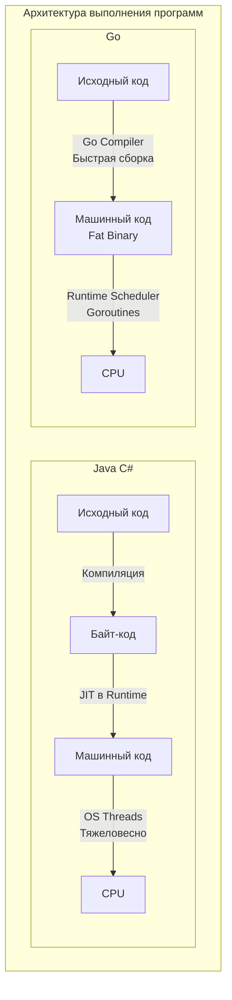

Переход на Go с таких языков, как Java, C#, PHP или Python, часто сопровождается когнитивным диссонансом. Синтаксис языка можно выучить за выходные, но попытки писать на Go так же, как вы писали на предыдущем языке, неизбежно приведут к разочарованию, громоздкому коду и борьбе с компилятором.

Этот раздел базы знаний посвящен не синтаксису, а **майндсету** — тому, как думает идиоматичный Go-разработчик. Понимание причин, по которым Go спроектирован именно так, а не иначе, является критическим шагом для перехода на уровень Middle+ и Senior.

## Что такое Go? Строгий инженерный компромисс

Если убрать маркетинговые лозунги, технически Go — это:
*   **Компилируемый язык со статической типизацией:** Код компилируется напрямую в платформо-зависимый машинный код (AOT-компиляция, Ahead-of-Time). Здесь нет виртуальных машин вроде JVM (Java) или CLR (C#), и нет JIT-компиляции.
*   **Язык со сборщиком мусора (Garbage Collector):** В отличие от C/C++ или Rust, вам не нужно вручную управлять аллокациями и освобождением памяти через `malloc`/`free` или владение (ownership).
*   **Язык с фокусом на конкурентность (Concurrency):** Примитивы конкурентности (горутины и каналы) встроены прямо в синтаксис языка и управляются собственным планировщиком в рантайме (M:N scheduler), а не напрямую операционной системой.

> [!info] Под капотом: Статическая линковка
> По умолчанию Go собирает приложения статически. Это значит, что весь необходимый код, включая сам рантайм Go (сборщик мусора, планировщик горутин) и стандартную библиотеку, упаковывается в один единственный исполняемый файл ("fat binary"). Вам не нужно устанавливать среду выполнения на сервер (как JRE или .NET Runtime) или искать зависимости `libc`. Вы просто копируете бинарник в минимальный Docker-образ (например, `scratch` или `alpine`), и он работает.

## Проблема: Зачем Google понадобился новый язык?

Go не был академическим экспериментом, созданным для проверки новых теорий построения компиляторов. Он появился в 2007 году внутри Google как сугубо прагматичный ответ на инженерный кризис. 

На тот момент основные системы Google писались на C++ и Java. И они столкнулись с тремя фундаментальными проблемами масштаба:

### 1. Время компиляции (Слишком долгий билд)
В гигантских монорепозиториях C++ включение заголовочных файлов (`#include`) приводило к экспоненциальному росту объема кода, который должен был обработать компилятор. Сборка некоторых бинарников занимала по 45 минут. Программисты тратили огромную часть рабочего времени, просто глядя в терминал. Go с самого начала проектировался так, чтобы время компиляции было молниеносным. Система импортов в Go гарантирует, что каждый пакет парсится компилятором ровно один раз.

### 2. Сложность языков (Когнитивная нагрузка)
C++ и Java развивались десятилетиями, обрастая новыми фичами. 
В больших командах Google возникала проблема: один инженер использовал подмножество фич X, а другой — подмножество Y. Читать чужой код становилось всё сложнее. Разработчики тратили время на споры о том, какой паттерн проектирования применить или как правильно выстроить иерархию классов. Go решил эту проблему радикальным путем — отрезав всё "лишнее".

### 3. Наступление эры многоядерности
Примерно в 2005-2007 годах закон Мура в контексте тактовой частоты процессоров уперся в физические ограничения (проблема теплоотделения). Производители начали наращивать количество ядер. 
Существующие языки опирались на потоки операционной системы (OS Threads) и блокировки (`Mutex`). 
Потоки ОС — это дорого:
*   У каждого потока по умолчанию выделяется большой стек памяти (обычно 1-8 МБ).
*   Переключение контекста между потоками (Context Switch) требует системных вызовов в Kernel Space, что сбрасывает кэши процессора и занимает тысячи тактов.

Создать 10 000 потоков ОС на сервере было рецептом катастрофы (проблема C10K). Go предложил легковесные горутины, которые на старте потребляют всего ~2 КБ памяти и переключаются в User Space.

> [!tip] Собеседование
> **Вопрос:** Какие проблемы решал Go при своем создании?
> **Ответ:** Go был создан для решения проблем "масштаба в квадрате": масштаба систем (многоядерность, распределенные сети, микросервисы) и масштаба команд (огромные кодовые базы, долгое время компиляции, сложная читаемость и поддержка кода сотнями разработчиков с разным бэкграундом).

## Философия «Меньше значит больше»

Чтобы решить эти проблемы, создатели Go пошли на радикальные шаги, которые до сих пор вызывают жаркие споры:

1.  **Нет классов и наследования:** Забудьте про `extends`. Go использует композицию и структурную типизацию интерфейсов (Duck Typing).
2.  **Нет исключений (`try/catch`):** Ошибки в Go — это обычные значения (values), которые нужно проверять явно. Это делает поток управления прозрачным (см. [[9. Errors Are Values. Почему в Go нет исключений]]).
3.  **Нет перегрузки методов:** Метод `Save()` может быть только один. Хотите другой — называйте `SaveToFile()`. Никакой магии неявного выбора сигнатур.
4.  **Только один способ сделать что-то:** В Go, как правило, есть только один правильный способ написать цикл (только `for`, никакого `while` или `do-while`), один способ отформатировать код (`gofmt`).

Этот минимализм требует перестройки мышления. Разработчикам на Java или C# может казаться, что Go связывает им руки и заставляет писать много "бойлерплейта" (однотипного кода, например, проверок `if err != nil`). Но с опытом приходит понимание, что этот бойлерплейт делает код феноменально прозрачным. Вы читаете код сверху вниз и точно знаете, где он может упасть, без риска поймать неявное исключение из глубины пяти слоев абстракции.

## О чем этот раздел?

В следующих статьях мы глубоко погрузимся в историю и принципы языка. Порядок изучения не случаен:
*   Мы узнаем, кто стоял у истоков языка в статье [[2. История создания Go. Google, Rob Pike, Ken Thompson, Robert Griesemer]].
*   Разберем парадигмы дизайна: почему мы используем композицию ([[12. Composition Over Inheritance. Почему в Go нет наследования]]) и интерфейсы на основе Duck Typing.
*   Поймем, как правильно обращаться с ошибками и почему паники — это не исключения.
*   Рассмотрим, как философия общения через каналы изменила подход к многопоточности ([[24. Concurrency Is Not Parallelism. Философия конкурентности в Go]]).

Цель этого раздела — сформировать у вас майндсет Idiomatic Go. Поняв философию, вы перестанете бороться с языком и начнете писать эффективные, поддерживаемые и по-настоящему быстрые бэкенд-системы.

Переходим к истокам: [[2. История создания Go. Google, Rob Pike, Ken Thompson, Robert Griesemer]].