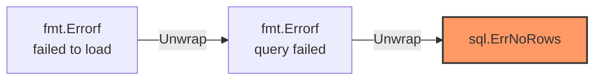

В предыдущей статье мы выяснили фундаментальную причину, почему создатели Go отказались от исключений: они хотели сделать поток управления (Control Flow) явным и предсказуемым. 

Но философия "ошибки — это значения" работает только в том случае, если вы умеете правильно с этими значениями обращаться. Блоки `if err != nil` часто называют "бойлерплейтом", но в идиоматичном Go они выполняют роль интеллектуальных узлов маршрутизации. Вы не просто проверяете ошибку, вы добавляете к ней контекст, принимаете решения об откате транзакций или маршрутизируете её в правильную подсистему логирования.

Давайте разберем внутреннее устройство типа `error`, главные ловушки и современные стандарты обработки ошибок в Go.

## Что такое `error` под капотом?

Для начала, `error` — это не магический встроенный тип. Это самый обычный интерфейс, определенный в исходном коде языка (пакет `builtin`):

```go
type error interface {
    Error() string
}
```

Любая структура, у которой есть метод `Error() string`, автоматически реализует этот интерфейс и может быть возвращена как ошибка. 

> [!info] Под капотом: Структура `iface`
> Как мы знаем из архитектуры Go, интерфейс под капотом (в рантайме) представляется структурой `iface`, которая занимает 16 байт на 64-битных системах и содержит два указателя:
> 1.  `tab` (или `_type`): указатель на метаданные о конкретном типе, который был присвоен интерфейсу, и таблицу его методов (itab).
> 2.  `data`: указатель на сами данные (само значение).

Понимание этого факта критически важно для прохождения собеседований на Senior-позиции и избегания самой частой "детской" ошибки в Go.

> [!warning] Ловушка / Gotcha: Интерфейс с nil-значением не равен nil
> Представьте, что вы создали свой тип ошибки:
> ```go
> type MyError struct { Msg string }
> func (e *MyError) Error() string { return e.Msg }
> ```
> И написали такую функцию:
> ```go
> func doWork() error {
>     var err *MyError = nil // Явно указываем nil-указатель
>     // ... какая-то логика, ошибка не возникла ...
>     return err // Возвращаем nil-указатель
> }
> ```
> Вызывающий код пишет `if err := doWork(); err != nil`. **И это условие выполнится! Программа решит, что произошла ошибка.**
> **Почему?** Потому что функция возвращает интерфейс `error`. Рантайм Go упаковывает возвращаемое значение в структуру `iface`. Указатель `data` будет равен `nil`, но указатель `tab` **не будет равен nil**, потому что он хранит информацию о типе `*MyError`. 
> Интерфейс считается `nil` **только тогда**, когда оба его внутренних указателя равны `nil`.
> **Правильный подход:** Всегда явно возвращайте `nil` (встроенный идентификатор), если ошибка не произошла.

## Типы ошибок в Go

В идиоматичном Go выделяют три основных способа работы с ошибками.

### 1. Сигнальные ошибки (Sentinel Errors)

Это глобальные переменные на уровне пакета, которые указывают на конкретное известное состояние. Классический пример — `sql.ErrNoRows` или `io.EOF`.

```go
var ErrUserNotFound = errors.New("user not found")

func GetUser(id int) (*User, error) {
    if id == 0 {
        return nil, ErrUserNotFound
    }
    return &User{}, nil
}
```
**Когда использовать:** Когда вызывающему коду нужно точно знать "что пошло не так", но ему не нужны дополнительные детали (например, ID пользователя).
Sentinel-ошибки проверяются через строгое равенство (до Go 1.13) или через функцию `errors.Is`.

### 2. Кастомные типы ошибок (Custom Error Types)

Когда вам нужно передать контекст (например, какой именно ID не найден, или какой HTTP-статус нужно вернуть клиенту), вы создаете структуру.

```go
type HTTPError struct {
    StatusCode int
    Err        error
}

func (e *HTTPError) Error() string {
    return fmt.Sprintf("status %d: %v", e.StatusCode, e.Err)
}
```
**Когда использовать:** В сложных предметных областях (Domain Driven Design) и на границах слоев абстракции (например, при трансляции ошибок базы данных в ошибки HTTP API).

### 3. Обертывание ошибок (Error Wrapping)

До версии Go 1.13 разработчики часто просто возвращали ошибку наверх: `return err`. Это приводило к ужасным логам вида: `connection refused`. Где она произошла? В базе? В Redis? При вызове стороннего API?

Правило идиоматичного Go: **Функция должна либо обработать ошибку, либо добавить к ней контекст и вернуть наверх.**

Начиная с Go 1.13, стандартный пакет `fmt` поддерживает глагол `%w` (wrap), который позволяет обернуть оригинальную ошибку новой текстовой оберткой, формируя цепочку (Error Chain).

```go
func fetchConfig() error {
    file, err := os.Open("config.json")
    if err != nil {
        // Оборачиваем ошибку, добавляя контекст: ЧТО мы пытались сделать
        return fmt.Errorf("failed to open config: %w", err)
    }
    // ...
}
```
Теперь в логе вы увидите: `failed to open config: open config.json: no such file or directory`. Это дает полноценный Traceback, не прибегая к тяжеловесной генерации стек-трейсов.

## Проверка ошибок: errors.Is и errors.As

Так как ошибки теперь могут быть обернуты друг в друга подобно матрешке, вы больше не можете использовать обычное сравнение `err == sql.ErrNoRows`. Ошибка `ErrNoRows` может быть спрятана на три уровня вглубь (Wrapped Error).

Для работы с цепочками ошибок используются функции из пакета `errors`.



### `errors.Is`: Проверка факта

Функция проверяет, есть ли целевая ошибка (по значению/указателю) где-либо в цепочке.

```go
err := fetchConfig()
if errors.Is(err, os.ErrNotExist) {
    // Выполнится, даже если ErrNotExist был обернут трижды через %w
    log.Println("Файл конфигурации не найден, используем дефолтные настройки")
}
```

### `errors.As`: Извлечение данных

Функция работает аналогично приведению типов (Type Assertion), но проходит по всей цепочке. Она ищет ошибку определенного *типа* и, если находит, распаковывает её значения в вашу переменную.

```go
var httpErr *HTTPError
// Обратите внимание: мы передаем УКАЗАТЕЛЬ на указатель (&httpErr)
if errors.As(err, &httpErr) {
    // Внутри этого блока мы можем безопасно использовать поля структуры
    w.WriteHeader(httpErr.StatusCode)
    w.Write([]byte(httpErr.Error()))
}
```

>[!tip] Собеседование
> **Вопрос:** В чем разница между `errors.Is` и `errors.As`?
> **Ответ:** `errors.Is` сравнивает ошибку по значению (подходит для сигнальных ошибок - Sentinel Errors, таких как `sql.ErrNoRows`). `errors.As` проверяет ошибку по типу (через рефлексию рантайма) и, если тип совпадает, извлекает (копирует) её в переданный указатель, что позволяет получить доступ к дополнительным полям структуры ошибки (например, достать HTTP статус-код). Обе функции рекурсивно вызывают метод `Unwrap()` у обернутых ошибок.

## Главный антипаттерн: Двойное логирование

Одна из самых частых ошибок бэкендеров, приходящих в Go, — это желание залогировать ошибку сразу в месте её возникновения, а затем еще и вернуть её наверх.

**Антипаттерн (Не делайте так!):**
```go
func InsertUser(db *sql.DB, u *User) error {
    err := db.QueryRow("...").Scan(&id)
    if err != nil {
        log.Printf("error inserting user: %v", err) // ❌ Логируем
        return err // ❌ И возвращаем
    }
    return nil
}
```

Если вы сделаете так на всех слоях (Repository -> Service -> Controller), то в вашей системе логирования (например, в ELK) при одной ошибке базы данных появится 3 или 4 одинаковых записи. Это засоряет систему Observability и делает расследование инцидентов невыносимым.

**Идиоматичный подход (Go-way):**
Ошибку нужно логировать **только один раз** — на самом верхнем уровне вашей архитектуры (например, в HTTP Middleware или в корневом обработчике горутины). Все нижележащие слои должны только возвращать ошибку, оборачивая её контекстом.

```go
// Слой репозитория: только добавляем контекст
func InsertUser(db *sql.DB, u *User) error {
    err := db.QueryRow("...").Scan(&id)
    if err != nil {
        return fmt.Errorf("failed to insert user %s: %w", u.Email, err)
    }
    return nil
}

// Слой HTTP-хендлера (Верхний уровень): логируем и отвечаем клиенту
func UserHandler(w http.ResponseWriter, r *http.Request) {
    err := InsertUser(db, user)
    if err != nil {
        // Логируем один раз с полным контекстом!
        log.Printf("request failed: %v", err)
        http.Error(w, "Internal Server Error", 500)
        return
    }
}
```

## Итог

Конструкция `if err != nil` — это не ограничение, а мощный инструмент контроля потока выполнения:
1.  **Она заставляет вас принимать решение:** проигнорировать, обернуть или прервать выполнение в точке возникновения проблемы.
2.  **Интерфейс `error`** позволяет передавать сложные структуры данных и строить цепочки через `fmt.Errorf("%w")`.
3.  **`errors.Is` и `errors.As`** предоставляют строгий и типобезопасный механизм для анализа природы ошибки на верхних слоях абстракции.

Мы обсудили, как управлять *нормальными* (хоть и ошибочными) ситуациями в бизнес-логике. Но что делать, если программа столкнулась с невосстановимым состоянием — например, программист обратился к `nil`-указателю или индексу за пределами массива? В этих случаях возникает паника. В следующей статье мы разберем темную сторону обработки ошибок: [[11. Panic и Recover. Когда они нужны, а когда вредны]].