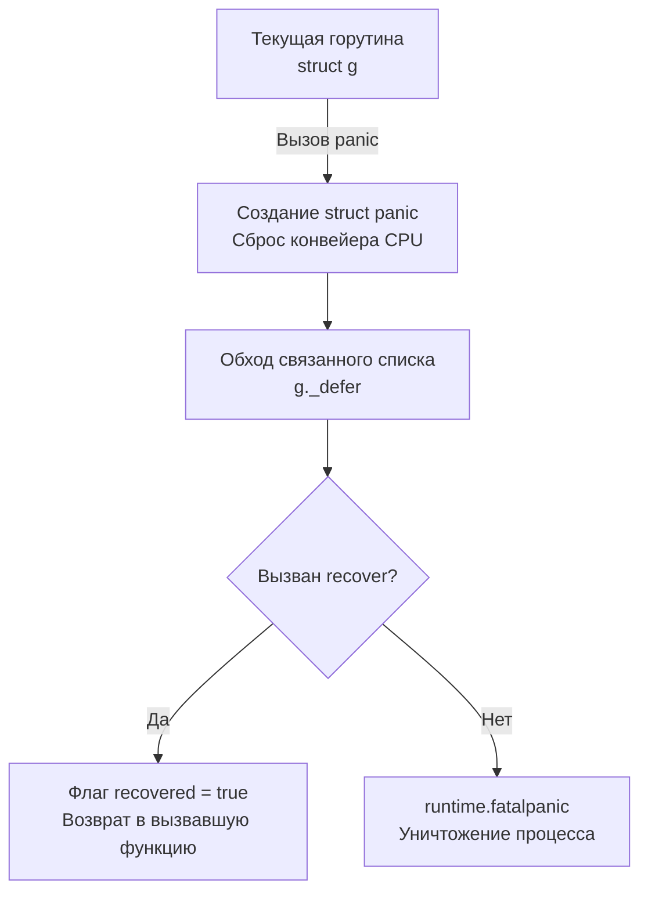

В предыдущих статьях ([[9. Errors Are Values. Почему в Go нет исключений]] и [[10. Обработка ошибок в Go. if err != nil как часть дизайна]]) мы закрепили мантру: ошибки бизнес-логики должны передаваться явно, как обычные значения. 

Но если вы обратитесь к элементу массива по индексу, выходящему за его границы (`arr[100]`), или попытаетесь разыменовать `nil`-указатель, программа завершится аварийно с выводом трассировки стека. Это механизм **Panic** (паника).

Разработчики из Java или Python часто смотрят на связку `panic` и `recover` и думают: *"Ага! Вот же они, мои любимые `throw` и `catch`, просто названы иначе. Сейчас я напишу обертку и буду использовать их как исключения"*. **Это фатальная архитектурная ошибка.**

Давайте разберем, как `panic` работает на уровне рантайма, почему ее нельзя использовать для управления бизнес-флоу, и в каких узких кейсах она абсолютно необходима.

## Под капотом: Как работает Panic

В отличие от ошибки-значения, которая обрабатывается в обычном User Space, паника запускает сложный механизм в рантайме Go.

Когда происходит паника (явно вызванная функцией `panic("...")` или аппаратно, например, при делении на ноль), компилятор вызывает функцию `runtime.gopanic`. Что происходит в этот момент:

1.  Рантайм создает структуру `_panic` и прикрепляет ее к текущей горутине (в структуру `g` в поле `g._panic`).
2.  Начинается **раскрутка стека (Stack Unwinding)**. Рантайм немедленно прекращает выполнение текущей функции.
3.  Go начинает обходить связанный список отложенных вызовов (структуры `_defer`), прикрепленных к этой горутине (поле `g._defer`), и выполняет их в порядке LIFO (Last In, First Out).
4.  Если ни один из вызовов `defer` не остановил панику (через `recover`), рантайм вызывает `runtime.fatalpanic`. Программа печатает стек-трейс и завершается с системным кодом выхода `exit 2`.



### Механика Recover

Функция `recover()` — это способ перехватить падающую горутину. Она имеет смысл **только внутри отложенного вызова (`defer`)**. 

Если `recover()` вызывается в тот момент, когда горутина находится в состоянии паники, рантайм (`runtime.gorecover`) помечает структуру `_panic` как перехваченную (`recovered = true`) и возвращает значение, которое было передано в `panic()`.

> [!warning] Ловушка / Gotcha: Продолжение выполнения
> Главное отличие `recover` от `catch` в том, куда возвращается управление. В C++ или Java после блока `catch` выполнение продолжается со следующей строки после блока `try`. 
> В Go перехват паники **не возвращает** вас в ту строчку, где произошла паника. Функция, в которой произошла паника, **немедленно прерывается и завершается**. Выполнение продолжится в функции, которая *вызвала* ту функцию, где сработал перехваченный defer. Вы не можете починить состояние и сказать процессору "попробуй выполнить ту же операцию еще раз".

## Почему эмуляция try/catch — это антипаттерн?

Предположим, вы решили игнорировать философию Go и написали такой код:

```go
// АНТИПАТТЕРН: Использование паники для бизнес-логики
func CreateUser(u *User) {
    if u.Name == "" {
        panic("validation error: empty name") // Эмулируем throw
    }
    // ...
}

func Process() {
    defer func() {
        if r := recover(); r != nil {
            log.Println("Поймали ошибку:", r) // Эмулируем catch
        }
    }()
    CreateUser(&User{})
}
```

Что с этим кодом не так на инженерном уровне?

1.  **Потеря предсказуемости для компилятора:** Компилятор не знает, что функция `CreateUser` может прервать поток выполнения. Он не может нормально оптимизировать инлайнинг (Inlining) и анализ побега (Escape Analysis), так как поток управления становится динамическим.
2.  **Огромный оверхед (Mechanical Sympathy):** Создание структур `_panic`, обход связных списков `_defer` и манипуляции со стеком стоят в сотни раз дороже, чем простой возврат 16-байтового интерфейса `error` в регистрах процессора (о чем мы говорили в предыдущих статьях).
3.  **Скрытый API:** Глядя на сигнатуру `func CreateUser(u *User)`, другой программист думает, что она всегда успешна. Ему придется читать исходники, чтобы узнать про спрятанную "мину" в виде `panic`.

> [!tip] Собеседование
> **Вопрос:** Вы написали HTTP-сервер. В одном из обработчиков запускается фоновая горутина `go doBackgroundWork()`, и внутри этой фоновой горутины происходит `panic`. В `main` или в HTTP-роутере у вас стоит глобальный `defer recover()`. Упадет ли сервер?
> **Ответ:** Сервер **упадет**. Паника принадлежит только той горутине, в которой она произошла (структура `g`). `defer`, объявленный в одной горутине, не может перехватить панику в другой. Рантайм увидит, что в фоновой горутине список `g._defer` пуст, и вызовет `fatalpanic`, убив весь процесс операционной системы. Поэтому любая критически важная фоновая горутина должна иметь свой собственный локальный `defer recover()`.

## Когда Panic и Recover действительно нужны?

Несмотря на строгий запрет на использование паник в бизнес-логике, в арсенале Senior Go-разработчика есть два легальных архитектурных паттерна их использования.

### 1. Fail-Fast на этапе инициализации (Паттерн Must)

Если ваше приложение при старте не может подключиться к БД, прочитать конфиг или скомпилировать критически важное регулярное выражение, нет смысла пытаться "восстановиться" или возвращать ошибку в `main` (чтобы там написать `if err != nil { os.Exit(1) }`). 

Идиоматичный подход — запаниковать (Fail-Fast). В стандартной библиотеке такие функции имеют префикс `Must`.

```go
// Идиоматично: переменная на уровне пакета
// Если регулярное выражение инвалидно, программист допустил баг. 
// Программа должна упасть еще до того, как начнет обслуживать трафик.
var emailRegex = regexp.MustCompile(`^[a-z]+@[a-z]+\.[a-z]+$`)

// Реализация MustCompile внутри стандартной библиотеки:
func MustCompile(str string) *Regexp {
    regexp, err := Compile(str)
    if err != nil {
        panic(`regexp: Compile(` + quote(str) + `): ` + err.Error())
    }
    return regexp
}
```

### 2. Защита границ приложения (Boundary Defenses)

Бэкенд-сервер (например, HTTP или gRPC) по своей природе работает бесконечно. Если один конкретный запрос привел к разыменованию `nil`-указателя из-за бага в коде, этот баг убьет текущую горутину. Как мы выяснили выше, необработанная паника убьет и весь процесс.

Допустить, чтобы из-за одного кривого запроса "легли" все остальные 10 000 активных соединений на этом сервере — недопустимо.

Для этого на верхнем уровне (на границе входа в систему) ставится Middleware (перехватчик) с `recover`.

```go
// Идиоматичный HTTP Middleware для защиты от падений
func PanicRecoveryMiddleware(next http.Handler) http.Handler {
    return http.HandlerFunc(func(w http.ResponseWriter, r *http.Request) {
        defer func() {
            if err := recover(); err != nil {
                // 1. Логируем стек-трейс, чтобы исправить баг
                log.Printf("PANIC RECOVERED: %v\n%s", err, debug.Stack())
                
                // 2. Отвечаем клиенту корректным 500 кодом
                http.Error(w, "Internal Server Error", http.StatusInternalServerError)
            }
        }()
        
        // Выполняем бизнес-логику
        next.ServeHTTP(w, r)
    })
}
```

Стандартный HTTP-сервер из пакета `net/http` по умолчанию содержит встроенный `recover` для каждого входящего соединения. Но в самописных TCP-серверах, воркерах Kafka или RabbitMQ вы обязаны реализовывать эту защиту самостоятельно.

## Итог

1.  **Errors** (ошибки) предназначены для ситуаций, которые **ожидаемы** в рамках работы системы (нет сети, неверный пароль, файл заблокирован).
2.  **Panic** (паники) предназначены для **багов программиста** (выход за границы массива, мертвая блокировка мьютекса, `nil`-pointer) и критических проблем при старте.
3.  **Recover** используется исключительно на границах системы (middleware, пулы воркеров), чтобы изолировать баг одной горутины от полного краха приложения. Использовать `recover` для скрытия бизнес-ошибок — строго запрещено.

На этом мы завершаем фундаментальный блок по управлению потоком выполнения и обработке ошибок. Следующий шаг для перехода из ООП-мира в мир Go — это полная перестройка мышления в области проектирования структур данных. Почему в Go нет ключевого слова `extends` и как строить сложные домены без иерархий? Разбираем в статье: [[12. Composition Over Inheritance. Почему в Go нет наследования]].