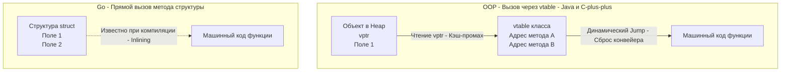

Переход от классического объектно-ориентированного программирования (ООП) к Go вызывает самый сильный архитектурный шок именно в момент проектирования доменной модели. Вы привыкли мыслить иерархиями: `Vehicle` -> `Car` -> `ElectricCar`. Вы ищете в Go ключевые слова `class` и `extends`, но находите только `struct`.

Почему создатели Go лишили нас базового инструмента ООП? 

Ответ кроется в знаменитой книге «Паттерны объектно-ориентированного проектирования» от Банды Четырех (Gang of Four), изданной еще в 1994 году. Одно из главных правил в ней гласило: **«Предпочитайте композицию наследованию»**. Создатели Go (см. [[2. История создания Go. Google, Rob Pike, Ken Thompson, Robert Griesemer]]) просто возвели эту рекомендацию в ранг закона на уровне компилятора.

Давайте разберем архитектурные и аппаратные причины отказа от наследования.

## Проблема наследования: Хрупкость и Связность

В традиционном ООП (Java, C#, C++) наследование реализует отношение **«Is-A» (Является)**. Собака *является* животным.
Проблема в том, что наследование — это самая жесткая форма связности (Tight Coupling) в программировании.

1.  **Проблема хрупкого базового класса (Fragile Base Class):** Если вы меняете поведение метода в корневом классе `Animal`, это изменение каскадно ломает или непредсказуемо меняет поведение во всех десятках классов-наследников на всех уровнях иерархии.
2.  **Проблема банана и гориллы:** Как говорил создатель языка Erlang Джо Армстронг: *"Проблема объектно-ориентированных языков в том, что они тянут за собой всю неявную среду. Вы хотели получить банан, но в итоге получили гориллу, которая держит этот банан, и все джунгли в придачу"*. Чтобы переиспользовать один метод из базового класса, вы вынуждены тащить в память все его состояние и зависимости.

Go использует подход **«Has-A» (Имеет/Содержит)**. Структуры в Go не выстраиваются в генеалогическое древо. Они собираются из мелких, независимых деталей, как конструктор Lego.

## Mechanical Sympathy: Налог на виртуальность

Помимо архитектурной громоздкости, у наследования есть огромная цена на уровне железа.

Чтобы реализовать переопределение методов (когда класс `Dog` переопределяет метод `Speak()` класса `Animal`), языки вроде C++ и Java используют механизм **динамической диспетчеризации** (Dynamic Dispatch).

Под капотом каждый объект, участвующий в наследовании, несет скрытые расходы:
*   **vptr (Virtual Pointer):** Скрытый указатель, который добавляется в начало каждого объекта в памяти.
*   **vtable (Virtual Table):** Таблица виртуальных методов — массив указателей на фактические реализации функций в памяти для данного класса.

> [!info] Под капотом: Кэш-промахи и предсказатель ветвлений
> Когда в C++ или Java вы вызываете `animal.Speak()`, процессор не может просто выполнить код. Он должен:
> 1. Прочитать объект из памяти и достать из него `vptr`.
> 2. Пойти по указателю `vptr` в другой участок памяти, где лежит `vtable`.
> 3. Найти в таблице нужный адрес функции `Speak`.
> 4. Выполнить безусловный переход (Jump) по этому адресу.
> 
> **Для CPU это мучительно больно.** Чтение по указателям (`vptr` и `vtable`) разбросано по разным участкам памяти, что приводит к постоянным промахам кэша (L1/L2 Cache Misses). Более того, адрес перехода неизвестен до момента выполнения, поэтому **Предсказатель ветвлений (Branch Predictor)** не может заранее загрузить инструкции в конвейер (Pipeline). Конвейер сбрасывается, и процессор простаивает.



В Go структура (`struct`) — это просто "тупой" кусок непрерывной памяти. В ней нет `vptr`. В ней нет заголовков объекта. Метод структуры в Go — это обычная статическая функция, куда первым неявным аргументом передается указатель на структуру. Компилятор точно знает адрес этой функции еще на этапе сборки. Это позволяет ему применять **Inlining** (встраивание кода функции прямо в место вызова), что делает код молниеносно быстрым.

*(Примечание: В Go есть динамическая диспетчеризация, но она возникает только при использовании интерфейсов (структура `iface` / `itab`), о чем мы поговорим позже. Вы платите эту цену только тогда, когда вам действительно нужен полиморфизм, а не по умолчанию для каждого объекта).*

## Отказ от иерархий в пользу ортогональности

Вместо того чтобы строить иерархии, идиоматичный Go предлагает комбинировать независимые компоненты. 

Рассмотрим антипаттерн (попытку перенести ООП-наследование в Go через интерфейсы) и правильный подход.

**Антипаттерн (Мышление категориями Java/C#):**
Попытка создать "Базовый контроллер", от которого будут наследоваться другие контроллеры.

```go
// Так пишут новички, пытаясь эмулировать наследование
type BaseController struct {
    Logger *log.Logger
    DB     *sql.DB
}

func (b *BaseController) Log(msg string) {
    b.Logger.Println(msg)
}

// Пытаемся "унаследоваться"
type UserController struct {
    BaseController // Это встраивание (Embedding), а не наследование!
}
```

> [!warning] Ловушка / Gotcha: Встраивание — это не наследование!
> Многие думают, что анонимное встраивание (Embedding) структуры в Go — это синтаксический сахар для наследования, ведь методы `BaseController` становятся доступны в `UserController` (можно вызвать `userCtrl.Log()`).
> Но это **иллюзия**. В Go нет полиморфизма подтипов для структур. Если у вас есть функция `func Process(b *BaseController)`, вы **не сможете** передать в нее `*UserController`. Компилятор выдаст ошибку `cannot use UserController as type BaseController`. Структуры не знают друг о друге, они просто делегируют вызовы.

**Идиоматичный подход (Go-way): Композиция зависимостей.**
Вместо базовых контроллеров мы явно передаем зависимости туда, где они нужны. Мы собираем приложение из ортогональных частей.

```go
// Зависимости передаются явно (Композиция)
type UserController struct {
    logger *log.Logger
    db     *sql.DB
}

func NewUserController(logger *log.Logger, db *sql.DB) *UserController {
    return &UserController{
        logger: logger,
        db:     db,
    }
}
```
Такой подход делает структуру легко тестируемой (мы можем передать моки) и избавляет нас от "гориллы с бананом" — `UserController` содержит только то, что ему реально нужно.

> [!tip] Собеседование
> **Вопрос:** Почему отсутствие наследования в Go делает рефакторинг безопаснее?
> **Ответ:** При наследовании (в классическом ООП) состояние базового класса часто защищено модификатором `protected` и неявно разделяется со всеми потомками. Изменение логики внутри `protected`-метода может привести к неочевидным сайд-эффектам в дочерних классах (Data Races или некорректному состоянию). В Go, поскольку наследования нет, состояние инкапсулировано внутри пакета. Вы не можете случайно сломать внутреннее состояние "родителя", потому что родителя не существует. Взаимодействие происходит только через явно определенные контракты.

## Итог

1.  **Наследование (Is-A)** создает жесткие иерархии, которые трудно рефакторить, и порождает проблемы производительности из-за таблиц виртуальных методов (`vtable`).
2.  **Композиция (Has-A)** в Go позволяет собирать сложные структуры из простых строительных блоков, сохраняя плотную компоновку памяти (Data Locality) без скрытых указателей.
3.  Go разделяет данные (поля структур) и полиморфизм (интерфейсы).

Мы упомянули, что в Go можно "встроить" одну структуру в другую (Embedding), чтобы сократить количество шаблонного кода. Это мощный инструмент делегирования, который часто путают с наследованием. Чтобы не попадаться в эту ловушку и понимать, как компилятор разрешает конфликты имен при делегировании, мы детально разберем этот механизм в следующей статье: [[13. Embedding. Как в Go реализуется композиция]].