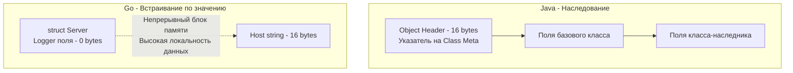

В прошлой статье ([[12. Composition Over Inheritance. Почему в Go нет наследования]]) мы разобрали фундаментальные причины, по которым создатели языка отказались от классического наследования и таблиц виртуальных методов (`vtable`). 

Однако, если мы собираем систему исключительно через композицию (передачу объектов как полей), возникает проблема "бойлерплейта" (излишнего шаблонного кода). Если у нашего компонента `DB` есть 10 методов, и мы оборачиваем его в структуру `UserRepository`, нам придется вручную писать 10 методов-оберток (делегатов), которые просто вызывают соответствующие методы `DB`.

Для решения этой проблемы в Go существует элегантный синтаксический сахар — **Встраивание (Embedding)**. Это механизм, который позволяет структурам "заимствовать" методы и поля других структур. 

Внешне это настолько похоже на наследование, что 90% разработчиков, приходящих из Java или C#, попадают в ловушку, пытаясь использовать его как `extends`. Но внутренне — это совершенно другой механизм.

## Механика встраивания: Поднятие методов (Method Promotion)

Встраивание происходит, когда вы объявляете поле в структуре **без указания имени**, оставляя только тип (так называемое анонимное поле).

```go
type Logger struct {}

func (l *Logger) Info(msg string) {
    fmt.Println("[INFO]", msg)
}

type Server struct {
    Logger // Анонимное поле - это и есть встраивание
    Host   string
}
```

Благодаря встраиванию, все методы и поля внутренней структуры `Logger` "поднимаются" (promote) на уровень внешней структуры `Server`. Мы можем вызывать их напрямую:

```go
srv := Server{Host: "localhost"}
// Метод Info доступен напрямую у srv
srv.Info("Server started") 

// Под капотом компилятор транслирует это в:
srv.Logger.Info("Server started")
```

Это выглядит как наследование, но разница кроется в том, как это обрабатывается компилятором и располагается в памяти.

## Под капотом: Layout в памяти (Mechanical Sympathy)

Как мы помним, в Java при наследовании (`class Server extends Logger`) создается единый объект, который имеет сложный заголовок (Object Header) и содержит метаданные о классе-родителе для обеспечения полиморфизма.

В Go встраивание по значению (`Logger`, а не `*Logger`) означает, что компилятор просто размещает данные встроенной структуры **внутри** внешней структуры как единый непрерывный блок памяти. Никаких заголовков, никаких `vptr`.



Это делает встраивание по значению феноменально эффективным для процессора (отличная Data Locality), так как при загрузке структуры `Server` в L1-кэш, поля `Logger` загружаются вместе с ней в одной кэш-линии.

## Ловушка №1: Перекрытие вместо Переопределения (Shadowing vs Overriding)

Это самый болезненный удар для тех, кто мыслит категориями ООП. В классическом наследовании вы можете переопределить виртуальный метод базового класса (Override), и базовый класс начнет вызывать вашу новую реализацию.

В Go нет динамической диспетчеризации (Virtual Dispatch) для структур. **Методы перекрываются (Shadowing), а не переопределяются.**

Рассмотрим классический пример с собеседований:

```go
type Base struct{}

func (b Base) Print() {
    fmt.Println("Base Print")
}

// Метод Run вызывает метод Print
func (b Base) Run() {
    b.Print()
}

type Derived struct {
    Base
}

// Перекрываем метод Print у Derived
func (d Derived) Print() {
    fmt.Println("Derived Print")
}

func main() {
    d := Derived{}
    d.Run() // ЧТО БУДЕТ ВЫВЕДЕНО?
}
```

> [!tip] Собеседование
> **Вопрос:** Что выведет код выше и почему?
> **Ответ:** Код выведет `Base Print`. 
> В Java или C# (если бы `Print` был виртуальным) вывелось бы `Derived Print`. Но в Go метод `Run` жестко привязан к ресиверу `Base`. Когда мы вызываем `d.Run()`, компилятор транслирует это в `d.Base.Run()`. Внутри метода `Run` ресивером является структура `Base`, которая **ничего не знает** о существовании обертки `Derived`. Поэтому `b.Print()` вызывает реализацию из `Base`. Встраивание — это просто синтаксический сахар для агрегации, здесь нет нисходящего полиморфизма.

## Ловушка №2: Полиморфизм подтипов отсутствует (Subtyping)

Даже если структура `Server` встроила в себя `Logger`, она **не является** `Logger`. Отношение `Is-A` (Является) в Go не работает для структур.

```go
func HandleLog(l Logger) {}

srv := Server{}
// HandleLog(srv) // ❌ ОШИБКА КОМПИЛЯЦИИ: cannot use srv (type Server) as type Logger
```

Компилятор строго следит за типизацией. Если вам нужна функция, которая может принимать и `Server`, и `Logger`, вы обязаны использовать **интерфейсы**, а не структурное встраивание. Полиморфизм в Go реализуется исключительно через `interface`.

## Встраивание по указателю vs Встраивание по значению

Вы можете встраивать структуры двумя способами: `Struct` (по значению) и `*Struct` (по указателю). Выбор кардинально влияет на управление памятью (Escape Analysis) и потокобезопасность.

```go
type Server struct {
    *Logger // Встраивание по указателю
}
```

**Особенности встраивания по указателю:**
1.  **Требует инициализации:** Если вы создадите `srv := Server{}`, поле `Logger` будет равно `nil`. При попытке вызвать `srv.Info()` произойдет `panic: nil pointer dereference`. Вы обязаны инициализировать его: `srv := Server{Logger: &Logger{}}`.
2.  **Разделение состояния:** Если несколько `Server` будут иметь указатель на один и тот же `Logger`, они будут делить общее состояние (разделяемая память).
3.  **Нагрузка на GC:** Встраивание по указателю часто заставляет компилятор аллоцировать `Logger` в куче (Heap), увеличивая нагрузку на Garbage Collector и создавая промахи кэша (индирекция указателей).

> [!warning] Ловушка / Gotcha: Встраивание sync.Mutex
> Очень часто разработчики встраивают мьютекс в свою структуру, чтобы сделать методы потокобезопасными:
> ```go
> type Cache struct {
>     sync.RWMutex // Встраивание по значению
>     data map[string]string
> }
> ```
> Теперь можно писать `c.Lock()` напрямую. Но это таит огромную опасность: **внешняя структура (Cache) становится некопируемой.** Передача `Cache` по значению в другую функцию приведет к скрытому копированию состояния мьютекса (включая его внутренние флаги блокировки), что гарантированно приведет к состоянию гонки (Data Race) или Deadlock. 
> Если вы встраиваете `sync.Mutex`, вы обязаны передавать вашу структуру *только* по указателю. Во многих случаях безопаснее сделать мьютекс обычным приватным полем: `mu sync.RWMutex`, чтобы не выставлять `Lock()` в публичный API вашей структуры (согласно принципу инкапсуляции).

## Конфликты имен (Коллизии)

Что произойдет, если мы встроим две структуры, у которых есть методы с одинаковыми именами?

```go
type ReaderA struct{}
func (a ReaderA) Read() {}

type ReaderB struct{}
func (b ReaderB) Read() {}

type MultiReader struct {
    ReaderA
    ReaderB
}
```

Компилятор Go обрабатывает коллизии очень прагматично:
1.  Само по себе объявление `MultiReader` **ошибкой не является**.
2.  Ошибка компиляции `ambiguous selector` (неоднозначный выбор) возникнет **только в момент вызова** `m.Read()`.
3.  Чтобы разрешить конфликт, программист должен явно указать путь: `m.ReaderA.Read()`.

## Итог: Как правильно использовать встраивание

Встраивание (Embedding) в Go — это не замена наследованию. Это утилитарный инструмент для:
1.  **Уменьшения бойлерплейта** (когда вам нужно проксировать вызовы к внутреннему компоненту).
2.  **Частичной реализации интерфейсов** (вы можете встроить заглушку или базовую реализацию в тестовый мок).

Senior Go-разработчик всегда помнит: **встроенная структура ничего не знает о внешней**. Они разделены, ортогональны и собираются вместе только для удобства написания кода.

Мы разобрались, почему структуры не могут формировать иерархии и наследовать полиморфизм. Но бэкенд-системы требуют абстракций: нам нужен способ подменять реализации (например, использовать `PostgresDB` в продакшене и `MockDB` в тестах). Если структуры не могут решать эту задачу, как это сделать? 

Ответ кроется в самой мощной концепции языка — структурной типизации. Переходим к следующей фундаментальной теме: [[14. Интерфейсы в Go как альтернатива классическому ООП]].