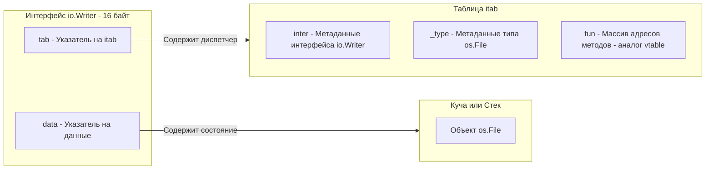

В языках с классическим ООП (Java, C#, C++) полиморфизм тесно связан с иерархией наследования. Если вы хотите, чтобы функция могла принимать объекты разных классов, эти классы должны **явно** унаследовать общий интерфейс (`implements`) или базовый абстрактный класс (`extends`).

В Go наследования нет (как мы выяснили в [[12. Composition Over Inheritance. Почему в Go нет наследования]]). Всю тяжесть обеспечения полиморфизма берут на себя интерфейсы. Но реализованы они совершенно иначе. 

Если в C++ интерфейс (чисто абстрактный класс) — это контракт, вшитый в сам объект через указатель `vptr` и таблицу `vtable`, то в Go интерфейс — это **самостоятельная структура данных (контейнер)**, которая "оборачивает" ваш объект в момент присваивания. 

Чтобы перестать бороться с компилятором, нужно понять, как этот контейнер устроен в памяти.

## Под капотом: iface и eface

В рантайме Go интерфейсы не являются абстракциями. Это конкретные структуры данных, состоящие ровно из двух машинных слов (16 байт на 64-битных системах).

Существует два типа интерфейсов:
1.  **`eface` (Empty Interface):** Пустой интерфейс `interface{}` (или `any` в современном Go), который не содержит методов.
2.  **`iface`:** Интерфейс с хотя бы одним методом (например, `io.Reader` или `error`).

Рассмотрим структуру `iface`, так как именно она обеспечивает виртуальную диспетчеризацию (полиморфизм).

```go
// Упрощенный код из исходников рантайма (runtime2.go)
type iface struct {
    tab  *itab          // Указатель на таблицу методов (метаданные)
    data unsafe.Pointer // Указатель на реальные данные вашей структуры
}
```

Когда вы присваиваете конкретную структуру интерфейсу, например:
```go
var w io.Writer = os.Stdout
```
Происходит неявная упаковка. Компилятор и рантайм создают этот 16-байтный "толстый указатель" (Fat Pointer), где `data` указывает на память структуры `os.File`, а `tab` указывает на специальную служебную таблицу `itab`.



> [!info] Под капотом: Таблица `itab`
> Таблица `itab` — это сердце полиморфизма в Go. Она генерируется **для каждой уникальной пары "Интерфейс + Конкретный Тип"**. 
> В ней хранится хэш типа (для быстрого приведения интерфейсов через `Type Assertion`), ссылка на метаданные исходной структуры и, самое главное, массив `fun`. Этот массив содержит физические адреса функций в памяти. 
> Когда вы вызываете `w.Write()`, процессор считывает `tab`, смещается до массива `fun`, достает оттуда адрес метода `Write` для типа `os.File` и делает косвенный переход (Indirect Jump). 

## Mechanical Sympathy: Цена полиморфизма

Теперь, зная внутреннее устройство, мы можем оценить реальную "цену" интерфейсов с точки зрения железа.

1.  **Аллокация в куче (Escape Analysis):** Когда вы передаете структуру по значению в интерфейс (`var w io.Writer = MyStruct{}`), компилятор вынужден скопировать вашу структуру и сохранить указатель на нее в поле `iface.data`. Если интерфейс "утекает" из функции (Escape Analysis), эта копия будет аллоцирована в куче (Heap), нагружая сборщик мусора.
2.  **Промахи кэша (Cache Misses):** Вызов метода через интерфейс — это всегда переход по двум указателям (`tab` -> `fun` и `data` -> `реальная память`). Это может вызвать промахи в кэшах L1/L2, если таблицы `itab` или сами данные вытеснены из кэша.
3.  **Блокировка Inlining:** Компилятор Go активно инлайнит (встраивает) прямые вызовы функций, чтобы избежать накладных расходов на вызов (переключение стека регистров). Но он **крайне редко** может заинлайнить метод, вызванный через интерфейс, так как точный адрес функции (Dynamic Dispatch) часто неизвестен до момента выполнения.

**Прагматичный вывод:** Не используйте интерфейсы "на всякий случай" (как это часто делают в Java с `IUserService`). Если у структуры только одна реализация — возвращайте указатель на структуру. Интерфейс имеет смысл только тогда, когда вам действительно нужен полиморфизм.

## Ловушка: Указатель на интерфейс (*interface)

Это классический паттерн анти-ООП в Go, на котором часто попадаются выходцы из C# или C++. 

Вы привыкли, что объекты нужно передавать по ссылке, чтобы избежать копирования. Вы видите, что функция принимает интерфейс, и думаете: *"Сделаю-ка я указатель на интерфейс, чтобы было эффективнее!"*

**Антипаттерн:**
```go
func WriteData(w *io.Writer) { // ❌ ОШИБКА АРХИТЕКТУРЫ
    // ...
}
```

Почему это ужасно?
1. Интерфейс — это уже контейнер, содержащий указатели (те самые 16 байт `tab` и `data`). Передавая интерфейс по значению, вы копируете всего 16 байт в регистрах CPU (практически бесплатно).
2. Создавая `*io.Writer`, вы создаете указатель на 16-байтную структуру. Это двойная косвенность (Pointer to Pointer to Data). Процессору придется сделать лишний прыжок по памяти.
3. Это ломает структурную типизацию. Вы больше не можете передать `*os.File` в эту функцию, потому что `*os.File` не является указателем на `io.Writer`.

> [!warning] Ловушка / Gotcha: Интерфейсы передаются только по значению
> Запомните правило: **Интерфейсы в Go всегда передаются по значению.** Сам интерфейс внутри себя может хранить как структуру по значению, так и указатель на нее. Но сигнатура функции всегда должна принимать `io.Writer`, а не `*io.Writer`. Единственное легальное исключение в стандартной библиотеке — это функция `json.Unmarshal(data, &v)`, где используется указатель на пустой `interface{}`, чтобы библиотека рефлексии могла подменить тип под капотом.

## Динамическая природа Go

В отличие от `vtable` в C++, где таблицы строятся строго на этапе компиляции для известной иерархии, генерация `itab` в Go может происходить как при компиляции (для статических присваиваний), так и **в рантайме**.

Если вы приводите один интерфейс к другому (Type Assertion):
```go
var r io.Reader = GetReader()
if closer, ok := r.(io.Closer); ok {
    closer.Close()
}
```
Рантайм Go в этот момент должен проверить: "А есть ли у исходного типа (спрятанного внутри `io.Reader`) метод `Close`?". Он ищет совпадение методов, и если находит, генерирует новую таблицу `itab` для `io.Closer` и **кэширует** ее в глобальной хэш-таблице `itabTable` внутри рантайма. Последующие приведения этого же типа будут работать за $O(1)$ практически мгновенно.

> [!tip] Собеседование
> **Вопрос:** Если интерфейс — это просто 16 байт, содержащие два указателя (`tab` и `data`), что происходит при сравнении интерфейсов (`if a == b`)?
> **Ответ:** Интерфейсы равны тогда и только тогда, когда равны оба их внутренних указателя. Сначала сравниваются указатели `tab` (совпадают ли динамические типы). Если типы разные — интерфейсы не равны. Если типы одинаковые, рантайм сравнивает указатели `data`. Если это указатели — сравниваются адреса в памяти. Если внутри интерфейса лежит тип-значение (например, `int`), то сравниваются сами значения в памяти по смещению `data`.

## Итог

1.  Интерфейс в Go — это не абстрактный контракт, а конкретный "толстый указатель" (`iface`), оборачивающий ваши данные.
2.  Вызов через интерфейс стоит дороже прямого вызова метода структуры из-за механизма `itab` (кэш-промахи и блокировка инлайнинга).
3.  Интерфейсы всегда передаются по значению. Указатель на интерфейс — архитектурный баг.

Мы разобрали *как* интерфейсы работают в памяти. Но мы до сих пор не коснулись их главной поведенческой особенности — почему для реализации интерфейса не нужно ключевое слово `implements`, и как это меняет архитектуру целых микросервисов. Эта концепция называется Duck Typing, и мы детально разберем ее в следующей статье: [[15. Duck Typing и неявная реализация интерфейсов]].