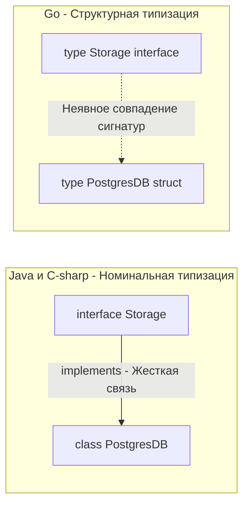
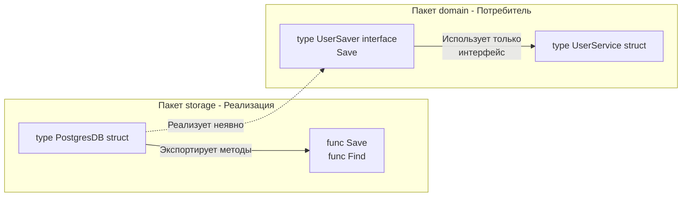

Переход из мира номинальной типизации (Java, C#, PHP) в мир Go часто сопровождается чувством потери контроля. Вы создаете интерфейс, создаете структуру, реализуете методы, но нигде не пишете `implements`. 

Компилятор сам магическим образом догадывается, что ваша структура подходит под интерфейс. Этот механизм называется **Duck Typing (Утиная типизация)**, или, если говорить академически строго, **Статическая структурная типизация**.

Знаменитая фраза гласит: *"Если это выглядит как утка, плавает как утка и крякает как утка, то это, вероятно, и есть утка"*. 

Давайте разберем, почему создатели Go выбрали этот подход, как он работает на уровне компилятора и какие архитектурные суперспособности (и ловушки) он дает бэкенд-разработчику.

## Номинальная типизация vs Структурная типизация

В Java или C# используется **Номинальная типизация** (от слова *name* — имя). 
Чтобы класс `PostgresDB` мог быть использован там, где ожидается интерфейс `IStorage`, он должен **явно** заявить об этом: `class PostgresDB implements IStorage`. Класс знает о существовании интерфейса. Это создает жесткую зависимость на уровне исходного кода.

В Go используется **Структурная типизация**. 
Интерфейс в Go — это просто набор сигнатур методов (контракт). Любой тип (структура, базовый тип, функция), который имеет методы с точно такими же именами, аргументами и возвращаемыми значениями, **автоматически (неявно)** реализует этот интерфейс. 



> [!tip] Собеседование
> **Вопрос:** Является ли типизация в Go классическим Duck Typing, как в Python или JavaScript?
> **Ответ:** Нет. В Python Duck Typing работает **в рантайме** (Runtime). Интерпретатор Python попытается вызвать метод `quack()` у объекта прямо во время выполнения программы, и если метода нет — выбросит исключение `AttributeError`. 
> В Go типизация **статическая**. Совпадение методов проверяется **на этапе компиляции**. Компилятор Go не соберет бинарник, если вы попытаетесь передать структуру в функцию, ожидающую интерфейс, но структура не реализует нужный метод. Поэтому правильный термин для Go — статическая структурная типизация.

## Под капотом: Как компилятор собирает itab

В предыдущей статье ([[14. Интерфейсы в Go как альтернатива классическому ООП]]) мы выяснили, что интерфейс под капотом — это структура `iface`, содержащая указатель на `itab` (таблицу методов) и указатель на данные.

Но как и когда создается этот `itab`, если нет слова `implements`?

Когда компилятор видит строку `var s Storage = PostgresDB{}`, он делает следующее:
1. Берет отсортированный список методов требуемого интерфейса `Storage`.
2. Берет отсортированный список методов типа `PostgresDB`.
3. Запускает алгоритм сравнения двух списков за линейное время $O(N+M)$.
4. Если все методы интерфейса найдены в структуре и их сигнатуры (типы аргументов и возвращаемые значения) строго совпадают, компилятор **генерирует** структуру `itab` для этой конкретной пары "Тип + Интерфейс" и вшивает ее в бинарный файл.

Если вы приводите типы в рантайме (через Type Assertion: `v, ok := myVar.(io.Reader)`), рантайм выполняет ту же самую проверку через хэши имен методов и кэширует сгенерированный `itab` в памяти, чтобы последующие вызовы работали за $O(1)$.

## Ловушка: Value Receiver vs Pointer Receiver

Это самая распространенная проблема при работе с неявными интерфейсами в Go, на которой "сыпятся" на собеседованиях 90% Middle-разработчиков.

Рассмотрим код:

```go
type Saver interface {
    Save() error
}

type User struct {
    Name string
}

// Метод объявлен для УКАЗАТЕЛЯ на User (Pointer Receiver)
func (u *User) Save() error {
    fmt.Println("User saved")
    return nil
}

func main() {
    // Вариант 1:
    var s1 Saver = &User{} // Успешно скомпилируется

    // Вариант 2:
    var s2 Saver = User{}  // ❌ ОШИБКА КОМПИЛЯЦИИ!
}
```

Ошибка компиляции звучит так: 
`User does not implement Saver (Save method has pointer receiver)`

Но подождите! Если у нас есть переменная `u := User{}`, мы можем спокойно написать `u.Save()`, и это сработает. Почему же нельзя положить значение (Value) в интерфейс?

>[!info] Под капотом: Адресуемость памяти (Addressability)
> Когда вы вызываете метод `u.Save()` у переменной `u`, переданной по значению, компилятор Go делает синтаксический сахар: он берет адрес переменной под капотом `(&u).Save()`. Это возможно, потому что переменная `u` **адресуема** (лежит в известном месте на стеке).
> 
> Но когда вы кладете значение в интерфейс (`var s2 Saver = User{}`), структура `User` **копируется** внутрь контейнера `iface` (в поле `data`). Согласно спецификации языка Go, данные внутри интерфейса **неадресуемы** (not addressable). 
> Компилятор не может взять указатель на копию внутри интерфейса, чтобы передать его в функцию `Save(u *User)`. Поэтому компилятор защищает вас: **Методы с pointer-ресивером не входят в набор методов (Method Set) value-типа.**

**Правило:**
* Если метод принимает указатель (`*T`), интерфейс реализует **только указатель** `*T`.
* Если метод принимает значение (`T`), интерфейс реализуют **и значение `T`, и указатель `*T`**.

## Хак: Проверка реализации во время компиляции

Поскольку нет `implements`, иногда (особенно при разработке библиотек) хочется быть уверенным, что ваша структура случайно не перестала удовлетворять важному интерфейсу (например, кто-то переименовал метод, и ошибка всплывет только там, где структуру попытаются использовать).

Для этого Senior Go-разработчики используют пустую инициализацию на уровне пакета:

```go
type MyHandler struct {}

func (h *MyHandler) ServeHTTP(w http.ResponseWriter, r *http.Request) {
    // ... логика ...
}

// Защита времени компиляции (Compile-time Check)
var _ http.Handler = (*MyHandler)(nil)
```

Что здесь происходит:
1. `(*MyHandler)(nil)` — мы берем `nil` и приводим его к типу указателя на `MyHandler`. Мы не выделяем память (никаких аллокаций в куче).
2. `var _ http.Handler = ...` — мы пытаемся присвоить этот типизированный `nil` интерфейсу `http.Handler` и сразу выбрасываем результат в пустой идентификатор `_`.
3. Если сигнатура `ServeHTTP` изменится, этот код моментально сломает компиляцию, выступая в роли аналога `implements`.

## Архитектурный сдвиг: Инверсия зависимостей по-гошному

Структурная типизация в Go кардинально меняет подход к проектированию слоев приложения.

В Java (из-за номинальной типизации) пакет, который реализует базу данных (Producer), обычно обязан импортировать пакет, где лежит интерфейс. Возникает проблема циклических зависимостей, которую решают созданием общих пакетов `common` или `interfaces` (свалки интерфейсов).

В Go действует правило: **Потребитель (Consumer) определяет интерфейс.**



Пакет `storage` (где лежит база данных) **ничего не знает** про пакет `domain`. Он просто реализует свои методы `Save` и `Find`.
Пакет `domain` сам локально объявляет интерфейс `UserSaver` ровно на те методы, которые ему нужны (например, только `Save`). 

Это дает невероятную свободу:
1. Вы можете подменять реализации, не заставляя авторов этих реализаций писать `implements YourInterface`. (Например, вы можете создать интерфейс, под который идеально подойдет структура `os.File` из стандартной библиотеки, хотя авторы `os.File` знать не знают о вашем проекте).
2. Вы полностью избавляетесь от пакетов `interfaces`.

## Итог

1.  **Duck Typing в Go статический.** Проверка контрактов происходит во время компиляции (или в рантайме при явном приведении типов), исключая неожиданные `Method Not Found` ошибки в проде.
2.  **Pointer vs Value:** Внимательно следите за типом ресивера. Pointer-методы нельзя вызывать на value-интерфейсах из-за проблем с адресуемостью скопированной памяти.
3.  **Архитектура:** Структурная типизация разворачивает зависимости. Интерфейсы должны жить там, где они используются, а не там, где они реализуются.

Но если мы можем описывать интерфейсы прямо на стороне потребителя, возникает логичный вопрос: какого размера должны быть эти интерфейсы? Почему в Go так редко встречаются интерфейсы с 10 методами и почему стандартная библиотека состоит из интерфейсов вроде `io.Reader` и `io.Writer`, содержащих всего по одной функции? 

Об этом — в следующей статье: [[16. Почему маленькие интерфейсы лучше больших]].