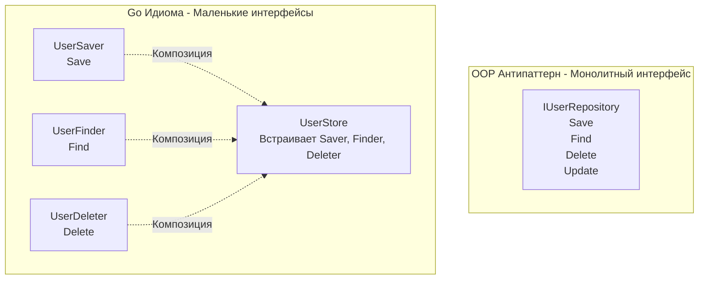

Одной из самых вредных привычек, которую бэкенд-разработчики приносят из мира Java или C# в Go, является создание "интерфейсов-монолитов". 

Типичный пример из энтерпрайз-ООП — это `IUserRepository`, который содержит 15 методов: `Create`, `Update`, `Delete`, `FindByID`, `FindByEmail`, `ListAll` и так далее. 

В Go такие интерфейсы считаются грубым антипаттерном. Создатель языка Роб Пайк выразил это одной из самых известных архитектурных пословиц языка: **«Чем больше интерфейс, тем слабее абстракция» (The bigger the interface, the weaker the abstraction).**

Давайте разберем, что скрывается за этой фразой, как размер интерфейса влияет на рантайм и почему стандартная библиотека Go состоит из интерфейсов длиной в одну строку.

## Парадокс силы абстракции

Что такое сильная абстракция? Это концепция, под которую подходит огромное количество совершенно разных вещей.

Возьмем интерфейс `io.Reader` из стандартной библиотеки Go:
```go
type Reader interface {
    Read(p[]byte) (n int, err error)
}
```
Он содержит всего один метод. Из-за того, что он настолько мал, под эту абстракцию (благодаря неявной реализации, см. [[15. Duck Typing и неявная реализация интерфейсов]]) подходит **всё что угодно**:
* Файл на жестком диске (`os.File`).
* Сетевой TCP-сокет (`net.Conn`).
* Тело HTTP-запроса (`http.Request.Body`).
* Буфер в оперативной памяти (`bytes.Buffer`).
* Архиватор ZIP, шифратор AES, генератор случайных чисел.

Вы можете написать функцию, принимающую `io.Reader`, и она будет работать с десятками системных ресурсов, даже с теми, которые еще не были изобретены на момент написания вашего кода. Это **максимально сильная абстракция**.

Теперь представим интерфейс `IUserRepository` с 15 методами. Сколько структур в мире могут удовлетворить этому интерфейсу? Ровно одна — ваша реализация базы данных (ну, может быть, еще одна структура в виде мока для тестов). Это **слабая абстракция**, которая по сути является просто зеркалом конкретного класса, а не самостоятельной концепцией.

## Развязывание архитектурных узлов

Большие интерфейсы порождают жесткую связность кода (Tight Coupling).

Представьте, что вы пишете микросервис. У вас есть бизнес-слой (Service) — отправка приветственных писем, и слой хранения (Repository).

**Антипаттерн (Толстый интерфейс):**
```go
// Где-то в пакете repository объявлен монстр
type IUserRepository interface {
    Create(user *User) error
    Delete(id int) error
    FindByID(id int) (*User, error)
    // и еще 10 методов...
}

// В пакете service мы используем его
func SendWelcomeEmail(repo IUserRepository, userID int) error {
    user, _ := repo.FindByID(userID)
    // отправляем письмо...
    return nil
}
```
Что здесь не так? Функция `SendWelcomeEmail` нуждается только в чтении (`FindByID`). Но мы передаем ей объект, который умеет удалять (`Delete`) и создавать (`Create`) пользователей. Мы нарушаем принцип минимальных привилегий. Кроме того, пакет `service` теперь жестко зависит от огромного контракта.

**Идиоматичный подход Go (Маленькие интерфейсы на стороне потребителя):**
```go
// Пакет service сам объявляет крошечный интерфейс
type UserGetter interface {
    FindByID(id int) (*User, error)
}

func SendWelcomeEmail(getter UserGetter, userID int) error {
    user, _ := getter.FindByID(userID)
    // отправляем письмо...
    return nil
}
```
Теперь функция `SendWelcomeEmail` защищена. Она физически не может случайно удалить пользователя. Она зависит только от одной узкой абстракции. 

> [!tip] Собеседование
> **Вопрос:** В чем разница между подходом к проектированию интерфейсов в Java и в Go?
> **Ответ:** В Java интерфейсы обычно проектируются "сверху вниз" (сначала пишем контракт базы данных `IRepository`, потом реализуем его). В Go интерфейсы появляются "снизу вверх" (Emergent Design). Вы пишете конкретные реализации (например, `PostgresDB`), а затем на стороне функции-потребителя выделяете из нее только те методы, которые нужны прямо сейчас (например, `UserGetter`).

## Боль тестирования и Mock-объектов

Большие интерфейсы превращают написание unit-тестов в ад.

Если ваша функция принимает `IUserRepository` (с 15 методами), то для написания теста вам нужно создать структуру (Mock), которая удовлетворяет этому интерфейсу. Вам придется:
1. Писать заглушки (stubs) для 14 методов, которые даже не используются в тесте.
2. Или использовать кодогенераторы вроде `gomock` или `mockery`, которые создадут тысячи строк шаблонного кода, замедляющего сборку и усложняющего чтение.

Если же функция принимает `UserGetter` (1 метод), вы можете написать мок прямо внутри функции теста в три строчки:

```go
type mockGetter func(id int) (*User, error)
func (m mockGetter) FindByID(id int) (*User, error) { return m(id) }

func TestSendEmail(t *testing.T) {
    // Вся реализация мока в одной строке!
    getter := mockGetter(func(id int) (*User, error) { return &User{Name: "Ivan"}, nil })
    SendWelcomeEmail(getter, 1)
}
```
Маленькие интерфейсы избавляют от необходимости тянуть тяжелые фреймворки для мокирования в 80% случаев.

## Композиция интерфейсов

Что делать, если вам всё-таки нужен объект, который умеет и читать, и писать? В Go вы создаете большие интерфейсы, собирая их из маленьких (интерфейсная композиция).

Пример из стандартной библиотеки:
```go
type ReadWriter interface {
    Reader // встраиваем интерфейс (будет доступен метод Read)
    Writer // встраиваем интерфейс (будет доступен метод Write)
}
```



Вы собираете архитектуру из атомарных контрактов.

## Mechanical Sympathy: Размер интерфейса и itab

Маленькие интерфейсы полезны не только для чистоты кода, но и имеют скрытую выгоду на уровне компиляции и рантайма.

> [!info] Под капотом: Генерация itab
> В статье про внутренности интерфейсов мы говорили о таблице `itab`. Компилятору (и рантайму при динамическом приведении типов) нужно сопоставить методы конкретной структуры с методами интерфейса. 
> Алгоритм сопоставления имеет сложность $O(N + M)$, где $N$ — количество методов интерфейса, а $M$ — количество методов структуры.
> *   Если интерфейс состоит из 1 метода (малое $N$), генерация `itab` и проверка совпадений происходит феноменально быстро, экономя такты CPU при рантайм-кастах (Type Assertions).
> *   Меньший размер интерфейсов также сокращает размер бинарного файла, так как компилятору нужно хранить меньше метаданных (Type Information) о каждом контракте.

## Итог

1.  **Интерфейсы в Go описывают поведение, а не сущности.** Файл (`os.File`) — это сущность, у нее десятки методов. А "что-то, что можно читать" (`io.Reader`) — это поведение.
2.  **Интерфейсы из 1-3 методов — это золотой стандарт Go.** Они обеспечивают максимальную переиспользуемость (сильную абстракцию).
3.  **Безопасность и Тестируемость:** Маленькие интерфейсы ограничивают область видимости методов для функций и позволяют писать моки в две строки без автогенерации.

Внимательный читатель, пришедший из ООП, мог заметить: подход "маленьких интерфейсов" подозрительно напоминает **Принцип разделения интерфейса (Interface Segregation Principle)** из SOLID. Это не совпадение. В следующей статье мы разберем, как принципы Роберта Мартина (Дяди Боба) ложатся на архитектуру Go и почему некоторые из них в этом языке мутировали до неузнаваемости. Переходим к: [[17. SOLID в мире Go. Что осталось, а что изменилось]].