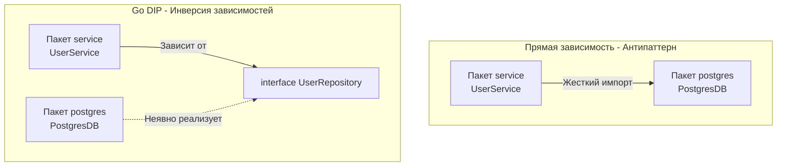

Принципы SOLID, сформулированные Робертом Мартином (Дядей Бобом) в начале 2000-х годов, создавались для классических объектно-ориентированных языков (C++, Java). Поскольку Go отказался от иерархий наследования, классов и полиморфизма подтипов, многие разработчики считают, что SOLID в Go не работает.

Это глубокое заблуждение. SOLID — это не про синтаксис. Это про управление зависимостями и стоимость изменения кода. В Go эти принципы не просто работают, они встроены в саму философию языка. Однако их реализация выглядит совершенно иначе, чем в энтерпрайз-ООП.

Давайте разберем каждый из пяти принципов через призму структурной типизации, композиции и работы под капотом.

## S: Single Responsibility Principle (Принцип единственной ответственности)

*ООП-определение:* У класса должна быть только одна причина для изменения.

В Go нет классов. Этот принцип применяется на трех уровнях: **Пакеты (Packages), Структуры (Structs) и Интерфейсы (Interfaces).**

Как мы разбирали в [[7. The Zen of Go и официальные принципы языка]], идиоматичный пакет в Go должен иметь одну четкую семантическую цель. 
Если вы назовете пакет `utils` или `common`, вы нарушите SRP на макроуровне. Пакет `utils` имеет бесконечное количество причин для изменения: кто-то добавил функцию парсинга дат, кто-то — хеширование паролей. Это приведет к постоянным конфликтам при слиянии веток (Merge Conflicts) и раздуванию импортов.

На микроуровне SRP обеспечивается маленькими интерфейсами. Если ваш интерфейс называется `UserHandler`, он делает слишком много. Если он называется `UserCreator` (имеет один метод `Create`) — он следует SRP.

## O: Open/Closed Principle (Принцип открытости-закрытости)

*ООП-определение:* Программные сущности должны быть открыты для расширения, но закрыты для модификации.

В Java или C# этот принцип исторически достигался через наследование (`extends`). Базовый класс "закрыт" для изменений, но вы можете создать класс-наследник, "открыв" его поведение для расширения через переопределение методов (`@Override`).

Поскольку в Go нет наследования, OCP реализуется исключительно через **Композицию (Embedding)** и **Интерфейсы**.

**Пример OCP через интерфейсы:**
Представьте функцию парсинга конфигурации:
```go
// Плохо: Жестко привязано к файлу
func ParseConfig(file *os.File) (*Config, error) { ... }
```
Если завтра вам потребуется читать конфиг из сети или из переменной окружения, вам придется *модифицировать* эту функцию, нарушая OCP.

```go
// Хорошо: Функция закрыта для модификации, но открыта для расширения
func ParseConfig(r io.Reader) (*Config, error) { ... }
```
Теперь вы можете передать сюда `os.File`, `net.Conn` или `bytes.Buffer`. Логика `ParseConfig` не изменится.

> [!info] Под капотом: Mechanical Sympathy и OCP
> Почему важно "закрывать" код для модификации с точки зрения железа?
> Если вы постоянно добавляете новые условия (`if t == "file" ... else if t == "network" ...`) в одну большую функцию, ее размер в машинных инструкциях растет. Это приводит к вытеснению полезного кода из кэша инструкций процессора (I-Cache Misses). 
> Разделяя поведение через интерфейсы, "горячий" цикл вашей бизнес-логики остается компактным и целиком помещается в кэш L1, а разные реализации вызываются динамически только по необходимости.

## L: Liskov Substitution Principle (Принцип подстановки Барбары Лисков)

*ООП-определение:* Объекты в программе должны быть заменяемы экземплярами их подтипов без изменения правильности выполнения программы.

В Go нет подтипов (Subtyping) для структур. Однако этот принцип критически важен при работе с интерфейсами. Компилятор Go (благодаря статической типизации) гарантирует, что методы совпадут по сигнатуре. Но компилятор **не может проверить семантику**. 

Принцип Лисков в Go ложится на плечи разработчика: **любая структура, реализующая интерфейс, не должна нарушать ожидаемое поведение контракта.**

> [!warning] Ловушка / Gotcha: Нарушение LSP через контекст и горутины
> Представьте интерфейс:
> ```go
> type Repository interface {
>     Save(ctx context.Context, data[]byte) error
> }
> ```
> Вызывающий код ожидает, что функция синхронная и учитывает таймаут из `context.Context`. 
> Вы пишете новую реализацию (например, для тестов или асинхронного сброса на диск), которая внутри метода `Save` запускает `go func() { ... }()` и мгновенно возвращает `nil`, игнорируя контекст отмены.
> **Это жесткое нарушение LSP.** Ваша новая реализация ведет себя не так, как ожидает клиент. Это приведет к "утечке" горутин (Goroutine Leak) или ложным срабатываниям в тестах.

## I: Interface Segregation Principle (Принцип разделения интерфейса)

*ООП-определение:* Клиенты не должны зависеть от методов, которые они не используют.

Это самый "родной" для Go принцип из всей пятерки SOLID. Ему была целиком посвящена предыдущая статья: [[16. Почему маленькие интерфейсы лучше больших]].

В отличие от C# или Java, где ISP требует от создателя класса заранее дробить свои контракты (например, `IReadOnlyCollection` и `ICollection`), в Go Duck Typing позволяет клиенту самому выделить нужный интерфейс постфактум. Вы физически защищены от зависимости от лишних методов, если просто объявляете интерфейс из одного-двух методов прямо рядом с функцией, которая его принимает.

## D: Dependency Inversion Principle (Принцип инверсии зависимостей)

*ООП-определение:* Модули верхнего уровня не должны зависеть от модулей нижнего уровня. Оба должны зависеть от абстракций.

В классическом ООП для этого часто применяют огромные фреймворки (Spring IoC в Java, ASP.NET Core DI в C#), которые используют рефлексию для связывания графа зависимостей (Dependency Injection) в рантайме.

В Go магия рефлексии презирается (см. [[5. Философия Go. Простота, читаемость и прагматизм]]). Инверсия зависимостей реализуется явно, вручную, через конструкторы (функции `New...`) и структурную типизацию.



В идиоматичном Go-коде мы прокидываем зависимости сверху вниз в `main.go`.

```go
// Пакет service
type UserRepository interface {
    FindUser(id int) (*User, error)
}

type Service struct {
    repo UserRepository // Зависимость от абстракции
}

// Конструктор - точка инъекции
func NewService(r UserRepository) *Service {
    return &Service{repo: r}
}

// Пакет main (Сборка графа)
func main() {
    db := postgres.NewDB("localhost:5432")
    
    // Передаем конкретную реализацию туда, где ожидается абстракция
    srv := service.NewService(db) 
    
    // ...
}
```

> [!info] Под капотом: Борьба с циклическими импортами
> В отличие от многих языков, компилятор Go **строго запрещает циклические импорты** (A импортирует B, а B импортирует A). Это архитектурное решение Кена Томпсона: дерево импортов должно быть направленным ациклическим графом (DAG). Это делает компиляцию феноменально быстрой (компилятор не делает многопроходный парсинг).
> Если вы нарушаете принцип DIP и делаете жесткие связки между модулями, вы неизбежно словите ошибку компиляции `import cycle not allowed`. Инверсия зависимостей через интерфейсы на стороне потребителя (как на схеме выше) — это единственный легальный способ разорвать цикл зависимостей в Go.

> [!tip] Собеседование
> **Вопрос:** В Java принято делать интерфейс `IService` и его реализацию `ServiceImpl`. Нужно ли делать так же в Go?
> **Ответ:** Категорически нет. Интерфейс ради интерфейса — это антипаттерн в Go. Если у структуры (например, бизнес-сервиса) есть только одна реализация, и ее никто не собирается мокировать в тестах вышестоящего слоя (например, контроллеры тестируются интеграционно), то сервис должен быть просто структурой `*Service`. Интерфейсы должны извлекаться из структур только тогда, когда появляется реальная потребность в полиморфизме (DIP).

## Итог

Архитектура по SOLID в Go выглядит так:
1.  **S:** Пакеты сфокусированы на одной задаче.
2.  **O:** Поведение расширяется за счет композиции и передачи интерфейсов, а не наследования.
3.  **L:** Реализации интерфейсов строго соблюдают семантику контракта, включая работу с блокировками и горутинами.
4.  **I:** Интерфейсы состоят из 1-3 методов, определяемых потребителем.
5.  **D:** Граф зависимостей строится вручную в пакете `main` через явную передачу интерфейсов в функции-конструкторы.

Теперь, когда мы разобрали механику и архитектурные принципы языка, пришло время собрать их в единую ментальную модель. В следующей статье мы подведем промежуточный итог и ответим на главный вопрос этого раздела: как перестроить мозг, чтобы перестать бороться с компилятором? Читайте в следующей статье.