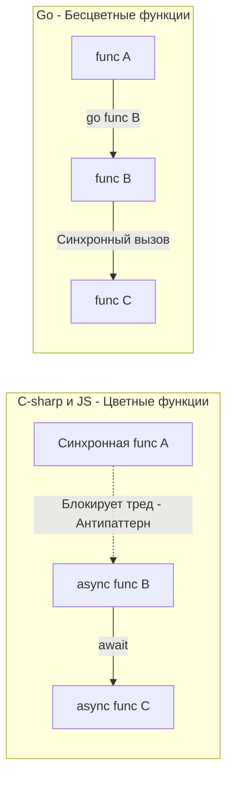

Переход на Go с популярных объектно-ориентированных или скриптовых языков часто сопровождается стадиями принятия неизбежного: отрицание (почему нет нормальных классов?), гнев (почему я должен писать `if err != nil` в сотый раз?), торг (может, напишем макросы или обертки с `panic`?), депрессия (мой код выглядит как на С из 80-х) и, наконец, принятие — понимание красоты простоты.

Чтобы ускорить этот процесс и сразу перейти к написанию идиоматичного и быстрого кода, вам нужно отказаться от четырех устоявшихся парадигм, вбитых в голову годами работы с фреймворками вроде Spring, .NET, Laravel или Django.

## 1. Отказ от "Слоёной Архитектуры" в пользу Данных (Data-Oriented Thinking)

В энтерпрайз-ООП нас учили мыслить сущностями и их поведением (Encapsulation). Мы создавали `UserService`, в который инжектили `UserRepository`, который оборачивал маппер из базы данных. Данные были просто "топливом" для объектов.

В Go необходимо переключить фокус на **то, как данные лежат в памяти и как они перемещаются**. 

>[!info] Под капотом: Mechanical Sympathy и Локальность Данных
> В Java или PHP объекты аллоцируются в куче (Heap), и массивы объектов — это массивы указателей. Когда процессор пытается итерироваться по ним, он постоянно прыгает по памяти, получая Cache Miss. 
> В Go структура `struct` — это просто плоский кусок памяти. Срез `[]User` аллоцирует структуры единым непрерывным блоком. Если вы начнете разбивать эти структуры на кучу мелких интерфейсов (ради "абстракции") или передавать везде указатели `*User` (вместо значений `User`), вы убьете этот аппаратный бонус. Компилятор (Escape Analysis) отправит все в Heap, GC начнет задыхаться, а CPU — простаивать.

**Как мыслить:** Сначала спроектируйте структуру данных (память), затем напишите функции, которые эти данные трансформируют (поведение). Не создавайте объекты ради объектов. В Go "состояние" и "поведение" ортогональны (как мы обсуждали в [[12. Composition Over Inheritance. Почему в Go нет наследования]]).

## 2. Проблема цветных функций (Colorless Functions)

Если вы пришли из C#, Python или JavaScript, вы привыкли к разделению мира на две части: синхронный код и асинхронный код (`async/await`). 
Боб Нистром (Bob Nystrom) назвал это "Проблемой цветных функций". 
Синхронные функции (синие) не могут просто так вызывать асинхронные (красные). Если вы добавляете `await` в функцию, она становится "красной", что заставляет вас "красить" в красный цвет все функции вверх по стеку вызовов (каскадное заражение).

В Go **все функции одного цвета**. 



**Как мыслить:** В Go вы пишете обычный, прямой, блокирующийся код. Если вам нужно сделать сетевой запрос или сходить в базу данных, вы просто вызываете метод. Вам не нужны `Task` или `Promise`.

> [!info] Под капотом: Магия netpoll
> Почему прямой код в Go не вешает сервер? В рантайме Go встроен планировщик (Scheduler) и сетевой поллер (netpoll на базе epoll в Linux).
> Когда ваша горутина делает вызов `http.Get()`, она *не блокирует* поток операционной системы (OS Thread). Рантайм Go перехватывает этот системный вызов, регистрирует файловый дескриптор сокета в `epoll`, "усыпляет" текущую горутину (переводит в статус `Gwaiting`) и отдает поток ОС другой горутине. Как только ядро ОС сообщает (через `epoll`), что данные пришли, рантайм "будит" вашу горутину, и она продолжает работу так, будто это был обычный синхронный вызов. Вы получаете эффективность асинхронного IO без синтаксического "async-ада".

## 3. Библиотеки вместо Фреймворков (Inversion of Control вручную)

В Spring (Java) или Symfony (PHP) фреймворк контролирует ваш код. Вы пишете классы, расставляете аннотации (`@Controller`, `@Autowired`), а "магия" фреймворка сама находит их при старте через рефлексию (Reflection), строит граф зависимостей и вызывает ваши методы.

В Go **вы контролируете библиотеки**. 
Идиоматичный бэкенд на Go имеет ярко выраженную функцию `main()`. В ней нет аннотаций. Вы руками создаете подключение к БД, руками создаете репозиторий, руками передаете его в сервис, руками регистрируете сервис в HTTP-маршрутизаторе (Router) и руками запускаете сервер.

```go
// Так выглядит идиоматичный Inversion of Control в Go
func main() {
    db := postgres.NewConnection(...)
    
    userRepo := repository.NewUserRepo(db)
    emailClient := external.NewEmailClient(...)
    
    userService := service.NewUser(userRepo, emailClient)
    
    httpHandler := api.NewHandler(userService)
    
    http.ListenAndServe(":8080", httpHandler)
}
```

Это может показаться шагом назад к "копипасте", но это сознательное архитектурное решение. В Go избегают рефлексии в рантайме. Явный граф зависимостей компилируется моментально, стартует за миллисекунды, а любая ошибка конфигурации всплывает на этапе сборки, а не в виде `NullPointerException` в проде.

## 4. Смерть классических паттернов проектирования

Когда вы открываете книгу Gang of Four (Паттерны проектирования), вы видите решения проблем, вызванных ограничениями ООП. В Go многие из них либо не нужны, либо реализуются в одну строку.

*   **Singleton (Одиночка):** В Java требует сложной логики с двойной проверкой блокировки (Double-Checked Locking) или статических блоков. В Go — это переменная на уровне пакета и вызов `sync.Once`.
*   **Factory (Фабрика):** В ООП — это отдельный класс. В Go — это просто функция `NewUser()`.
*   **Builder (Строитель):** В Java используется для классов с огромным числом опциональных параметров. В Go это решается паттерном **Functional Options** (Функциональные опции).

>[!tip] Собеседование
> **Вопрос:** Как в Go реализовать аналог паттерна Builder для конфигурации сложных структур?
> **Ответ:** С помощью паттерна Functional Options. Мы создаем структуру с приватными полями, и конструктор `NewServer(opts ...Option)`, который принимает вариативный список опций. Каждая опция — это функция, которая применяет изменение к структуре.
> ```go
> type Server struct { host string; port int }
> type Option func(*Server)
> 
> func WithPort(p int) Option { return func(s *Server) { s.port = p } }
> 
> // Использование:
> srv := NewServer(WithPort(8080))
> ```
> Это идиоматично, так как позволяет расширять API без изменения сигнатуры основной функции (соблюдая OCP из SOLID).

## Итог: Перестройка ментальной модели

Чтобы стать Senior Go Engineer, вы должны принять три догмы (см. [[5. Философия Go. Простота, читаемость и прагматизм]]):

1.  **Бойлерплейт — это не всегда плохо.** Если код явно описывает бизнес-процесс, пусть он даже дублируется или требует постоянных проверок `err != nil`, он лучше, чем код, скрытый за магией макросов или неявных перехватчиков.
2.  **Оставляйте контроль у вызывающего.** Не запускайте горутины внутри своих библиотек тайно. Возвращайте синхронный результат, а клиент сам решит, нужно ли ему оборачивать это в `go func()`.
3.  **Компонуйте, не наследуйте.** Стройте программы из мелких блоков (Data + Methods), связанных крошечными интерфейсами по месту потребления.

В этой статье мы несколько раз упомянули, что Go избегает "магии", аннотаций и скрытых состояний. Почему создатели языка заняли столь радикальную позицию в отношении "удобных" фич, и к чему приводит чрезмерная магия в других языках? Мы глубоко разберем этот феномен в следующей статье: [[19. Почему в Go избегают магии и скрытого поведения]].