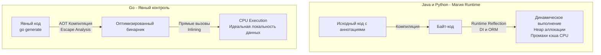

Переход в Go из экосистем вроде Spring (Java), .NET (C#) или Laravel (PHP) часто вызывает ломку. Вы привыкли, что рутинные задачи решаются одной аннотацией: `@Transactional` открывает транзакцию в БД, `@Autowired` собирает зависимости, а обращение к `user.Profile` магическим образом делает SQL-запрос (Lazy Loading) под капотом.

В Go ничего этого нет. Язык заставляет вас писать явный код: вручную открывать транзакции, вручную передавать `Context`, вручную сканировать строки из базы данных. 

Для новичка это выглядит как шаг назад, в каменный век. Но для Senior-инженера это осознанный архитектурный компромисс. Философия Go гласит: **Явное лучше неявного (Explicit is better than implicit)**. Давайте разберем, какую цену мы платим за "магию" на уровне железа и рантайма, и почему отказ от нее делает распределенные системы надежнее.

## Что такое "Магия" в программировании?

В контексте инженерии "магия" — это скрытый поток управления (Control Flow) или неявное изменение состояния, которое невозможно отследить, просто читая исходный код текущей функции.

Магия обычно реализуется через три механизма:
1.  **Рефлексия (Reflection)** в рантайме.
2.  **Глобальное/Локальное состояние потока** (ThreadLocal).
3.  **Перехватчики (Interceptors / Proxies)**, генерируемые динамически.

Все три механизма в Go считаются антипаттернами, если применяются для реализации бизнес-логики.

## Цена рефлексии (Mechanical Sympathy)

Почти все "магические" фреймворки (DI-контейнеры, тяжелые ORM) работают на базе рефлексии. Они анализируют типы данных во время выполнения программы (в рантайме), читают метаданные и динамически вызывают функции.

В Go есть пакет `reflect`, но его использование в "горячем" пути выполнения (Hot Path) — это архитектурное преступление. 

> [!info] Под капотом: Как рефлексия ломает оптимизации компилятора
> Компилятор Go славится своим мощным анализом (Escape Analysis) и встраиванием функций (Inlining). 
> 
> Когда вы используете `reflect.ValueOf(x)`, переменная `x` упаковывается в пустой интерфейс `eface`. Компилятор **слепнет**. Он больше не знает, какой конкретно тип там лежит и как он будет использоваться. В результате:
> 1.  **Провал Escape Analysis:** Компилятор пессимистично предполагает, что переменная "утечет" (Escape), и принудительно аллоцирует её в куче (Heap), даже если это было простое число. Возрастает нагрузка на Garbage Collector.
> 2.  **Запрет Inlining:** Динамический вызов метода через рефлексию не может быть встроен в место вызова.
> 3.  **Кэш-промахи CPU:** Динамическая диспетчеризация (косвенные переходы по адресам, вычисленным в рантайме) ломает предсказатель ветвлений (Branch Predictor) процессора.

**Решение в Go: Кодогенерация.**
Вместо того чтобы парсить JSON или мапить SQL-запросы в структуры через рефлексию в рантайме, в Go используют утилиты кодогенерации (например, `easyjson` или `sqlc`). Кодогенерация работает на этапе компиляции (AOT — Ahead of Time), создавая явный, "скучный", но феноменально быстрый статически типизированный код, который идеально оптимизируется процессором.



## Проклятие неявного контекста: ThreadLocal vs context.Context

В Java или C#, когда к вам приходит HTTP-запрос, вы можете извлечь ID пользователя или ID транзакции где угодно в глубине приложения (даже в слое БД), просто обратившись к статическому контексту запроса. Это работает благодаря механизму `ThreadLocal` — переменным, привязанным к текущему потоку операционной системы (OS Thread).

В Go разработчики часто просят: *"Дайте нам Goroutine-Local Storage (GLS)!"* Но создатели языка (и лично Брэд Фитцпатрик) категорически отказываются это делать.

> [!warning] Ловушка / Gotcha: M:N Планировщик и скрытое состояние
> Почему Goroutine-Local Storage — плохая идея? В Go используется планировщик `M:N`. Ваша горутина (`G`) не привязана жестко к потоку ОС (`M`). Если горутина блокируется на I/O, планировщик отрывает ее от потока ОС и переносит на другой. 
> Если бы в Go было скрытое состояние (GLS), при каждом переключении контекста (которое происходит миллионы раз в секунду) рантайму приходилось бы копировать и синхронизировать гигантские объемы метаданных, убивая производительность.
> Более того, если вы запускаете фоновую горутину `go doWork()`, должна ли она наследовать скрытое состояние родителя? Ответов на этот вопрос нет, и любой выбор ведет к непредсказуемым багам (например, утечкам памяти в скрытых хранилищах).

**Решение в Go: Явный `context.Context`.**
В Go вы обязаны передавать `context.Context` первым аргументом в каждую функцию, которая делает I/O (база данных, сеть) или может быть отменена.

```go
// Явно видно, что функция зависит от контекста вызова
func (r *Repository) GetUser(ctx context.Context, id int) (*User, error) {
    // ID транзакции или таймауты извлекаются явно
    reqID := ctx.Value("request_id")
    
    // ...
}
```

Это выглядит как лишний бойлерплейт. Но читая код, вы сразу видите граф зависимостей. Вы точно знаете, передается ли контекст отмены дальше по стеку вызовов, или фоновая задача отвязана от HTTP-запроса клиента. В распределенных микросервисах эта прозрачность спасает тысячи часов дебага.

## ORM: Скрытие сетевых вызовов

Рассмотрим классический пример из мира Active Record (Ruby on Rails, Laravel, Hibernate):

```java
User user = repository.findById(1);
// Магия: обращение к геттеру делает скрытый сетевой SQL-запрос к БД
String companyName = user.getCompany().getName(); 
```

Для Go-разработчика этот код — воплощение архитектурного ужаса. Обращение к полю объекта (или вызов геттера) выглядит как операция в оперативной памяти $O(1)$, которая выполняется за наносекунды. Но под капотом она блокирует поток на десятки миллисекунд (сетевой вызов, парсинг ответа, аллокации памяти).

Если вы вставите такой код в цикл (Проблема $N+1$ запросов), ваша система ляжет под нагрузкой.

**Философия Go:** Любая операция, которая может упасть из-за сети или требует времени, **обязана возвращать `error`**. Сетевой вызов не может маскироваться под доступ к локальному свойству.

```go
// Идиоматично: Все сетевые вызовы явные
user, err := repo.FindUserByID(ctx, 1)
if err != nil { ... }

// Чтобы получить компанию, мы делаем ЯВНЫЙ вызов, который может вернуть ошибку
company, err := repo.FindCompanyByUserID(ctx, user.ID)
if err != nil { ... }
```

>[!tip] Собеседование
> **Вопрос:** Почему в Go-сообществе не любят популярные ORM (например, GORM), предпочитая `sqlx`, `pgx` или `sqlc`?
> **Ответ:** ORM часто скрывают сложность SQL под абстракциями на базе рефлексии `interface{}`. Это приводит к трем проблемам:
> 1. Из-за рефлексии (пустых интерфейсов) происходит массовая аллокация структур в куче.
> 2. Скрываются неоптимальные SQL-запросы (сложно понять, какой именно JOIN сгенерирует ORM).
> 3. Нарушается принцип локальности рассуждений: изменение поля структуры может сломать запрос в рантайме (паника), а не на этапе компиляции. Инструменты вроде `sqlc` решают это, генерируя типобезопасный код напрямую из "сырых" SQL-файлов на этапе сборки.

## Принцип локальности рассуждений (Local Reasoning)

Отказ от магии в Go служит одной глобальной цели — обеспечению **Локальности рассуждений**. 

Локальность рассуждений означает, что когда разработчик читает функцию `ProcessPayment()`, он может понять все ее побочные эффекты, не открывая 15 других файлов, не изучая конфигурационные XML/YAML-файлы и не удерживая в голове граф DI-контейнера. 

*   Если в Go создается транзакция, вы видите `tx.Begin()` и `defer tx.Rollback()`. 
*   Если происходит валидация, вы видите вызов `Validate()`. Она не происходит магическим образом перед входом в контроллер из-за аннотации `@Valid`.
*   Если возвращается ошибка, вы видите `return err`. Она не пробрасывается скрыто наверх через Exceptions.

## Итог

Go — язык инженеров, которые устали "дебажить фреймворки". В сложных распределенных системах на первый план выходит предсказуемость. 

1.  **Магия прячет сложность, но не устраняет её.** Когда магия ломается в рантайме (циклическая зависимость в DI, Lazy Loading вне транзакции), починить её сложнее, чем написать явный код с самого начала.
2.  **Рефлексия вредна для железа.** Она обходит Escape Analysis и Inlining, создавая нагрузку на GC. Кодогенерация всегда предпочтительнее.
3.  **Нет скрытому контексту.** Явная передача состояния (`context.Context`) — единственный безопасный способ управления жизненным циклом в конкурентной среде M:N планировщика.

Отказ от магии означает, что вы работаете с сырыми данными и их базовыми значениями. И здесь Go предлагает еще одну элегантную концепцию, которая позволяет писать меньше инициализационного кода, не прибегая к магии. Мы поговорим об этом в следующей статье: [[20. Zero Value как часть дизайна языка]].