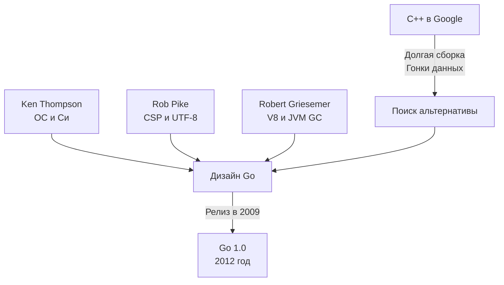

## 45 минут, которые изменили бэкенд-разработку

Существует известная байка (которая является абсолютной правдой), что идея создания Go родилась в конце 2007 года в офисе Google. Три инженера — Роб Пайк (Rob Pike), Роберт Гризмер (Robert Griesemer) и Кен Томпсон (Ken Thompson) — ждали, пока скомпилируется гигантский плюсовый проект. В это же время активно обсуждался черновик нового стандарта C++0x (будущего C++11), который добавлял в язык еще больше сложных абстракций.

Во время этого 45-минутного ожидания они пришли к выводу, что экосистема C++ стала слишком неповоротливой. Язык обрастал фичами, время сборки увеличивалось экспоненциально из-за заголовочных файлов, а сложность управления памятью в многопоточной среде приводила к бесконечным багам. 

Им не нужен был язык с бóльшим количеством возможностей. Им нужен был язык с **меньшим** количеством возможностей, но феноменально быстрой компиляцией, встроенной многопоточностью и строгим фокусом на инженерную продуктивность.

Чтобы понять, почему Go получился именно таким, нужно посмотреть на бэкграунд его создателей. Это не случайные люди, а титаны индустрии, определившие облик современных операционных систем и компиляторов.

## Отцы-основатели и их влияние на архитектуру языка

### 1. Кен Томпсон (Ken Thompson)
**Кто он:** Соавтор операционной системы UNIX (вместе с Деннисом Ритчи). Создатель языка B (предшественника C). Соавтор кодировки UTF-8. Человек, чьи решения лежат в основе работы с файловыми системами и процессами в любом современном Linux.

**Его влияние на Go:**
*   **Синтаксис и прагматизм:** Go унаследовал свой C-подобный синтаксис (фигурные скобки, указатели, структуры) во многом благодаря Томпсону. Он хотел создать "улучшенный C".
*   **Отношение к указателям:** В Go есть указатели для передачи ссылок на память (что критично для производительности), но **отсутствует адресная арифметика** (нельзя сделать `ptr++`). Это радикально сократило класс уязвимостей, связанных с выходом за границы буфера (buffer overflow), характерных для C/C++.
*   **Быстрая компиляция:** Архитектура пакетов и парсинга исходников в Go спроектирована так, чтобы компилятору никогда не приходилось читать один и тот же файл дважды.

### 2. Роб Пайк (Rob Pike)
**Кто он:** Разработчик операционных систем Plan 9 и Inferno. Соавтор UTF-8. В 80-х и 90-х годах активно экспериментировал с языками для конкурентного программирования (Newsqueak, Alef).

**Его влияние на Go:**
*   **Concurrency (Конкурентность):** Именно Пайк принес в Go математическую модель CSP (Communicating Sequential Processes, разработанную Тони Хоаром). Вместо разделения памяти и использования тяжелых мьютексов, Пайк реализовал концепцию горутин (легковесных потоков) и каналов (очередей типизированных сообщений). Подробнее мы разберем это в [[24. Concurrency Is Not Parallelism. Философия конкурентности в Go]].
*   **Форматирование кода:** Пайк ненавидел споры о стиле кода. Поэтому вместе с языком родился инструмент `gofmt`. Форматирование кода перестало быть вопросом вкуса и стало частью компилятора.
*   **Строки:** Нативная поддержка UTF-8 «из коробки» (где исходный код всегда UTF-8, а строки — это неизменяемые массивы байт) — это прямое следствие того, что создатели языка сами когда-то придумали UTF-8.

### 3. Роберт Гризмер (Robert Griesemer)
**Кто он:** Эксперт по компиляторам и виртуальным машинам. Работал над движком V8 (JavaScript) для Google Chrome и виртуальной машиной Java HotSpot.

**Его влияние на Go:**
*   **Garbage Collector (GC):** Несмотря на сильные C-корни, создатели поняли, что язык для массового и конкурентного бэкенда **обязан** иметь сборщик мусора. Гризмер принес экспертизу в построении высокопроизводительных рантаймов.
*   **Парсер и AST:** Гризмер написал первую версию парсера Go и помог спроектировать язык таким образом, чтобы он легко анализировался машинами (отсюда отсутствие сложных макросов и предсказуемость грамматики).

> [!info] Под капотом: Почему Go не мог обойтись без сборщика мусора?
> Для программистов на C++ часто кажется кощунством наличие GC в "системном" языке. Но Гризмер и Пайк понимали важную вещь: **ручное управление памятью разрушает абстракцию конкурентности.**
> Если у вас есть объект, который передается через канал (channel) из одной горутины в другую, кто должен вызывать `free()`? Если использовать умные указатели (как `std::shared_ptr` в C++), то счетчики ссылок требуют атомарных операций процессора (Compare-And-Swap). В высоконагруженных многопоточных системах атомарные счетчики вызывают жесточайший **False Sharing** (инвалидацию кэш-линий L1/L2 процессора между ядрами), что убивает производительность.
> Интегрированный в рантайм Concurrent Mark-and-Sweep Garbage Collector в Go решает эту проблему: вы можете дешево выделять память (через bump-pointer allocation в локальном кэше горутины), а рантайм сам уберет мусор асинхронно, минимизируя задержки.

## Смещение парадигмы: От академичности к инженерии

Go часто критикуют энтузиасты функционального программирования (за отсутствие развитой системы типов вроде монад) и ветераны ООП (за отсутствие наследования). 

Но создатели Go (особенно Роб Пайк) всегда подчеркивали: **Go проектировался не для Computer Science, а для Software Engineering.** 

Программирование — это когда один человек пишет программу. Инженерия (Software Engineering) — это когда код живет годами, разрабатывается сотнями людей, масштабируется на тысячи серверов, а требования бизнеса постоянно меняются. 

> [!tip] Собеседование
> **Вопрос:** Почему в Go так долго не было Generics (Обобщений), и почему создатели сопротивлялись их внедрению до версии 1.18?
> **Ответ:** Кен Томпсон и Роберт Гризмер изначально не включили дженерики в язык, потому что они нарушали базовые компромиссы. Любая реализация дженериков — это выбор из трех зол:
> 1. Медленная компиляция и раздувание бинарника из-за мономорфизации (как шаблоны в C++ или Rust).
> 2. Медленное исполнение из-за упаковки типов (boxing) и виртуальных вызовов (как в Java/C# с Type Erasure).
> 3. Усложнение синтаксиса и компилятора.
> Лишь спустя более 10 лет был найден алгоритм реализации дженериков (на базе GCShape / словарей типов), который устроил команду с точки зрения компромисса между временем компиляции и скоростью работы в рантайме.

Знание истории языка помогает понять, почему в нем нет "магических" макросов или неявных преобразований типов. Томпсон, Пайк и Гризмер строили инструмент для суровых реалий промышленной разработки бэкенда, где понятность кода и предсказуемость производительности важнее синтаксического сахара.

Чтобы лучше понять этот инженерный компромисс, в следующей статье мы детально разберем: [[3. Какие проблемы существующих языков пытался решить Go]].