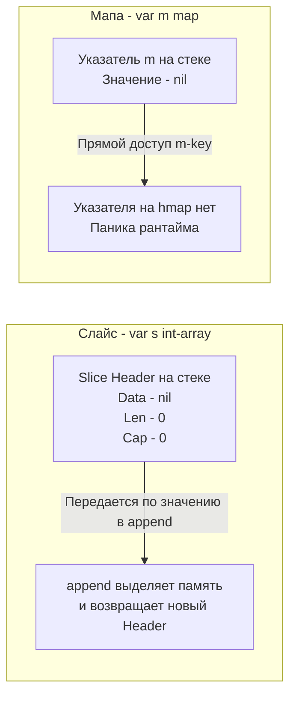

В языках программирования семейства C/C++ объявление переменной без ее инициализации приводит к тому, что в ней оказывается "мусор" — случайные байты, которые остались в этом участке оперативной памяти от предыдущей программы. Это стало причиной тысяч критических уязвимостей (чтение чужой памяти) и плавающих багов.

В Java или C# примитивы инициализируются нулями, но ссылочные типы получают значение `null`. Обращение к методу неинициализированного объекта моментально приводит к знаменитому `NullPointerException` (Тони Хоар назвал свое изобретение null-ссылок "ошибкой на миллиард долларов"). Вы обязаны явно вызывать конструкторы: `User u = new User();`.

В Go создатели пошли иным путем. В языке заложен жесткий гарант: **память всегда инициализируется нулями, и это "нулевое значение" должно быть полезным**. Эта концепция устраняет необходимость в написании шаблонных конструкторов и делает код чище.

Давайте разберем, как обнуление работает на уровне железа, как оно встроено в рантайм, и как правильно проектировать структуры под философию Zero Value.

## Mechanical Sympathy: Аппаратное обнуление памяти

Когда компилятор Go аллоцирует память на стеке горутины или в куче (Heap), он обязан гарантировать, что там нет старых данных. 

Для бэкенд-разработчика может показаться, что принудительное обнуление гигабайт памяти — это дорогостоящая операция, которая замедлит сервер. Но создатели Go (в частности, эксперты по компиляторам) идеально синхронизировали этот процесс с возможностями современных процессоров.

> [!info] Под капотом: Векторные инструкции и memclr
> В рантайме Go за обнуление памяти отвечает высокооптимизированная процедура `memclrNoHeapPointers` (и её вариации), написанная на чистом ассемблере под каждую архитектуру (x86_64, ARM64).
> Вместо того чтобы обнулять память байт за байтом в цикле, Go использует **векторные инструкции процессора (SIMD, AVX/AVX2)**. Процессор способен за один такт записать нули в блок памяти размером 32 или 64 байта, используя 256-битные или 512-битные регистры (например, `YMM` или `ZMM`).
> Кроме того, когда ОС выдает рантайму Go новые страницы памяти из ядра (через syscall `mmap`), ядро Linux *уже* отдает страницы, обнуленные на аппаратном уровне контроллером памяти (Zero Page). Таким образом, инициализация переменных нулями в Go стоит процессору практически ничего.

## "Делайте нулевое значение полезным"

Как мы упоминали в статье [[8. Go Proverbs. Практический смысл известных цитат]], это официальная максима языка. 

Поскольку компилятор всё равно "бесплатно" инициализирует все поля вашей структуры нулями (`0` для int, `false` для bool, `nil` для указателей), ваша задача как архитектора — спроектировать структуру так, чтобы эти нули означали **состояние готовности**, а не инвалидное состояние.

### Примеры идеального Zero Value из стандартной библиотеки

Самый яркий пример — мьютекс `sync.Mutex`. 
Вам не нужно писать `mu := NewMutex()`. Вы просто объявляете переменную:

```go
var mu sync.Mutex
mu.Lock()
// ...
mu.Unlock()
```

Как это работает под капотом? Внутри `sync.Mutex` есть целочисленное поле `state int32`. Когда структура создается, `state` равен `0`. Разработчики пакета `sync` спроектировали логику так, что `0` (Zero Value) означает "мьютекс разблокирован". Первый же вызов `Lock()` просто меняет атомарно `0` на `1`.

Другой пример — буфер в памяти `bytes.Buffer`:

```go
var buf bytes.Buffer
buf.WriteString("Привет")
```

Под капотом `bytes.Buffer` содержит слайс байт `buf[]byte`. При старте он равен `nil`. Метод `WriteString` проверяет: если внутренний слайс равен `nil`, он лениво (lazy) аллоцирует память при первой записи. Это экономит ресурсы: если вы создали буфер, но так ничего в него и не записали, вы не потратили ни одного байта в куче.

## Ловушка: Слайсы против Мап (Slices vs Maps)

Отношение к Zero Value для встроенных коллекций — это одна из главных причин паник у разработчиков уровня Junior/Middle. Вы должны четко понимать, как рантайм работает со слайсами и мапами.

**Сценарий 1: Zero Value Слайса**
```go
var s[]int // s == nil
s = append(s, 1) // Работает идеально!
```

**Сценарий 2: Zero Value Мапы**
```go
var m map[int]int // m == nil
m[1] = 1 // 💥 PANIC: assignment to entry in nil map
```

Почему `append` к `nil`-слайсу работает, а запись в `nil`-мапу вызывает панику?



> [!tip] Собеседование
> **Вопрос:** Почему запись в `nil` мапу вызывает панику, а чтение из `nil` мапы — нет? И почему `nil` слайс можно использовать с `append`?
> **Ответ:** 
> 1. Слайс — это структура-значение (Slice Header: `ptr`, `len`, `cap`). Функция `append` принимает этот Header по значению. Если `ptr == nil`, `append` просто аллоцирует новый массив в куче, создает новый Header и возвращает его. Вы перезаписываете старый `nil`-хидер новым.
> 2. Мапа (`map`) под капотом — это **указатель** на сложную структуру `hmap` (которая содержит хэш-семена, массивы бакетов и счетчики). Присваивание `m[key] = value` — это синтаксический сахар, который транслируется компилятором в вызов функции `mapassign(m, key)`. Эта функция не возвращает новую мапу, она пытается изменить существующую структуру `hmap`. Если указатель `m` равен `nil`, изменять нечего — происходит разыменование нулевого указателя (паника).
> 3. Чтение из `nil` мапы (`v := m[key]`) транслируется в `mapaccess`. Эта функция написана безопасно: она проверяет, если указатель `m == nil`, она просто возвращает Zero Value для типа значения (например, `0` для `int`), не пытаясь читать память.

Поэтому для мап всегда нужен явный конструктор: `m := make(map[int]int)`.

## Как проектировать API с учетом Zero Value?

Представьте, что вы пишете микросервис и проектируете структуру конфигурации соединения с БД:

**Антипаттерн (Не учитывает Zero Value):**
```go
type DBConfig struct {
    Timeout int // 0 - это таймаут?
}

// Вынуждает писать конструкторы и проверки:
func DefaultConfig() DBConfig {
    return DBConfig{Timeout: 30} // Если забыли вызвать, будет 0
}
```

Если клиент создаст `var cfg DBConfig` и передаст ее в подключение, база данных отвалится с таймаутом `0` миллисекунд.

**Идиоматичный подход (Lazy Initialization):**
Спроектируйте код так, чтобы `0` означало "использовать дефолт".

```go
func (c *DBConfig) getTimeout() time.Duration {
    if c.Timeout == 0 {
        return 30 * time.Second // Ленивая подстановка дефолта
    }
    return time.Duration(c.Timeout)
}
```

Либо, если `0` — это валидное бизнес-значение (например, "ждать бесконечно"), и вам нужно отличать "не задано" от "задано 0", в Go используют указатели: `Timeout *int`. Если указатель `nil` — значит не задано (Zero Value для указателя).

## Ловушка: Встраивание и Zero Value

В статье [[13. Embedding. Как в Go реализуется композиция]] мы обсуждали встраивание. Если вы встраиваете структуру по указателю, вы ломаете концепцию полезного Zero Value.

```go
type Server struct {
    *sync.Mutex // Встроено по указателю
    State int
}

func main() {
    var s Server // Zero value инициализирует указатель нулем (nil)
    s.Lock()     // 💥 PANIC: nil pointer dereference
}
```
**Правило:** Встраивайте примитивы синхронизации и внутренние состояния всегда **по значению**, чтобы переменная на стеке `var s Server` была полностью инициализирована и готова к работе без единой аллокации в куче.

## Итог

1.  **Zero Value избавляет от конструкторов.** Вы экономите сотни строк кода инициализации по сравнению с Java/C#.
2.  **Аппаратная эффективность.** Инициализация нулями выполняется процессором на уровне векторизованных инструкций за доли наносекунд.
3.  **Безопасность.** Отсутствие неинициализированной памяти исключает огромный класс уязвимостей и плавающих багов.
4.  **Правильный дизайн.** Если вашей структуре обязательно нужна функция `New...()`, чтобы не паниковать при первом вызове — подумайте, можно ли перепроектировать её так, чтобы пустое значение `var x Struct` было работоспособным (ленивая инициализация).

Стремление Go к минимизации сущностей (таких как обязательные конструкторы) прослеживается не только в структурах, но и в архитектуре всего приложения. Почему Go-инженеры стараются избегать многоуровневых абстракций, фабрик и сложных паттернов? Об этом мы поговорим в следующей статье: [[21. Простота против абстракций. Почему Go не любит сложные иерархии]].